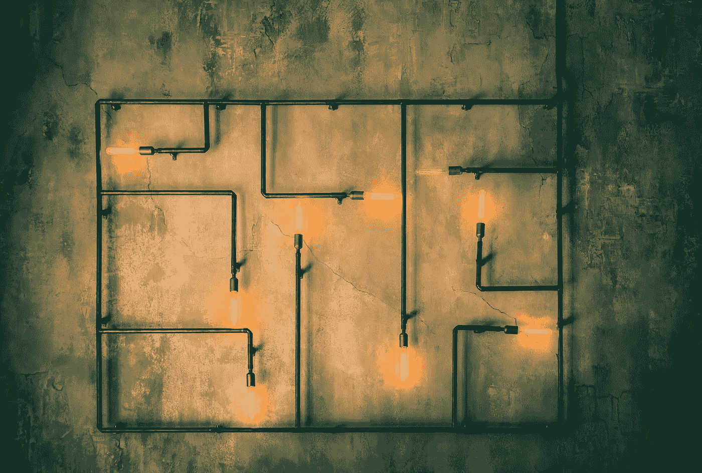
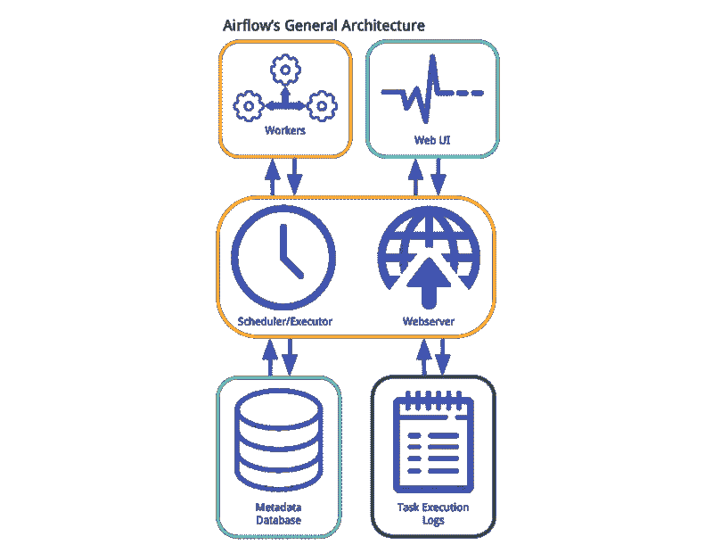
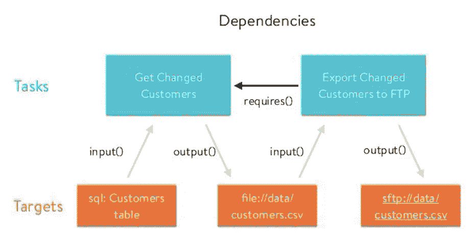
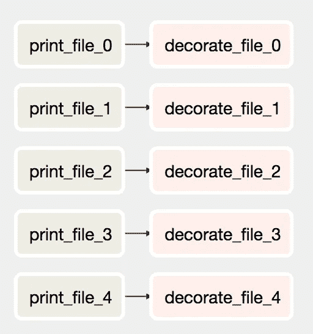

# 数据管道、Luigi、气流:你需要知道的一切

> 原文：<https://towardsdatascience.com/data-pipelines-luigi-airflow-everything-you-need-to-know-18dc741449b7?source=collection_archive---------1----------------------->

Photo by [Gerrie van der Walt](https://unsplash.com/photos/m3TYLFI_mDo?utm_source=unsplash&utm_medium=referral&utm_content=creditCopyText) on [Unsplash](https://unsplash.com/search/photos/pipeline?utm_source=unsplash&utm_medium=referral&utm_content=creditCopyText)

这篇文章是基于我最近给同事们做的关于气流的演讲。

特别是，演讲的重点是:什么是气流，你可以用它做什么，它与 Luigi 有什么不同。

# 你为什么需要 WMS

在公司中，移动和转换数据是很常见的事情。

例如，您在 S3 的某个地方存储了大量日志，您希望定期获取这些数据，提取和聚合有意义的信息，然后将它们存储在分析数据库中(例如，Redshift)。

通常，这种任务首先是手动执行的，然后，随着规模的扩大，这个过程是自动化的，例如，用 cron 触发。最终，您会发现原来的 cron 已经无法保证稳定和健壮的性能。这已经远远不够了。

这时候你就需要一个工作流管理系统(WMS)。

# 气流

Airflow 是 Airbnb 在 2014 年开发的，后来开源了。2016 年，它加入了阿帕奇软件基金会的孵化计划。

当被问及“是什么让 WMS 的气流与众不同？”，Maxime Beauchemin(创造者或气流)回答:

> 一个关键的区别是气流管道被定义为代码，任务是动态实例化的。

希望在这篇文章结束时，你能够理解，更重要的是，同意(或不同意)这种说法。

我们先来定义一下主要概念。

# 工作流作为 Dag

在 Airflow 中，工作流被定义为具有方向依赖性的任务的集合，基本上是有向无环图(DAG)。图中的每个节点是一个任务，边定义了任务之间的依赖关系。

任务属于两类:

1.  **操作员**:他们执行一些操作
2.  **传感器**:它们检查进程或数据结构的状态

现实生活中的工作流可以从每个工作流只有一个任务(你不必总是很花哨)到非常复杂的 Dag，几乎不可能可视化。

# 主要组件

气流的主要组成部分有:

*   一个**元数据库**
*   一个**调度器**
*   一个**执行者**

Airflow architecture

元数据数据库存储任务和工作流的状态。调度器使用 DAGs 定义以及元数据数据库中的任务状态，并决定需要执行什么。
执行器是一个消息队列进程(通常是[芹菜](http://www.celeryproject.org/](http://www.celeryproject.org/))，它决定哪个工人将执行每个任务。

使用 Celery executor，可以管理任务的分布式执行。另一种方法是在同一台机器上运行调度器和执行器。在这种情况下，将使用多个进程来管理并行性。

气流也提供了一个非常强大的用户界面。用户能够监控 Dag 和任务的执行，并通过 web UI 与它们直接交互。

气流遵循*“设置好就忘了”*的方法是很常见的，但这意味着什么呢？
表示一旦设置了 DAG，调度器将自动调度它按照指定的调度间隔运行。

# 路易吉

理解气流最简单的方法大概就是把它比作 Luigi。

Luigi 是一个用于构建复杂管道的 python 包，由 Spotify 开发。

在 Luigi 中，与在 Airflow 中一样，您可以将工作流指定为任务以及它们之间的依赖关系。

Luigi 的两个积木是**任务**和**目标**。目标通常是任务输出的文件，任务执行计算并消耗其他任务生成的目标。

Luigi pipeline structure

你可以把它想象成一条真正的管道。一个任务完成它的工作并生成一个目标。结果，第二个任务接受目标文件作为输入，执行一些操作并输出第二个目标文件，依此类推。

Coffee break (Photo by [rawpixel](https://unsplash.com/photos/qbrmH8y1jHY?utm_source=unsplash&utm_medium=referral&utm_content=creditCopyText) on [Unsplash](https://unsplash.com/search/photos/break?utm_source=unsplash&utm_medium=referral&utm_content=creditCopyText))

# 简单的工作流程

让我们看看如何实现由两个任务组成的简单管道。
第一个任务用一个单词生成一个. txt 文件(在本例中是“pipeline”)，第二个任务读取该文件并添加“My”修饰该行。新的一行写在一个新的文件上。

Luigi simple pipeline

每个任务被指定为从`luigi.Task`派生的类，方法`output()`指定输出，因此目标，`run()`指定任务执行的实际计算。
方法`requires()`指定了任务之间的依赖关系。

从代码中，很容易看出一个任务的输入是另一个任务的输出，依此类推。

让我们看看如何在气流中做同样的事情。

Airflow simple DAG

首先，我们定义并初始化 DAG，然后向 DAG 添加两个操作符。
第一个是`BashOperator`，它基本上可以运行所有的 bash 命令或脚本，第二个是执行 python 代码的`PythonOperator`(为了演示，我在这里使用了两个不同的操作符)。

如你所见，没有输入和输出的概念。两个运营商之间没有信息共享。有很多方法可以在操作符之间共享信息(你基本上共享一个字符串)，但是作为一个通用的规则:如果两个操作符需要共享信息，那么它们可能应该合并成一个。

# 更复杂的工作流程

现在让我们考虑一下我们想要同时处理更多文件的情况。

在 Luigi，我们可以用多种方式做到这一点，但没有一种是真正简单的。

Luigi a pipeline managing multiple files

在这种情况下，我们有两个任务，每个任务处理所有的文件。从属任务(`t2`)必须等到`t1`处理完所有文件。
我们使用一个空文件作为目标来标记每个任务完成的时间。

我们可以为循环增加一些并行化。
这种解决方案的问题是`t1`开始产生输出后，`t2`就可以开始逐渐处理文件，实际上`t2`不必等到`t1`创建完所有文件。

Luigi 中的一个常见模式是创建一个包装器任务并使用多个 workers。

这是代码。

Luigi a pipeline using multiple workers

要使用多个工作线程运行任务，我们可以在运行任务时指定`— workers number_of_workers`。

现实生活中常见的一种方法是委托并行化。基本上，你使用第一种方法，例如在`run()`函数中使用 Spark，来进行实际的处理。

# 让我们用气流来做

您还记得在最初的引用中，dag 是用代码动态实例化的吗？

但是这到底是什么意思呢？
这意味着借助气流，你可以做到这一点

Airflow a parallel DAG with multiple files

任务(和依赖项)可以以编程方式添加(例如，在 for 循环中)。相应的 DAG 如下所示。

Parallel DAG

此时，您不必担心并行化。气流执行器从 DAG 定义中知道，每个分支可以并行运行，这就是它所做的！

# 最终考虑

我们在这篇文章中谈到了很多点，我们谈到了工作流程、Luigi、气流以及它们之间的区别。

让我们快速回顾一下。

**路易吉**

*   它通常基于管道，任务输入和输出共享信息并连接在一起
*   基于目标的方法
*   UI 是最小的，没有用户与正在运行的进程的交互
*   没有自己的触发
*   Luigi 不支持分布式执行

**气流**

*   基于 DAGs 表示
*   一般来说，任务之间没有信息共享，我们希望尽可能地并行
*   没有功能强大的任务间通信机制
*   它有一个执行器，管理分布式执行(您需要设置它)
*   方法是“设置它，然后忘记它”,因为它有自己的调度程序
*   强大的用户界面，你可以看到执行和互动运行的任务。

*结论:在本文中，我们了解了 Airflow 和 Luigi，以及这两者在工作流管理系统中的不同之处。我们看了一些非常简单的管道示例，以及它们如何使用这两种工具来实现。最后我们总结了 Luigi 和 Airflow 的主要区别。*

如果您喜欢这篇文章，并且觉得它很有用，请随意👏或者分享。

干杯