# 你应该知道的数据预处理技术

> 原文：<https://towardsdatascience.com/data-pre-processing-techniques-you-should-know-8954662716d6?source=collection_archive---------1----------------------->


嗨伙计们！欢迎回来。今天，我们将讨论可以帮助您获得更高准确度的特征工程技术。

如您所知，对于数据科学家来说，数据可能非常令人生畏。如果你手里有一个数据集，如果你是一个数据科学家，那么你会开始考虑对你手里的原始数据集做些什么。这是数据科学家的天性。所以我还在成为数据科学家的学习过程中。我试图用各种数据预处理技术来充实我的头脑，因为这些技术对于了解你是否想处理数据是非常必要的。

对于这个分析，我将使用 Kaggle 提供的信用卡交易数据集。我已经写了一篇关于使用自动编码器检测信用卡欺诈的文章。链接在这里:[https://medium . com/@ manisharajarathna/credit-card-fraud-detection-using-auto 编码器-in-h2o-399cbb7ae4f1](https://medium.com/@manisharajarathna/credit-card-fraud-detection-using-autoencoders-in-h2o-399cbb7ae4f1)

# 什么是数据预处理？

它是一种将原始数据转换成可理解格式的数据挖掘技术。原始数据(真实世界的数据)总是不完整的，并且这些数据不能通过模型发送。这将导致某些错误。这就是为什么我们需要在通过模型发送之前预处理数据。

## 数据预处理的步骤

以下是我遵循的步骤；
1。导入库
2。读取数据
3。检查缺失值
4。检查分类数据
5。标准化数据
6。PCA 变换
7。数据分割

# 1.输入数据

作为主库，我使用熊猫、Numpy 和 time
**熊猫**:用于数据操作和数据分析。
**Numpy** :用 Python 进行科学计算的基础包。

至于可视化，我用的是 Matplotlib 和 Seaborn。
对于数据预处理技术和算法，我使用了 **Scikit-learn** 库。

```
# main libraries
import pandas as pd
import numpy as np
import time# visual libraries
from matplotlib import pyplot as plt
import seaborn as sns
from mpl_toolkits.mplot3d import Axes3D 
plt.style.use('ggplot')# sklearn libraries
from sklearn.neighbors import KNeighborsClassifier
from sklearn.model_selection import train_test_split
from sklearn.preprocessing import normalize
from sklearn.metrics import confusion_matrix,accuracy_score,precision_score,recall_score,f1_score,matthews_corrcoef,classification_report,roc_curve
from sklearn.externals import joblib
from sklearn.preprocessing import StandardScaler
from sklearn.decomposition import PCA
```

# 2.读出数据

你可以在这里找到更多关于数据集的细节:[https://www.kaggle.com/mlg-ulb/creditcardfraud](https://www.kaggle.com/mlg-ulb/creditcardfraud)

```
*# Read the data in the CSV file using pandas*
df = pd.read_csv('../input/creditcard.csv')
df.head()
```

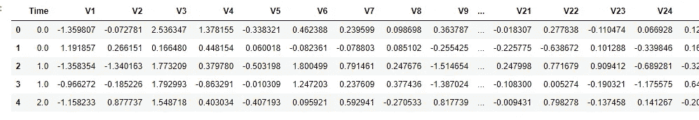

Fig 1 : Dataset

```
df.shape
> (284807, 31)
```

# 3.检查缺少的值

```
df.isnull().any().sum()
> 0
```

因为在数据集中没有发现缺失值，所以我没有使用任何缺失值处理技术。

## 让我们看看数据

因此数据集被标记为 0 和 1。

*   0 =非欺诈
*   1 =欺诈

```
All = df.shape[0]
fraud = df[df['Class'] == 1]
nonFraud = df[df['Class'] == 0]

x = len(fraud)/All
y = len(nonFraud)/All

print('frauds :',x*100,'%')
print('non frauds :',y*100,'%')
```

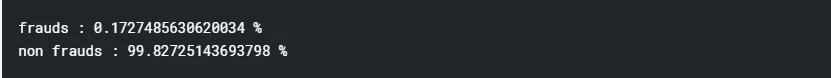

```
 *# Let's plot the Transaction class against the Frequency* labels = ['non frauds','fraud']
classes = pd.value_counts(df['Class'], sort = True)
classes.plot(kind = 'bar', rot=0)
plt.title("Transaction class distribution")
plt.xticks(range(2), labels)
plt.xlabel("Class")
plt.ylabel("Frequency")
```


Fig 2 : Class vs Frequency

# 4.检查分类数据

我们在这个数据集中唯一的分类变量是目标变量。其他要素已经是数字格式，所以不需要转换成分类数据。

## 让我们画出特征的分布

我使用 seaborn distplot()来可视化数据集中的要素分布。数据集中有 30 个特征和目标变量。

```
*# distribution of Amount*
amount = [df['Amount'].values]
sns.distplot(amount)
```

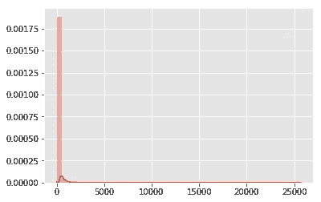

Fig 3 : Distribution of Amount

```
*# distribution of Time*
time = df['Time'].values
sns.distplot(time)
```

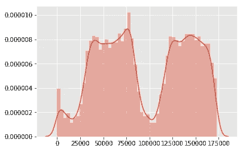

Fig 4 : Distribution of Time

```
*# distribution of anomalous features*
anomalous_features = df.iloc[:,1:29].columns

plt.figure(figsize=(12,28*4))
gs = gridspec.GridSpec(28, 1)
for i, cn **in** enumerate(df[anomalous_features]):
    ax = plt.subplot(gs[i])
    sns.distplot(df[cn][df.Class == 1], bins=50)
    sns.distplot(df[cn][df.Class == 0], bins=50)
    ax.set_xlabel('')
    ax.set_title('histogram of feature: ' + str(cn))
plt.show()
```

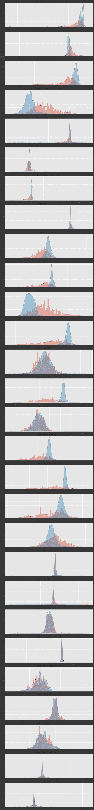

Fig 5 : Distribution of anomalous features

在这个分析中，我不会放弃任何查看特征分布的特征，因为我仍处于以多种方式处理数据预处理的学习过程中。所以我想一步一步地实验数据。

相反，所有的特征将被转换成比例变量。

```
*# heat map of correlation of features*
correlation_matrix = df.corr()
fig = plt.figure(figsize=(12,9))
sns.heatmap(correlation_matrix,vmax=0.8,square = True)
plt.show()
```

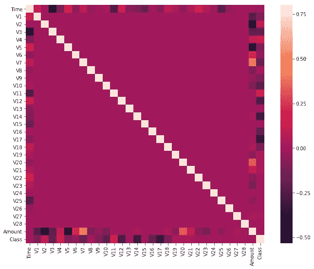

Fig 6 : Heatmap of features

# 5.使数据标准化

数据集仅包含作为 PCA 变换结果的数字输入变量。V1、V2……v 28 是通过五氯苯甲醚获得的主要成分，唯一没有通过五氯苯甲醚转化的特征是“时间”和“数量”。因此，主成分分析受比例的影响，所以我们需要在应用主成分分析之前对数据中的特征进行比例缩放。对于缩放，我使用 Scikit-learn 的 StandardScaler()。为了适合定标器，数据应该在-1 和 1 之间整形。

```
*# Standardizing the features*
df['Vamount'] = StandardScaler().fit_transform(df['Amount'].values.reshape(-1,1))
df['Vtime'] = StandardScaler().fit_transform(df['Time'].values.reshape(-1,1))

df = df.drop(['Time','Amount'], axis = 1)
df.head()
```

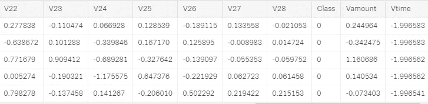

Fig 7 : Standardized dataset

现在，所有特征都被标准化为单位尺度(平均值= 0，方差= 1)

# 6.PCA 变换

PCA(主成分分析)主要用于减少特征空间的大小，同时保留尽可能多的信息。在这里，所有的特征使用 PCA 转换成 2 个特征。

```
X = df.drop(['Class'], axis = 1)
y = df['Class']

pca = PCA(n_components=2)
principalComponents = pca.fit_transform(X.values)
principalDf = pd.DataFrame(data = principalComponents
             , columns = ['principal component 1', 'principal component 2'])finalDf = pd.concat([principalDf, y], axis = 1)
finalDf.head()
```

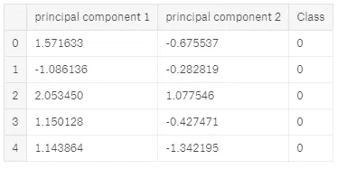

Fig 8 : Dimensional reduction

```
*# 2D visualization*
fig = plt.figure(figsize = (8,8))
ax = fig.add_subplot(1,1,1) 
ax.set_xlabel('Principal Component 1', fontsize = 15)
ax.set_ylabel('Principal Component 2', fontsize = 15)
ax.set_title('2 component PCA', fontsize = 20)
targets = [0, 1]
colors = ['r', 'g']
for target, color **in** zip(targets,colors):
    indicesToKeep = finalDf['Class'] == target
    ax.scatter(finalDf.loc[indicesToKeep, 'principal component 1']
               , finalDf.loc[indicesToKeep, 'principal component 2']
               , c = color
               , s = 50)
ax.legend(targets)
ax.grid()
```

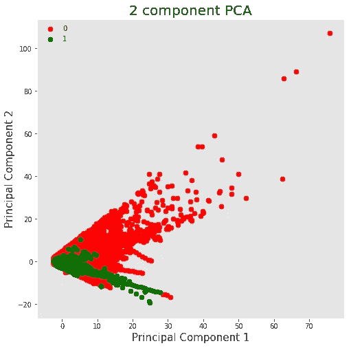

Fig 9 : Scatter plot of PCA transformation

由于数据非常不平衡，我只从非欺诈交易中提取了 492 行。

```
*# Lets shuffle the data before creating the subsamples*
df = df.sample(frac=1)

frauds = df[df['Class'] == 1]
non_frauds = df[df['Class'] == 0][:492]

new_df = pd.concat([non_frauds, frauds])
*# Shuffle dataframe rows*
new_df = new_df.sample(frac=1, random_state=42) *# Let's plot the Transaction class against the Frequency*
labels = ['non frauds','fraud']
classes = pd.value_counts(new_df['Class'], sort = True)
classes.plot(kind = 'bar', rot=0)
plt.title("Transaction class distribution")
plt.xticks(range(2), labels)
plt.xlabel("Class")
plt.ylabel("Frequency")
```

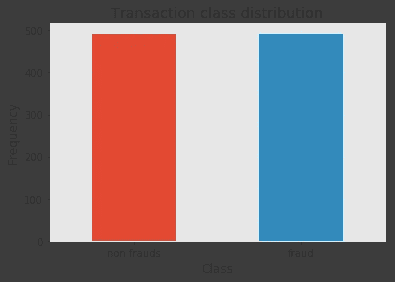

Fig 10 : Distribution of classes

```
*# prepare the data*
features = new_df.drop(['Class'], axis = 1)
labels = pd.DataFrame(new_df['Class'])

feature_array = features.values
label_array = labels.values
```

# 7.数据分割

```
*# splitting the faeture array and label array keeping 80% for the trainnig sets*
X_train,X_test,y_train,y_test = train_test_split(feature_array,label_array,test_size=0.20)

*# normalize: Scale input vectors individually to unit norm (vector length).*
X_train = normalize(X_train)
X_test=normalize(X_test)
```

对于模型建筑，我使用 K 个最近邻。因此，我们需要找到一个最佳的 K 来获得最佳效果。

# k-最近邻

来自*维基百科；*

> 在模式识别中，***k*-最近邻算法** ( ***k* -NN** )是一种用于分类和回归的非参数方法。在这两种情况下，输入由特征空间中的 ***k*** 个最接近的训练样本组成。输出取决于 *k* -NN 是用于分类还是回归。

KNN 算法假设相似的事物存在于附近。换句话说，相似的事物彼此靠近。

> *“物以类聚，人以群分。”*

*训练算法*只存储数据，计算由*预测算法*完成。

```
neighbours = np.arange(1,25)
train_accuracy =np.empty(len(neighbours))
test_accuracy = np.empty(len(neighbours))

for i,k **in** enumerate(neighbours):
    *#Setup a knn classifier with k neighbors*
    knn=KNeighborsClassifier(n_neighbors=k,algorithm="kd_tree",n_jobs=-1)

    *#Fit the model*
    knn.fit(X_train,y_train.ravel())

    *#Compute accuracy on the training set*
    train_accuracy[i] = knn.score(X_train, y_train.ravel())

    *#Compute accuracy on the test set*
    test_accuracy[i] = knn.score(X_test, y_test.ravel())
```

我们可以通过将测试集的准确性与训练集的准确性进行绘图来找到最佳 K 值。k 的最佳值是给出最大测试精度的点。

```
*#Generate plot*
plt.title('k-NN Varying number of neighbors')
plt.plot(neighbours, test_accuracy, label='Testing Accuracy')
plt.plot(neighbours, train_accuracy, label='Training accuracy')
plt.legend()
plt.xlabel('Number of neighbors')
plt.ylabel('Accuracy')
plt.show()
```

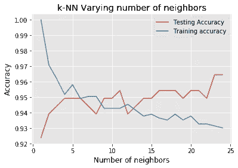

Fig 11 : Number of Neighbors vs Accuracy

```
idx = np.where(test_accuracy == max(test_accuracy))
x = neighbours[idx]
```

我使用 Scikit-learn*KNeighborsClassifier()*来构建模型*。*

```
*#k_nearest_neighbours_classification*
knn=KNeighborsClassifier(n_neighbors=x[0],algorithm="kd_tree",n_jobs=-1)
knn.fit(X_train,y_train.ravel())
```

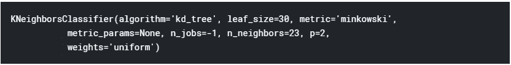

```
*# save the model to disk*
filename = 'finalized_model.sav'
joblib.dump(knn, filename)*# load the model from disk*
knn = joblib.load(filename)
```

在我们建立模型之后，我们可以使用 predict()来预测测试集的标签。

```
*# predicting labels for testing set*
knn_predicted_test_labels=knn.predict(X_test)
```

## 模型评估

```
from pylab import rcParams
*#plt.figure(figsize=(12, 12))*
rcParams['figure.figsize'] = 14, 8
plt.subplot(222)
plt.scatter(X_test[:, 0], X_test[:, 1], c=knn_predicted_test_labels)
plt.title(" Number of Blobs")
```

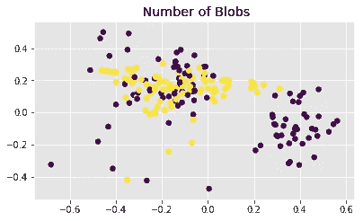

Fig 12 : Number of Blobs

```
*#scoring knn*
knn_accuracy_score  = accuracy_score(y_test,knn_predicted_test_labels)
knn_precison_score  = precision_score(y_test,knn_predicted_test_labels)
knn_recall_score    = recall_score(y_test,knn_predicted_test_labels)
knn_f1_score        = f1_score(y_test,knn_predicted_test_labels)
knn_MCC             =    matthews_corrcoef(y_test,knn_predicted_test_labels)
```

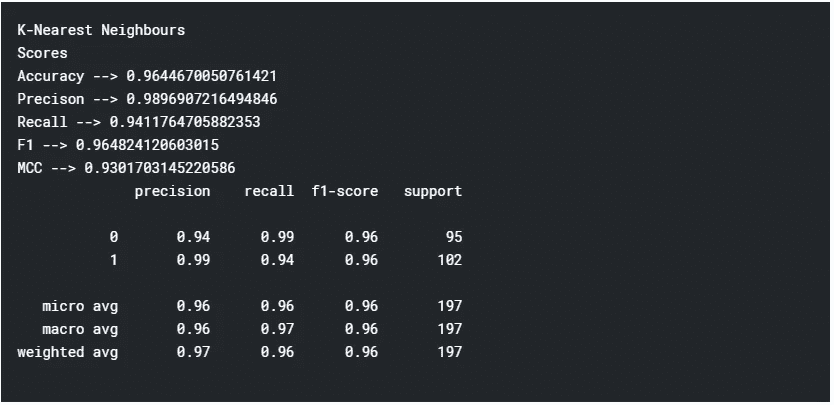

## **混淆矩阵**

> 混淆矩阵是一个表格，通常用于描述一个分类模型(或“分类器”)对一组真实值已知的测试数据的性能。Scikit-learn 提供了使用混淆矩阵方法计算混淆矩阵的工具。

```
import seaborn as sns
LABELS = ['Normal', 'Fraud']
conf_matrix = confusion_matrix(y_test, knn_predicted_test_labels)
plt.figure(figsize=(12, 12))
sns.heatmap(conf_matrix, xticklabels=LABELS, yticklabels=LABELS, annot=True, fmt="d");
plt.title("Confusion matrix")
plt.ylabel('True class')
plt.xlabel('Predicted class')
plt.show()
```

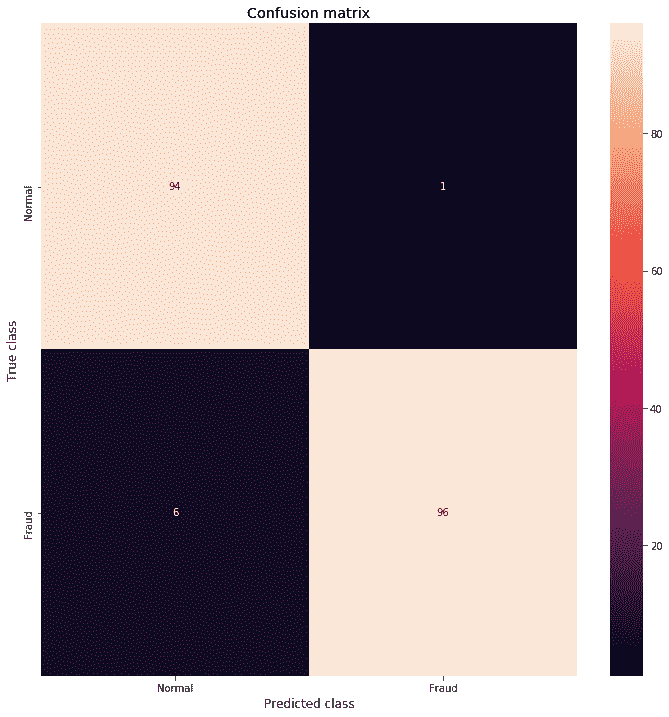

Fig 13 : Confusion Matrix

# 结论

我试图不标准化数据，以获得更好的准确性。但是在我学会并应用这个方法后，它给出了一个有希望的结果。我还在做实验，还在学习数据预处理技术。对于这个数据集，我只使用了 KNN 算法。如果你觉得这个内核有帮助，请随意评论并投赞成票。

# 参考

你可以在这里找到更多关于 PCA 转换的信息:[https://towardsdatascience . com/PCA-using-python-scikit-learn-e653 f 8989 e 60](/pca-using-python-scikit-learn-e653f8989e60)