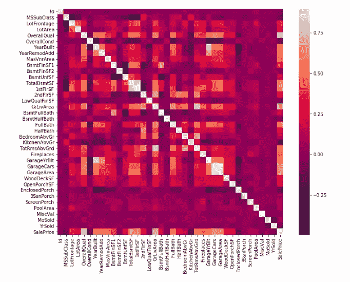
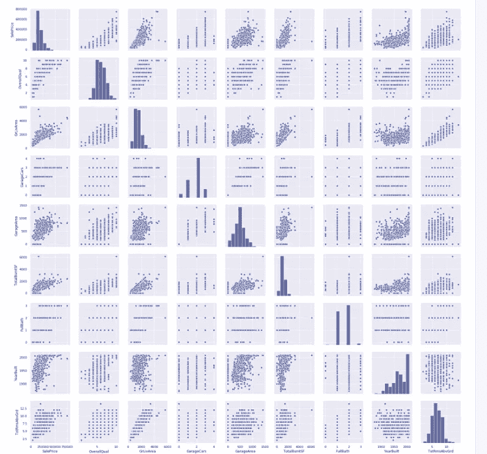
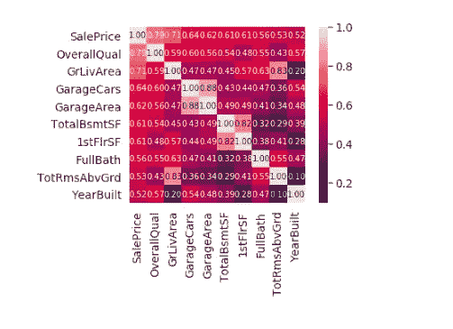
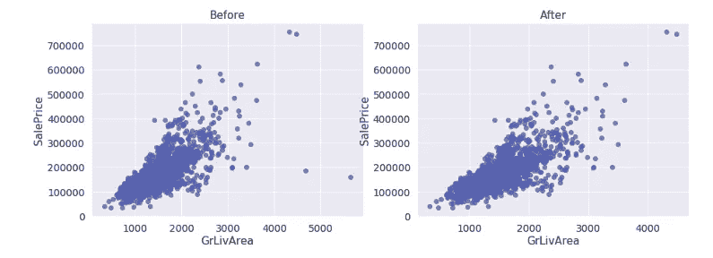
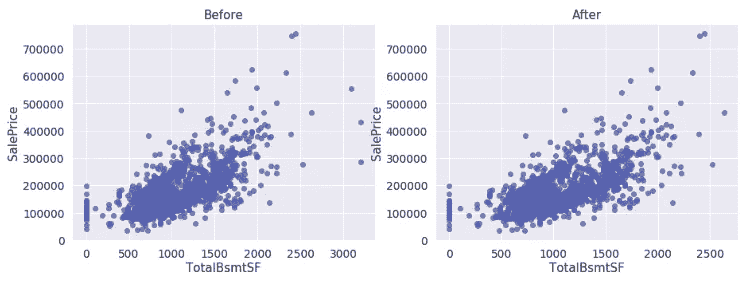
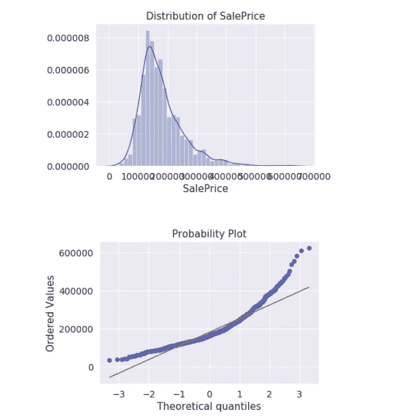
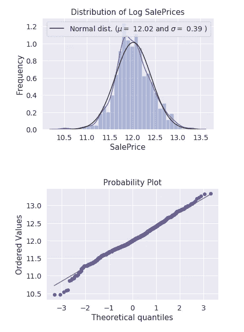

# 数据准备和预处理与在数据科学中创建实际模型同样重要——第 1 部分

> 原文：<https://towardsdatascience.com/data-preparation-and-preprocessing-is-just-as-important-creating-the-actual-model-in-data-sciences-2c0562b65f62?source=collection_archive---------9----------------------->

我最近报名参加了 Kaggle 上的[房价:高级回归技术](https://www.kaggle.com/c/house-prices-advanced-regression-techniques)挑战。这个问题要求参与者在超过 75 个基本预测值的基础上预测每栋房屋的最终价格。显然，这是一个回归问题。顾名思义，它测试用户对高级回归技术的使用。

我花了近 2 周时间在工作、几门课程、几个其他项目和生活中周旋，并学到了一些关于 EDA(探索性数据分析)、特征工程和数据准备的技巧。在我带您完成以下步骤的同时，我还将分享我从挑战中的其他参与者那里学到的东西。当前版本的笔记本没有太多的建模技术。我仍在研究模型，稍后将发表另一篇关于模型选择及其基本概念的文章。

本文重点介绍数据理解和预处理的几个步骤，即基于相关矩阵、异常值处理和目标变量转换的初步特征选择。在相应的文章中，我还会谈到像缺失值处理和特征工程这样的步骤。

# **了解数据集**

竞赛的[数据部分包含一个详细的数据描述文件，解释了所有变量的定义和内容。人们应该知道的一些重要变量是:](https://www.kaggle.com/c/house-prices-advanced-regression-techniques/data)

1.  “销售价格”——这是目标变量，包含以美元为单位的房产销售价格。虽然此变量是为训练数据集中的所有记录填充的，但必须为 test.csv 文件中的数据预测相同的列
2.  “总体质量”——这一指标对房屋的整体材料和装修质量进行评级。它有从 1 到 10 的等级，1 对应“非常差”，10 对应“非常好”。这个分类变量实际上是一个变量。我们将不得不相应地对待它。
3.  “总体状况”——这一指标对酒店的整体状况进行评级。就像，总的来说，它对相同的类有 1 到 10 的排名。
4.  ' year build '-这个变量给出了房产最初建造的年份。
5.  yearremodaddd '-这个变量表示房产的改造日期。如果没有进行改造或添加，则该列的值应该与建造日期(建造年份)相同
6.  YrSold'-这包含房子出售的年份(YYYY 格式)。
7.  这是房产出售的月份(MM 格式)。
8.  GarageYrBlt'-这是房子的车库建造的年份。
9.  GrLivArea'-这是许多可用的区域相关参数之一。这一项特别指出了房屋中可利用的地上(等级)居住面积(平方英尺)。
10.  TotalBsmtSF'-顾名思义，这个指标包含了地下室的总面积，以平方英尺为单位。
11.  “1stFlrSF”和“2 ndflrsf”-这些变量分别代表一楼和二楼的面积(平方英尺)
12.  ' GarageArea'-这个变量代表车库的平方英尺大小。
13.  GarageCars 这一栏包含车库的大小，以汽车容量表示。因此，该指标中的所有值都应该是整数。
14.  TotRmsAbvGrd'-该参数包含地面以上的房间总数。数据描述文件清楚地表明，这没有考虑到浴室。
15.  ' LotFrontage'-该列包含与物业相连的街道的线性英尺数。

还有一些其他指标，如“PoolQC”、“Utilities”、“Alley”、“CentralAir”等，这些指标表明酒店中某些功能的存在和质量。人们可以参考数据字典并了解如何研究和使用它。

train.csv 文件有 1461 行和 81 列(包括列标题)。另一方面，test.csv 文件有 1460 行和 80 列(不包括目标变量，即“销售价格”)。

# **数据探索(EDA)**

**相关性和主要特征选择**

我在这个问题上的第一步是理解变量，评估它们，做一些基本的 EDA。我从绘制训练数据集的相关矩阵开始。

Correlation Matrix

相关矩阵的一些基本要点如下:

1.  如果我们看上面的热图，所有的白色方块表示相应变量之间的高度相关性
2.  “GarageCars”和“GarageArea”显示出高度的相关性，也符合我们的直觉思维。车库的面积越大，车的数量就越多。此外，两者似乎都与“销售价格”有着相似(且相对较高)的相关性。这清楚地表明了多重共线性的情况。因此，我们可以删除其中一个，保留另一个。
3.  此外，“TotalBsmtSF”和“1stFlrSF”再次显示高度相关性，表明多重共线性。因此，我们应该删除其中一个。
4.  如果我们查看“TotalBsmtSF”和“SalePrice”之间的相关性，我们会看到一个白色方块，即高相关性。这表明应该保留 TotalBsmtSF，因为它有助于销售价格预测
5.  另一组显示高相关性的变量是“YearBuilt”和“GarageYrBlt”。如果我们比较“GarageYrBlt”中缺失值的百分比，我们会看到它有超过 5%的缺失值(我们将在后面查看相同的详细分析)。此外，“YearBuilt”似乎与“SalePrice”有相当好的相关性(大约 0.5)。看来我们应该保留‘year build’而放弃‘GarageYrBlt’。
6.  此外，除了‘year build’、‘GarageCars’或‘GarageArea’中的一个)和‘TotalBsmtSF’之外，我们还应该记住其他四个似乎与‘销售价格’有很好相关性的变量:‘总体质量’、‘GrLivArea’、‘全浴’和‘TotRmsAbvGrd’
7.  然而，如果我们观察' TotRmsAbvGrd '与其他变量的相关性，我们会发现与' GrLivArea '的相关性很高。为了能够决定删除哪个变量，让我们再看一些分析。

然后，我绘制了一个散点图，它会给出一些列相对于其他列的数据分布的详细信息。我们选择了上面提到的列。

scatter plot of selected variables

从上面的情节我们可以推断:

1.  ‘GrLivArea’和‘TotRmsAbvGrd’表现出高度的线性关系。
2.  当我们关注“GrLivArea”和“TotalBsmtSF”时，显示出一种线性关系，几乎有一个边界定义了该图。这基本上表明“GrLivArea”定义了“TotalBsmtSF”(地下室面积)的上限。没有多少房子会有比底层居住面积更大的地下室。
3.  “销售价格”显示“一年建成”几乎急剧上升，基本上表明价格随着房屋年限的减少而上升(几乎呈指数增长)。大多数最近的房子价格都很高。

为了最终决定保留上面的哪些变量，放弃哪些变量，我们将进行最后的分析。让我们放大几个具体变量的相关矩阵。

Zoomed in correlation matrix for top 10 variables

从上面的相关矩阵快照中，我决定了最终要明确考虑的变量列表和要排除的变量列表:

1.  与“销售价格”相关性最高的变量是“总体质量”——*保留“总体质量”*
2.  “GarageCars”和“GarageArea”之间的高相关性+“GarageCars”和“SalePrice”之间的高相关性— *保留“GarageCars”；移除‘车库区域’*
3.  ' TotalBsmtSF '和' 1stFlrSF '相关性高，与' SalePrice '相关性相等——*保留' TotalBsmtSF '，删除' 1stFlrSF'*
4.  在“GarageYrBlt”和“year build”中，“year build”的缺失值较低，与“销售价格”的相关性较高— *保留“year build”，删除“GarageYrBlt”*
5.  “TotRmsAbvGrd”和“GrLivArea”之间的相关性很强+“GrLivArea”和“SalePrice”之间的相关性更高— *保留“GrLivArea”；删除' TotRmsAbvGrd'*
6.  *保留“全浴”*,因为我们没有看到与任何其他变量的相关性，但它与“销售价格”有显著关联

在我们进入下一步之前，让我们试着理解为什么我删除了可能导致多重共线性的变量。为此，我们将不得不钻研一些简单的数学。

> 回归分析分离出每个预测值或自变量(x)和目标/因变量(y)之间的关系。在最后的方程中，回归系数表示在所有其他自变量都不变的情况下，相应自变量的单位变化在目标变量中引起的平均变化。
> 
> 现在，在一种情况下，当独立变量相关时(这种情况是多重共线性)，它表明一个变量的变化也会导致另一个变量的变化。这种相关性越强，改变一个变量而不改变另一个变量的难度就越高。这使得回归模型难以独立估计每个自变量和因变量之间的关系。这基本上导致了 3 个相互关联的主要问题:
> 
> 由于预测因素导致的解释方差不可靠
> 
> 系数变得对模型中的微小变化和其他独立预测因子的存在高度敏感。
> 
> 它会降低方程系数的精度，从而降低回归模型的性能(用于确定独立变量统计显著性的不可靠 p 值)。

**异常值处理**

既然我们已经关注了导致目标变量“销售价格”最大方差的变量，让我们从这些变量中移除异常值。为什么这很重要？回归作为一种算法，试图通过数据点拟合最佳直线。为了找到最佳拟合函数，它试图适应所有点，这使得它对异常值非常敏感。虽然线性回归比其他稳健算法更敏感，但在任何回归练习之前的最佳实践是处理异常值，而不管使用什么算法。

我采用了一种启发式方法来处理异常值，这样我就可以看到和控制我正在处理的数据点。我在处理异常值时注意的一些变量是

1.  格里瓦雷亚

首先，我使用散点图比较了变量“GrLivArea”和“SalePrice”。

“之前”图表中大约 4600 平方英尺和 5600 平方英尺的两个点看起来像是异常值。我通过在大于 4000 平方英尺的‘GrLivArea’应用降点条件来移除它们。制成'销售价格'低于 30 万美元。

2.总计 BsmtSF

对地下室总面积(TotalBsmtSF)也做了类似的工作。移除异常值(*[' TotalBsmtSF ']>3000*)前后的散点图如下所示:

3.总体平等

总体质量度量是一个顺序变量。“总体质量”相对于“销售价格”的散点图有望为我们提供价格范围，以及相应的物业质量。使用散点图，我删除了 2 个数据点，看起来像离群值。使用条件( *['总体质量'] > 9) & (['销售价格'] > 700000)* )，我获得了“总体质量”散点图之前和之后的以下内容:

上述练习从训练数据集中移除了 7 个数据点(或总共记录)。使用上述数据集，我继续进行下一个练习:调查目标变量，即“销售价格”

**目标变量的调查和转换**

在我深入研究这一步的复杂性之前，让我解释一下我们通过这一步想要达到的目的。我们正在调查问题中目标或响应变量的行为和趋势，即“销售价格”。这一步的发现还将帮助我们转换变量，以尽可能最好的方式适应我们的模型。

这对于确保模型预测更加准确非常重要。在回归算法中，残差必须服从正态分布。只是修改一下残差的定义，它被定义为因变量/目标变量的观测值( *y* )和预测值( *ŷ* )之差。

现在出现的一个明显的问题是关于正态残差的需要。为了回答这个问题，让我们试着简化这个练习背后的数学逻辑:

> 残差和异方差的非正态性(一个变量的可变性在用于预测它的另一个变量的值的范围内不相等的性质。)提出了一个主要问题。它基本上是说，模型中的误差量在观察或训练数据的整个范围内是不一致的。就独立变量或预测变量而言，这意味着它们所具有的解释方差(或预测能力)的数量(按β权重计算)在目标变量的整个范围内并不相同。本质上，预测因子可以解释不同水平的响应变量的不同趋势和差异。换句话说，当残差不是正态分布时，则假设它们是随机数据集，取值为“否”。这意味着模型不能解释数据集中的所有趋势(低 R 平方值)。这无疑降低了试验预测的可靠性。
> 
> 我们可以通过转换因变量来纠正这一点。现在，如果预测值是正态分布的，那么残差也是正态分布的，反之亦然。一些常见的转换变量是:1。对数，2。平方根，3。反向(1/x)。根据观察到的响应变量趋势，还可以使用其他几个函数或转换。
> 
> 更详细的解释也可以参考这个[链接这里](https://stats.stackexchange.com/questions/60410/normality-of-dependent-variable-normality-of-residuals)。

因此，我从绘制直方图开始，研究“销售价格”的分布:

Plots for original ‘SalePrice’ values

我们可以从直方图中观察到正偏度。这不完全是正态分布。此外，在概率图中,“销售价格”列的有序值不遵循线性趋势。这基本上都代表了数据的右偏度。

现在，如果我们观察到正或右偏斜，对数变换是一个很好的选择。对这些值应用对数函数应给出线性趋势，并将这组值转换为“正态分布”值。我们将看到如何。

您可以参考下面的代码片段来查看我执行了什么转换:

观察到的 mu 和 sigma 值为:均值= 12.02 和标准差。戴夫。= 0.39。我获得的图是:

Plots for log-transformed ‘SalePrice’ values

正如我们在这里看到的，分布现在看起来是正常的，并且在概率图中是线性趋势。

在这一步之后，我添加了经过处理的训练和测试数据集，以形成一个数据集:“total_df”。接下来的步骤包括缺失值处理和特征工程。我将在下一篇文章中讨论这些内容。

# 上述步骤的要点

正如你在上面看到的，每一步都有其背后的基本原理。分析相关矩阵以减少多重共线性。进行异常值处理是为了优化回归模型的性能。对目标变量进行分析和转换，以获得推理和直观的误差趋势。

您的用例可能需要也可能不需要这些步骤。但是，在开始构建模型之前，最好先检查一下这些情况。缺乏这些可能会错误地摆动你的模型而没有解释，或者可能会给你完全不可靠的测试预测。

我将在相应的文章中介绍其余的步骤。请留意这个空间的链接。

*编辑:*

*链接到本系列的下一篇文章:* [*数据准备和预处理与创建数据科学中的实际模型同样重要——第 2 部分*](https://medium.com/@srishtisaha/data-preparation-and-preprocessing-is-just-as-important-creating-the-actual-model-in-data-sciences-509f49b17aab)