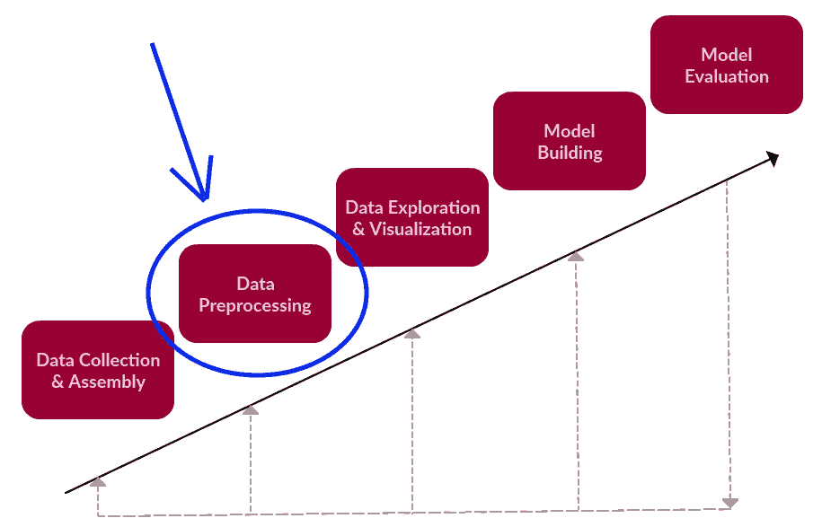
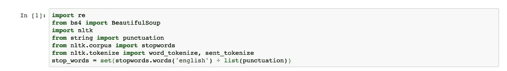
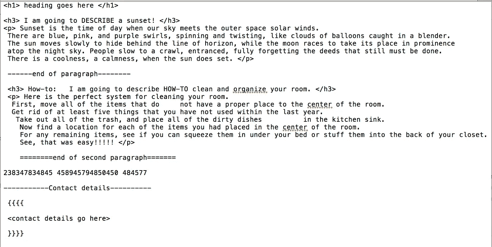
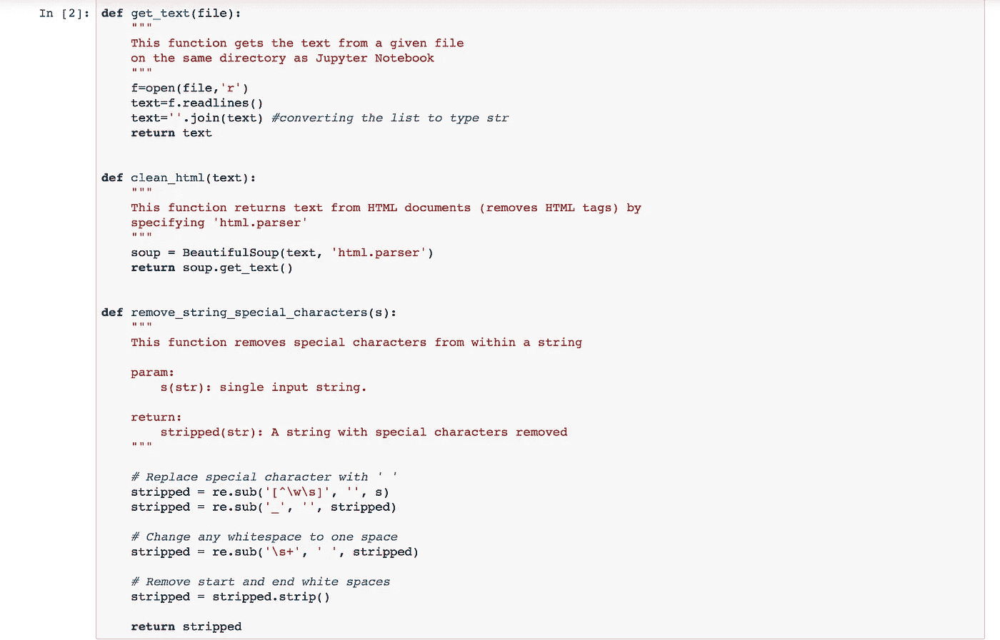
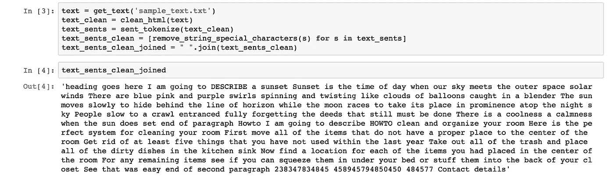
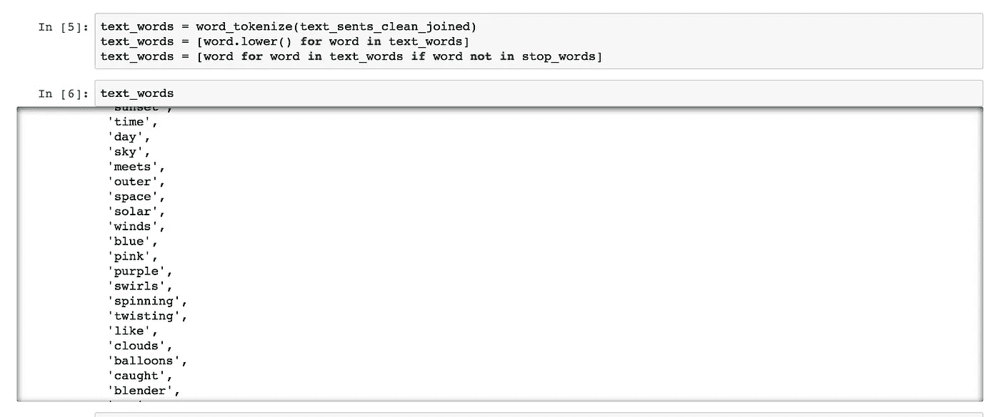

# Python 中的数据预处理

> 原文：<https://towardsdatascience.com/data-preprocessing-in-python-6f04e6c2cb70?source=collection_archive---------5----------------------->

我在我的[文本摘要工具](https://medium.com/@shivangisareen/text-summariser-in-python-da5557d31aa0)中执行了数据预处理，现在，这里是详细内容。

数据预处理不过是*为实验准备*数据——转换原始数据以供进一步处理。

正在使用的 Python 库— **NLTK** 、**[**beautiful soup**](https://medium.com/@shivangisareen/beautiful-soup-in-python-79697b33e294)、 [**re**](https://medium.com/@shivangisareen/regular-expressions-in-python-b4cb7da6ec18) 。**

****

**考虑以下保存为 *sample_text.txt* 的文本-**

**这只是我用 HTML 标签、额外空格和特殊字符加上的一组随机的句子。**

****目标**是通过移除多余的空格、换行符、标签、特殊字符和小写单词来清理这段文本。**

****

**让我们对上述数据进行预处理-**

**我已经开始编写一些函数，即***【get _ text()*******clean _ html()****和***remove _ string _ special _ characters()***-****

********

****让我们在 *sample_text.txt.* 上使用这些函数****

****首先我们从 *get_text()* 函数获取文本，使用 *clean_html()* 移除 HTML 标签，然后使用 *sent_tokenize 将文本分成句子。*****

****这些句子然后被传入*remove _ string _ special _ characters()。*****

****然后，将几乎清理干净的句子连接起来，再次给出全文。****

********

****最后一步是使用 *word_tokenize 将文本标记成单词。*****

****单词*小写*并且*停止单词*从最终单词列表 *text_words 中移除。*****

********

****所以现在我们有了一个文本中的单词语料库。****

****这部文集能告诉我们什么？使用一些基本方法探索内容，典型的方法是数单词。我们可以找出哪些词在语料库中出现频率最高，通过按语料库频率对词进行排序，我们可以研究语料库的词汇分布。NLP 有很多！****

****可以实现更多的函数来满足特定类型的文本，但以上是清理数据以供进一步处理的最常见方法。****

****编码快乐！****

********

****Photo by [delfi de la Rua](https://unsplash.com/photos/lyRCGYIf4hQ?utm_source=unsplash&utm_medium=referral&utm_content=creditCopyText) on [Unsplash](https://unsplash.com/search/photos/sunset?utm_source=unsplash&utm_medium=referral&utm_content=creditCopyText)****