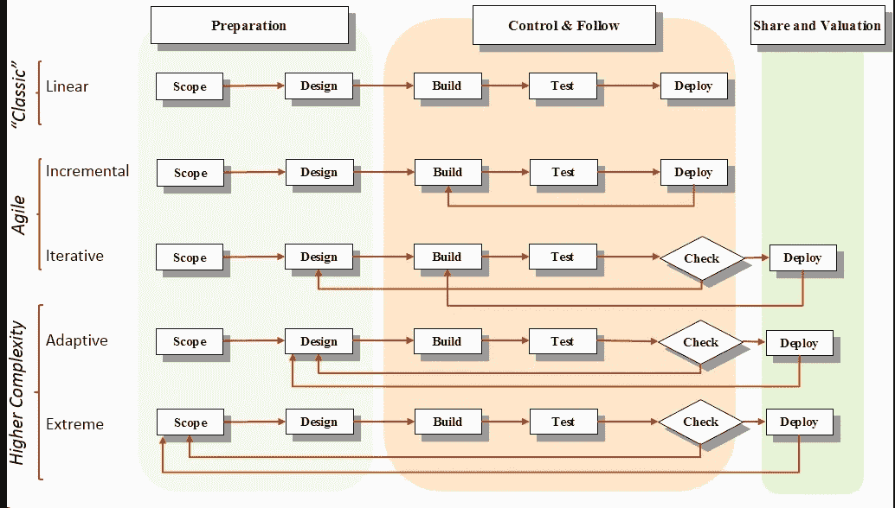
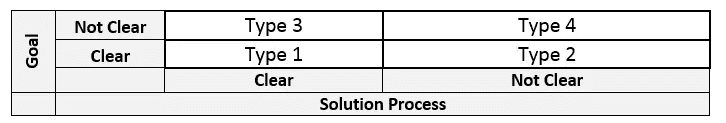
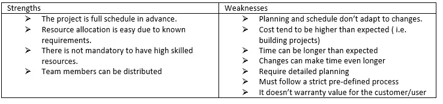
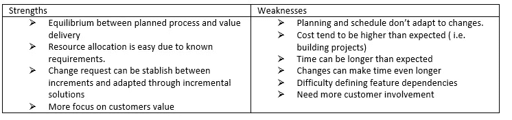
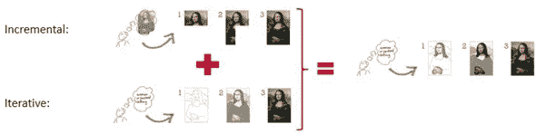
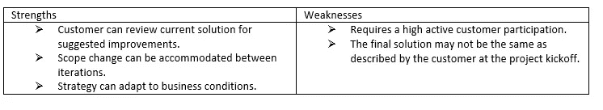
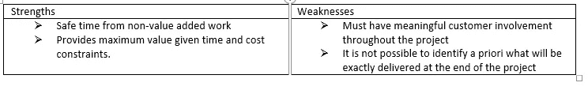
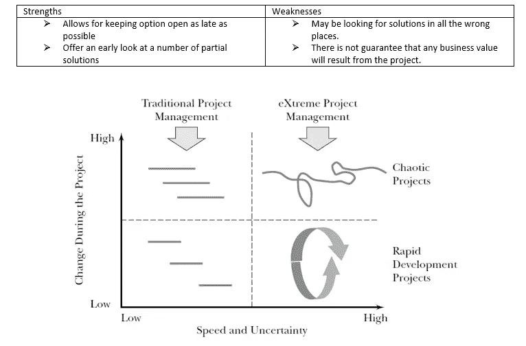

# 数据科学项目管理方法

> 原文：<https://towardsdatascience.com/data-sciencce-projects-management-methodologies-54339c9d5e5a?source=collection_archive---------5----------------------->

在数字化背景下，组织正在部署越来越多的数据科学项目。这篇文章揭示了一些可以指导新一代项目的项目管理方法。即使敏捷方法在 IT 中非常普遍，数据科学通常也需要更新的方法，如 Adaptive 或 Extreme。

这篇文章将快速回顾这些方法，展示每种方法的优缺点。

首先，有必要将项目方法分为两类:目标和解决方案过程。我们会选择目标是从一开始就绝对明确的(如在建筑施工中)还是不明确的(如在研究中)。第二，如果解决方案过程是明确的和预先建立的，或者如果过程是临时的和在开发项目的过程中发现的。

Project Characteristics Quadrants by Goal and Solution Uncertainty — Adapted from [1]

**1 型。线性策略:**

线性策略包括没有反馈回路连续阶段。项目解决方案直到最后阶段才发布。该策略的特点是明确定义的目标解决方案和要求、零或很少的范围变更要求、项目内部的常规和重复过程、使用预先建立的公式和模板。

**1 型。增量策略:**

这种策略类似于线性策略，但是项目的每个阶段都发布一个部分解决方案。在这个策略中，价值必须在最终阶段之前交付。

**1 型或 2 型。迭代策略(例如 Scrum 或特性驱动开发)**

试图对不断变化的环境进行全面规划和计划是没有效率的。因此，敏捷鼓励基于数据的迭代决策**。**例如，在 Scrum 中，主要的焦点是以小的迭代增量交付满足客户需求的产品。

类似于增量战略，但由许多重复的阶段组成。该策略包括一组阶段完成后的反馈回路。当客户满意时，循环停止，即该策略使用几个中间解决方案作为发现最终解决方案的途径。

**2 型或 3 型。适应性策略(如适应性项目框架或适应性软件开发)**

类似于迭代策略，但是每次迭代反馈都将调整项目的未来，以收敛到一个完整的解决方案。一次迭代可能会为客户创建一个部分的解决方案。这种策略是自适应的，因为最终的解决方案只有部分为客户所知，所以成功取决于分配频繁变化的能力。在这里，计划是以适时的方式完成的。[2]

**4 型。极端战略(如研究&开发项目)**

类似于适应性策略，但是每次迭代反馈，项目的目标也必须被发现，并且项目将在其上收敛。这是第 4 类策略，因为目标或解决过程都是未知的。这类项目中目标和路径的不确定性导致了高度的复杂性。通常，最终产品与最初的预期大相径庭。

Differences between traditionam project management and extreme Project Management. Figure from the book Extreme Project Manament by Doug DeCarlo [3]

从一种类型的项目管理转换到另一种类型的项目管理并不是一件简单的任务，在下面的文章中，我将解释如何从经典的方法(传统的，V-cycle)转换到本文中描述的敏捷方法。如果你想阅读它，只需点击以下链接:

 [## 我们如何促进项目管理的转变？(从经典到敏捷)

### 项目管理过渡不一定是破坏性的，相反，我提出了一个模型来实现这一点…

medium.com](https://medium.com/agileinsider/how-can-we-facilitate-the-transformation-of-project-management-from-classic-to-agile-d0c63a20c809) 

**感谢阅读！！！**

> 如果你想继续阅读这样的故事，你可以[在这里订阅！](https://fesan818181.medium.com/membership)

**参考书目**

*[1] R. K. Wysocki，有效的项目管理传统的、适应性的、极端的。威利出版社，2006 年。*

*[2] J. A. Highsmith，适应性软件开发:管理复杂系统的协作方法，第 12 卷。2000.*

*[3] D. Doug，极限项目管理:在现实面前使用领导、原则和工具交付价值。，第 22 卷，第 6 号。2005.*