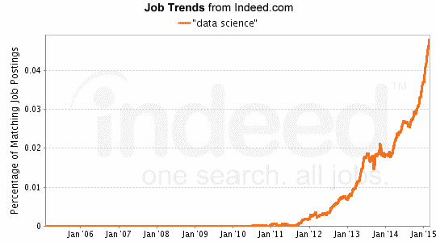
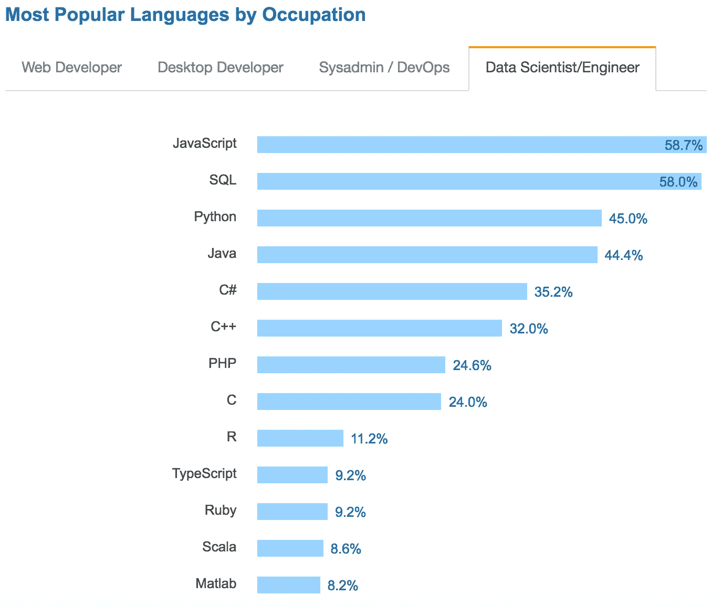
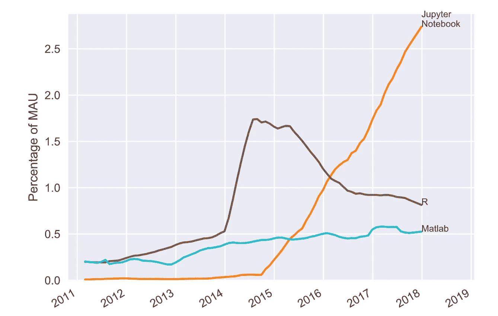
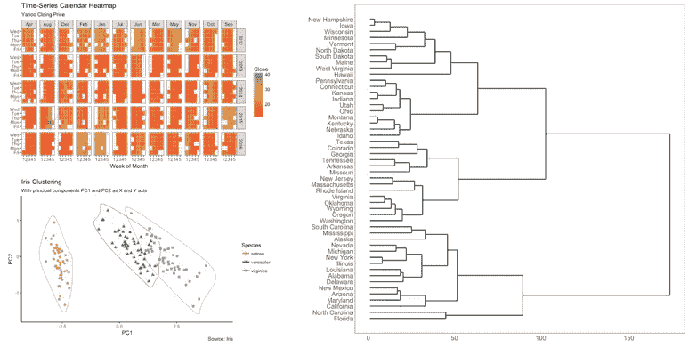
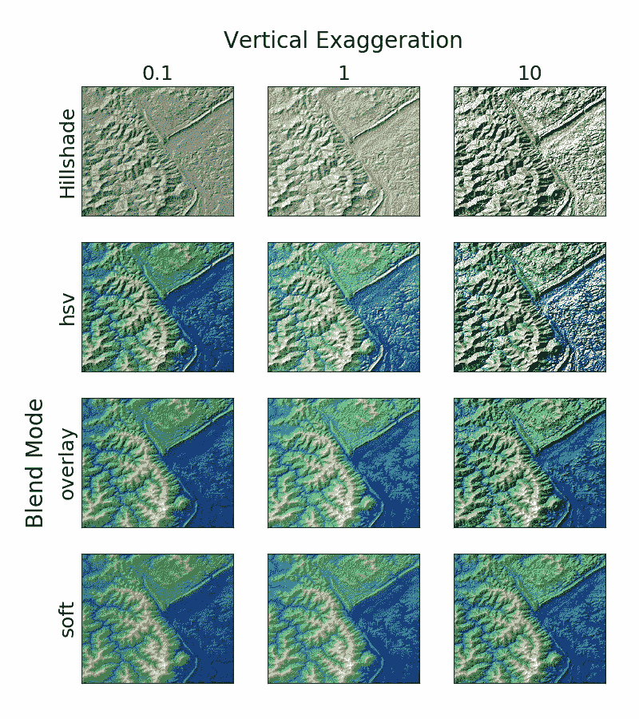
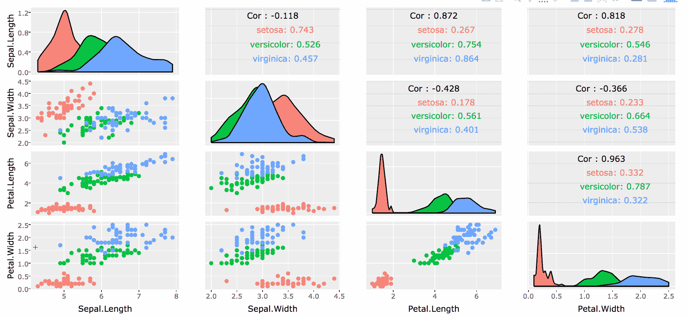
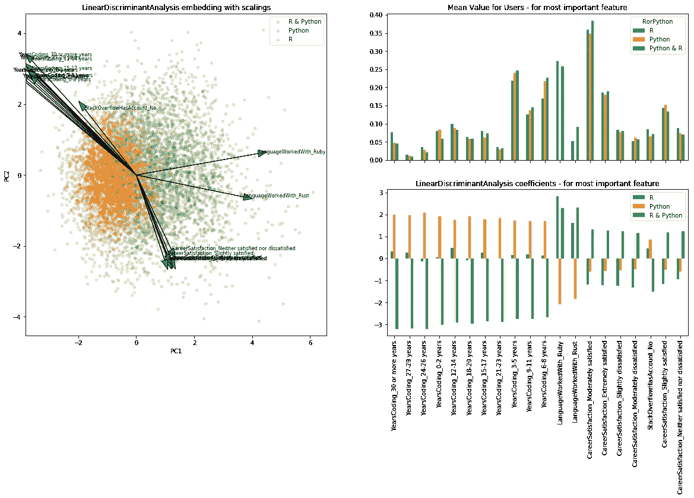
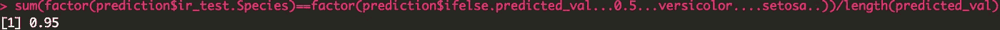
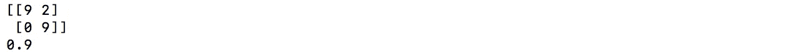
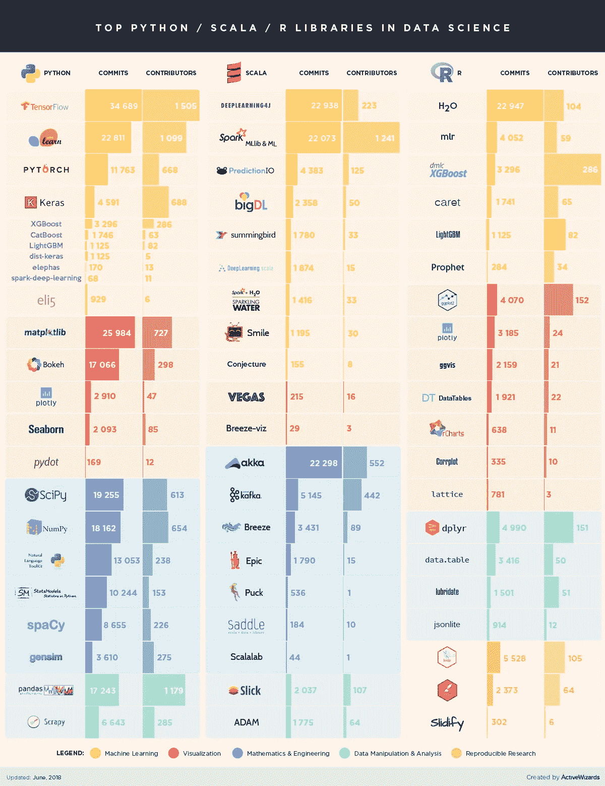

# 数据科学 101:Python 比 R 好吗？

> 原文：<https://towardsdatascience.com/data-science-101-is-python-better-than-r-b8f258f57b0f?source=collection_archive---------7----------------------->


几十年来，研究人员和开发人员一直在争论 Python 和 R 是数据科学和分析的更好语言。数据科学在包括生物技术、金融和社交媒体在内的多个行业中迅速发展。它的重要性不仅被在行业中工作的人们所认识，而且也被现在开始提供数据科学学位的学术机构所认识。随着开源技术迅速取代传统的闭源商业技术，Python 和 R 在数据科学家和分析师中变得非常流行。



“Data science job growth chart — Indeed.com

# **(非常)简短的介绍**

Python 由吉多·范·罗苏姆发明，于 1991 年首次发布。 **Python 2.0** 发布于 2000 年，8 年后 **Python 3.0** 也发布了。 **Python 3.0** 有一些主要的语法修订，并且不向后兼容 **Python 2.0** 。然而，有一些 Python 库，比如 [2to3](https://docs.python.org/2/library/2to3.html) ，可以自动完成两个版本之间的翻译。 **Python 2.0** 目前计划于 2020 年退役。

r 是 1995 年由 Ross Ihaka 和 Robert Gentleman 发明的。它最初是约翰·钱伯斯在 1976 年发明的 S 编程语言的一个实现。一个稳定的测试版本 **1.0.0** 于 2000 年发布。目前由 R 开发核心团队维护，最新稳定版本为 **3.5.1** 。与 Python 不同，R 在过去没有需要语法转换的重大变化。


Guido van Rossum (left) Ross Ihaka (middle) Robert Gentleman (right)

Python 和 R 都有庞大的用户群体和支持。由 Stack Overflow 完成的 2017 年[调查](https://insights.stackoverflow.com/survey/2017)显示，几乎 **45%** 的数据科学家使用 Python 作为他们的主要编程语言。而 r 则被 **11.2%** 的数据科学家使用。



“Developer Survey Results 2017” — Stack Overflow

值得注意的是，Python，特别是 **Jupyter Notebook** ，在最近几年里获得了极大的流行。虽然 **Jupyter Notebook** 可以用于 Python 以外的语言，但它主要用于在数据科学竞赛的浏览器中记录和展示 Python 程序，如 [Kaggle](https://www.kaggle.com/) 。由 Ben Frederickson 做的一项调查显示 **Jupyter Notebook** 在 Github 上的月活跃用户百分比(MAU)在 2015 年后大幅上升。



“[Ranking Programming Languages by GitHub Users](https://www.benfrederickson.com/ranking-programming-languages-by-github-users/)” — Ben Frederickson

随着 Python 近年来越来越受欢迎，我们观察到用 r 编写的 Github 用户的 MAU 百分比略有下降。然而，这两种语言在数据科学家、工程师和分析师中仍然非常受欢迎。

# **可用性**

最初用于研究和学术领域，R 已经不仅仅是一种统计语言。R 可以从 [CRAN](https://cran.r-project.org/) (综合 R 档案网)轻松下载。CRAN 还被用作一个包管理器，有超过 **10，000** 个包可供下载。许多流行的开源 ide 如 [R Studio](https://www.rstudio.com/) 可以用来运行 R。作为一名统计学专业的学生，我认为 R 在堆栈溢出方面有一个非常强大的用户社区。我在本科学习期间关于 R 的大多数问题都可以在 [Stack Overflow 的 R 标签 Q 和 A](https://stackoverflow.com/questions/tagged/r) 上找到答案。如果你刚刚开始学习 R，许多 MOOCs 如 [Coursera](https://www.coursera.org/learn/r-programming) 也提供入门 R 甚至 Python 课程。

在本地机器上设置 Python 工程环境也同样容易。事实上，最近的 MAC 电脑都内置了 Python 2.7 和几个有用的库。如果你像我一样是一个狂热的 Mac 用户，我建议查看 [Brian Torres-Gil](https://medium.com/u/d9b3e07b88?source=post_page-----b8f258f57b0f--------------------------------) 的[Mac OSX 上的 Python 权威指南](https://medium.com/@briantorresgil/definitive-guide-to-python-on-mac-osx-65acd8d969d0)以获得更好的 Python 设置。开源 Python 包管理系统，如 PyPI 和 Anaconda 可以很容易地从他们的官方网站下载。在这一点上，我可能应该提到 Anaconda 也支持 R。当然，大多数人更喜欢直接通过 CRAN 管理包。PyPI 或 Python 通常比 r 有更多的包。然而，并不是所有的 **100，000+** 包都适用于统计和数据分析。

# 形象化

Python 和 R 都有优秀的可视化库。由 R Studio 的首席科学家 [Hadley Wickham](https://medium.com/u/2f166aac6770?source=post_page-----b8f258f57b0f--------------------------------) ，[**ggplot2**](https://github.com/hadley/ggplot2-book)**创建，现在是 R 历史上最流行的数据可视化软件包之一。我完全爱上了 gg plot 2 的各种功能和定制。与 base R 图形相比，ggplot2 允许用户在更高的抽象层次上定制绘图组件。ggplot2 提供了超过 **50** 种适用于不同行业的地块。我最喜欢的图表包括日历热图、分层树状图和聚类图。[塞尔瓦·普拉巴卡兰](https://medium.com/u/28472f176d5?source=post_page-----b8f258f57b0f--------------------------------)有一个关于如何开始使用 ggplot2 的精彩[教程](http://r-statistics.co/Complete-Ggplot2-Tutorial-Part1-With-R-Code.html)。**

****

**Calendar Heatmap (top left), Clusters (bottom left) and Hierarchical Dendrogram (right) in ggplot2**

**Python 也有很好的数据可视化库。 [**Matplotlib**](https://matplotlib.org/) 及其 [**seaborn**](https://seaborn.pydata.org/) 扩展对于可视化和制作有吸引力的统计图非常有帮助。我强烈推荐你去看看 George Seif 的用 Python 编写的快速简单的数据可视化代码，以便更好地理解 matplotlib。与 R 的 ggplot2 类似，matplotlib 能够创建各种各样的图，从直方图到矢量场流图和雷达图。也许 matplotlib 最酷的特性之一是地形山体阴影，在我看来，这比 R [raster](https://www.rdocumentation.org/packages/raster/versions/2.6-7) 的`hillShade()`功能更强大。**

****

**Topographic hillshading using matplotlib**

**R 和 Python 都有**fleet . js**的包装器，这是一个用 Javascript 编写的漂亮的交互式地图模块。我之前写过一篇文章，介绍了如何使用 follow 可视化房地产价格(follow 是 fleet . js 的 Python 包装)。Leaflet.js 是我使用过的较好的开源 GIS 技术之一，因为它提供了与 OpenStreetMaps 和 Google Maps 的无缝集成。您还可以使用 fleed . js 轻松创建吸引人的气泡图、热图和 choropleth 图。我强烈建议您查看 fleed . js 的 Python 和 R wrappers，因为与底图和其他 GIS 库相比，安装要简单得多。**

**或者， [Plotly](http://plot.ly) 是两种语言共有的令人惊叹的图形库。Plotly(或 Plot.ly)是使用 Python，特别是 Django 框架构建的。它的前端是用 JavaScript 构建的，集成了 Python、R、MATLAB、Perl、Julia、Arduino 和 REST。如果你正试图建立一个 web 应用程序来展示你的可视化，我肯定会推荐你去看看 Plotly，因为他们有很棒的带有滑块和按钮的交互图。**

****

**Plotly correlation plots of the Iris dataset**

# **预测分析**

**正如我之前提到的，Python 和 R 都有强大的预测分析库。很难在高层次上比较两者在预测建模方面的表现。r 是专门作为统计语言编写的，因此与 Python 相比，它更容易搜索与统计建模相关的信息。简单的谷歌搜索`logistic regression in R`会返回 6000 万个结果，这是搜索`logistic regression in Python`的 37 倍。然而，对于具有软件工程背景的数据科学家来说，使用 Python 可能更容易，因为 R 是由统计学家编写的。虽然我发现与其他编程语言相比，R 和 Python 同样容易理解。**

**Kaggle 用户 *NanoMathias* 已经做了一个非常彻底的[调查](https://www.kaggle.com/nanomathias/predicting-r-vs-python)关于 Python 或 R 在预测分析中是否是一个更好的工具。他总结道，在数据科学家和分析师中，Python 和 R 用户的数量相当。他的研究中有一个有趣的发现，那就是从事编码工作 12 年以上的人倾向于选择 R 而不是 Python。这说明程序员选择 R 还是 Python 进行预测分析，无非是个人喜好。**

****

**Linear Discriminant Analysis with embeded scalings, R and Python user analysis**

**嗯（表示踌躇等）..所以普遍的共识是两种语言在预测的能力上非常相似。这有点无聊，不是吗？让我们使用 R 和 Python 将逻辑回归模型拟合到 [Iris 数据集](https://archive.ics.uci.edu/ml/datasets/iris)，并计算其预测的准确性。我选择 Iris 数据集是因为它很小并且缺少缺失数据。没有进行探索性数据分析(EDA)和特征工程。我只是做了一个 80-20 的训练测试分割，并用一个预测因子拟合了一个逻辑回归模型。**

```
library(datasets)#load data
ir_data<- iris
head(ir_data)#split data
ir_data<-ir_data[1:100,]
set.seed(100)
samp<-sample(1:100,80)
ir_train<-ir_data[samp,]
ir_test<-ir_data[-samp,]#fit model
y<-ir_train$Species; x<-ir_train$Sepal.Length
glfit<-glm(y~x, family = 'binomial')
newdata<- data.frame(x=ir_test$Sepal.Length)#prediction
predicted_val<-predict(glfit, newdata, type="response")
prediction<-data.frame(ir_test$Sepal.Length, ir_test$Species,predicted_val, ifelse(predicted_val>0.5,'versicolor','setosa'))#accuracy
sum(factor(prediction$ir_test.Species)==factor(prediction$ifelse.predicted_val...0.5...versicolor....setosa..))/length(predicted_val)
```

****

**95% accuracy achieved with R’s glm model. Not bad!**

```
import pandas as pd
from sklearn.linear_model import LogisticRegression
from sklearn.metrics import confusion_matrix#load data
traindf = pd.read_csv("~/data_directory/ir_train")
testdf = pd.read_csv("~/data_directory/ir_test")
x = traindf['Sepal.Length'].values.reshape(-1,1)
y = traindf['Species']
x_test = testdf['Sepal.Length'].values.reshape(-1,1)
y_test = testdf['Species']#fit model
classifier = LogisticRegression(random_state=0)
classifier.fit(x,y)#prediction
y_pred = classifier.predict(x_test)#confusion matrix
confusion_matrix = confusion_matrix(y_test, y_pred)
print confusion_matrix#accuracy
print classifier.score(x_test, y_test)
```

****

**90% accuracy achieved with Python sklearn’s LogisticRegression model**

**使用 R stat 的`glm`函数和 Python scikit-learn 的`LogisticRegression`，我将两个逻辑回归模型拟合到 Iris 数据集的随机子集。在我们的模型中，我们只使用了一个预测因子`sepal length`来预测花的`species`。两个模型都达到了 90%或更高的准确率，R 给出了稍好的预测。然而，这不足以证明 R 比 Python 有更好的预测模型。逻辑回归只是你可以用 Python 和 R 构建的许多预测模型中的一种。Python 挤掉 R 的一个方面是它构建良好的深度学习模块。流行的 Python 深度学习库包括 **Tensorflow** 、 **Theano** 和 **Keras** 。这些库都有足够的文档，我确信 Siraj Raval 有数百个关于如何使用它们的 Youtube 教程。老实说，我宁愿花一个小时在 Keras 中编写 dCNNs(深度卷积神经网络),也不愿花半天时间弄清楚如何在 r 中实现它们。 [Igor Bobriakov](https://medium.com/u/f7782f0aeb1b?source=post_page-----b8f258f57b0f--------------------------------) 制作了一个出色的信息图，描述了 Python、Scala 和 r 中流行库的提交和贡献者数量。我强烈推荐阅读他的文章(下面提供了链接)。**

****

**“[Comparison of top data science libraries for Python, R and Scala [Infographic]](https://medium.com/activewizards-machine-learning-company/comparison-of-top-data-science-libraries-for-python-r-and-scala-infographic-574069949267)” — Igor Bobriakov**

# **表演**

**测量编程语言的速度通常被认为是一项有偏见的任务。每种语言都有针对特定任务优化的内置特性(比如 R 如何针对统计分析进行优化)。用 Python 和 R 进行性能测试可以用许多不同的方法来完成。我用 Python 和 R 编写了两个简单的脚本来比较 Yelp 的[学术用户数据集](https://www.kaggle.com/yelp-dataset/yelp-dataset#yelp_academic_dataset_user.json)的加载时间，该数据集略超过 2g。**

****R****

```
require(RJSONIO)
start_time <- Sys.time()
json_file <- fromJSON("~/desktop/medium/rpycomparison/yelp-dataset/yelp_academic_dataset_user.json")
json_file <- lapply(json_file, function(x) {
  x[sapply(x, is.null)] <- NA
  unlist(x)
})
df<-as.data.frame(do.call("cbind", json_file))
end_time <- Sys.time()
end_time - start_time#Time difference of 37.18632 secs
```

****Python****

```
import time
import pandas as pd
start = time.time()
y1 = pd.read_json('~/desktop/medium/rpycomparison/yelp-dataset/yelp_academic_dataset_user.json', lines = True)
end = time.time()
print("Time difference of " + str(end - start) + " seconds"#Time difference of 169.13606596 seconds
```

**嗯……有意思。r 加载 json 文件的速度几乎是 Python 的 5 倍。众所周知，Python 比 R 有更快的加载时间，布莱恩·雷(Brian Ray)的 T2 测试(T3)证明了这一点。让我们看看这两个程序如何处理一个大的？csv 文件为。csv 是一种常用的数据格式。我们稍微修改了上面的代码，以加载[西雅图图书馆库存数据集](https://www.kaggle.com/city-of-seattle/seattle-library-collection-inventory/version/15)，它几乎有 4.5 千兆字节。**

****R****

```
start_time <- Sys.time()
df <- read.csv("~/desktop/medium/library-collection-inventory.csv")
end_time <- Sys.time()
end_time - start_time#Time difference of 3.317888 mins
```

****Python****

```
import time
import pandas as pd
start = time.time()
y1 = pd.read_csv('~/desktop/medium/library-collection-inventory.csv')
end = time.time()
print("Time difference of " + str(end - start) + " seconds")#Time difference of 92.6236419678 seconds
```

**呀！r 花了几乎两倍的时间来加载 4.5 千兆字节。csv 文件比 Python **pandas** (用于数据操作和分析的 Python 编程语言)。重要的是要知道，虽然 pandas 主要是用 Python 编写的，但是库的更重要的部分是用 Cython 或 c 编写的，这可能会对加载时间产生潜在的影响，具体取决于数据格式。**

**现在让我们做一些更有趣的事情。 **Bootstrapping** 是一种从总体中随机重新取样的统计方法。我以前做过足够的引导，知道这是一个耗时的过程，因为我们必须重复地对数据进行多次迭代。以下代码分别测试了在 R 和 Python 中引导 100，000 次复制的运行时:**

****R****

```
#generate data and set boostrap size
set.seed(999)
x <- 0:100
y <- 2*x + rnorm(101, 0, 10)
n <- 1e5#model definition
fit.mod <- lm(y ~ x)
errors <- resid(fit.mod)
yhat <- fitted(fit.mod)#bootstrap
boot <- function(n){
  b1 <- numeric(n)
  b1[1] <- coef(fit.mod)[2]
  for(i in 2:n){
    resid_boot <- sample(errors, replace=F)
    yboot <- yhat + resid_boot
    model_boot <- lm(yboot ~ x)
    b1[i] <- coef(model_boot)[2]
  }
  return(b1)
}
start_time <- Sys.time()
boot(n)
end_time <- Sys.time()#output time
end_time - start_time#Time difference of 1.116677 mins
```

****Python****

```
import numpy as np
import statsmodels.api as sm
import time
#generate data and set bootstrap size
x = np.arange(0, 101)
y = 2*x + np.random.normal(0, 10, 101)
n = 100000
X = sm.add_constant(x, prepend=False)#model definition
fitmod = sm.OLS(y, X)
results = fitmod.fit()resid = results.resid
yhat = results.fittedvalues#bootstrap
b1 = np.zeros((n))
b1[0] = results.params[0]
start = time.time()
for i in np.arange(1, 100000):
   resid_boot = np.random.permutation(resid)
   yboot = yhat + resid_boot
   model_boot = sm.OLS(yboot, X)
   resultsboot = model_boot.fit()
   b1[i] = resultsboot.params[0]
end = time.time()#output time
print("Time difference of " + str(end - start) + " seconds")#Time difference of 29.486082077 seconds
```

**r 花了几乎两倍的时间来运行引导程序。这是相当令人惊讶的，因为 Python 通常被认为是一种“慢”的编程语言。我慢慢开始后悔用 R 而不是 Python 来运行我所有的本科统计学作业。**

# **结论**

**本文只讨论了 Python 和 R 之间的基本区别。就个人而言，我会根据手头的任务在 Python 和 R 之间进行转换。最近，数据科学家一直在推动在[结合](https://www.kdnuggets.com/2015/12/using-python-r-together.html)中使用 Python 和 R。很有可能在不久的将来会出现第三种语言，并最终在流行程度上超过 Python 和 R。作为数据科学家和工程师，跟上最新技术并保持创新是我们的责任。最后，强烈推荐你阅读 [Karlijn Willems](https://medium.com/u/b9a4f6da81ed?source=post_page-----b8f258f57b0f--------------------------------) 的[选择 R 还是 Python 做数据分析？一张信息图](https://www.datacamp.com/community/tutorials/r-or-python-for-data-analysis)。它为我们在本文中讨论的内容提供了一个很好的视觉总结，并提供了额外的信息，包括就业趋势和平均工资。在下面评论，让我知道你更喜欢哪种语言！**

**感谢您阅读我的文章。**