# 数据科学

> 原文：<https://towardsdatascience.com/data-science-43c246d4eebc?source=collection_archive---------5----------------------->

## Minder 建议引擎:

以下是如何使用随机森林进行数据分类的详细说明。

我们分析了由一个类似 Tinder 的配对网站产生的数据， *Minder* 面向一个特定的社区。其工作方式是，当您登录时，Minder 的引擎会根据您保存的偏好向您推荐配置文件。你可以向右滑动，即*喜欢*的个人资料，或者你可以向左滑动*丢弃*。任何显示过一次的个人资料，在任何情况下都不会再向您显示。因此，如果两个人互相喜欢对方，他们的详细资料会透露给对方。

为了增加匹配的可能性，我们显然需要了解人们的刷卡行为。我们收集了一百万条最新的刷卡数据，并决定使用由 **Python** 提供的流行生态系统来分析这些数据。我们用这一百万个数据点来训练我们的引擎。然后，我们的引擎预测一个人喜欢另一个人的可能性。

由于两种性别之间的性别行为非常不同(如下图所示)，我们最终决定为男性和女性用户使用单独的预测分类器。

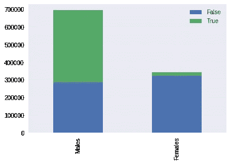

图表中的*真*和*假*值是候选人*喜欢另一个*还是*不喜欢*。我们可以看到，男性喜欢展示给他们的 58.65%的简介，而女性只喜欢 5.7%。这与男性相比甚至不到十分之一。

最终，我们实现了正确预测一个人是否会喜欢某个个人资料的结果，女性用户的准确率大约为 94%，男性用户的准确率为 83%。

详细信息分为以下三个部分:

## I:使用机器学习的数据分类

首先，我们将大类分开，并确定根据性别和 T21 行为来分离数据可能是个好主意。我们决定使用由 **Python** 提供的流行生态系统来分析刷卡数据。我们的最终目标是创建一个 web 服务(RESTful ),通过提供两个用户的个人资料作为输入，提供一个人喜欢另一个人的大概情况。

**导入库**

我们将使用由 [Pandas](http://pandas.pydata.org/) 库提供的数据帧来加载和操作数据。然后我们将使用 [Matplotlib](http://matplotlib.org/) (及其衍生 [Seaborn](http://seaborn.pydata.org/) )库来可视化数据的不同方面。数字操作通常用 [Numpy](http://www.numpy.org/) 数组完成，对于机器学习，我们使用 [Scikit-Learn](http://scikit-learn.org/) 。使用 *pip* 或任何其他合适的 Python 包管理器可以很容易地安装这些库。

```
import os
import datetime
import numpy as np
import pandas as pd
import matplotlib.pyplot as plt
import seaborn as sns
from sklearn import tree
from sklearn.ensemble import RandomForestClassifier
from sklearn.model_selection import train_test_split
from sklearn.metrics import classification_report,confusion_matrix
from sklearn.externals import joblib
```

**读取数据**

我们已经对数据库中的所有数据进行了反规范化，并将其转储到一个平面 CSV 文件中。

```
data=pd.read_csv('1M.csv')
print data.shape data.head(2)----output----
(1000000, 27)
 "p1_liked","p2_liked","confirmed","unmatched","answeredFromTelegram","p1_id","p1_country","p1_gender","p1_education","p1_flavor","p1_age","p1_timezone","p1_ethnicity","p1_languages","p1_religiosity","p1_premium","p2_id","p2_country","p2_gender","p2_education","p2_flavor","p2_age","p2_timezone","p2_ethnicity","p2_languages","p2_religiosity","p2_premium"
 FALSE,,FALSE,,,151606,"US","male","graduate_degree","sunni",26,"-5","{""South Asian""}","{Bengali}","3.0661764705882355",FALSE,181761,"US","female","graduate_degree","sunni",26,"-4","{""South Asian""}","{Bengali,English,Hindi,Urdu}","2.9233774038461537",FALSE
 FALSE,,FALSE,,,266475,"US","female","graduate_degree","sunni",26,"-4","{""South Asian""}","{Bengali}","1.5865208360015366",FALSE,213638,"US","male","graduate_degree",,,"-6",,,,FALSE
```

**删除无用的列**

当我们决定提取数据时，我们从数据库中收集了(几乎)所有可能用到的信息。后来我们决定删除几列，因为这些不是用户决策(刷卡)过程中使用的信息的一部分。

```
useless_columns = ['answeredFromTelegram', 'confirmed', 'p1_timezone', 'p2_timezone', 'unmatched'] data.drop(useless_columns, axis=1, inplace=True)
```

附:这些文章中使用的“风味”一词是指一个特定的宗教派别。

**进一步反规格化数据**

刷卡数据的结构是这样的，每个刷卡行都有一个名为[p1_liked]的字段，该字段包含第一个人(p1)的刷卡结果( *true* 表示 *like* ),第一个人(p1)被展示给另一个人(p2 的)的简档。当(且如果)p2 显示 p1 的配置文件时，使用相同的行，数据存储在名为[p2_liked]的字段中。如果两个字段都有*真值*，那么字段【确认】被设置为*真值*。请注意，我们之前已经删除了[确认]数据。

因为这些行(其中[p2_liked]不为空)包含两组数据，所以让我们复制它们，然后在切换[p1_…]和[p2_…]数据后将它们与主数据重新合并。这将使[p2_liked]无用，我们将删除它。

第一步是复制[p2_liked]不为空 T27 的行，即不是 T28 真 T29 就是 T30 假 T31。接下来，我们将交换其列的名称，以便交换 *p1* 和 *p2* 的角色。这对我们来说是一个新的数据点。

```
datap2=data[data.p2_liked>=0]
print datap2.shapep2_cols={'p1_age' : 'p2_age' , 'p1_country' : 'p2_country' ,
 'p1_education' : 'p2_education' , 'p1_ethnicity' : 'p2_ethnicity' ,
 'p1_flavor' : 'p2_flavor' , 'p1_gender' : 'p2_gender' ,
 'p1_id' : 'p2_id' , 'p1_languages' : 'p2_languages' ,
 'p1_liked' : 'p2_liked' , 'p1_premium' : 'p2_premium' ,
 'p1_religiosity' : 'p2_religiosity' , 'p2_age' : 'p1_age' ,
 'p2_country' : 'p1_country' , 'p2_education' : 'p1_education' ,
 'p2_ethnicity' : 'p1_ethnicity' , 'p2_flavor' : 'p1_flavor' ,
 'p2_gender' : 'p1_gender' , 'p2_id' : 'p1_id' ,
 'p2_languages' : 'p1_languages' , 'p2_liked' : 'p1_liked' ,
 'p2_premium' : 'p1_premium' , 'p2_religiosity' : 'p1_religiosity' }
datap2n= datap2.rename(columns=p2_cols)data2 = pd.concat([data, datap2n], axis=0);
print data2.shape
data2= data2.rename(columns={'p1_liked':'liked'})----output----
(43089, 22)
(1043089, 22)
```

我们看到数据中有 43089 行，其中两个人都刷了对方的个人资料。最后，我们将新数据帧与主数据合并，并将新数据帧称为 **data2。**我们也把[p1_liked]重命名为[liked]。[liked]列有 True/False 值，这些值就是我们的分类器将分类到的类。

**根据性别分割数据**

让我们在[p1_gender]的基础上分割数据。我们将很快证明我们的选择。

```
dataf = data2[(data2.p1_gender=='female') & (data2.p2_gender=='male')]
datam = data2[(data2.p1_gender=='male') &      (data2.p2_gender=='female')]
print dataf.shape
print datam.shape----output----
(344951, 22)
(695762, 22)
```

让我们删除更多无用的列。记住我们不需要用户*id’*s 和性别值作为分类器。

```
useless_columns=['p1_gender','p2_gender','p2_liked','p1_id','p2_id']
datam.drop(useless_columns, axis=1, inplace=True)
dataf.drop(useless_columns, axis=1, inplace=True)----output----
count     1043089
unique          2
top         False
freq       614942
Name: liked, dtype: object
```

**行为分析**

这里有一个根据性别分离数据集的基本原理。他们的行为完全不同。

```
dmvc = datam.liked.value_counts()
dfvc = dataf.liked.value_counts()
df = pd.DataFrame([dmvc,dfvc])
df.index = ['Males','Females']
df.plot(kind='bar', stacked=True);
```


男性喜欢向他们展示的 58.65%的简介，而女性只喜欢 5.7%。甚至不到*十分之一*相比男性。

```
dmm = datam.liked.mean()
dfm = dataf.liked.mean()
df = pd.DataFrame([dmm,dfm])
df.index = ['Males','Females']
df.plot(kind='bar', stacked=True);
```

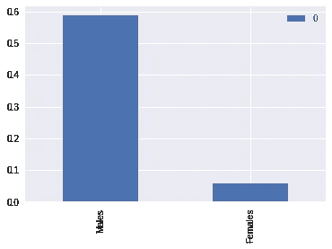

```
print " True liked values - Males- {} ({:.2%})".format(datam.liked.sum(), datam.liked.mean())
print " True liked values - Females- {} ({:.2%})".format(dataf.liked.sum(), dataf.liked.mean())----output----
True  liked values - Males-  408099 (58.65%)
True  liked values - Females-  19791 (5.74%)
```

**现在保存**，让分析在单独的数据集上继续进行。

```
datam.to_csv("1M-datam.csv", index=False)
dataf.to_csv("1M-dataf.csv", index=False)
```

接下来:我们将分析女性用户的行为。

## 二:数据分析

让我们从加载 *1M-dataf.csv* 开始，这个文件包含了女性用户的滑动行为。我们假设已经加载了适当的库( *Pandas、Matplotlib、Seaborn、Numpy、Scikit-Learn* )。

**加载数据**

```
datafile='1M-dataf.csv'
data=pd.read_csv(datafile)
print data.shape
print list(data)
print data.liked.mean()
print data.liked.describe()----output----
(344951, 17)
['p1_age', 'p1_country', 'p1_education', 'p1_ethnicity', 'p1_sect', 'p1_languages', 'liked', 'p1_premium', 'p1_religiosity', 'p2_age', 'p2_country', 'p2_education', 'p2_ethnicity', 'p2_sect', 'p2_languages', 'p2_premium', 'p2_religiosity']
0.0573733660723

count     344951
unique         2
top        False
freq      325160
Name: liked, dtype: object
```

正如我们从上一篇文章中所记得的，在[喜欢的]列中几乎 94.7%的值(355160/244951)都是*错误的。*

首先，我们向我们的数据框架添加一个新列[same_country]。如果国家相同或不同，添加信息，减少了我们的交叉类别很多。对于宗教派别来说也是如此。

```
data['same_country']=(data['p1_country']==data['p2_country'])
data['same_religion']=(data['p1_flavor']==data['p2_flavor'])
```

处理数字数据和相关的 N/A

```
print data.shape
data.describe().loc['count',:]----output----
(344951, 19)
 p1_age 332184
 p1_religiosity 257957
 p2_age 328447
 p2_religiosity 233237
```

计数值的差异是缺失值，或 NaN。我们将用中间值填充缺失的[年龄]值，用平均值填充缺失的[宗教信仰]值。

```
print (data.p1_religiosity.mean(), data.p1_religiosity.median(), data.p2_religiosity.mean(), 
   data.p2_religiosity.median())
print (data.p1_age.mean(), data.p1_age.median(), 
   data.p2_age.mean(), data.p2_age.median())

data.p1_age.fillna(data.p1_age.median(), inplace=True)
data.p2_age.fillna(data.p2_age.median(), inplace=True)
data.p1_religiosity.fillna(data.p1_religiosity.mean(), 
   inplace=True)
data.p2_religiosity.fillna(data.p2_religiosity.mean(),
   inplace=True)----output----
(3.07051616485, 3.03669724771, 2.79660425283, 2.96941896024)
(26.1033403174, 25.0, 28.1010147756, 28.0)
```

## **分析开始**

Seaborn 库提供了更简单的 API 来创建更好的可视化。

**1。国家智慧**

```
sns.countplot(x="p1_country", hue='liked', data=data);
```

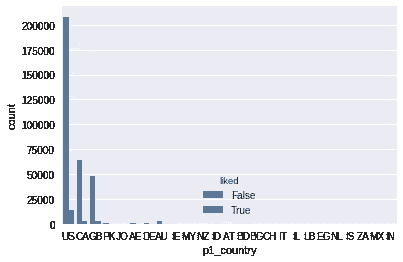

让我们看一下标准化的数据，以便理解。

```
sns.barplot(x="p1_country", y='liked', hue='same_country', 
    data=data, ci=None);
```

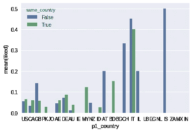

**按国家查看喜欢的个人资料。**

因为就频率而言有三个不同的组:

1.  美国
2.  CA/GB
3.  世界其他地方

让我们分别来看。

```
fig, ax =plt.subplots(nrows=1, ncols=3, figsize=(15,5))
sns.countplot(x="p1_country", hue='same_country', 
     data=data[(data.liked) & (data.p1_country=='US')], 
     ax=ax[0]);
sns.countplot(x="p1_country", hue='same_country', 
     data=data[(data.like) & ((data.p1_country=='CA')|
     (data.p1_country=='GB'))], ax=ax[1]);
sns.countplot(x="p1_country", hue='same_country', 
     data=data[(data.liked) & (data.p1_country!='US')
         &(data.p1_country!='CA') & (data.p1_country!='GB')],
     ax=ax[2]);
fig.show()
```

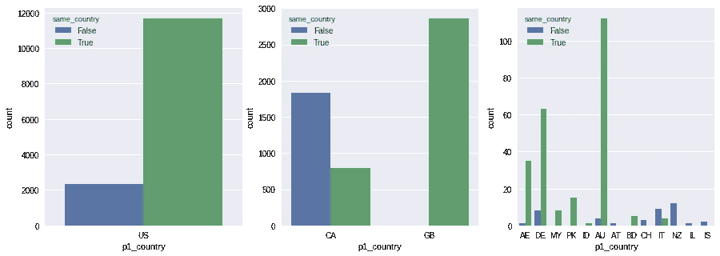

所以国家分为四类

1.  美国
2.  加拿大
3.  千兆字节
4.  其他人

同样，我们将删除[p2_country]数据，保留[same_country],因为来自其他国家的数据点非常少，所以我们将它们分组在一起。我们将[p1_country]重命名为[country]，并删除[p2_country]。

```
data.p1_country[(data.p1_country!='US') & (data.p1_country!='CA')
         & (data.p1_country!='GB')]='XX'
data.rename(columns={"p1_country":"country"}, inplace=True)
data.drop("p2_country", inplace=True, axis=1)
```

绘制上面的图表表明，数据看起来仍然有意义。

```
fig, ax =plt.subplots(nrows=2, ncols=3, figsize=(15,10))
sns.countplot(x="country", hue='liked', data=data, ax=ax[0,0]);
sns.barplot(x="country", y='liked', hue='same_country', data=data, ci=None, ax=ax[0,1]);
sns.countplot(x="country", hue='same_country', data=data[(data.liked) & (data.country=='US')], ax=ax[1, 0]);
sns.countplot(x="country", hue='same_country', data=data[(data.liked) & ((data.country=='CA')|(data.country=='GB'))], ax=ax[1, 1]);
sns.countplot(x="country", hue='same_country', data=data[(data.liked) & (data.country!='US') & (data.country!='CA') & (data.country!='GB')], ax=ax[1,2]);
fig.show()
```

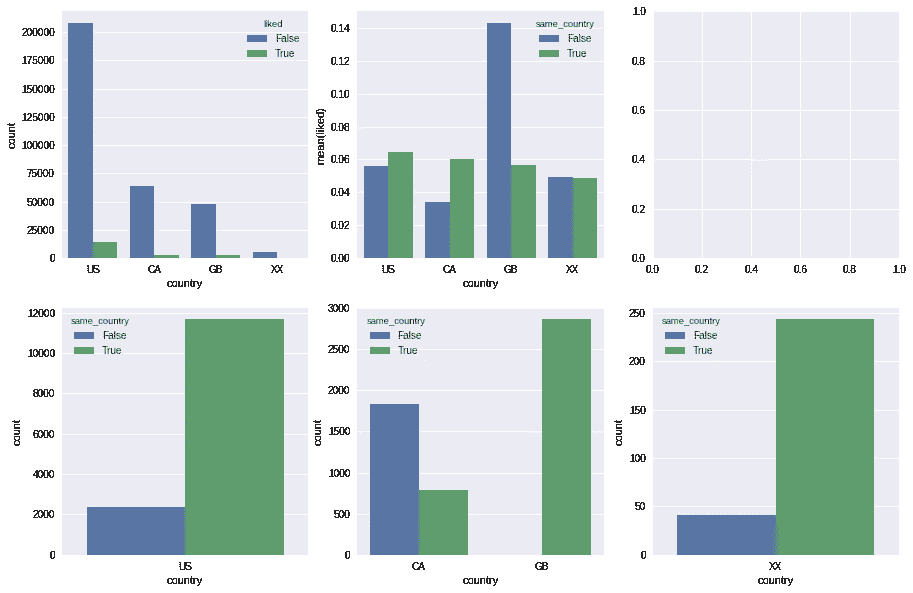

**2。宗教**

宗教和教派信息无疑是目标群体中的一个关键因素。

```
fig, ax =plt.subplots(nrows=1, ncols=3, figsize=(15,5))
sns.countplot(x="p1_flavor", hue='liked', data=data, ax=ax[0]);
sns.barplot(x="p1_flavor", y='liked', data=data, ci=None, ax=ax[1]);
sns.barplot(x="p1_flavor", y='liked', hue='p2_flavor', data=data, ci=None, ax=ax[2]);
fig.show()
```

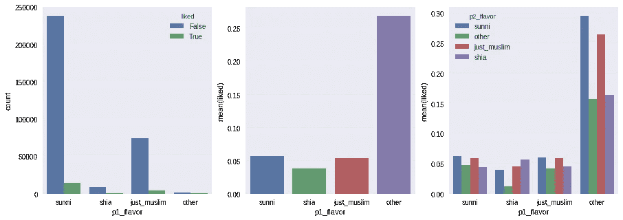

“其他人”很少，让我们把他们和“仅仅是穆斯林”合并起来，然后重复。

```
data.p1_flavor[(data.p1_flavor=='other')]='just_muslim'
data.p2_flavor[(data.p2_flavor=='other')]='just_muslim'
fig, ax =plt.subplots(nrows=1, ncols=3, figsize=(15,5))
sns.countplot(x="p1_flavor", hue='liked', data=data, ax=ax[0]);
sns.barplot(x="p1_flavor", y='liked', data=data, ci=None, ax=ax[1]);
sns.barplot(x="p1_flavor", y='liked', hue='p2_flavor', data=data, ci=None, ax=ax[2]);
fig.show()
```

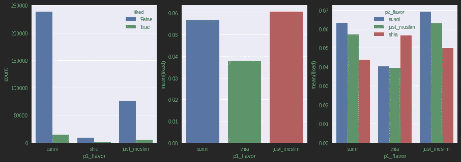

**2.1 宗教狂热**

宗教狂热呢？这是每个用户给出的关于他/她自己的信息，他/她有多虔诚，等级为 1-5。让我们先把数据转换成最接近的整数，然后画出来。

```
data=data.round({'p1_religiosity': 0, 'p2_religiosity': 0})
data.p1_religiosity=data.p1_religiosity.astype(int)
data.p2_religiosity=data.p2_religiosity.astype(int)
fig, ax =plt.subplots(nrows=1, ncols=2, figsize=(15,5))
sns.barplot(x="p1_religiosity", y='liked', data=data, ci=None, ax=ax[0]);
sns.barplot(x="p1_religiosity", y='liked', hue='p2_religiosity', data=data, ci=None, ax=ax[1]);
fig.show()
```

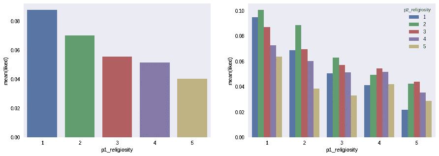

所以看起来宗教相关性仍然比宗教告诉我们更多，但是宗教图表中的微小差异也可能帮助我们。两个都留着吧。

**3。高级用户**

```
fig, ax =plt.subplots(nrows=1, ncols=2, figsize=(15,5))
sns.barplot(x='p1_premium', y='liked', hue='p2_premium',
    data=data, ci=None, ax=ax[0]);
sns.barplot(x='p2_premium', y='liked', hue='p1_premium',
    data=data, ci=None, ax=ax[1]);
fig.show()
```

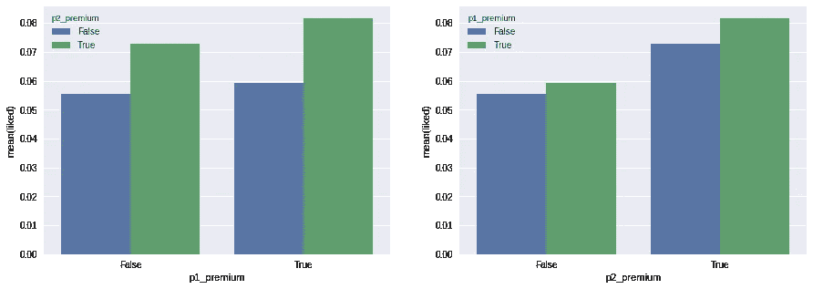

高级用户更有可能被*喜欢* **。**但这一点受到了怀疑，因为高级用户的个人资料更经常被展示。因此，让我们保留 *p2* 的保费数据，并在我们的培训中使用它来提高他们的概率，以便实际上不需要在最后计算保费。

p1 的先决条件也并非完全无关紧要。高级用户选择了更多的选择(右图)。但是这个事实并没有改善我们的预测。

**4。教育**

我们有一种预感，教育可能是一个关键因素。让我们验证一下直觉。但首先让我们打印我们的数据库中给出的独特的教育资格。

```
print data.p1_education.unique()array(['graduate_degree', 'college_degree', 'undergraduate', 'other',
       'high_school', nan], dtype=object)fig, ax =plt.subplots(nrows=1, ncols=2, figsize=(15,5))
edu_o=['graduate_degree', 'undergraduate', 'college_degree', 'other', 'high_school']
sns.countplot(x="p1_education", data=data, order=edu_o, ax=ax[0]);
sns.barplot(x="p1_education", y='liked', hue='p2_education', data=data, ci=None, order=edu_o, hue_order=edu_o, ax=ax[1]);
fig.show()
```

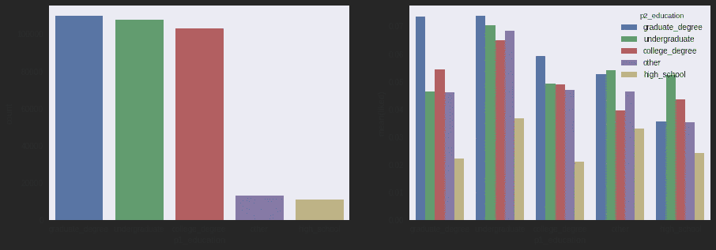

所以教育似乎是影响决策的一个因素。既然反对这些的用户行为是相似的，让我们合并本科生，大学和其他。它们似乎同等重要。让我们称之为 BS。

```
data.p1_education[(data.p1_education=='college_degree')|(data.p1_education=='undergraduate')|(data.p1_education=='other')]='BS'
data.p2_education[(data.p2_education=='college_degree')|(data.p2_education=='undergraduate')|(data.p2_education=='other')]='BS'
```

为了确保万无一失，让我们绘制图表。

```
fig, ax =plt.subplots(nrows=1, ncols=3, figsize=(15,5))
sns.countplot(x="p1_education", data=data, ax=ax[0]);
sns.countplot(x="p1_education", data=data[data.liked], ax=ax[1]);
sns.barplot(x="p1_education", y='liked', hue='p2_education', data=data, ci=None, ax=ax[2]);
fig.show()
```

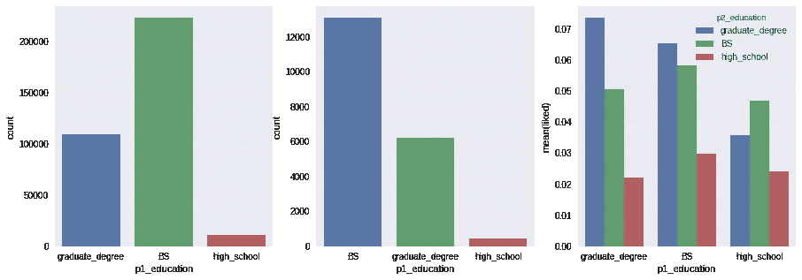

既然我们已经处理完了数据，是时候继续了。

**处理列**

关于我们将要使用的分类器([随机森林](http://en.wikipedia.org/wiki/Random_forest))的一点是，它可以很好地处理数字数据或虚拟分类数据(也称为[指示变量](http://en.wikipedia.org/wiki/Dummy_variable_(statistics)))。现在我们有了所有的列(除了多值数组:[种族]和[语言])，让我们对它们进行适当的虚拟化和类型转换。

因为我们已经清理了数字字段(适当地填充了 NaN 值)，所以让我们为训练/测试创建一个新的数据副本，称为 *dt* 。

```
dt = data[['p1_age','p2_age','p1_religiosity','p2_religiosity']].copy()
```

现在让我们为每个分类字段创建虚拟变量:[国家、教育、宗教(风味)、溢价]。

```
datac = pd.get_dummies(data.country, prefix="ct")
dt = pd.concat([dt,datac],axis=1)
dt = pd.concat([dt,data.same_country.astype(int)],axis=1)datae1 = pd.get_dummies(data.p1_education, prefix="edu1")
dt = pd.concat([dt,datae1],axis=1)
datae2 = pd.get_dummies(data.p2_education, prefix="edu2")
dt = pd.concat([dt,datae2],axis=1)datar = pd.get_dummies(data.p1_flavor, prefix="rel")
dt = pd.concat([dt,datar],axis=1)
dt = pd.concat([dt,data.same_religion.astype(int)],axis=1)dt = pd.concat([dt,data.p2_premium.astype(int)],axis=1)
```

我们已经完成了标准数据。有两个多值字段[种族、语言]。这些多值数据需要处理，因为我们将它们表示为 JSON 数组。我们将简单地使用我们对实际实现的理解来获得语言和种族列表。我们将遍历所有语言/种族，并进行子字符串比较，以查看我们的语言/种族是否在字段数据中。让我们创建一个新的数据框，并在那里进行一些分析。

首先针对*语言:*

```
langs=["Arabic", "Urdu", "Turkish", "Spanish", "Russian", "Pashtu", "Malaysian", "Italian", "Indonesian", "Hindi", "German", "French", "Filipino", "Farsi", "English", "Dutch", "Chinese", "Bengali"]dfl = pd.DataFrame()
dl1=data.p1_languages
dl2=data.p2_languagesdfl["liked"]=data.liked.astype(int)
dfl["same_language"]=0
for l in langs:
ln1="lang1_"+l
ln2="lang2_"+l
dfl[ln1]=(dl1.str.contains(l)==True)
dfl[ln2]=(dl2.str.contains(l)==True)dfl["same_language"]=dfl["same_language"]+((dfl[ln1])*(dfl[ln1]==dfl[ln2]))fig, ax =plt.subplots(nrows=1, ncols=3, figsize=(15,5))
sns.countplot(x="same_language", data=dfl, ax=ax[0]);
sns.countplot(x="same_language", data=dfl[dfl.liked==1], ax=ax[1]);
sns.barplot(x="same_language", y='liked', data=dfl, ci=None, ax=ax[2]);
fig.show()
```

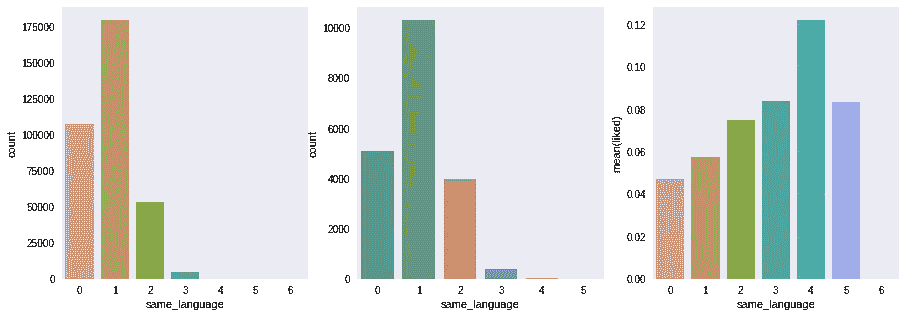

请注意，我们还为[same_language]创建了字段，这有望使分析变得更加简单。下一站【种族】。

```
dfe = pd.DataFrame()
de1=data.p2_ethnicity
de2=data.p2_ethnicitydfe["liked"]=data.liked.astype(int)
dfe["same_ethnicity"]=0

ethnics=["Afghan", "African American", "Arab (Khaleej)", "Arab (Levant)", "Arab (North Africa)", "Caucasian", "East African", "East Asian", "Hispanic", "Kurdish", "Persian", "South Asian", "Sub-Sahara African", "Turkish", "West African", "Other"]
for e in ethnics:
    et1="ethn1_"+e
    et2="ethn2_"+e
    dfe[et1]=(de1.str.contains(e)==True)
    dfe[et2]=(de2.str.contains(e)==True)
    dfe["same_ethnicity"]=dfe["same_ethnicity"]+((dfe[et1])*(dfe[et1]==dfe[et2]))fig, ax =plt.subplots(nrows=1, ncols=3, figsize=(15,5))
sns.countplot(x="same_ethnicity", data=dfe, ax=ax[0]);
sns.countplot(x="same_ethnicity", data=dfe[dfe.liked==1], ax=ax[1]);
sns.barplot(x="same_ethnicity", y='liked', data=dfe, ci=None, ax=ax[2]);
fig.show()
```

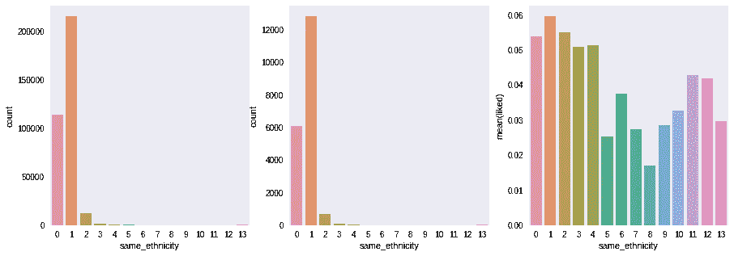

请注意，图表显示了*喜欢的*简介的匹配语言/声明种族的频率。让我们最后把这个数据加到 *dt* 上。我们还需要将目标列 *liked、*添加到 dt 中，然后将数据帧保存到一个文件中。

```
dt = pd.concat([dt,dfl.same_language.astype(int)],axis=1)
dt = pd.concat([dt,dfe.same_ethnicity.astype(int)],axis=1)
dt = pd.concat([dt,data.liked.astype(int)],axis=1)
print dt.shape
dt.to_csv("dataf-categorical.csv", index=False)----output----
(344951, 23)
```

在填充缺失值、创建虚拟(指示)变量和减少字段数量(维度缩减)之后，我们可以看到我们的数据由 23 个属性组成。在下一步中，我们将训练我们的分类器，看看我们的进展如何。

## 三:培训/储蓄和测试

我们将使用[随机森林](http://en.wikipedia.org/wiki/Random_forest)分类器，众所周知它在这类问题中工作得很好。同样，我们假设已经加载了适当的库( *Pandas、Matplotlib、Seaborn、Numpy、Scikit-Learn* )。

让我们加载数据，并提醒自己所涉及的维度。

```
datafile="1M-dataf-categorical"
data=pd.read_csv(datafile+".csv")
print data.shape
print ("Percentage of likes: {:.2%}".format(data.liked.mean()))----output----
(344951, 23)
Percentage of likes: 5.74%
```

我们有 345K 的*刷*记录，只有 5.74%的*喜欢*，其余都是*不喜欢*。

**创建训练和测试数据集**

让我们将数据分为训练数据和测试数据。我们将在每个集合中随机放置一半数量的行。

```
num_test = 0.5
train, test, train_target, test_target =
        train_test_split(data.drop(['liked'], axis=1), 
        data.liked, test_size=num_test, random_state=23)
train_features = train.values
test_features = test.valuesprint "Training Data (rows, columns): {}".format(str(train_features.shape))
print "Testing Data (rows, columns): {}".format(str(test_features.shape))----output----
Training Data (rows, columns): (172475, 22)
Testing Data (rows, columns): (172476, 22)
```

字段[liked]已从特征数据中分离出来，并将用作训练和测试的*目标*类数据。

## 训练并保存随机森林模型

```
clfr = RandomForestClassifier(max_depth = 35, min_samples_split=2, n_estimators = 20, random_state = 2)start = time.time()
model = clfr.fit(train_features,train_target)
end = time.time()print("Training Time: {:.2f} seconds.".format(end - start))
print("Classifier Score: {:.2%}".format(model.score(train_features,train_target)))
joblib.dump(model, datafile+'-RFclf.pkl');
```

**注意:** *clfr* 是我们用一些适当的参数初始化的主 classier 对象。 *fit* 函数是核心训练函数，所以我们对它进行计时，以便对在我的 core-i3 linux 机器上训练大数据所需的时间进行估计。我们将分类器的准确性打印在训练数据上。记住极高的训练效率最有可能导致[过拟合](http://en.wikipedia.org/wiki/Overfitting)的问题。我们的模型使用 SK-Learm 中的 *joblib* 模块保存在 *pkl* 文件中，并且可以重复使用。

```
----output----
Training Time: 6.31 seconds.
Classifier Score: 97.31%
```

这似乎令人印象深刻。所以现在我们当然可以原样使用*模型*，但是仅仅为了好玩，我们将重新加载模型。

**重新加载模型并根据测试数据预测结果**

```
clf = joblib.load(datafile+'-RFclf.pkl')
pred = clf.predict(test_features)
print("Accuracy: {:.2%}".format((test_target.values==pred).mean())----output----
Accuracy: 93.34%
```

请注意，我们可能使用了

```
clf.score(test_features,test_target)
```

这是由 *sk-learn* 提供的功能，但是为了准确起见，我们使用了简单的比较计数。结果会是一样的。

所以现在这是一个很好的结果，但是通过预测每一个配置文件匹配为*假*，它可能很容易方便地(但显然是无用地)增加，因为它们中的 95 %应该是假的，我们将获得 95%的准确性，没有假阴性。但是输出对我们没有任何帮助。对于 95%的简档，我们可以通过随机预测*不喜欢的*达到 90%以上的准确率。对于“有用”的结果，我们需要通过使用所谓的*混淆矩阵*来分析行为。

```
confusion_matrix(test_target,pred)----output----
array([[160001,   2554],
       [  8929,    992]])
```

但这并没有给我们太多的洞察力，相反，让我们自己重新计算这些值，以了解发生了什么。

```
aq1=(test_target.values==pred) & (test_target.values==0)
aq2=(test_target.values!=pred) & (test_target.values==0)
aq3=(test_target.values!=pred) & (test_target.values==1)
aq4=(test_target.values==pred) & (test_target.values==1)
print " True Negative {} ({:.2%})".format(aq1.sum(), aq1.mean())
print "False Positive {} ({:.2%})".format(aq2.sum(), aq2.mean())
print "False Negative {} ({:.2%})".format(aq3.sum(), aq3.mean())
print " True Positive {} ({:.2%})".format(aq4.sum(), aq4.mean())----output----
 True Negative 160001 (92.77%)
False Positive 2554 (1.48%)
False Negative 8929 (5.18%)
 True Positive 992 (0.58%)
```

这是首次尝试。接下来，我们当然可以玩我们削减的参数(在[第二部分](http://numan.space/2017/07/30/minder-suggestion-engine-2/))以及[设计新功能](http://en.wikipedia.org/wiki/Feature_engineering)。由于*喜欢*的比例已经很低，我们可能得不到足够的匹配。为了理解这一点，考虑一下*预测*函数是如何工作的。分类器给出一个数据点(输入行)属于某一类的可能性(概率)。如果*喜欢*(比如 0.6)的概率高于*不喜欢* (0.4)，那么预测将为*真，*否则为*假。*因此，即使我们的分类器预测到*不像*，它也可能是 100%到 0%的决定，而不是 51%到 49%的决定。对于后一种情况，最好将其作为可能的候选返回，因为*可能的*简档的数量已经非常少了。

幸运的是，预测结果可以作为类别概率而不是类别值来检索(在我们的例子中是*真/假*)。

```
print clf.predict_proba(test_features)----output----
array([[ 1\.  ,  0\.  ],
       [ 1\.  ,  0\.  ],
       [ 0.44,  0.56],
       ..., 
       [ 1\.  ,  0\.  ],
       [ 0.98,  0.02],
       [ 1\.  ,  0\.  ]])
```

返回的数组维数为 172476✕2.针对每一行，我们得到两个概率值，分别针对*不像*和*像*。我们可以对这个数组进行排序，并使用最好的几个结果来建议候选项。

对男性用户的数据进行同样的处理，最终达到 83%的准确率。

*原载@* [*努曼的博客*](https://numan.space/ds/)*2017 年 7 月 31 日*