# 数据科学:个人应用

> 原文：<https://towardsdatascience.com/data-science-a-practical-application-7056ec22d004?source=collection_archive---------4----------------------->


**记录 2017 年的重量挑战**

我经常从学习数据科学的人那里听到的一个挫折是，很难从书本上的玩具示例跳到现实世界的问题。任何学习过程都必须从简单的问题开始，但在某些时候，我们需要超越精选的例子，进入杂乱的、人为生成的数据。这张图很好地总结了我在数据科学教育中所经历的事情，尽管我还没有翻过这座诅咒之山，但我已经通过尝试(并且经常失败)大量使用真实数据的项目爬上了一部分:

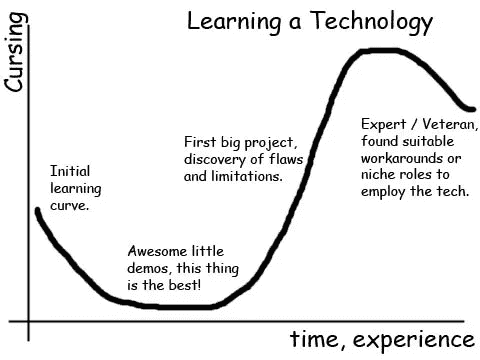

Technology Learning Curve ([Source](http://www.stephencalenderblog.com/?p=371))

爬上这条曲线的最好方法是随着时间的推移建立你的信心，没有比一个与你的生活直接相关的项目更好的起点了。这篇文章将展示数据科学对我和我父亲健康的直接应用，一个有明显好处的个人问题，如果曾经有过的话！

好消息是，为了将数据科学应用于个人利益，你不需要大型科技公司的数据或资源，只需要一套一致的测量方法和免费的开源分析工具，如 R 和 Python。如果你停下来看看，你会发现你周围都是等待被跟踪的数据流。你可能每天早上都站在磅秤上，根据结果，祝贺或贬低自己，然后第二天再忘记。然而，花几秒钟时间，在电子表格中记录每天一次的体重，可以在几个月后产生一个有用而干净的数据集([，增加你达到目标的几率](https://www.usatoday.com/story/life/2016/01/03/weight-loss-scales-daily/77584478/))。这些数据非常适合让您在实际问题上发展您的数据科学技能。

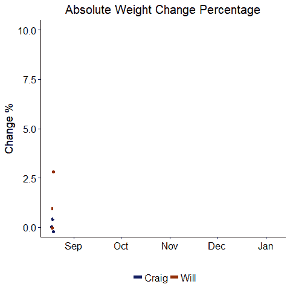

就其核心而言，数据科学从根本上讲是从数据中提取智能，这篇文章展示了数据科学如何产生改善现实世界结果的见解。数据科学是一个多学科领域，由计算机科学、统计学和工程学组成，但最重要的方面也是最容易被忽视的方面:通信。你的分析可能很棒，但归根结底，经理、教授和公众更关心最终结果，而不是确切的方法。能够清楚地传达数据科学问题的答案和分析的局限性是任何数据科学工具箱中的宝贵资产。

在这篇文章中，我省略了所有用于创建图表的代码(在 R 中完成),以便专注于结果以及我们可以从它们中学到什么，但是所有代码都可以在 project [GitHub 页面](https://github.com/WillKoehrsen/Data-Analysis/tree/master/weight_loss_challenge)上找到，以便任何想要了解神奇是如何发生的人使用。同样，这些数据在 GitHub 和 Google Drive 上以一个 [csv 文件](https://drive.google.com/file/d/1aVL3ih81hAUGNcIbQYzgLRJj6238Tout/view?usp=sharing)的形式提供给那些想跟进的人。我还试图为那些想了解更多的人提供特定主题的资源。现在，是时候深入了解 2017 年大体重挑战的数据科学了！

**免责声明:**首先，本项目呈现的所有数据都是真实的！我爸爸和我都相信开放数据(在一定程度上)，我们绝对不在乎让自己看起来比实际上更成功。第二，我不会试图向你推销任何减肥产品(尽管我确实考虑过把这篇文章叫做“如何用数据科学减肥”)。

# 2017 年的重量大挑战

多年来，我和父亲一直善意地互相取笑我们各自的挣扎——我的是增加体重，他的是减轻体重——我和父亲决定最好的解决办法是体重变化比赛。我父亲的表现将以体重减轻来衡量，而我的则以体重增加来衡量。唯一的规则是:我们必须每天称重一次，比赛从 8 月 18 日开始，到 2018 年 1 月 1 日结束，输的人必须向赢的人支付赢的人体重变化的两倍，以磅为单位。因为这是一个现实世界中的问题，第一条和第二条规则都不完全成立！尽管如此，在比赛过程中(实际上在 1 月 6 日结束)，我们每个人都收集了超过 100 个数据点，足以得出许多有趣的结论。

## **竞争对手**

*   我(威尔):大学年龄，男性，5 英尺 11 英寸，起始体重 125.6 磅，学生，偶尔跑超级马拉松
*   爸爸(克雷格):壮年男性(我让你猜猜是多少岁)，5 英尺 11 英寸，起始体重 235.2 磅，办公室职员，前竞技举重运动员

我们都决定尽可能开诚布公地面对挑战，并告诉家人和朋友关于比赛的事情，以迫使我们坚持到底。在收到大量善意的建议后，我们制定了各自的策略。我决定开始吃午餐，因为我已经养成了不吃午餐的不健康习惯，以便专注于我在美国宇航局的实习工作。我爸爸想吃完全相同的饮食，但减少份量。这似乎是一个明智的决定，因为这意味着他不必考虑节食，而是做同样的食物，用更小的盘子盛着。他还决定通过长距离散步进行锻炼，强调不需要短期减肥计划，而是需要更健康的整体生活方式。

# 结果

不妨从整个结果图开始。

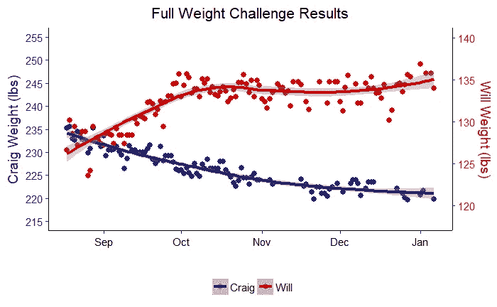

Weight Challenge Results

就这样，对吗？整个比赛总结成一幅画。嗯，不完全是。这是一个好的开始，但从我们对数据的研究中还可以获得很多真知灼见。通过数据绘制的线是使用[“黄土”回归方法](https://www.statsdirect.com/help/nonparametric_methods/loess.htm)制作的模型，而点是实际测量值。马上我们可以看到我们两个都走在正确的方向上！然而，这个图表掩盖了很多信息。我们甚至无法判断谁赢了！为此，我们可以用图表显示我们的体重从起始体重开始的变化，单位是磅。


Absolute Weight Change

我们在这里使用绝对值，所以数字越大越好。我们可以清楚地看到，虽然比赛一开始很接近，但我的父亲(克雷格)在最后拉开了距离，并以相当大的优势获胜。恭喜爸爸！另一个问题是体重测量非常嘈杂。我们尝试每天在相同的时间，早上第一件事，在相同的规模上采集数据，但是[每天影响体重的因素太多](https://www.ncbi.nlm.nih.gov/books/NBK221834/)以至于只看一个点毫无意义。只有通过检查一系列数据点，趋势才会出现。此外，我们体重的每次变化似乎都类似于平方根关系或[对数](http://www.purplemath.com/modules/graphlog.htm)。也就是说，有一个最初的快速增益(或损失),然后随着时间的推移变得平稳。这是意料之中的，因为最初当你有动力的时候，很容易取得进步，但是保持这种动力是很困难的。最终，我们都进入了体重平台期，最后的测量显示出轻微的改善迹象，这可能是也可能不是趋势。

这个结果的一个小问题是它没有考虑体重。如果我爸爸减掉 10 磅，相对于他的体重来说，比我增加 10 磅要小。下一张图也显示了变化，但这次是根据体重的百分比。

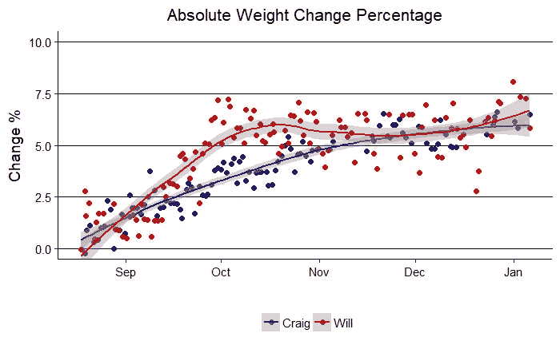

Weight Change Percentage

好吧，如果你支持我，这张图看起来会好得多。在比赛的大部分时间里，我的百分比变化都比较大，我一直领先，直到最后一天，我爸爸在百分比上略微超过了我。有趣的是，我们两个都适应了接近 6%的体重变化。这可能意味着我们的身体很容易在±6%的范围内波动，但除此之外，进一步的变化就更加困难了。

以下是最终的数值结果。

1.  **克雷格:最终重量= 219.8 磅，绝对变化= 15.4 磅，百分比变化= 6.55%**
2.  **将:最终重量= 134 磅，绝对变化= 7.4 磅，百分比变化= 5.85%**

# 建模

图表可以向我们展示大量信息和快速的定性趋势，但不能用定量结果来回答问题。例如，我们每个人平均每天增加或减少多少体重？用所有的数据预测一年后我们的体重是多少？这些都是我们必须求助于[造型](https://www.udacity.com/course/model-building-and-validation--ud919)来回答的问题。

**简单线性建模**

对于任何有连续变量(如重量)的建模，最好的起点是简单的线性回归方法。我们将创建一个带有一个响应变量(y)和一个解释变量(x)的线性模型。我们对体重和比赛开始后的天数之间的关系感兴趣，因此，答案是体重，解释变量是天数。从图表中，我们看到这可能不是数据的最佳表示，但这是一个很好的起点，可以让我们量化各自的体重变化。

Craig 的模型结果如下所示。这里有很多信息，但我会浏览一遍并指出哪些是重要的。

```
Coefficients:
              Estimate Std. Error t value Pr(>|t|)    
**(Intercept) 227.779544**   0.481849 472.720  < 2e-16 ***
**days         -0.023887 **  0.006326  -3.776 **0.000264 *****
---
Signif. codes:  0 ‘***’ 0.001 ‘**’ 0.01 ‘*’ 0.05 ‘.’ 0.1 ‘ ’ 1Residual standard error: 3.861 on 105 degrees of freedom
**Multiple R-squared:  0.1196**, Adjusted R-squared:  0.1112 
F-statistic: 14.26 on 1 and 105 DF,  **p-value: 0.0002642**
```

要检查的主要部分是[参数](http://www.itl.nist.gov/div898/handbook/pmd/section1/pmd12.htm)，即定义模型的数字。在简单线性模型的情况下，这些是截距和斜率，如直线方程所示:y = mx + b。对于体重挑战，该模型为:体重=(每天体重变化)*天数+零天体重。上述总结中第 0 天的重量在估算栏下的(截距)行中，值为 227.78 磅。每天的重量变化在“估计”列下的“天数”行中，值为-0.024 磅/天。这意味着，在线性模型下，我爸爸平均每天减掉 0.024 磅。

上面介绍的其他统计数据稍微详细一些，但也很有信息。 [R 平方表示](http://blog.minitab.com/blog/adventures-in-statistics-2/regression-analysis-how-do-i-interpret-r-squared-and-assess-the-goodness-of-fit)y 变量(重量)的变化分数，可以用 x 变量(天数)的变化来解释。更高的 R 平方意味着模型更好地代表了数据，我们可以看到我们的模型只占重量变化的 11.96%。此外，我们可以查看 [p 值](http://blog.minitab.com/blog/adventures-in-statistics-2/how-to-correctly-interpret-p-values)，看看我们的模型中是否有真正的趋势，或者我们的数据是否只是[噪声](https://www.amazon.com/Signal-Noise-Many-Predictions-Fail-but/dp/0143125087)。p 值是一种常见的统计数据，表示在模型下观察到的数据随机出现的概率。对于 Craig 的模型，p 值为 0.0002642，远低于公认的显著性阈值 0.05(p 值越低越好，因为这意味着数据不太可能是偶然生成的)。所以，我爸减肥单纯是随机噪音的几率不到万分之三。从这个模型中，我们可以得出结论，我爸爸在比赛过程中的体重下降是一个真正的趋势！

我们现在可以转向我的简单线性回归模型进行类似的分析。

```
 Estimate Std. Error t value Pr(>|t|)    
**(Intercept)  131.9**   3.133e-01  420.843   <2e-16 ***
**days         0.0095**  3.808e-03   2.388   0.0185 *  
---
Signif. codes:  0 ‘***’ 0.001 ‘**’ 0.01 ‘*’ 0.05 ‘.’ 0.1 ‘ ’ 1Residual standard error: 2.679 on 121 degrees of freedom
**Multiple R-squared:  0.04502,** Adjusted R-squared:  0.03713 
F-statistic: 5.704 on 1 and 121 DF,  **p-value: 0.01847**
```

模型摘要显示截距为 131.9 磅，每日重量变化为 0.0095 磅，R 平方为 0.04502，p 值为 0.01847。我们的结论是:

*   在比赛过程中，我每天增重 0.0095 磅
*   这个模型只能解释重量变化的 4.5%
*   由于纯粹的偶然性，观察到的结果有 1.85%的几率发生

我的模型的 p 值略高于我爸爸的，但它仍然低于显著性阈值，并且模型显示了真实的趋势。

我们可以通过稍微修改完整的结果代码并将模型趋势线从“黄土”改为线性，来直观显示线性模型与数据的拟合程度。

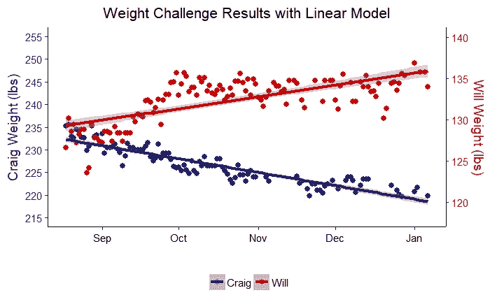

Linear Model Performance

从线性模型中得到的启示是，我父亲和我都在挑战中向我们的体重变化目标展示了显著的进步。

## 广义加性模型

[广义相加模型](http://multithreaded.stitchfix.com/blog/2015/07/30/gam/)超越了简单线性模型的线性关系假设，将时间序列(在这种情况下为权重)表示为总体趋势以及日、周或年模式的组合(相加)。这种方法[非常适用于经常展示特定模式的真实世界数据](https://research.fb.com/prophet-forecasting-at-scale/)。我们的数据在大约 4 个月的时间里每天收集一次，所以只有周模式和总体趋势(要获得日模式需要每天进行多次观察)。尽管如此，我们仍然能够从加法模型中得出有用的结论。

我们可以先画出总体趋势。这类似于我们在完整结果图中看到的平滑线，向我们展示了体重变化的总体轨迹。

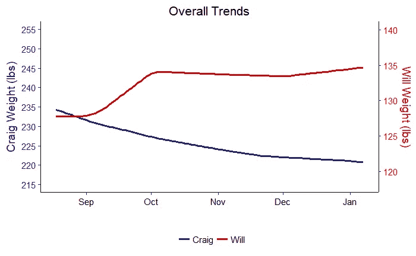

Overall Trend from Generalized Additive Model

下一张图显示了一周内每天体重增加或减少的趋势。该图提供了可操作的信息，因为它显示了哪些日子对我们的体重变化目标有问题。

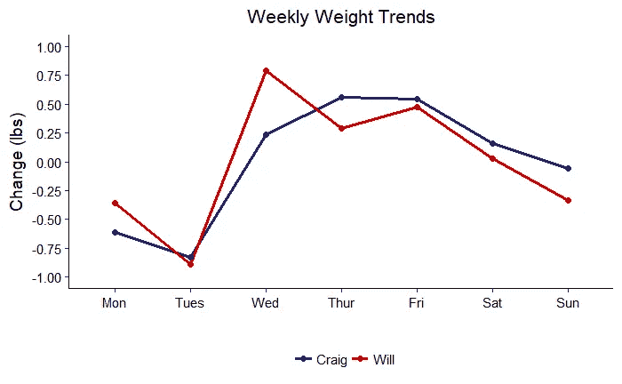

Weekly Trends

虽然我爸爸和我试图去相反的方向，我们有非常相似的每周模式。在工作周的前两天，我们的体重都下降了，在工作周的其余时间体重增加了，并在周末呈下降趋势。有可能对此有太多的解读，但我自己的解释是，我倾向于在周末进行更多的锻炼(通常是几个小时的跑步)，这将减少我进入工作周的体重。然后，当我忙于上课时，我会恢复体重，直到周末再次失去动力。我爸爸在周末表现更好，可能也是因为他不工作时锻炼增加了。这些结果表明，我需要努力在周末消耗更多的食物，而我的父亲需要努力减少他在一周内的消耗量。一个广义的加法模型可能看起来很复杂，但是我们可以使用结果来确定简单的行动来改善我们的健康！

# 预言

建模的另一个好处是，我们可以使用结果进行预测。我们可以使用线性模型或广义加性模型进行预测，但是因为加性模型更好地代表了数据，所以我们将只使用它进行预测。有两个主要关注的估计值:

1.  对 2018 年 1 月 1 日的预测是根据我们前两个月(到 2017 年 10 月底)的测量结果做出的
2.  对 2019 年 1 月 1 日的预测是通过所有测量得出的

第一个预测将使我们能够将我们在下半年的表现与基于上半年数据预测的表现进行比较。第二个预测会让我们知道一年后我们会在哪里。

预测的一个经常被忽视的重要方面是[不确定性界限](http://www.itl.nist.gov/div898/handbook/pmd/section5/pmd512.htm)。经理们通常只想要一个单一的预测数字，但在一个不确定的世界里这是不可能的。即使是最精确的模型也无法捕捉数据中固有的随机性或不精确的测量设备。因此，为了成为负责任的数据科学家，除了单一的预测数字，我们还将提供一系列的不确定性。

## 根据两个月的数据对 2018 年 1 月 1 日的预测

下图显示了克雷格和我根据截至 2017 年 11 月 1 日的数据对比赛计划结束时间的预测。


Craig Prediction for Jan 1, 2018

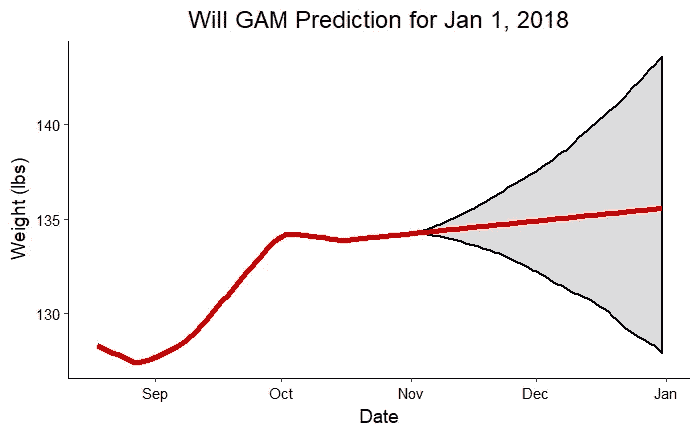

Will Prediction for Jan 1, 2018

灰色阴影区域表示预测中最重要的部分:不确定区域。红线向我们展示了最有可能的未来结果，如果我们继续目前观察到的趋势。阴影区域是基于观察并考虑测量中的噪声的最终重量的可能范围。要正确看待这些范围，我们应该看看实际数字:

*   **克雷格:预测= 213.2 磅，上限= 223.5 磅，下限= 203.2 磅，1 月 1 日的实际体重= 220.8 磅**
*   **威尔:预测= 135.6，上限= 143.4 磅，下限= 127.3 磅，1 月 1 日实际体重= 136.9 磅**

我和爸爸的实际体重都在预测范围内。该模型在预测我们两个月前的实际体重方面做得相对较好，考虑到它正在处理大约 70 个数据点！

## 2019 年 1 月 1 日的预测

作为对模型的最后探索，我们可以看看从现在起一年后我们会达到什么程度。也许这些预测不会完全实现，但它们至少应该给我们明年一个目标！以下是利用所有比赛数据对 2019 年做出的预测:

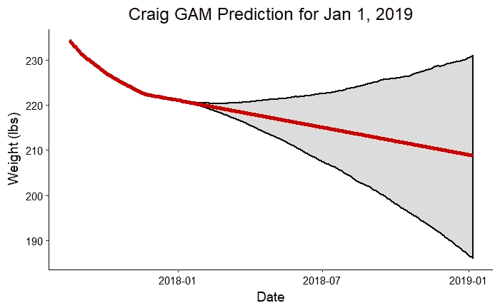

Craig Prediction for Jan 1, 2019

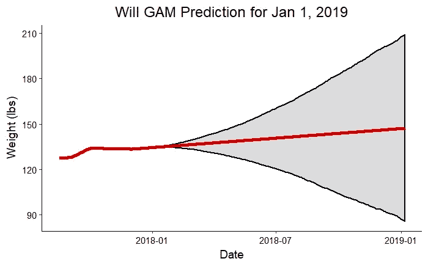

Will Prediction for Jan 1, 2019

这些图表清楚地显示了我们从数据中推断的不确定性是如何增加的。按照这些情节，明年初我可能比我爸还重！这个练习更多的是为了好玩，而不是作为一个严肃的预测，但是如果我们继续收集更多的数据，预测可以改进。最终，有了足够的信息，我们应该能够建立一个模型，从理论上对未来一年做出准确的预测。我们将不得不在明年检查这些预测的准确性的更新！

*   **克雷格:预测= 208.8 磅，上限= 230.9 磅，下限= 186.0 磅，目标体重= 215.0 磅**
*   **意志:预测= 147.2 磅，上限= 209.2 磅，下限= 85.5 磅，目标体重= 155.0 磅**

# 结论

在任何数据分析结束时，你要问自己的问题是:“我现在知道哪些我可以使用的东西？”有时候答案会是不多，这是非常好的！这只是表明您需要收集更多的数据，或者您需要重新考虑建模方法。但在 2017 年大重量挑战的分析中，有一些见解需要复习并投入使用！

*   克雷格在体重变化方面轻松赢得了比赛，尽管我们都很成功:克雷格减掉了约 6%的体重，而我增加了约 6%。
*   **克雷格每天减了 0.024 磅，而我每天增加了 0.0095 磅。我们俩都表现出体重变化的显著趋势。**
*   **我需要在周末努力增加体重，而我爸爸需要在工作日努力减肥。**
*   **在比赛的前半段，当体重变化始终朝着正确的方向发展时，我们两人都表现得更好，但在第三个月我们达到了平台期。**
*   对明年的预测表明，我们双方都将继续走在正确的道路上，但存在相当大的不确定性。

最后，我将展示另外两个图表，对比 2018 年 1 月 1 日的预测与这一天的实际结果。

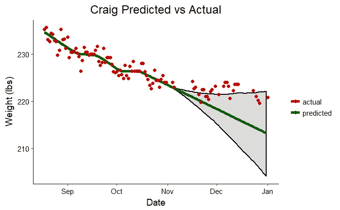

Craig Additive Model Prediction vs. Actual Weight

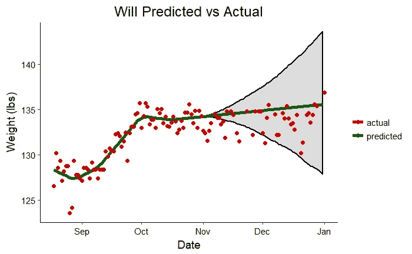

Will Additive Model Prediction vs. Actual Weight

我希望这篇文章展示了任何人如何在日常生活中使用数据科学为个人或社区造福。我的目标是让数据科学民主化，让每个人都能通过展示数据科学工具的真实用途来利用这个令人兴奋的领域！

一如既往，我欢迎反馈和建设性的批评。可以在 wjk68@case.edu 找到我。