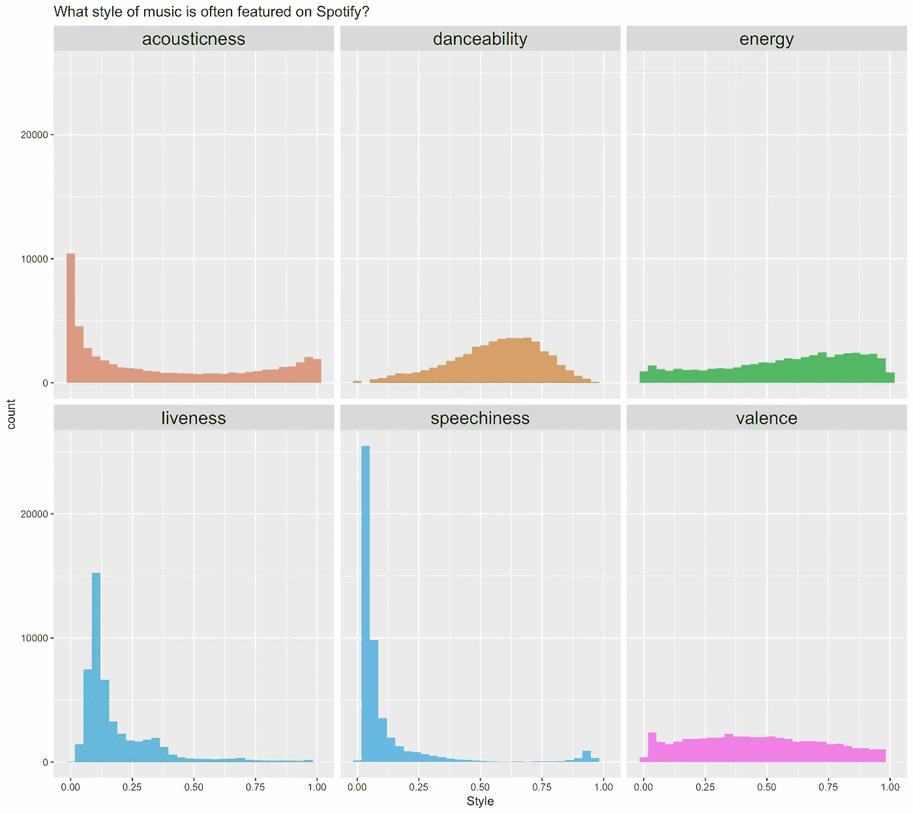
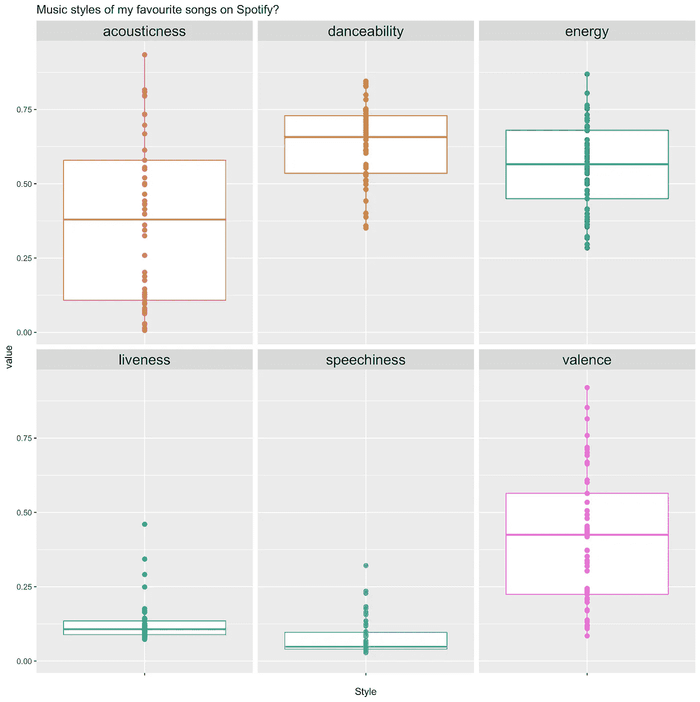
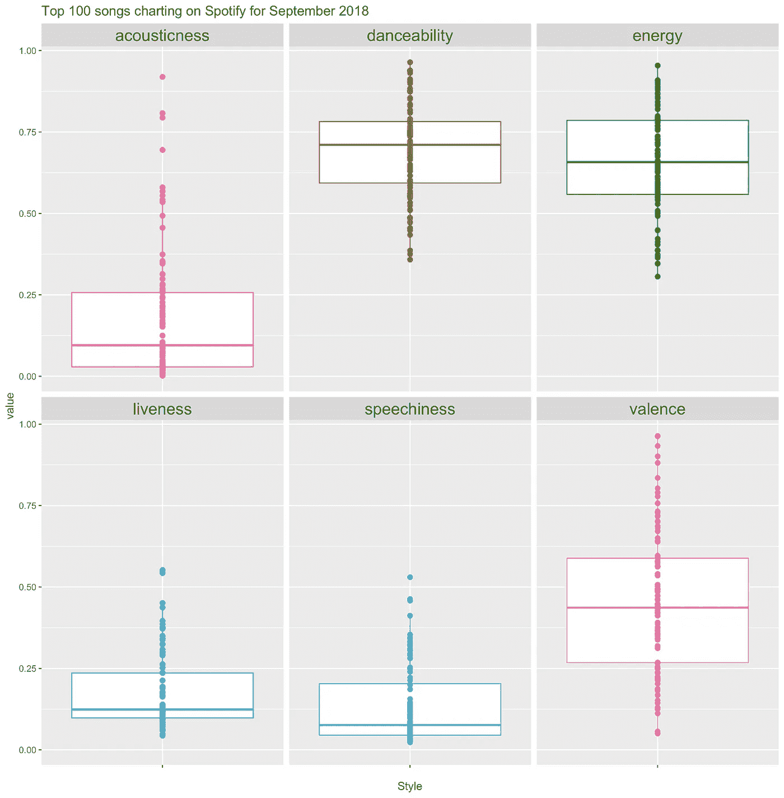

# 你的 Spotify 音乐听起来像什么？Spotify 数据科学(第 1 部分)

> 原文：<https://towardsdatascience.com/data-science-and-machine-learning-with-spotify-841225bfb5d0?source=collection_archive---------16----------------------->


“MacBook Pro turned on” by [sgcreative](https://unsplash.com/@sgcreative?utm_source=medium&utm_medium=referral) on [Unsplash](https://unsplash.com?utm_source=medium&utm_medium=referral)

# 介绍

音乐一直是每个人生活中不可或缺的一部分。我们听到音乐，如果不是听音乐的话，无论我们在哪里，当我们学习时，我们听到美妙的声音，当我们参加聚会时，我们听到令人兴奋的刺激和节拍，当我们和朋友旅行时，我们听到令人兴奋和有趣的拼车卡拉 ok。音乐在我们周围无处不在。

> 如果我们可以使用数据科学来分析我们所听的音乐，从而获得关于我们所听音乐类型的见解，会怎么样？

# 动机

这个系列的动机是让任何人都能发现关于他们自己和他们所听音乐的模式和见解。这样做，可以更好地理解他们在听 Spotify 时的音乐行为。

```
**Note:** The code to collect data and perform insights on your own music is linked below.
```

为了实现这一点，我们将致力于展示量化衍生数据科学项目的完整端到端周期，并将分为以下几个部分。

## **1。探索性数据分析(第 1 部分:数据可视化)**

*在这里我们将学习统计分析的基础知识。这使我们能够了解我们正在处理的数据，并获得对我们所拥有的特征的见解。探索性数据分析通常是任何数据科学项目中最重要的步骤，因为它为构建进一步的分析提供了大量见解。*

## 我们希望回答的问题包括:

*   Spotify 上经常播放什么类型的音乐？有特色的音乐通常更有声音吗？
*   我们可能喜欢哪种音乐？
*   最流行的歌曲图表，遵循某种模式吗？

## **2。探索性数据分析(第 2 部分:统计测试)**

在这一节中，我们将学习对我们在数据可视化中所做的观察进行一些统计上的严格处理。毕竟，我们想要定量地验证我们的假设。我们将执行的一些统计测试是卡方良好适合度和 T 检验，以及查看相关性。

## 3. **A / B 测试**

*在这里，我们将了解如何在回答关于我们音乐品味的问题时进行 A/B 测试，例如:*

## 我们希望回答的问题包括:

-我听的音乐风格是否与前 100 名播放的音乐风格不同，是否与 Spotify 上播放的音乐风格不同。

*   我们听什么风格的音乐可能比 Spotify 上的典型音乐更明显
*   最后，我们是普通人吗？意思是，与最流行的歌曲相比，我们听的音乐是否遵循相似的模式。

## 4.**机器学习(建立推荐系统，向我们推荐我们可能感兴趣的新歌)**

*这最后一部分将使用我们从探索性数据分析和 A/B 测试中获得的见解，开发一种机器学习算法，为我们推荐新歌！*

# 探索性数据分析(可视化)

> Spotify 上经常播放哪些风格的音乐？有特色的音乐通常更有声音吗？我们可能喜欢哪种音乐？最流行的歌曲图表遵循某种模式吗？

数据科学最重要的方面之一是将大规模数据集中到一条信息中的能力。这使我们能够回答我们可能有的问题，并更好地了解我们的个人行为和我们喜欢的音乐类型。

## Spotify 上经常播放哪些风格的音乐？

数据科学的一个重要部分是理解我们收集的数据的分布。我们关心发行情况，因为它让我们了解各种音乐风格的频率，以及频率的形状，就好像它们在 Spotify 上一样。让我们先来看看 Spotify 上精选歌曲的分布情况！



Distributions of music styles featured on Spotify

通过观察分布图，我们可以立即观察到以下情况:

*   在特征*语音*和*声音*中有一个非常大的向下的斜率，我们可以注意到在接近曲线末端的分布中有一个轻微的向上的尾部。**这向我们表明，Spotify 上精选的歌曲的音乐风格总体上较少声学或言语。**上升尾向我们表明，高语音或声学的歌曲更有可能在上限附近被选择。

> 或者更定量地说，被评价为超过 25%的声音或语言风格的歌曲不太可能出现在 Spotify 上。

*   Spotify 上展示的大多数歌曲往往不太**生动**，随着歌曲的**生动**增加，它在 Spotify 上展示的可能性降低。
*   **Danceability** 似乎呈正态分布，分布的尾部表示出现在 Spotify 上的可能性较低。
*   属性，**化合价**和**能量**看起来大致均匀(均匀分布)。**表示对那些影响 Spotify 上精选音乐选择的属性没有偏好。**

> 总之，Spotify 上播放的歌曲往往表现出较低的声音、语音和活力，而效价和能量对 Spotify 上播放的歌曲没有显著影响。最后，大约 65%的可跳舞歌曲是 Spotify 上最常见的特色。

## 我们可能喜欢哪种音乐？

*咚咚咚，谁在那里？这是什么音乐风格，太棒了！让我们来看看吧！*

音乐品味可以很好地反映我们的情绪和感觉。它们给我们一种身份，一种安全感，更多的时候，它们是一首旋律，伴随着我们的日常生活起伏。

当我们感觉不可思议的时候！我们会听感觉像站在世界之巅的音乐！当我们心碎的时候，我们会听一些反映失去所爱之人的歌曲。这种对我们生活的内省观点，实际上可以概括在我们所听的音乐中！

所以，让我们看看我们能从目前我最喜欢的歌曲中发现什么！



Box-plot of my favorite songs by style

从上图中我们可以观察到以下情况:

*   我听的歌在**声、价、舞、能**上分布很正态。
*   我们可能会注意到活跃度和语速的分布集中在下限，这表明我听的音乐不是很**活泼**也不是**健谈**。

> 我们可以观察到，我倾向于欣赏更有声、更适合跳舞和更有活力的音乐。不太喜欢活泼或有声的音乐。

## 最流行的歌曲图表遵循某种模式吗？

> 鲍勃，为什么你的音乐如此普通！因为它们对你的口味来说毫无意义。色调色调色调

排行榜上的前 50 首歌曲无疑是全世界播放量最大的歌曲，无论你是在购买新包时听它，还是在咖啡馆与朋友交谈时听它。它无处不在。但是，我们似乎从来不介意听这些歌曲，在某些情况下，随着我们的耳朵适应音乐，它们可能会变得乏味。但是我们从来不说“伙计，我受不了听这首歌，它伤了我的耳朵”，这是为什么？

> 这是不是前 50 名歌曲采用的一种模式，让我们可以享受背景音乐中的歌曲，甚至有时可以跟着一起唱？

## 让我们来了解一下！

我们将通过绘制前 100 种音乐风格的方框图来实现这一点！



Box-plot of the top 100 charting by style

通过观察箱线图，我们可以看到大多数进入前 100 名的歌曲是:

*   非常适合跳舞和精力充沛。但是在声音、语音和生动性方面较低

> 排行榜前 100 名中的歌曲表现出对非常适合跳舞的歌曲的高度偏好，而语速较低。例如，泽德的《中间》,马希梅洛的《快乐》。

# 结论

我希望你们都非常喜欢通过可视化 Spotify 上的前 100 首图表歌曲、精选歌曲和我个人最喜欢的歌曲获得的见解！

```
If you would like to try this for yourselves and have a look at your own Spotify tastes and try to do this yourselves, I've attached the link to the code I've used to collect this data [here](https://github.com/Chippasaur/spotifyMe)
```

如果你真的喜欢这篇文章，请吧👏并分享给你的朋友。这将让我知道你们真的很喜欢这个系列的第一部，如果是这样的话，我会继续做更多。记住，你最多可以鼓掌 50 次——这对我真的很重要。