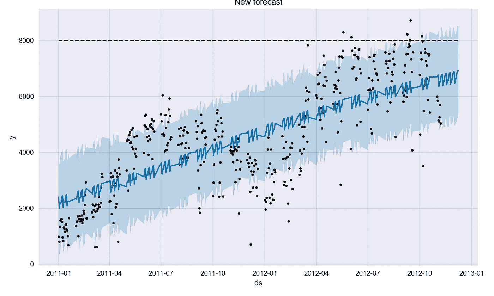
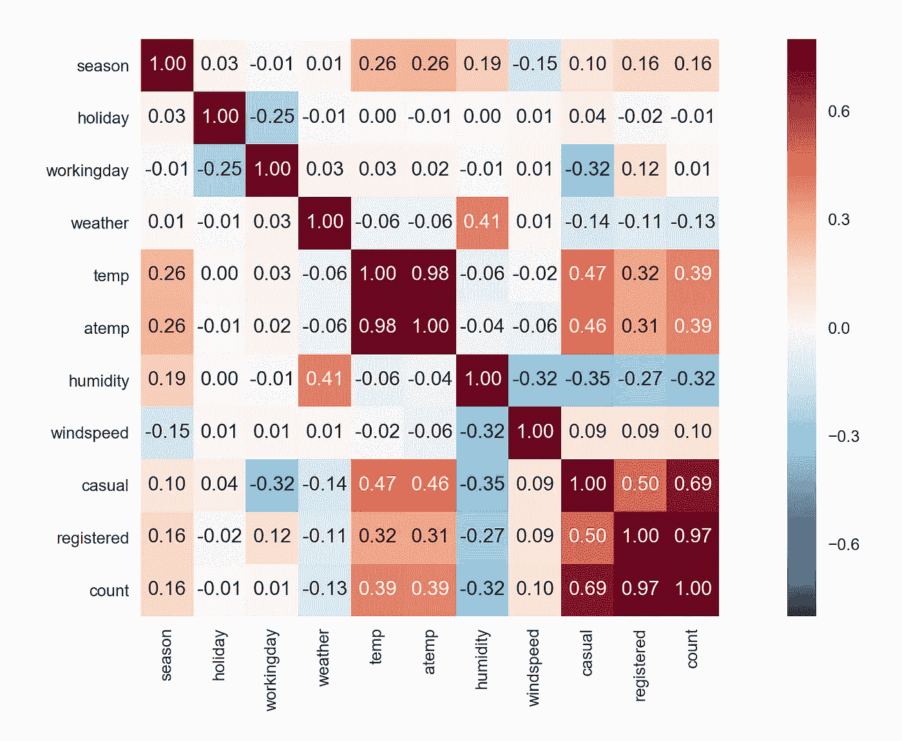
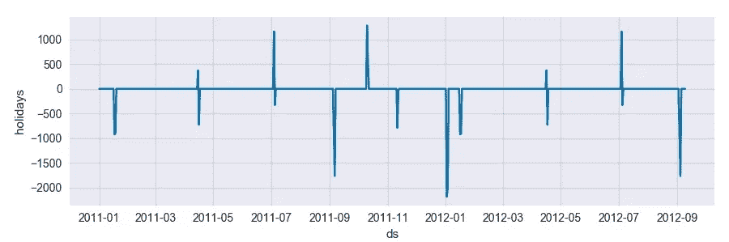

# 数据科学和业务战略

> 原文：<https://towardsdatascience.com/data-science-business-strategy-bbfd1c2cdc17?source=collection_archive---------2----------------------->

在我从上一篇帖子中获得令人鼓舞的反馈后，我想我会继续我的旅程，接受一个更大的挑战(在回到 IBM 员工流失项目之前):使用数据科学来塑造业务战略。这是我以前从未尝试过的事情，所以我认为尝试一下是有益的，希望能学到一些东西。

我在这个项目中使用的数据来自 Kaggle 的自行车共享需求竞赛:

 [## 自行车共享需求| Kaggle

### 城市自行车共享系统的使用预测

www.kaggle.com](https://www.kaggle.com/c/bike-sharing-demand) 

数据集中包含的字段如下:

*   **日期时间**:小时日期+时间戳
*   **季节** :
    1 =春天，
    2 =夏天，
    3 =秋天，
    4 =冬天
*   **假日**:该日是否视为假日
*   **工作日**:该日是否既不是周末也不是节假日
*   **天气:** 1:晴，云少，部分多云，局部多云；
    2:薄雾+多云，薄雾+碎云，薄雾+少云，薄雾；
    3:小雪、小雨+雷雨+散云、小雨+散云
    4:大雨+冰托盘+雷雨+薄雾、雪+雾
*   **温度**:摄氏温度
*   atemp :“感觉像”摄氏温度
*   **湿度:**相对湿度
*   **风速**:风速
*   **临时**:发起非注册用户租赁的数量
*   **已注册:**已启动的注册用户租赁数量
*   **计数:**总租赁次数

该数据集非常有限，因为它只显示了自行车租赁需求如何随着天气条件、一天中的时间和季节性事件(节假日)而变化。该案件没有提供太多关于 [Capital Bikeshare](https://www.capitalbikeshare.com/) 的商业背景或商业战略的信息。这需要我做一些研究，以更好地了解业务和他们的经营更广泛的背景。

# 定义目标

由于我没有太多的信息可以利用，我决定保持目标尽可能简单— ***超过我们当前的轨迹*** 。这样做绝对不仅仅是简单地预测我们的增长，我还需要知道取得成功的最佳举措。

**下面是我决定使用的项目结构:**

1.  预测未来 3 个月的自行车共享需求(我们目前的战略将带我们走多远？)
2.  调查影响需求的因素(目前什么是重要的)
3.  增加需求的潜在机会(我们能做些什么来实现我们的目标)

# 预估需水量

为了知道我的目标是什么，我必须知道我当前的轨迹会把我带到哪里。为了做到这一点，我决定看一看脸书的 Prophet 库，它被设计用来做时间序列预测，并支持 R 和 Python。

在我继续之前，我肯定要感谢 José Roberto Ayala S 的精彩和鼓舞人心的文章，这篇文章在向我介绍脸书的先知图书馆时是非常有用的资源。如果你想了解更多关于脸书先知图书馆的信息，请访问此链接:

 [## 先知

### Prophet 是一个用 R 和 Python 实现的预测程序。它速度很快，并提供完全自动化的预测…

facebookincubator.github.io](https://facebookincubator.github.io/prophet/) 

在我可以用数据集进行任何预测之前，我必须准备好数据，以便它可以符合我的目标，同样重要的是，与脸书的先知库兼容。我是这样创建我所使用的数据集的:

我要做的下一件事是将数据分开，用于培训、验证、测试和调整:

开始使用 Prophet 非常容易，我只用了几行代码就开始运行了:

Getting Started with Facebook’s Prophet Library

验证期间的预计租赁数量为 **188186** ，但实际上，它应该更接近于 **208939** 。投影一点都不差(相差只有 10.45%)。我还应该指出，这个模型使用了 José提出的值。我决定做的下一件事是使用 Prophet 来查看我对 2012 年 11 月 8 日到 2012 年 12 月 19 日期间(31 天)的预测。

此期间的总项目预计为 **240016** 。

# 更深的潜水

在发现我的轨迹后，我需要知道我能做什么来改变它。我首先从一个相关矩阵开始。我认为这将是有用的，看看哪些价值有助于在给定时期的自行车租赁数量。这是我想到的:

Correlation Matrix for Bike Rental Demand Data

该矩阵显示，租赁数量与临时客户和注册客户的数量密切相关。正如你所想象的，我对自己最初的发现很不满意。所以我决定看看图表还显示了什么。我注意到“*温度*”、“ *atemp* ”和“*湿度*”字段与计数字段有相当程度的相关性。我还发现'*天气*和'*季节*的相关性得分也很显著。

虽然我认为这些发现是有用的，但我需要知道更多。我需要了解是否有任何我可以利用和利用的优势。操纵天气绝对不是一个选择，此外，预测天气本身就是一个挑战。

我决定采用另一种方法来发现重要变量，这涉及到发现数据集特征的重要性:

最重要的功能是“假日”功能。我发现这非常令人惊讶，但也非常有用。假期不一定是可以被操纵的，但它们可以被**预期…并为**计划。

然后我决定调查自行车租赁和假期之间的关系:

A graph which shows how rentals fluctuate based on the holiday.

显而易见，假期肯定与租赁数量有某种因果关系，所以我决定找出哪些假期具有最显著(和积极)的影响。租金上涨的节日有独立日、退伍军人节、劳动节和哥伦布日。值得注意的是，哥伦布日租金上涨了 **35.93%** ，是四次上涨中涨幅最高的一次。

发现这一点后，我意识到我已经获得了第一块拼图。

# 把所有的放在一起

对于这个项目，我将把商业战略定义为实现公司长期目标的决策和行动。

[约翰逊和斯科尔斯](https://www.tutor2u.net/business/reference/what-is-strategy)将战略定义为:

“一个组织的长期方向和范围:在一个不断变化的环境中，哪个**通过资源配置**实现组织的优势，以满足市场的需求和利益相关者的期望。”

在思考如何利用数据科学来制定业务战略时，我想到了查看[不同级别的业务战略](https://hubpages.com/business/Business-Strategy-The-Three-Management-Layers):

1.  公司战略:一家公司应该进入的市场，并通过竞争来定位自己，以实现其长期目标。
2.  **商业战略**:公司为了实现其公司战略而必须采取的具体目标和行动。
3.  **职能战略**:使一个组织能够实现其战略目标的日常运作的调整。

我认为，通过采用这种方法，我将有一个视角，使我能够尽可能简单地说明数据科学过程的输出和业务战略的开发之间的联系。

既然我知道租金确实会受到节假日(尤其是哥伦布日)的影响，我就有了制定商业策略的起点。我认为围绕对租金有最大影响的假期建立一个商业策略可能是有用的。我还认为，在实施我提出的策略后，预测预测的租赁数量将如何变化可能是有用的。

我问自己的第一个问题是“哥伦布日在华盛顿特区有什么可做的？”在我的研究中，我发现华盛顿州 DC 市在哥伦布日有很多[可做的事情](http://www.smartdestinations.com/blog/columbus-day-in-washington-dc/)和[可去的地方](https://www.capitalbikeshare.com/explore/local-attractions)，包括:

1.  白宫花园之旅
2.  品尝华盛顿美食节
3.  克里斯托弗·哥伦布纪念喷泉
4.  乔治·华盛顿的弗农山
5.  跳上跳下观光巴士旅游

我还对 Capital Bikeshare 做了一些研究，以了解他们提供的更多服务，这样我就对我必须要做的事情有了更好的了解。我很高兴地发现，他们有相当多的[路径](https://www.capitalbikeshare.com/explore/popular-rides)，他们有相当多的选择[额外津贴](https://www.capitalbikeshare.com/how-it-works/perks)提供给他们的客户，最明显的是提供给首都自行车共享客户的折扣。

然后我有了一个想法。我想:“如果能有一个全包的首都之旅，包括参观这些地方的一小部分，会怎么样？”我认为这肯定值得探索。我也认为这可能是明智的，让它成为一个家庭事务，并引入团体价格，使产品更具吸引力。

这将包括通过利用现有的合作伙伴关系来打造新的体验，并可能与其他企业发展新的关系，以便我们能够接触到新的客户。当我第一次想到它时，我并没有想到它，但很有可能，那些通过“旅游服务”(我现在称之为旅游服务)获得的客户中的一小部分，可能会成为回头客。

利用我们能够利用提供给我们的数据发现的东西，我们现在有了新业务战略的构建模块。

# 最后的想法

我当然希望今天的博文是有用的。像往常一样，我问，如果你对这篇文章有任何想法或意见，请与我分享。如果你对未来的博客文章有任何想法，请随时分享。我绝不是这方面的专家，但我想成为专家，所以我正在尽我所能寻求帮助。

# 为了进一步探索

用这些数据创建的其他 Kaggle 内核:

 [## 自行车共享需求| Kaggle

### 城市自行车共享系统的使用预测

www.kaggle.com](https://www.kaggle.com/c/bike-sharing-demand/kernels) 

这是资本自行车共享公司系统数据的链接。根据他们分享的内容，实际上有可能使用他们的数据来规划哥伦布日游，并决定如何实施商业计划。

 [## 系统数据|首都自行车共享

### 开发者、工程师、统计学家和学者可以找到并下载首都自行车共享会员的数据…

www.capitalbikeshare.com](https://www.capitalbikeshare.com/system-data) 

Python 中的要素选择:

 [## Python 中机器学习的特征选择——机器学习掌握

### 你用来训练你的机器学习模型的数据特征对你可以…

machinelearningmastery.com](http://machinelearningmastery.com/feature-selection-machine-learning-python/) 

如果你像我一样，目前正在培养你的商业头脑，你可以在这里了解扩大产品线的好处:

 [## 扩大产品线的四个理由

### 对于希望增加收入或扩大市场的小型企业来说，扩大产品线是一项重要的增长战略…

smallbusiness.chron.com](http://smallbusiness.chron.com/four-reasons-expand-product-line-55242.html) 

# 下一步是什么？

在我的下一篇文章中，我想我会看看如何构建一个自然语言生成系统。到目前为止，我所有的帖子都涉及到向用户提供某种信息，但我觉得有必要改进这种方式。这将是我的下一个挑战。

下次见。