# 数据科学案例研究:物联网中的分类

> 原文：<https://towardsdatascience.com/data-science-case-study-classification-in-iot-474726c7559?source=collection_archive---------5----------------------->

**Don’t let your health and youth go to waste. Also, that’s me squatting!**

# 介绍

我们将研究来自 [UCI 机器学习库](http://archive.ics.uci.edu/ml/index.html)的[日常运动和活动](http://archive.ics.uci.edu/ml/datasets/Daily+and+Sports+Activities)数据集。这项工作的目标是训练一个分类器，根据从连接到所有四肢和躯干的设备收集的传感器数据来预测用户正在进行的活动。这将通过巧妙的传感器数据特征工程和训练机器学习分类器来实现。

我们将从这两篇文章中引用机器学习研究人员所做的工作:

[人类活动分类](http://kilyos.ee.bilkent.edu.tr/~billur/publ_list/eusipco11_1.pdf)

[识别日常和体育活动](http://yoksis.bilkent.edu.tr/pdf/files/8333.pdf)

**科学是同行评审的**

请查看这项工作的 [Jupyter 笔记本](https://github.com/DataBeast03/DataBeast/blob/master/MachineLearning/Data_Scienec_Case_Study_IoT.ipynb)。

# 动机

物联网(IoT)是一个不断增长的技术领域，它寻求在汽车、家用电器，是的，甚至(特别是)人身上安装电子监视器。物联网可穿戴设备越来越受用户、公司和城市的欢迎。物联网的承诺是更智能地向电网输送能源，更智能的交通控制，实时健身反馈等等。毫不奇怪，初创公司正在寻求利用物联网的前景。

**The promise of a smarter city.**

[Fitbit](https://www.fitbit.com/home) 已经成为健身可穿戴设备的代名词。它受到各种各样的人的欢迎:马拉松运动员全程记录自己的心率，而普通人只是想增加他们每天的步数。

**Fitbit watch**

Spire.io 的目标是利用从他们的可穿戴设备收集的生物特征数据，不仅跟踪心率和活动持续时间，还跟踪用户的呼吸频率，以提高注意力。冥想已经在西方社会大规模传播开来。神经科学继续证明冥想对身体和心理健康的益处[。Spire.io 肯定会加入其他初创公司的行列，这些公司寻求向越来越多寻求更好地预防身心疾病的用户提供技术。](https://blogs.scientificamerican.com/guest-blog/your-brain-as-laboratory-the-science-of-meditation/)

**Spire wearable**

[Comfy](http://www.comfyapp.com/) 利用物联网和机器学习来智能监控和调节工作场所的舒适度。他们的设备和分析可以自动调节工作场所的温度，并减少了员工投诉，提高了生产率。

**Intelligent climate control**

可穿戴设备和其他显示器的快速普及要求数据科学家能够分析这些设备产生的信号数据。凭借必要的技能，数据科学家可以为营销和产品团队提供可操作的见解，并构建数据驱动的产品，从而提高用户参与度，让我们的生活变得更加轻松。

# 关于数据

8 个用户都参与相同的 19 个活动。5 个设备(4 个肢体和 1 个躯干)中的每一个都有 9 个传感器(x、y、z 加速度计、x、y、z 陀螺仪和 x、y、z 磁力计)。对于每个用户的每个活动，以 25 Hz 的频率在总共 5 分钟的 5 秒时间段内收集数据。

## 这 19 项活动是:

坐着(A1)、
站着(A2)、
仰卧和右侧躺着(A3 和 A4)、
上下楼梯(A5 和 A6)、
站在电梯里(A7)
并在电梯里走动(A8)、
在停车场行走(A9)、
在速度为 4 公里/小时的跑步机上行走(在平的和 15 度倾斜的位置)(A1 0 和 A11)、
在速度为 8 公里/小时的跑步机上跑步
在踏步机上锻炼(A13)
在交叉训练器上锻炼(A14)
在健身车上以水平和垂直姿势骑行(A15 和 A16)
划船(A17)
跳跃(A18)
打篮球(A19)。

## 数据结构:

19 个活动(a)(按上述顺序)
8 个用户(p)
60 个分段(s)
躯干(T)、右臂(RA)、左臂(LA)、右腿(RL)、左腿(LL)上的 5 个单元
每个单元上的 9 个传感器(x、y、z 加速度计、x、y、z 陀螺仪、x、y、z 磁力计)

# 数据检查|探索性数据分析

**Let’s dive right in!**

为了简单起见，让我们加载一个单独的片段，看看一个人在停车场行走的数据是什么样子。

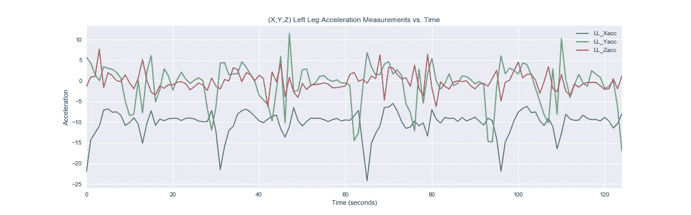

我们可以从左腿和躯干加速度图中看出，这个人必须以正常的速度行走。这一点从波峰之间的间距大致恒定这一事实可以明显看出。如果有人以不规则的步速行走(即慢-快-慢行进)，那么我们会看到频率的变化(稍后将详细介绍频率)。

设备在所有三个空间维度上的加速度是周期性的，以时间不变平均值为中心。

出于好奇，垂直维度是 X 方向，Z 方向指向远离设备的方向，与地面平行。有关尺寸和设备方向的更多信息，请参见[识别日常和体育活动](http://yoksis.bilkent.edu.tr/pdf/files/8333.pdf)。

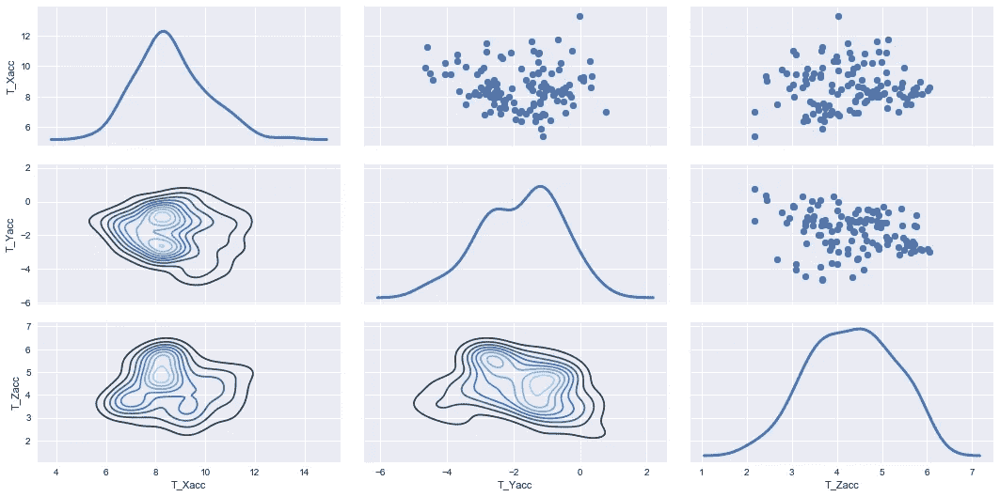

上面的配对图显示了条件概率:人的加速度的 X，Y，Z 维度是如何相互关联的。对角线图显示信号分布近似为高斯分布。我们还可以看到，在底部三角形中，分布的中心彼此靠近。顶部的三角形以散点图的形式显示了维度之间的条件关系。

这些观察很重要。由于信号近似正常，我们可以在特征工程阶段利用这一事实(稍后将详细介绍)。

# 特征工程

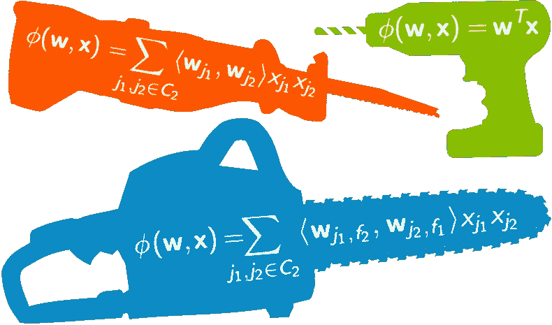

**Feature Engineering is cleaver transformations.**

我们将基于两篇论文的成功研究，采用他们的方法进行特征工程。

我们将为每个细分市场添加新功能。新特征是每行分布的均值、方差、偏斜度和峰度(因为信号是正态的，正如我们前面看到的，我们可以计算它们的统计矩)[自相关](https://en.wikipedia.org/wiki/Autocorrelation)
序列的前十个值，以及具有相应频率的段的[离散傅立叶变换](https://en.wikipedia.org/wiki/Discrete_Fourier_transform)
的最大五个峰值。

我们将每个特征归一化为[0，1]之间的值，然后将每个 5 秒的片段展平为具有 1140 个特征的单行。如此大量的特征将引入[维数灾难](https://en.wikipedia.org/wiki/Curse_of_dimensionality)并降低大多数分类器的性能。因此，我们将通过应用[主成分分析](https://en.wikipedia.org/wiki/Principal_component_analysis) (PCA)来降低维度。

然后，每个展平的行将成为结果数据矩阵中的单个样本(行)，分类器将最终对其进行训练和测试。

## 步伐

1.为原来的 45 个特性中的每一个获得 19 个附加特性。
2。归一化[0，1]
3 之间的所有特征。减少每个片段的尺寸
4。将这些片段堆叠起来，为每个人建立一个数据集

# 1.提取 19 个附加特征并转换数据集格式

让我们依次检查工程特性。

## 均值、方差、偏斜度和峰度

我们看到每个信号的分布都是近似正态的。这意味着我们可以对每 5 秒的片段取前四个统计矩。通过包含这四个时刻，我们正在帮助我们的模型更好地学习每个独特活动的特征。

## 自相关

在一些时间序列任务中，例如在 [ARIMA](https://en.wikipedia.org/wiki/Autoregressive_integrated_moving_average) 中，希望最小化自相关，以便将序列转换为[平稳状态](https://en.wikipedia.org/wiki/Stationary_process)。我们可以在下图中看到，在滞后两步之后，我们在之前看到的序列中出现了统计上不显著的自相关。

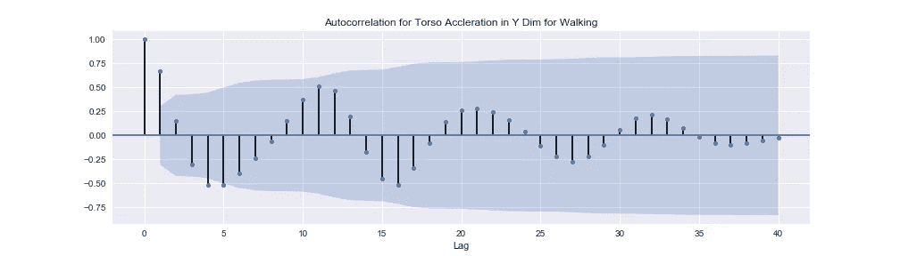

出于我们的目的，我们希望从每个样本的自相关中提取前 10 个点，并将这 10 个点中的每个点视为一个新特征。我们为什么要这么做？这个想法是，每一个物理活动将有一个独特的自相关序列。因此，我们希望捕捉这种独特性，以帮助我们的模型了解活动之间的差异。

查看另一个人跳跃的下一个自相关图。我们可以看到，该活动没有统计上显著的自相关(除了滞后为零时的完美自相关)。我们看到跳跃的自相关序列不同于行走。

这是使用自相关图的前 10 个点创建新要素的直觉和理由。最终，这一点或任何工程特征的有效性将由模型的性能决定。

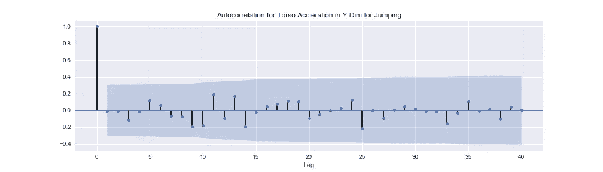

## 离散傅立叶变换的最多五个峰值

傅立叶变换函数在时间和频率空间之间来回映射信号。每个信号都是正弦函数(正弦和余弦)的线性组合。

第一个等式将信号从时间空间(t)变换到频率空间(ω)。第二个方程是逆变换。

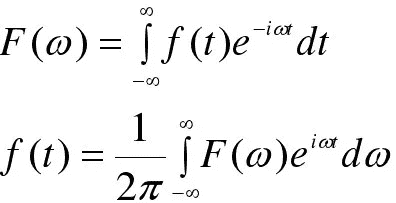

这些方程显示了连续的变换。实际上，像 Python 的 [SciPy](https://www.scipy.org/) 这样的编码包要么计算离散情况，要么对连续情况进行数值逼近。

下图显示了如何将信号分解成正弦曲线，确定每条曲线的频率，并最终将原始时间序列表示为频率序列。

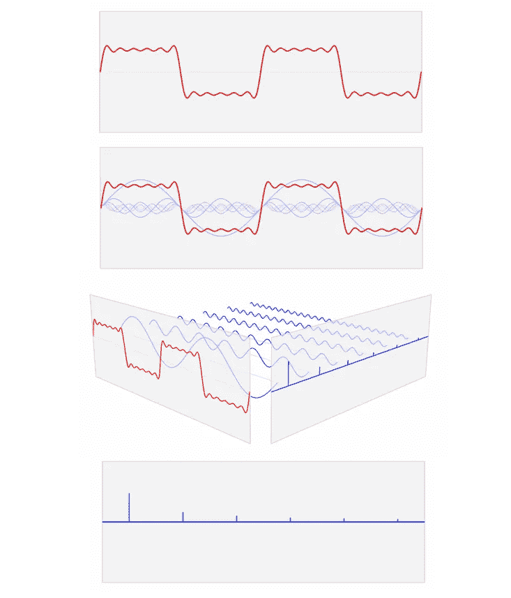

**Pretty cool, huh?**

下面我们有一个人行走系列的躯干加速度的 Y 方向图。第一个图显示了时间序列信号的样子，第二个图显示了相应的频率信号的样子。

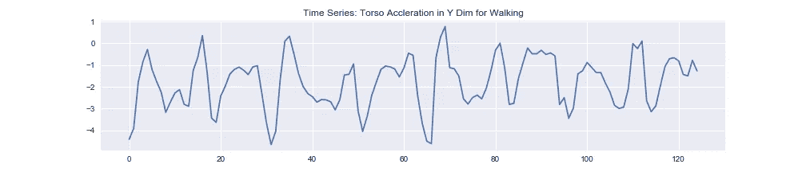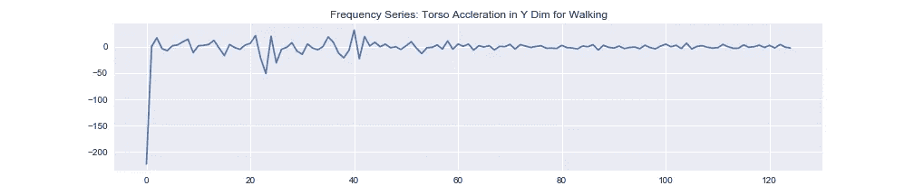

出于我们的目的，我们将提取 5 个最大峰值，并为每个样本中的每个值创建特征。我们为什么要这么做？回想一下上面的傅里叶变换图像，频率最高的曲线负责宏观振荡，而无数的小频率曲线负责微观振荡。这些宏观振荡决定了曲线的总体形状。每个活动的信号都有不同的一般形状。通过捕捉这些有影响的频率，我们的机器学习模型将能够更好地区分活动。

# 2.正常化所有特征

所有要素都在值 0 和 1 之间重新调整。

# 3.减少每个部分的尺寸

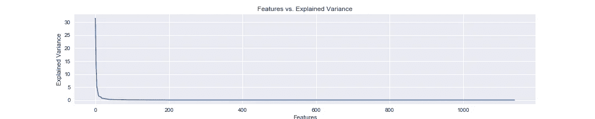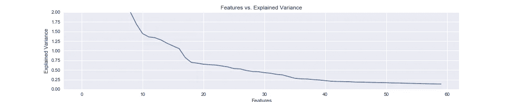

上图显示了所有 1140 个特性的解释差异。我们可以看到，解释的方差迅速下降到接近零。

底部曲线显示，在第 40 维之后，解释的方差几乎不变。这里的目标是减少维度的数量，并尽可能多地包含可解释的差异——这是一种平衡行为。两篇研究论文都表明，他们将维数降低到 30，收到了极好的效果。因此，我们将效仿他们的工作，将数据集的特征减少到 30 个。

如果我们创建并遵循我们自己的启发式方法来决定保留多少特征，我们可能会选择排除除了最小数量的特征之外的所有特征，这些特征解释了 90%的差异。

我们要取前 30 个主成分向量。

# 建模和预测

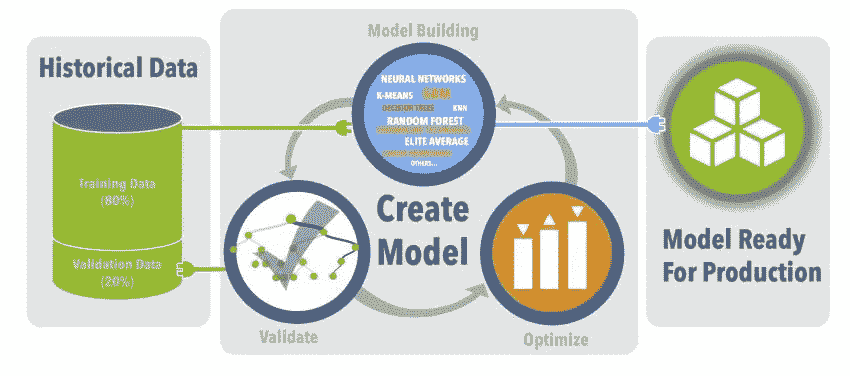

最后，到了性感的部分！我们将探索两种预测用户活动的方法。

## 方法 1

我们将创建包含来自每个用户的混合样本的训练和测试集。因此，该模型将根据来自每个用户的数据进行训练，并预测测试集中每个用户的活动。

## 方法 2

我们将包括 7 个用户的数据作为训练集，并将剩余的
个用户的数据作为测试集。这里的目标是预测模型从未见过的用户的活动。*

在每种方法中，我们将遵循相同的模型构建框架:

1.  将数据分为定型集和维持集
2.  优化模型超参数
3.  通过分析学习曲线交叉验证模型性能

## 模型

在此分析中使用的机器学习模型是逻辑回归(LR)、支持向量机(SVM)和随机森林(RF)。为了简洁起见，我们将重点放在 LR 和 SVM。

# 建模方法 1

1.  创建包含来自每个用户的混合样本的训练集和测试集。
2.  根据来自每个用户的数据训练模型，并预测测试集中每个用户的活动。

## 网格搜索|优化的内存管理

对于每个唯一的超参数组合，简单的网格搜索实现会将数据集的副本从磁盘读入内存，这大大增加了运行网格搜索所需的时间。

一个更简单的网格搜索实现将只使用单个内核来顺序训练模型。请记住，拟合一个模型与拟合其他模型是完全独立的任务。因此，在数据工程社区中，这项任务通常被称为令人尴尬的并行任务。

以下网格搜索实现使用 [ipyparallel](https://ipyparallel.readthedocs.io/en/latest/intro.html) 包来创建本地集群，以便同时运行多个模型拟合——与可用的内核数量一样多。

这个网格搜索实现还利用了 [Numpy 的内存映射](https://docs.scipy.org/doc/numpy/reference/generated/numpy.memmap.html)功能。每次拟合模型时，我们不会从磁盘读取数据集的副本，而是将数据的只读版本映射到内存，每个内核都可以引用它来拟合模型。

并行化和内存映射的结合大大缩短了网格搜索过程。

## 交叉验证|学习曲线

在我们深入研究这些图告诉我们关于我们的模型的什么之前，让我们确保理解这些图是如何生成的。

## 生成学习曲线

我们为四个指标绘制了一条学习曲线，我们将使用这四个指标来评估我们模型的性能:准确度、精确度、召回率和 f1 分数。这些图表上绘制的每个点都是由以下交叉验证流程生成的指标得分。

首先，数据被分为训练集和保持集。训练集被进一步分成 k 个折叠，并且每个折叠被迭代地用作训练集的一部分或验证集，以便训练模型。一旦模型定型，它就用于预测定型集和维持集的值。蓝色曲线表示对定型集进行的预测，绿色曲线表示对维持集(我们在这里也称为测试集)进行的预测。)

## 分析学习曲线|逻辑回归

学习曲线包含了关于我们模型的丰富信息。

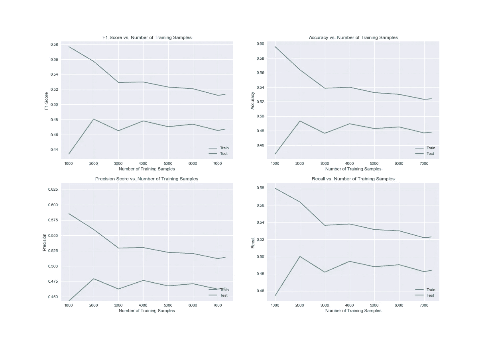

让我们看看精确度学习曲线。我们可以看到，当我们将训练集的大小从 1000 个样本增加到 2000 个样本时，测试集的分数增加了大约 5%。随着我们继续增加训练集的大小，我们看到测试的准确性没有增加。测试集精度的这种饱和表示模型的**偏差**。偏差表明模型不够复杂，无法从数据中学习，因此无论对多少训练点进行训练，都无法提高其性能。这也被称为**欠拟合**。

训练曲线和测试曲线之间的差距表明了模型预测中的**方差**的数量。理想情况下，模型在这两条曲线之间会有一个非常小的间隙，这表明模型可以很好地概括看不见的数据。这是合乎需要的，因为替代方案是更大的差距，表明测试分数比训练分数差。这表明模型正在学习只预测以前看到的数据，而不是学习可概括的趋势和模式。这被称为**过拟合**。我们可以看到，逻辑回归既有偏差又有方差。

最后，我们可以看到逻辑回归的所有指标从未超过 50%。如果我们随机猜测样本属于哪一类，我们的正确率大约是 5%(因为有 19 个活动)。虽然 LR 的表现比 random 更好，但我们想做到比 50%的准确率好得多。

## 分析学习曲线| SVM

支持向量机模型的表现明显优于逻辑回归。看一下精度曲线。它表明，该模型能够在预测训练集的活动分类方面做得近乎完美。

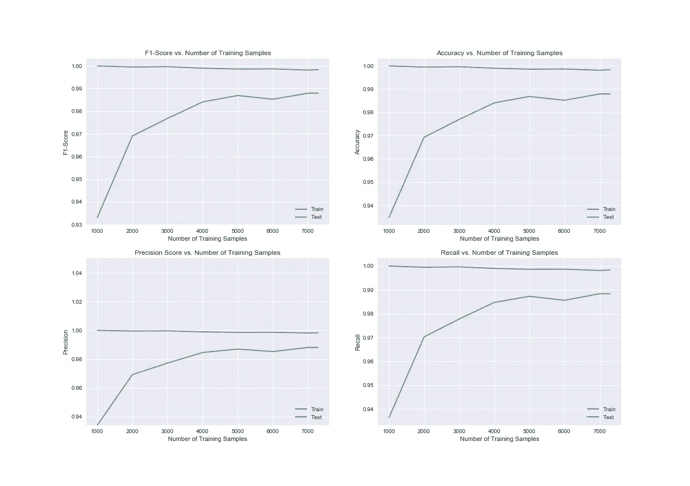

更重要的是，**该模型以接近 99%的准确率对测试集中的活动进行分类**。测试曲线显示，随着在更大的数据集上进行训练，SVM 的性能有所提高。训练曲线和测试曲线之间的差距可能看起来很大，但请记住，这两条曲线之间的差异约为 0.01%，这是一个非常小的差异。我们可以从这些学习曲线得出结论，SVM 遭受了非常小的偏差和方差。这就是我们在即将投入[生产](http://stackoverflow.com/questions/490289/what-exactly-defines-production)的车型中所期望的性能类型。

## 精确度|召回

到目前为止，我们一直专注于准确性度量，但精度和召回呢？

**Precision** 告诉我们预测为肯定的分类实际上是肯定的百分比。为简单起见，假设我们正在处理一个二元分类问题，其中 100 个样本被预测属于正类。100 个肯定预测中有 90 个实际上属于肯定类别，在这种情况下，我们将这些预测标记为**真肯定** ( **TP** )。另一方面，100 个阳性预测中有 10 个实际上不属于阳性类别，它们是被错误预测为阳性的阴性样本，在这种情况下，我们将这些预测标记为**假阳性** ( **FP** )。

**回忆**告诉我们模型能够多好地识别属于正类的点。这听起来很像精确，但事实并非如此。召回将 TP 与**假阴性** ( **FN** )进行比较，其中 as 精度将 TP 与 FP 进行比较。这里的区别在于，对于每个被错误地预测为属于负类的样本，模型可以正确识别为属于正类的样本就少了一个。

**回忆是对区分积极和消极分类失败的一种度量。**

**精度是对正确预测肯定分类失败的度量。**

最后，f1 分数是精确度和召回率的加权平均值。f1 分数用于衡量这两种类型的失败。

回到我们的案例研究，看看 SVM 的精度曲线。它告诉我们，100 个被预测为属于正类的样本中，有 99 个实际上属于正类。现在，因为我们的数据集有 19 个类，而不是 2 个，标签“积极”和“消极”类失去了意义。当存在两个以上的分类时，我们可以重新解释测试集精度学习曲线，以表示预测属于特定类的 100 个分类中有 99 个实际上属于该类。

# 建模方法 2

1.  创建一个由 7 个随机选择的用户组成的训练集和一个由剩余用户组成的测试集。
2.  训练模型来预测以前未见过的用户正在从事哪些活动，而不仅仅是针对以前见过的用户。

## 分析学习曲线| SVM

哇哦。发生了什么事？

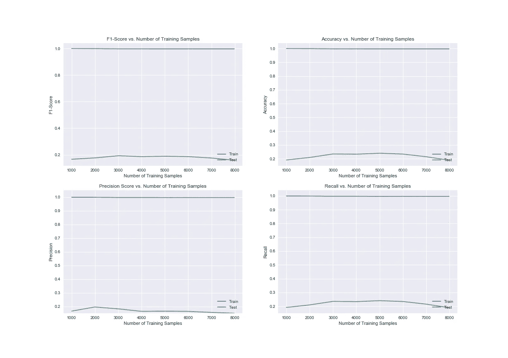

记住，训练集包含 7 个用户，测试集包含第 8 个用户。学习曲线显示了大量的过度拟合。蓝色的训练曲线代表训练集中的 7 个用户。该模型可以预测已经看到的用户的活动。然而，绿色曲线告诉我们，该模型无法推广到新用户。

这些结果可能归因于我们采用的特征工程方法。人们走路、跳跃、上下楼梯等等的方式都是独一无二的。我们有理由得出这样的结论:我们已经成功地捕捉到了特定个体特有的身体运动，但还没有捕捉到对这些活动在人群中是如何进行的概括理解。

根据我们的目标，我们可以得出我们成功了或者没有达到目标的结论。如果我们的目标是为每个人建立并奉献一个模型，那么我们可以得出结论，这项工作是一个巨大的成功！

另一方面，如果我们的目标是建立一个模型，从任何用户那里学习行走信号或跳跃信号的样子，那么我们将不得不承认我们有所欠缺。

# 结论

我们已经看到了对时间序列数据和信号处理的理解如何能够导致工程特性和构建机器学习模型，这些模型能够以 99%的准确率预测用户正在从事的活动。

事实证明，我们的方法成功地构建了一个模型，该模型可以预测出现在训练集和测试集中的用户活动。该模型能够学习哪些信号对应于特定用户的行走或跳跃等活动。然而，当用户被限制出现在训练或测试集中时，我们看到该模型不能获得独立于用户的关于哪些信号对应于特定活动的概括理解。

这项工作可以直接应用于 Fitbit 和 Spire 这样的物联网创业公司。两家公司都在从可穿戴设备上收集信号数据。对用户参与的活动类型进行分类是有价值的信息，可用于构建数据产品和推动营销工作。

# 关于作者

[Alexander Barriga](http://linkedin.com/in/alexander-barriga-m-s-52bb558b) 拥有 [GalvanizeU](http://www.galvanizeu.com/) (纽黑文大学)的数据科学硕士学位和加州大学伯克利分校的物理学学士学位。他目前是旧金山[大会](https://generalassemb.ly/locations/san-francisco)的数据科学讲师。