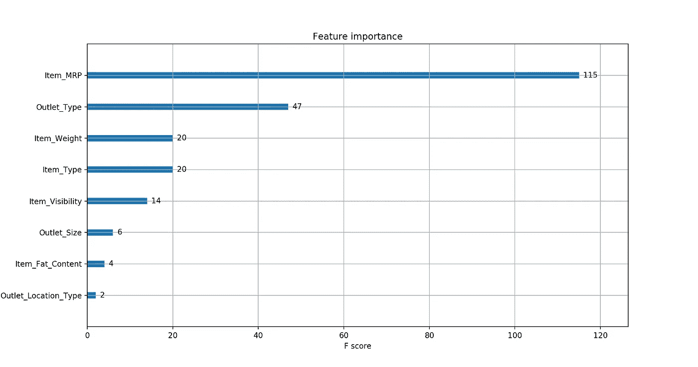

# 数据科学案例研究:优化零售中的产品布局(第 1 部分)

> 原文：<https://towardsdatascience.com/data-science-case-study-optimizing-product-placement-in-retail-part-1-2e8b27e16e8d?source=collection_archive---------8----------------------->

## 利用数据科学创造价值的实用方法


在[之前的一篇文章](/how-to-create-value-with-your-data-science-projects-62460db3bb4f)中，我写了一种我在数据科学项目中创造价值的方法。快速回顾和总结我在那篇文章中所说的，数据科学的目标是*赋予更好的决策能力。*这样做需要我们有 ***同理心*** 来确保我们问了正确的问题并且使用了正确的信息。

当与价值主张画布并置时，数据科学项目可以被视为满足客户需求(即决策)的产品，处理与做出这些决策相关的挑战，并最大化从做出正确决策中获得的利益。

## 数据

在今天的帖子中，我将使用的数据集来自 Analytics Vidhya 的' *Big Mart Sales III* '数据集，该数据集可通过他们的一次练习比赛获得。你可以通过下面的链接来看看。

[](https://datahack.analyticsvidhya.com/contest/practice-problem-big-mart-sales-iii/) [## 练习题:大卖场销售 III

### 练习题:大卖场销售 III |知识与学习

datahack.analyticsvidhya.com](https://datahack.analyticsvidhya.com/contest/practice-problem-big-mart-sales-iii/) 

## 数据描述(取自比赛现场)

BigMart 的数据科学家收集了不同城市的 10 家商店的 1559 种产品的 2013 年销售数据。此外，还定义了每个产品和商店的某些属性。

数据集中包含的数据如下:

*   **Item_Identifier:** 唯一产品 ID
*   **项目 _ 重量**产品重量
*   **Item_Fat_Content:** 产品是否低脂
*   **Item_Visibility:** 商店中分配给特定产品的所有产品的总展示面积的百分比
*   **Item_Type:** 产品所属的类别
*   **Item_MRP:** 产品的最高零售价格(标价)
*   **Outlet_Identifier:** 唯一店铺 ID
*   **奥特莱斯 _ 成立 _ 年份:**店铺成立的年份
*   商店占地面积的大小
*   **Outlet_Location_Type:** 商店所在城市的类型
*   商店类型:商店是杂货店还是超市
*   **Item_Outlet_Sales:** 特定商店中产品的销售额。

## 问题定义

如前所述，在这个项目中，我们将试图找到最佳的产品植入选项，以最大化 **Item_Outlet_Sales** 变量。为此，我们将创建一个模型来预测某些商品的价值，然后提出可能的方法来改进该产品的位置。

利用我们所知道的创建我们的*客户档案*我们得到:

*   **工作:**优化植入式广告
*   痛苦:忽视影响销售的因素
*   **收获:**洞察客户喜好。

# 制定方法

为了创建正确的数据产品，我们将这样做:

1.  建立用于创建销售预测的模型
2.  了解影响销售的因素
3.  根据影响销售的因素，提供增加原始预测的建议

## 发现最重要的，但易处理的特征

我认为值得分享的是，我使用 XGBoost 的*特性重要性*函数来确定我想要操作的特性，以便改变销售预测。下图显示了数据集中各种要素的重要性:



A graph showing the features that have the greatest impact on sales.

Pretty Simple eh?

在图表上显示的所有特性中，请务必注意 Item_MRP、Outlet_Type、Item_Visibility、Outlet_Size 和 Outlet _ Location _ Type——这些是**易处理的**特性。对于这个项目，我假设我们希望让 MRP 保持原样。其中最重要的是“Outlet_Type”变量。调整预测主要意味着选择将产生最有希望的预测的出口类型。

在这样做的时候，我决定最好在现有的商店(和它们各自的配置)中循环，因为只有 10 个 BigMart 商店。

这样做的代码如下:

Creating an Item-Outlet pairing for generating an Adjusted Forecast.

生成我们的新预测相当简单，是这样完成的:

## 最后的结果

运行我编写的程序后，产生了以下建议:

```
I recommend that Item '**FDW58**', be moved from Outlet '**OUT049**', to Outlet '**OUT027**'.
The adjusted forecast is expected to be **64.0%** better (**2606.40**), than the original forecast of **$1589.31**.Configuration details:
Outlet_Size:  Medium --> Medium
Outlet_Location_Type: Tier 1 --> Tier 3
Outlet_Type: Supermarket Type1 --> Supermarket Type3
Outlet_Age: 19 --> 33
```

# 理解价值主张


将所有这些与我之前提到的价值主张设计和数据科学项目联系起来，我们可以将我们的设计总结如下:

*   **产品和服务:**为产品建议最佳放置选项的数据产品。
*   **止痛药:**减少决策的不确定性。
*   **收益创造者:**产品在最需要它们的顾客触手可及的地方。

请注意，在这个例子中，我们的解决方案不仅为*大商场*的员工解决了一个问题，还影响了*他们的顾客*。考虑那些受我们产品支持的决策影响的人，对于创造正确的产品至关重要。

# 结论

值得注意的是，这种算法通常出现在“完美系统”用例中，如游戏和模拟，其中系统的所有规则都是已知的，没有未知变量。不幸的是，生活不是这样的。应用于“假设”场景的机器学习技术仅用于提供关于什么可能产生最佳结果的指导。

尽管我们获得了销售数据，但我们仍然不确定所观察到的购物习惯的季节性，这肯定会对推荐的质量产生影响。这个系统的一个更好的版本将能够找到多种产品的最佳放置选项，同时允许用户优先考虑一种产品。

我希望这篇文章给了你一个清晰而实用的方法，用你的数据科学为项目创造价值，我希望你能学到一些新的东西。像往常一样，我欢迎您的反馈，并期待产生更多的内容。

在这篇文章的最后，我想对一些非常重要的人大声疾呼。首先，我要感谢 [**数据助手**](http://datahelpers.org) 的可爱员工，感谢他们为我们提供问题、指导和数据科学帮助。如果你正在寻找一位数据科学导师，我强烈建议你从那里开始。我还要感谢[**Rachael Tatman**](https://medium.com/u/703b09baff4e?source=post_page-----2e8b27e16e8d--------------------------------)**让我加入他们，也感谢她在 [Kaggle](https://www.kaggle.com/learn/overview) 在数据科学教育方面所做的出色工作。**

**如果您想了解更多关于我用来构建本案例研究中提到的解决方案的工具，请查看下面的链接:**

**[](https://github.com/dmlc/xgboost) [## XGBoost

### xgboost -可扩展、可移植和分布式梯度增强(GBDT、GBRT 或 GBM)库，用于 Python、R、Java、Scala…

github.com](https://github.com/dmlc/xgboost) [](https://cambridgespark.com/content/tutorials/hyperparameter-tuning-in-xgboost/index.html#training-and-tuning-an-xgboost-model) [## XGBoost 中超参数调整

### 在本教程中，您将学习使用本机 XGBoost API(对于 sklearn API，请参见上一教程),它…

cambridgespark.com](https://cambridgespark.com/content/tutorials/hyperparameter-tuning-in-xgboost/index.html#training-and-tuning-an-xgboost-model)**