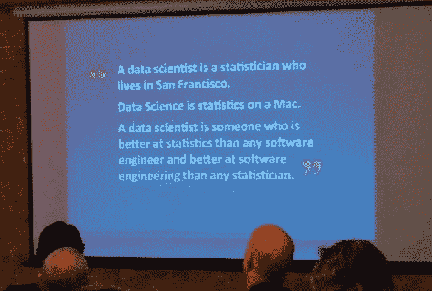
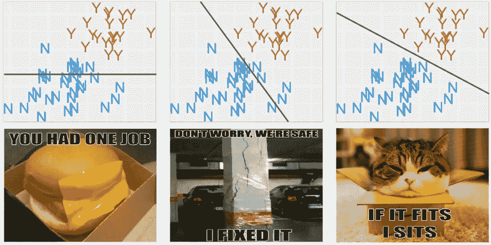
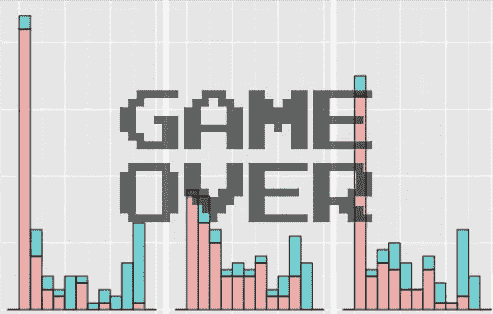

# 30 条数据科学妙语

> 原文：<https://towardsdatascience.com/data-science-conversation-starters-84affd2347f6?source=collection_archive---------2----------------------->

## 浓缩成 30 句引言的假日阅读清单

对于那些喜欢在假期吃大脑食物的人来说，这里有一个方便的索引，列出了我从 2018 年开始的所有文章，归结为 30 个(偶尔厚颜无耻的)妙语，帮助你避免/引起家庭活动和假日聚会上的尴尬沉默。

**章节:** *数据科学与分析，ML/AI 概念，如何不在 ML/AI 上失败，数据科学领导力，技术，统计学。*

**额外收获:**视频、播客、供你的非英语朋友和家人欣赏的外语翻译，以及为你们当中的 Pythonistas 提供的端到端深度学习教程。

# **数据科学和分析**

[**数据科学到底是什么？**](http://bit.ly/quaesita_datasci) 快速浏览数据科学、数据工程、统计学、分析学、ML 和 AI。

> 数据科学是让数据变得有用的学科。

Twitter definitions circa 2014.

[**优秀的数据分析师做什么，为什么每个组织都需要他们**](http://bit.ly/quaesita_analysts) 。优秀的分析师是数据工作取得成效的先决条件。让他们放弃你是很危险的，但是如果你低估了他们，他们就会这么做。

> 这三个数据科学学科各有所长。统计员带来严谨，ML 工程师带来性能，分析师带来速度。

[**秘密段落摘自《HBR 分析篇》**](http://bit.ly/quaesita_bsides) 一篇从上面文章中略去的沉思集。我们来谈谈混合角色，研究的本质，Bat 信号，数据江湖骗子，牛逼的分析师！

> 买家请注意:有许多冒充数据科学家的数据骗子。没有魔法能把不确定性变成确定性。

[**人工智能和数据科学十大角色**](http://bit.ly/quaesita_roles) 。职位指南，按招聘顺序排列。

> 如果研究员是你的第一份工作，你可能没有合适的环境来好好利用他们。

# **ML/AI 概念**

[**你会读到**](http://bit.ly/quaesita_simplest) 对机器学习最简单的解释。机器学习是一种事物标签，你可以用例子而不是指令来解释你的任务。

> 机器学习是一种新的编程范式，一种向计算机传达你的愿望的新方式。这很令人兴奋，因为它让你能够自动化不可言喻的事物。

你是不是用错了“AI”这个词？ 定义不清的术语，实际上并不存在正确使用它们的问题。我们都可能成为赢家，但这里有一个快速指南，可以让你了解 AI、ML、DL、RL 和 HLI 的字母汤。

> 如果你担心每个橱柜里都潜伏着一个类似人类的智能，请放松呼吸。所有这些行业人工智能应用都忙于解决实际的商业问题。

****【向孩子(或你的老板)解释监督学习。**我的目标是让所有人熟悉一些基本术语:*实例、标签、特征、模型、算法和监督学习。***

> **不要被行话吓倒。例如，模型只是“配方”的一个花哨的词**

****

**[**机器学习——皇帝穿衣服了吗？通过图片和猫迷因，初学者可以轻松了解核心概念，包括算法和损失函数。**](http://bit.ly/quaesita_emperor)**

> **不要因为简单而讨厌机器学习。杠杆也很简单，但它们可以移动世界。**

****

**Neural networks may as well be called “yoga networks” — their special power is giving you a very flexible boundary.**

**[**无监督学习去神秘化**](http://bit.ly/quaesita_unsupervised) 。无监督学习通过为你将相似的东西分组在一起，帮助你在数据中寻找灵感。结果就是一张帮助你做梦的罗夏卡片。**

> **把无监督学习想象成让“物以类聚”的数学版本。**

*   **[**交代艾不会搭救。下面是为什么**。许多人被 XAI 吸引，因为他们认为这是信任的良好基础。事实并非如此，陷入信任炒作可能意味着你会错过 XAI 最擅长的东西:灵感。](http://bit.ly/quaesita_xai)**

> **如果你拒绝把决策权交给你不了解其过程的事情，那么你应该解雇你所有的人类工人，因为没有人知道大脑(及其一千亿个神经元！)做决策。**

****

# ****如何不在 ML/AI 上失败****

**[**为什么商家在机器学习上失败**](http://bit.ly/quaesita_fail) 。许多企业没有意识到应用 ML 与 ML 算法研究是非常不同的学科。**

> **想象一下，试着雇佣那些一辈子都在制造微波炉零件，却从来没有做过饭的人来开一家餐馆……会有什么问题呢？**

****

**Which of these are you selling? The right team to hire depends on your answer.**

**[**寻找 AI 用例建议**](http://bit.ly/quaesita_island) 。我寻找应用机会的头脑风暴技巧始于想象人工智能是一个骗局…**

> **企业犯的一个常见错误是假设机器学习是神奇的，因此可以跳过对做好任务意味着什么的思考。**

**[**AI 的第一步可能会给你带来惊喜**](http://bit.ly/quaesita_first) 。启动一个 AI 项目的正确方法是什么？获得 AI 学位？不。雇一个人工智能巫师？没有。挑一个牛逼的算法？也不是那个。钻研数据？又错了！以下是如何做得更好的方法。**

> ***永远不要让一个博士团队“去把机器学习洒在业务的顶部，这样……好事就会发生。”***

****

**[“What is my purpose?”](http://bit.ly/rickmortyyt)**

**[**你的 AI 项目没戏吗？**](http://bit.ly/quaesita_realitycheck) 在你雇佣任何工程师或者为一个应用的 ML/AI 项目获取任何数据之前，你应该通过*的一个(现实)清单。***

> ***不要为了 AI 而在 AI 上浪费时间。被它能为你做什么所激励，而不是被它听起来有多科幻。***

**[**AI 入门？从这里开始！**](http://bit.ly/quaesita_dmguide) 决策者在应用 ML/AI 项目中的角色和职责的详细指南。**

> **仅仅因为你能做某事，并不意味着这是对任何人时间的一种很好的利用。我们人类爱上了自己倾注心血的东西……哪怕是一堆有毒的垃圾。**

**[**AI 犯错是谁的错？人工智能的要点是你用例子而不是指令来表达你的愿望。为了让它起作用，例子必须是相关的。**](http://bit.ly/quaesita_aimistakes)**

> **如果你使用的工具没有经过安全验证，那么你造成的任何混乱都是你的错。人工智能和其他工具一样。**

****

# **数据科学领导地位**

**[**数据驱动？再想想**](http://bit.ly/quaesita_inspired) **。**对于数据驱动的决策来说，驱动决策的必须是数据，而不是其他东西。看起来很简单，但在实践中却很少见，因为决策者缺乏一个关键的心理习惯。**

> **分割数据的方式越多，你的分析就越容易滋生确认偏差。解药是提前设定你的决策标准。**

****

**[**数据科学是泡沫吗？**](http://bit.ly/quaesita_bubble) 了解更多关于自称“数据科学家”的人，以及为什么这个行业在玩一场危险的游戏。**

> **“我认为你可能会像毒枭为他的后院买一只老虎一样雇佣数据科学家，”我告诉他。“你不知道你想要这只老虎做什么，但其他毒枭都有一只。”**

****

**I don’t know any actual drug lords (or tigers), so I’m not sure what’s in those backyards. But you get my point.**

**[**数据科学领袖:你们**](http://bit.ly/quaesita_dsleaders) **太多了。**有什么计划来培训决策者，让他们掌握让数据科学团队成功的技能？希望不是策略！**

> **…一种亲数学的亚文化，在这种亚文化中，对任何闻起来像“软”技能的东西表示蔑视是一种时尚。这都是关于你是多么热衷于熬夜证明一些定理或用你的第六语言编码。**

**[**反思数据科学中的快与慢**](http://bit.ly/quaesita_rethinking) **。**产品开发团队是否有可能调和快速迭代与深度研究过程的缓慢移动的庞然大物，或者他们必须选择一个？**

> **灵感是廉价的，但严谨是昂贵的。**

**[**面试:给数据科学家的建议**](http://bit.ly/mlconf_cassie) **。**坦诚回答数据科学家同事的问题。主题包括:喜爱的资源、职业、统计教育和数据科学领导。**

> **有用比复杂更有价值。数据质量比方法质量更重要。沟通技巧比另一种编程语言更有价值。**

****

# **技术**

**[**关于 TensorFlow**](http://bit.ly/quaesita_tf) **你应该知道的 9 件事。如果你有大量数据和/或你在追求人工智能的最新发展，TensorFlow 可能是你新的最好的朋友。这不是数据科学瑞士军刀，这是工业车床。这是它的新特性。****

> **有了 TensorFlow Hub，您可以从事一种历史悠久的传统的更有效的版本，即帮助自己使用他人的代码并将其称为自己的代码(也称为专业软件工程)。**

**[**5 个一口大小的数据科学总结**](http://bit.ly/quaesita_ds5) **。**Google Cloud Next SF 2018 最喜欢的 5 场演讲。5 个视频摘要。5 分钟或更少。**

> **人工智能花了半个多世纪被大肆宣传，而不是发生。那么，为什么是现在？许多人没有意识到，今天应用人工智能的故事实际上是关于云的故事。**

****

# **统计数字**

**[**不要把时间浪费在统计**](http://bit.ly/quaesita_pointofstats) **上。**如何确定是否需要统计，如果不需要怎么办。**

> **统计学是改变你想法的科学。**

**[**永远不要从一个假设开始**](http://bit.ly/quaesita_damnedlies) **。从假设而不是行动开始是那些学习数学却没有吸收任何哲学的人的一个普遍错误。让我们看看如何利用统计数据进行决策。****

> **假说就像蟑螂。当你看到一个，它永远不会只是一个。附近总有更多的藏身之处。**

**[**统计来去匆匆的人**](http://bit.ly/quaesita_statistics) **。曾经希望有人能告诉你统计学的意义是什么，术语用简单的英语表达是什么意思吗？让我试着在 8 分钟内实现你的愿望吧！****

> **数学就是建立一个零假设宇宙的玩具模型。这就是获得 p 值的方法。**

**[**——你做错了**](http://bit.ly/quaesita_popwrong) **。只有当你想要的信息(人群)和你拥有的信息(样本)不匹配时，统计方法才有意义。如果项目负责人不知道他们想要什么信息会怎么样？****

> **在从样本到人群的伊卡洛斯式的飞跃中，如果你不知道你的目标是什么，那么期待一个大的冲击。**

**[**统计精明自测**](http://bit.ly/quaesita_savvy) 。你能通过这个测试你统计专业知识的小测验吗？如果你相信他们在 STAT101 告诉你的，你可能不会…**

> **如果你有事实，你就不需要统计数据了。**

**[**无能，授权，人口**](http://bit.ly/quaesita_incomp) 。如果决策者没有正确的技能，你的整个统计项目就注定要失败。统计学家什么时候应该大惊小怪，什么时候应该温顺地服从命令？**

> **如果你的目标是用数据说服人们，你也可以把严谨扔出窗外(因为那是它的归属)，转而制作漂亮的图表。**

****

# ****翻译****

**我的第二个 Medium [账号](https://medium.com/@kozyr_91350)上有其他语言的社区翻译文章。下面是[阿拉伯语](https://medium.com/@kozyr_91350/arabic-simplest-ml-4e755850dc3c)、[中文](https://medium.com/@kozyr_91350/chinese-why-businesses-fail-at-machine-learning-b22b82a34c50?source=user_profile---------24------------------)、[荷兰语](https://medium.com/@kozyr_91350/de-eenvoudigste-uitleg-van-machine-learning-die-je-ooit-zult-lezen-46ea5158a45e)、[法语](https://medium.com/@kozyr_91350/les-statistiques-pour-les-gens-press%C3%A9s-dc5dcf8630ea)、[德语](https://medium.com/@kozyr_91350/die-einfachste-beschreibung-von-maschinellem-lernen-die-sie-jemals-lesen-werden-2a75dbba54b7)、[印地语](https://medium.com/@kozyr_91350/hindi-why-businesses-fail-at-ml-2beb7573ce03?source=user_profile---------5------------------)、[印尼语](https://medium.com/@kozyr_91350/indonesian-9-things-b0524ccb9d7c)、[意大利语](https://medium.com/@kozyr_91350/la-spiegazione-pi%C3%B9-semplice-di-machine-learning-che-tu-abbia-mai-letto-db3d36aa6455)、[日语](https://medium.com/@kozyr_91350/japanese-simplest-ml-82acdea1dd20?source=user_profile---------18------------------)、[葡萄牙语](https://medium.com/@kozyr_91350/aprendizado-de-m%C3%A1quina-em-portugu%C3%AAs-79d398fd6af4)、【BR】、[俄语](https://medium.com/@kozyr_91350/%D0%BC%D0%B0%D1%88%D0%B8%D0%BD%D0%BD%D0%BE%D0%B5-%D0%BE%D0%B1%D1%83%D1%87%D0%B5%D0%BD%D0%B8%D0%B5-%D1%81%D0%B0%D0%BC%D0%BE%D0%B5-%D0%B4%D0%BE%D1%85%D0%BE%D0%B4%D1%87%D0%B8%D0%B2%D0%BE%D0%B5-%D0%BE%D0%B1%D1%8A%D1%8F%D1%81%D0%BD%D0%B5%D0%BD%D0%B8%D0%B5-4d06d3a3cd8f)、[西班牙语](https://medium.com/@kozyr_91350/la-explicaci%C3%B3n-m%C3%A1s-simple-de-machine-learning-que-jam%C3%A1s-habr%C3%A1s-leido-4fa7ac6243ba)和[土耳其语](https://medium.com/@kozyr_91350/okuyabilece%C4%9Finiz-en-basit-makine-%C3%B6%C4%9Frenimi-a%C3%A7%C4%B1klamas%C4%B1-26ef73418a81)[(如果你愿意自愿做翻译，请阅读此处。)](https://medium.com/@kozyr_91350/okuyabilece%C4%9Finiz-en-basit-makine-%C3%B6%C4%9Frenimi-a%C3%A7%C4%B1klamas%C4%B1-26ef73418a81)**

# **播客**

**[DI 播客:我为那些喜欢音频的人读我的文章](http://bit.ly/quaesita_dipod)**

**[关于决策智能的 30 分钟 GCP 播客](http://bit.ly/quaesita_gcpp)**

**[65 分钟关于让数据科学变得有用的 DataCamp 播客](http://bit.ly/quaesita_datacampp)**

# ****视频****

**29min talk about ethics and responsibility in AI**

**19min talk introducing Decision Intelligence**

**15min talk explaining Google Cloud’s ML offerings in terms of making pizza. If you’ve already watched one of the videos above, start at 5:25.**

# **感谢阅读！YouTube 课程怎么样？**

**哇！你一直坚持到最后吗？耐力挑战成功了！你已经准备好迎接速度挑战了…你能在 5 秒钟内鼓掌几次？:)**

**如果你在这里玩得开心，并且你正在寻找一个为初学者和专家设计的有趣的应用人工智能课程，这里有一个我为你制作的娱乐课程:**

**Enjoy the entire course playlist here: [bit.ly/machinefriend](http://bit.ly/machinefriend)**

# **喜欢作者？与凯西·科兹尔科夫联系**

**让我们做朋友吧！你可以在 [Twitter](https://twitter.com/quaesita) 、 [YouTube](https://www.youtube.com/channel/UCbOX--VOebPe-MMRkatFRxw) 、 [Substack](http://decision.substack.com) 和 [LinkedIn](https://www.linkedin.com/in/kozyrkov/) 上找到我。有兴趣让我在你的活动上发言吗？使用[表格](http://bit.ly/makecassietalk)取得联系。**