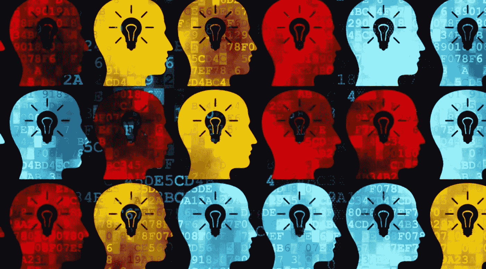
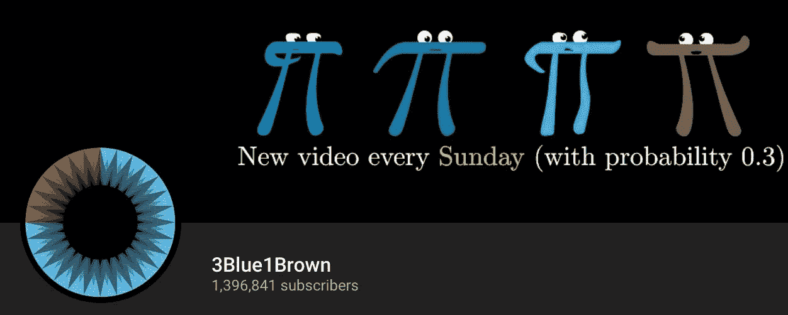

# 数据科学课程从零开始 2018(第一部分)

> 原文：<https://towardsdatascience.com/data-science-curriculum-from-scratch-2018-part-1-35061303c385?source=collection_archive---------5----------------------->

Photo by [rawpixel](https://unsplash.com/@rawpixel?utm_source=medium&utm_medium=referral) on [Unsplash](https://unsplash.com?utm_source=medium&utm_medium=referral)

由于我的药学背景，我不具备数据科学家所需的任何技术知识，在此之前我甚至不知道线性代数的存在。那时，我真的不太可能一头扎进很酷的数据科学领域。我被自己知识的匮乏所压倒，我认为一个全面的课程会真正帮助我，或者像我这样的人。

好消息是，网上并不缺少数据科学课程。坏消息是，我既没有收入也没有时间去试驾每一门课程，我需要一门适合我的课程。

根据我缺乏的技能开发定制课程是下一个最好的选择。我从工作门户网站中提取技能，查阅了班级中心的大量评论，结合社区的建议，几个版本之后，我自己的数据科学课程形成了。

这是我展示我的课程和提供这些课程的个人评论的系列的第一部分。

***免责声明*** :遵循课程并不能保证成功。我也不是来自任何有资格出版我自己的课程的学术机构。本课程的目的是为您提供数据科学入门指南，即使您缺乏技术知识。

**数据科学导论**

*   [数据科学 A-Z 来自*Udemy*](https://www.udemy.com/datascience/)

**统计数据**

*   [MITx micro masters 程序*统计基础*](https://www.edx.org/micromasters/mitx-statistics-and-data-science)

**概率**

*   [概率——不确定性和数据的科学由](https://www.edx.org/micromasters/mitx-statistics-and-data-science) [*MITx MicroMasters 程序*](https://www.edx.org/micromasters/mitx-statistics-and-data-science)

**微积分**

*   [机器学习的数学:来自 *Coursera*](https://www.coursera.org/learn/multivariate-calculus-machine-learning) 的多元微积分
*   [多变量微积分由*可汗学院*](https://www.khanacademy.org/)

**线性代数**

*   [机器学习的数学:来自 *Coursera*](https://www.coursera.org/learn/linear-algebra-machine-learning) 的线性代数
*   [线性代数由*可汗学院*提供](https://www.khanacademy.org/)
*   [线性代数精粹由*3 blue 1 brown*](https://www.youtube.com/watch?v=fNk_zzaMoSs&list=PLZHQObOWTQDPD3MizzM2xVFitgF8hE_ab)
*   [线性代数由*麻省理工学院 18.06*](https://ocw.mit.edu/courses/mathematics/18-06-linear-algebra-spring-2010/)

**Python 编程**

*   [完整 Python Bootcamp:从零到英雄在 Python 中从*Udemy*](https://www.udemy.com/complete-python-bootcamp/)
*   [计算机科学与编程导论*MITx 6.001 x*](https://www.edx.org/course/introduction-to-computer-science-and-programming-using-python)
*   [*MITx 6.002 x*](https://www.edx.org/course/introduction-computational-thinking-data-mitx-6-00-2x-7)计算思维与数据科学导论

**机器学习**

*   [机器学习通过*吴恩达*](https://www.coursera.org/learn/machine-learning)
*   [由*fast . ai*为编码员介绍机器学习](https://course.fast.ai/ml)
*   [用 Python 进行机器学习:从线性模型到深度学习](https://www.edx.org/micromasters/mitx-statistics-and-data-science) [*MITx MicroMasters 程序*](https://www.edx.org/micromasters/mitx-statistics-and-data-science)

**深度学习**

*   [Deeplearning.ai 专精来自 *Coursera*](https://www.coursera.org/specializations/deep-learning)
*   [由*fast . ai*为编码人员提供实用的深度学习](https://course.fast.ai/)

学习如此复杂的题目没有硬性规定。在线学习的美妙之处在于，你可以选择你需要的和让你兴奋的东西。

对于这个系列的第 1 部分，我将回顾我所学的数学和 python 基础课程。请注意，这些是我的个人意见，可能会也可能不会引起你的共鸣。不管怎样，我们走吧。

https://www.udemy.com/datascience/

# 数据科学导论

我想特别提到基里尔·叶列缅科和超级数据科学团队的数据科学 A-Z。这是我第一次参加数据科学领域的课程，*基里尔·叶列缅科*做得非常好，激起了所有数据科学爱好者的兴趣。不要期望从本课程中学到任何工具或技术技能，而是欣赏更大的画面*基里尔·叶列缅科*试图描绘，他将带你了解一个标准数据科学项目的整个工作流程。

您可以使用一些数据集，完成简单的任务，如数据清理、建模、模型选择、基本 SQL 和数据表示。这是数据科学入门课程中最完整的内容，会让你渴望更多。此外，本课程也是对你的现实检验。如果这不是你作为数据科学家所期望的，也许追求数据科学并不是你的最佳选择。总体而言，如果您对数据科学家的角色仍有疑问，建议您这样做。

# **统计数据**

继续，机器学习所需的数学基础。您可能已经意识到我包含了来自 MITx 的统计和数据科学 MicroMasters 程序，但这完全取决于您的偏好。没有这个项目你也能做得很好。对于统计和概率，我正在使用该计划的课程，但我可以列出一些其他的替代建议。

1.  [描述性统计简介*uda city*](https://www.udacity.com/course/intro-to-descriptive-statistics--ud827)
2.  [由 *Udacity* 和](https://www.udacity.com/course/intro-to-inferential-statistics--ud201)介绍推断统计

除了它们经常在我搜索的时候出现之外，我没什么好评论的。下面的评论让我知道这是不是一个好的选择。MITx*MITx*的统计基础还没有开始他们的课程，所以我将把它留到另一天。

# 可能性

现在我只想说，概率——不确定性和数据的科学是一门极好的课程。这是我带过的最有活力、要求最高的 MOOC。该课程估计在 16 周内每周要花费大约 12 个小时的努力，但我很容易就完成了每周两倍的时间。有每周到期的问题集和每 4 周一次的定时考试，迫使你经常重温这些材料。一句忠告，认真对待前提条件。在学习新的深入概念时，你不会想与基本的微积分作斗争。做好心理准备，把你的大部分空闲时间花在习题集上，但我保证这是值得的。这门课程可能是你在数据科学中唯一需要的概率课程。甚至有人会说，你不需要这么高级的概率。这可能是真的，但是让你自己沉浸在一门数学繁重的课程中，会让你更好地为你将来会遇到的所有数学符号做好准备，无论是来自机器学习算法还是阅读未来的科学研究论文。结论:如果你有时间和决心，这是一门优秀的课程，强烈推荐。

你可以免费旁听课程，不需要证书，否则，证书费用为 300 美元。如果您负担不起，edX 将提供高达 90%的经济资助。

# 多元微积分和线性代数

我将它们放在一起提及，因为我在这些方面几乎使用了相同的资源。Coursera 和 Khan academy 的机器学习数学互为补充，为您提供足够的基础知识来理解机器学习算法。坦率地说，与课程中的其他课程相比，它们相形见绌。《机器学习的数学》旨在介绍机器学习中微积分和线性代数的各种实现，但短片和练习作业的缺乏使概念难以坚持，难以理解，并让您比以前更加困惑。

这就是可汗学院的用武之地。Khan Academy 为机器学习的数学中引入的每个概念提供了详细的解释。通过关注可汗学院 Coursera 课程引入的主题，它大大减少了微积分和线性代数所需的时间。对于我们在数据科学中的应用，有些主题比其他主题更重要。可汗学院的主要缺点是缺乏任务，但不要担心，因为当你进入机器学习算法时，你会得到大量的练习。

可汗学院对所有人都是免费的，你可以免费旁听 Coursera 课程。

https://www.youtube.com/channel/UCYO_jab_esuFRV4b17AJtAw

这里还要特别提一下。3Blue1Brown 的《线性代数精要》在为常见的线性代数运算提供直观性方面做得很好。这一系列 youtube 短视频绝对值得一看，不会占用你太多时间。

麻省理工学院吉尔伯特·斯特兰教授的线性代数课程也很受欢迎。我还没有浏览过这些材料，但是考虑到矢量化实现在机器学习中的重要性，我一定会在不久的将来参观这个课程。

# Python 编程

为什么是 python？对我来说，与 R 相比，我喜欢它是一种通用语言，语法对我来说也很直观，很容易掌握。

来自 *Udemy* 的完整 Python 训练营在教授语法、面向对象编程方面做得相当不错，并且提供了 Jupyter 笔记本作业来练习。这对初学编程的人来说是很棒的，Jupyter 笔记本作业是一个加分项。开始习惯 Jupyter 笔记本，因为它无疑是我们工具箱中最重要的工具之一。对于那些有编程经验的人来说，你最好阅读官方的 [python 文档](https://docs.python.org/3/)。

另一方面，MITx 的两门课程(Python 中的计算机科学和编程入门，计算思维和数据科学入门)都值得仔细研究。编程语言很像自然语言，需要练习。每周的习题集、测验和考试给你充分的练习机会，评分员会对你的代码提供即时的反馈。计算思维和数据科学也涉及数据科学技术，如优化算法、蒙特卡罗模拟、随机漫步和其他有用的技能。对我来说，这是最接近真实课堂环境的了。完成每个问题集后的成就感强化了你的理解，激励你走得更远。

再次强调，旁听 MITx 课程是免费的，但是每张证书的费用是 75 美元，并且有资格获得 edX 90%的经济资助。

这就是这个系列的全部内容。接下来，我将讨论机器学习和深度学习的课程。

我个人的建议是处理这些课程

1.  好好计划你的时间表。edX 上提供的大多数课程都是教师指导的，这意味着你的作业有评分的最后期限
2.  以 1.5 到 2 倍的速度观看视频
3.  记笔记
4.  如果你没有马上理解这个概念，不要太担心，当你应用这些知识的时候，重新审视它们
5.  申请，申请，申请。做一些项目，研究有趣的数据集，在 kaggle 上竞争

> “我没有特殊才能。我只是强烈好奇。”
> 
> — **阿尔伯特·爱因斯坦**

这是我的 Github 链接，里面有更多资源和一些数据科学电子书的可下载 pdf 文件[https://github.com/Benlau93/Data-Science-Curriculum](https://github.com/Benlau93/Data-Science-Curriculum)

## 对于该系列的第 2 部分，点击[此处](https://medium.com/@ben_lau93/data-science-curriculum-from-scratch-part-2-5778a29a5cd2)。