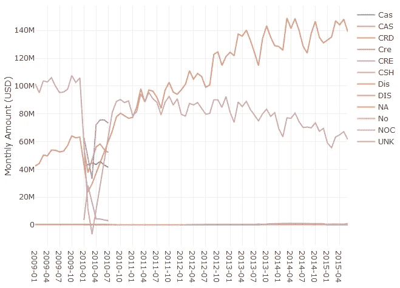
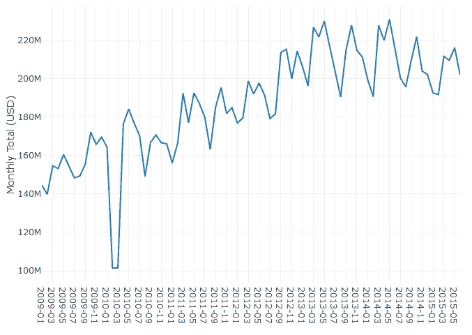
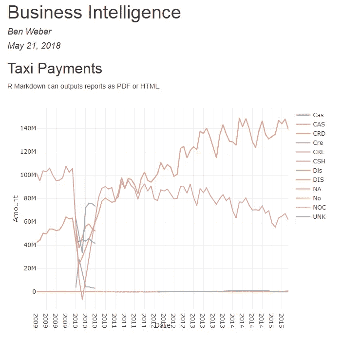
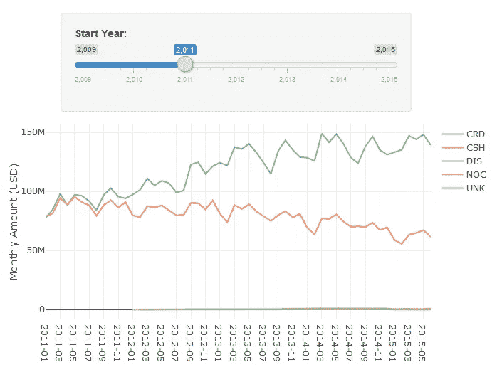
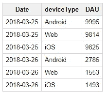
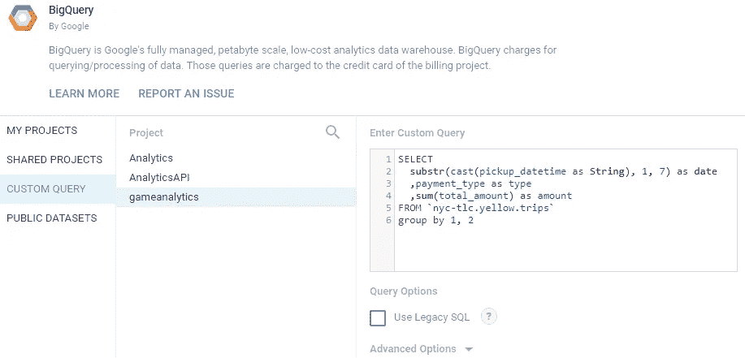
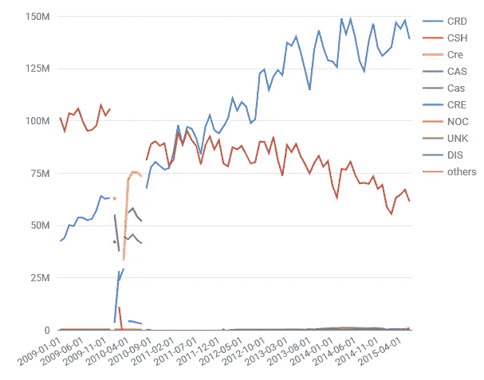
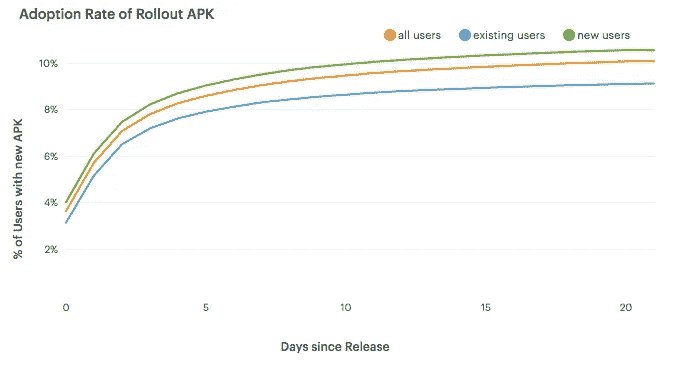
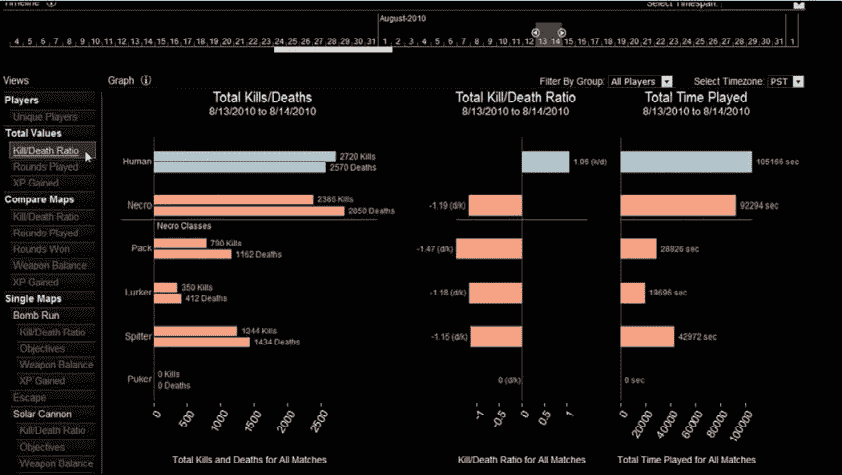

# 创业数据科学:商业智能

> 原文：<https://towardsdatascience.com/data-science-for-startups-business-intelligence-f4a2ba728e75?source=collection_archive---------1----------------------->


roleSource: rawpixel at pixabay.com

我正在进行的关于在初创公司建立数据科学学科的系列文章的第四部分。你可以在 [*简介*](/data-science-for-startups-introduction-80d022a18aec) *中找到所有帖子的链接，还有一本基于这个系列的关于* [*亚马逊*](https://www.amazon.com/dp/1983057975) *的书。*

在初创公司建立数据科学涉及的大量繁重工作是说服产品团队使用仪器并关心数据。如果你能够实现这个目标，下一步就是能够回答你的组织内所有关于产品健康的问题。数据科学家新手可能会认为这类工作超出了数据科学家的职责范围，但确定产品健康的关键指标是该角色的核心方面之一。

我将这篇文章命名为商业智能，因为一旦你建立了数据管道，初创公司的数据科学家就应该回答所有关于数据的问题。考虑到新的数据洪流，这并不奇怪，但也是数据科学家为组织的其他人设定期望的时候了。作为一名初创公司的数据科学家，你的职责不是回答数据问题，而是告知领导层哪些指标应该是重要的。

这篇文章讲述了如何将原始数据转化为可以总结产品健康状况的成熟数据的基础知识。我将讨论在处理原始数据时采用的几种不同的方法，包括 SQL 查询、R markdown 和供应商工具。总的来说，就是展示处理数据集有几种选择，您应该选择一种适合您团队目标的解决方案。我将讨论过去使用 Tableau 等工具的经验，并提供在团队中扩展自动化报告的建议。

在这篇文章中，我们将使用两个数据源。第一个是公共数据集，我们将使用关键指标对其进行汇总和总结。第二个是本系列第二章中跟踪 API 生成的数据。我们将关注用于将原始数据转换为已处理数据的第二个数据集，以及用于将已处理数据转换为熟数据的第一个数据集。

## KPI

关键绩效指标(KPI)用于跟踪初创公司的健康状况。为了确定对产品所做的改变是否有益，跟踪捕捉参与度、保留率和增长的指标是很重要的。作为一家初创公司的数据科学家，你的职责是确定哪些指标是重要的。该职能与领域知识的数据科学能力相一致，是数据科学家极具影响力的领域之一。

由早期数据科学家建立的 KPI 可能会产生巨大的影响。例如，我过去工作过的许多公司的公司目标都是基于数据科学家过去的分析。在电子艺界，我们专注于提高会话指标，在 Twitch，我们希望最大限度地提高观看内容的数量，在索尼在线娱乐，我们希望提高免费游戏的保留指标。这些是游戏行业的衡量标准，但还有更通用的衡量标准，如参与度、增长和货币化，这些在创建公司时非常重要。

在初创公司建立数据科学学科时，确保您的团队从事高影响力的工作非常重要。我在过去的公司看到的一个问题是，数据科学家被拉入数据工程和分析类型的工作。当公司只有一名数据人员时，这是意料之中的，但是您不希望支持太多无法扩展的手动数据流程。这就是为什么为报告和分析建立可重复的方法是重要的。几个月后重新运行一个分析应该是微不足道的，并且其他团队成员在最少的指导下也可以这样做。

我对新数据科学家的主要建议是，为防止被产品经理和其他团队的请求淹没，为数据科学团队建立一个接口，缓冲直接请求。与其让公司的任何人都能够询问数据科学团队事情的执行情况，不如设置一组基线仪表板来跟踪产品性能。鉴于数据科学家可能是初创公司的首批数据角色之一，这一职责最初将由数据科学家承担，为了在初创公司支持这一职能，熟悉许多不同的工具非常重要。

## 用 R 报告

作为一名数据科学家，您在创业时可以实现的一个关键转变是从手动报告流程迁移到可重现的报告。对于这种类型的工作来说，r 是一种强大的编程语言，它可以以多种不同的方式提供自动化的报告功能。本节讨论如何使用 R 来创建绘图、生成报告和构建交互式 web 应用程序。虽然 Python 和 Jupyter suite 也提供了许多这样的功能，但是对自动化的关注比用于实现这一目标的语言更重要。

用 Excel 或 Google Sheets 可以实现这类功能，但我建议初创公司不要用这种方法。这些工具非常适合创建演示图表，但不适合自动报告。对于数据科学家来说，基于这些类型的报告来支持一家初创公司是不可持续的，因为可能需要如此多的手动步骤。像 Excel 中的 ODBC 这样的连接器对于自动化来说似乎很有用，但是当试图在另一台机器上运行报告时可能就不起作用了。

本节涵盖了用 R 构建报告的三种方法:直接使用 R 创建图，使用 R Markdown 生成报告，以及使用 Shiny 创建交互式可视化。本节列出的所有代码都可以在 [Github](https://github.com/bgweber/StartupDataScience/tree/master/BusinessIntelligence) 上获得。

**Base R
幸运的是，有一个公共数据集可以帮助回答这类问题:BigQuery 的[纽约出租车和豪华轿车出行](https://cloud.google.com/bigquery/public-data/nyc-tlc-trips)公共数据集。此旅行数据集合包括付款信息，您可以使用这些信息来确定付款类型随时间变化的趋势。**

我们将用来回答这个问题的第一种方法是使用 R 中的绘图库来创建一个绘图。采用这种方法时，我推荐使用 [RStudio IDE](https://www.rstudio.com) 。此外，这种方法实际上不是“Base R ”,因为我使用了两个额外的库来完成汇总数据集和绘制结果的目标。我将这个部分称为 *Base R* ，因为我使用了 R 的内置可视化功能。

R 的一大优点是有各种不同的库可用于处理不同类型的数据库。[BigQuery](https://github.com/r-dbi/bigrquery)库为 big query 提供了一个有用的连接器，可以用来从 R 脚本中的公共数据集中提取数据。下面显示了用于汇总一段时间内的支付历史并将结果绘制成图表的代码。

```
library(bigrquery)
library(plotly)
project <- "your_project_id"sql <- "SELECT  
  substr(cast(pickup_datetime as String), 1, 7) as date
  ,payment_type as type 
  ,sum(total_amount) as amount
FROM `nyc-tlc.yellow.trips`
group by 1, 2"df <- query_exec(sql, project = project, use_legacy_sql = FALSE)
plot_ly(df, x = ~date, y = ~amount, color = ~type) %>% add_lines() 
```

该脚本的第一部分包括除最后一行之外的所有内容，负责从 BigQuery 中提取数据。它加载必要的库，声明要运行的查询，并使用 *bigrquery* 获取结果集。将数据放入数据框后，脚本的第二部分使用 plotly 库将结果显示为折线图。脚本中排除了一些额外的格式化步骤，完整的代码清单可以在 [Github](https://github.com/bgweber/StartupDataScience/tree/master/BusinessIntelligence) 上找到。在 RStudio 中，图表将在 IDE 中显示为交互式绘图，Jupyter 也提供了类似的功能。下面的图表显示了这段代码的结果。



Monthly Spending by Payment Type

该查询使用 2009 年至 2015 年的数据，按支付类型计算纽约市出租车旅行的每月总支出。结果显示，信用卡(CRD)现在是比现金(CSH)更受欢迎的支付方式。要回答最初关于实现哪种类型的支付系统的问题，我建议从接受信用卡的系统开始。

此时值得一提的一个话题是数据质量，因为图表中有许多不同的标签似乎代表相同的值。例如, *CAS* 和 *CSH* 都可能指现金支付，应该组合在一起以获得准确的现金支付总额。处理这类问题超出了这种方法的范围，但是有一些方法可以用于这类场景。最简单但可伸缩性最差的方法是编写考虑这些不同类型的查询:

```
,sum(case when payment_type in ('CSH', 'CAS') then amount else 0 end) as cash_payments
```

可以使用的另一种方法是创建一个维度表，将所有原始的 *payment_type* 值映射到净化的类型值。这个过程通常被称为属性丰富，在从原始数据或经过处理的数据构建成熟的数据集时非常有用。

我们已经回答了关于确定最流行的支付方式的第一个问题，但如果我们有第二个问题，关于纽约市的交通市场是否在增长呢？我们可以使用现有数据集轻松绘制数据来回答这个问题:

```
total <- aggregate(df$Amount, by=list(Category=df$Date), FUN=sum)
plot_ly(total, x = ~Category, y = ~x) %>% add_lines()
```

此代码计算所有不同支付类型的每月总支付额，并将合计值绘制成单线图。结果如下图所示。基于对该数据的初步观察，第二个问题的答案尚不清楚。从 2009 年到 2013 年，纽约市的出租车支出稳步增长，但有季节性波动，但支出在 2014 年夏天达到顶峰。优步和 Lyft 可能解释了这一趋势，但需要进一步分析才能得出明确的结论。



Total Monthly Spending

本节展示了如何使用 R 从 BigQuery 中的汇总数据生成图表。虽然这个示例使用了一个固定的数据集，但是同样的方法也可以用于一个随时间增长的动态数据集，重新运行脚本将会包含更多的最新数据。这还不是自动报告，因为它涉及到在 IDE 或笔记本中手动运行代码。可以使用的一种方法是将绘图输出到图像文件，并作为 cron 作业的一部分运行脚本。这种方法的结果是定期更新的绘图图像。这是一个很好的起点，但是在 r 中还有更好的自动化报告解决方案。

**R Markdown
[R Markdown](https://rmarkdown.rstudio.com/) 提供了这种能力，可以使用 R 代码生成 pdf、word 文档(DOCX)、网页(HTML)。甚至可以用 R Markdown 写[本书](https://bookdown.org/)！R Markdown 扩展了标准 Markdown，支持可用于生成可视化效果的内联 R 代码片段。嵌入式 R 代码几乎可以执行任何标准的 R 功能，包括使用 R 库和连接数据库。这意味着我们可以将上面的代码转换成 R markdown 文件，并定期运行脚本来构建自动化报告。**

下面的 markdown 代码片段是以前的 R 代码，现在嵌入到一个报告中，该报告将生成一个 HTML 文件作为输出。文件的第一部分是关于报告的元数据，包括所需的输出。接下来，markdown 用于向报告添加注释。最后，使用 R 代码块从 BigQuery 中提取数据并绘制结果。运行此报告时，生成的 plotly 对象嵌入到文档中。

```
---
title: "Business Intelligence"
author: "Ben Weber"
date: "May 21, 2018"
output: html_document
---
## Taxi Payments 
R Markdown can outputs reports as PDF or HTML.```{r echo=FALSE, message=FALSE, warning=FALSE}
library(bigrquery)
library(plotly)
project <- "your_project_id"sql <- "SELECT  
  substr(cast(pickup_datetime as String), 1, 7) as date
  ,payment_type as type 
  ,sum(total_amount) as amount
FROM `nyc-tlc.yellow.trips`
group by 1, 2"df <- query_exec(sql, project = project, use_legacy_sql = FALSE)
plot_ly(df, x = ~date, y = ~amount, color = ~type) %>% add_lines()
```
```

生成的 HTML 文档如下图所示。它包括与之前相同的情节，以及在代码块之前列出的降价文本。此输出可能比图像更有用，因为文件中嵌入的 plotly 图表是交互式的，而不是渲染的图像。它对于创建具有各种不同图表和指标的报告也很有用。



The interactive web page generated from the R Markdown file.

要自动创建该报告，您可以再次设置一个 cron 作业。将 Rmd 文件转换为报告的命令是:

```
Rscript -e "rmarkdown::render('BI.Rmd')"
```

我们现在有了一种生成报告的方法，并且可以使用 cron 开始构建一个自动化的报告解决方案。然而，我们还没有提供过滤和深入功能的图表。

**R Shiny** [Shiny](https://shiny.rstudio.com/)是一个直接在 R 中构建仪表板的解决方案，它提供了构建具有过滤和下钻功能的报表的功能，可以作为 Tableau 等工具的替代。使用 Shiny 时，您可以指定要包含在报告中的 UI 组件，以及报告中不同组件的行为，例如基于对 slider 组件的更改应用过滤器。结果是一个交互式的 web 应用程序可以运行您的嵌入式 R 代码。

我已经基于与上述报告相同的代码创建了一个示例 Shiny 应用程序。代码的第一部分是相同的，我们将数据从 BigQuery 拉至 dataframe，但是我们还包含了闪亮的库。代码的第二部分定义了不同组件(服务器)的行为，以及不同组件(ui)的布局。这些函数被传递给 shinyApp 调用以启动仪表板。

```
library(shiny)
library(bigrquery)
library(plotly)
project <- "your_project_id"sql <- "SELECT  
substr(cast(pickup_datetime as String), 1, 7) as date
,payment_type as type 
,sum(total_amount) as amount
FROM `nyc-tlc.yellow.trips`
group by 1, 2"
df <- query_exec(sql, project = project, use_legacy_sql = FALSE)server <- function(input, output) {
  output$plot <-  renderPlotly({
    plot_ly(df[df$date >= input$year, ], x = ~date, 
      y = ~amount, color = ~type) %>% add_lines()
  })
}ui <- shinyUI(fluidPage(
  sidebarLayout(
    sidebarPanel(
      sliderInput("year", "Start Year:", 
        min = 2009, max = 2015, value = 2012)
    ),
    mainPanel(plotlyOutput("plot"))
  )
))shinyApp(ui = ui, server = server)
```

UI 函数指定如何在仪表板中布置组件。我从包含滑块和直方图的 [Hello Shiny](http://rstudio.github.io/shiny/tutorial/#hello-shiny) 示例开始，并修改了布局以使用 plotOutput 对象代替 plot output。滑块指定允许选择的年份，并设置默认值。behavior 函数指定如何响应 UI 组件中的变化。该图与 behavior 相同，但有一处修改，当使用数据帧`df$date >= input$year`时，它现在过滤起始数据。结果是如下所示的交互式仪表板。移动滑块将会过滤图表中包含的年份。



An interactive Chart in R Shiny.

我已经展示了使用 R 生成报告的三种不同方式。如果您需要交互式仪表板，那么 Shiny 是一个很好的工具，而如果您希望构建静态报告，那么 R Markdown 是一个很好的解决方案。这两种方法的一个关键好处是，你可以在你的图表中嵌入复杂的 R 逻辑，比如使用脸书的 [prophet library](https://research.fb.com/prophet-forecasting-at-scale/) 向你的图表添加预测值。

## ETLs

在关于数据管道的文章中，我讨论了使用原始数据、经过处理的数据和熟数据。大多数用于商业智能的报告应该基于熟数据，在熟数据中数据被聚合、丰富和净化。如果您在构建报告时使用经过处理的数据或原始数据，而不是熟数据，您将很快遇到报告管道中的性能问题。例如，不是在上面的 R 部分中直接使用 *nyc-tlc.yellow.trips* 表，我可以创建一个预先计算了聚合值的表。

ETL 是提取-转换-加载的缩写。这些类型的流程的主要用途之一是将原始数据转换为处理过的数据，或者将处理过的数据转换为熟数据，例如聚合表。设置聚合表的一个主要挑战是保持表的更新和准确。例如，如果您开始使用新的缩写(例如 CAH)来跟踪现金支付，您将需要更新计算每月现金支付的汇总流程，以包括这种新的支付类型。

数据管道的输出之一是一个原始事件表，其中包含所有编码为 JSON 的跟踪事件的数据。我们可以设置的一种 ETL 过程是原始数据到已处理数据的转换。在 BigQuery 中，这可以为登录事件实现，如下所示:

```
create table tracking.logins as (
  select eventVersion,server_time 
    ,JSON_EXTRACT_SCALAR(message, '$.userID') as userID
    ,JSON_EXTRACT_SCALAR(message, '$.deviceType') as deviceType
  from tracking.raw_events
  where eventType = 'Login'
)
```

该查询过滤原始事件表中的登录事件，并使用 JSON 提取标量函数解析 JSON 消息中的元素。运行此 DDL 语句的结果将是跟踪模式中的一个新表，其中包含所有登录数据。我们现在已经处理了带有可以直接查询的 *userID* 和 *deviceType* 属性的登录数据。

在实践中，我们希望逐步构建一个这样的表，只转换自 ETL 过程最后一次运行以来到达的新数据。我们可以使用下面的 SQL 代码中所示的方法来实现这一功能。我们不是创建一个新表，而是插入到一个现有的表中。使用 BigQuery，您需要为插入操作指定列。接下来，我们找到最后一次更新登录表的时间，表示为 *updateTime* 值。最后，我们使用这个结果来连接自上次更新以来发生的登录事件。这些原始事件被解析成已处理的事件，并添加到登录表中。

```
insert into tracking.logins
    (eventVersion,server_time, userID, deviceType)
with lastUpdate as (
  select max(server_time) as updateTime
  from tracking.logins
)
select eventVersion,server_time 
  ,JSON_EXTRACT_SCALAR(message, '$.userID') as userID
  ,JSON_EXTRACT_SCALAR(message, '$.deviceType') as deviceType
from tracking.raw_events e
join lastUpdate l 
  on e.server_time > updateTime
where eventType = 'Login'
```

可以使用类似的方法从处理过的数据中创建熟数据。上面登录 ETL 的结果是，我们现在可以直接查询 *userID* 和 *deviceType* 字段。这些经过处理的数据使得按平台计算有用的指标(如每日活跃用户(DAU))变得很简单。下面是在 BigQuery 中计算这个指标的一个例子。

```
create table metrics.dau as (
  select substr(server_time, 1, 10) as Date
    ,deviceType, count(distinct userID) as DAU
  from `tracking.logins` 
  group by 1, 2
  order by 1, 2
)
```

运行该查询的结果是一个预先计算了 DAU 度量的新表。烹饪数据表中显示了该数据的一个示例。与前面的 ETL 类似，实际上我们希望使用增量方法来构建这个度量表，而不是使用完整的数据集来重建。这里需要采用稍微不同的方法，因为如果 ETL 在一天中运行多次，那么当天的 DAU 值需要更新多次。



Cooked Data: DAU by Platform

一旦有了一组要为数据管道运行的 ETL，您就需要安排它们定期运行。您可以采用的一种方法是使用 cron 来设置任务，例如:

```
bq query --flagfile=/etls/login_etl.sql
```

为这样的流程设置监控非常重要，因为数据管道早期的故障会对下游产生重大影响。诸如 [Airflow](https://airflow.apache.org/) 等工具可用于构建复杂的数据管道，并提供监控和警报。

## 报告工具

虽然 R 确实为执行商业智能任务提供了有用的工具，但它并不总是构建自动化报告的最佳工具。当技术和非技术用户需要使用报告工具时，这是很常见的，并且用于构建仪表板的供应商解决方案通常对这些类型的场景很有用。以下是我过去用过的几种不同的工具。

谷歌数据工作室
如果你已经在使用 GCP，那么谷歌数据工作室值得探索，为你的组织内部共享建立仪表板。然而，它比其他工具稍显笨拙，所以最好推迟构建仪表板，直到您有了要构建的报告的基本完整的规范。



Setting up a Custom Data Source in Google Data Studio

上图显示了如何在 Google Data Studio 中设置一个自定义查询，以提取 R 报告中使用的相同数据集。与之前相同的报告，现在用 Data Studio 实现，如下所示。



The Taxi Report recreated in Google Data Studio

这个工具的主要好处是它提供了许多内置于其他工具的协作特性，比如 Google Docs 和 Google Sheets。它还会根据需要刷新报告以防止数据过时，但可用的计划选项有限。

**Tableau** 我用过的最好的可视化工具之一就是 Tableau。当您有一个完整的规格时，它非常适合构建仪表板的用例，以及在执行探索性分析时构建交互式可视化。DC Universe Online 的热图是用 Tableau 构建的，是可以构建的许多不同类型的可视化之一。


A heatmap in Tableau for the game DC Universe Online

Tableau 的主要优点是易于构建可视化和探索新数据集。主要的缺点是许可证的定价，以及缺乏 ETL 工具，因为它关注的是表示而不是数据管道。

在 Twitch，我们使用了一个名为 Mode Analytics 的供应商工具。Mode 使得与其他分析人员共享查询变得简单，但是它的可视化功能非常有限，并且只关注于表示，而不是 ETL 类型的任务。



Line Charts in Mode Analytics

**定制工具** 另一种可用的方法是使用 D3.js 和 Protovis 等工具创建定制可视化。在电子艺界，D3 被用于为游戏团队创建客户仪表盘，例如由 Ben Medler 创建的用于可视化死亡空间 2 中游戏测试数据的[数据破解](https://dl.acm.org/citation.cfm?id=1979288)工具。



The Data Cracker Tool for Dead Space 2\. Source: GDC Vault 2011

使用定制工具提供了最大的灵活性，但是也需要维护一个系统，并且通常需要做更多的工作。

## 结论

数据科学家在初创公司的一个关键角色是确保其他团队可以有效地使用你的产品数据。通常这采取提供仪表板或其他自动化报告的形式，以便为不同的团队提供 KPI 或其他指标。它还包括确定哪些指标对公司的测量是重要的。

这篇文章介绍了在 R 中设置自动化报告的三种不同方法，从直接在 R 中创建图表，使用 R Markdown 生成报告，到使用 Shiny 构建仪表板。我们还讨论了如何编写 ETL 来将原始数据转换为经过处理的数据，并将经过处理的数据转换为熟数据，以便可以用于报告目的。最后一节讨论了一些不同的报告供应商解决方案，以及它们的优缺点。

在为商业智能设置好工具之后，大部分工作都已经就绪，可以更深入地研究数据科学类型的工作了。我们可以超越回顾性的问题，前进到预测、预测性建模和实验。