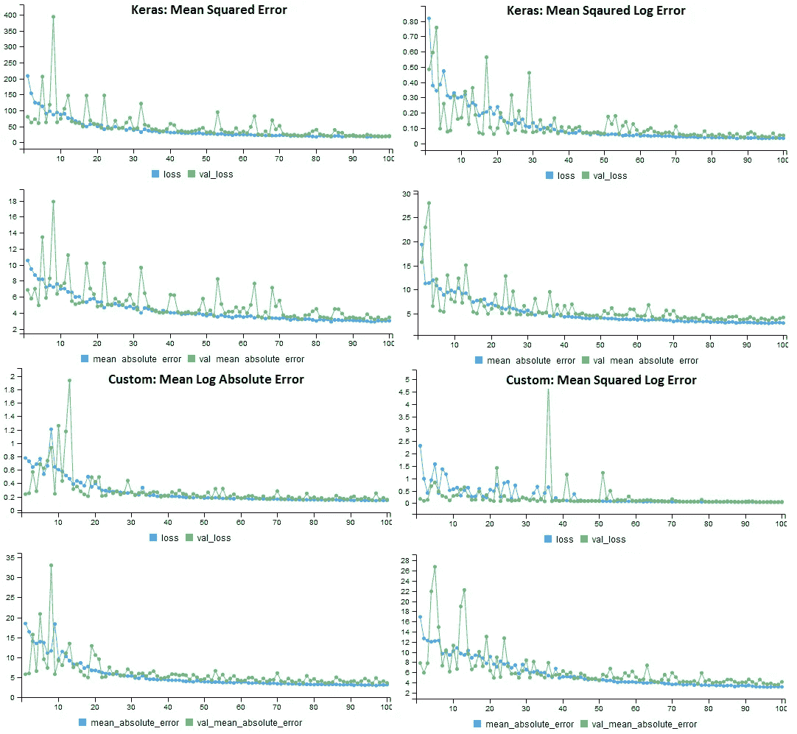
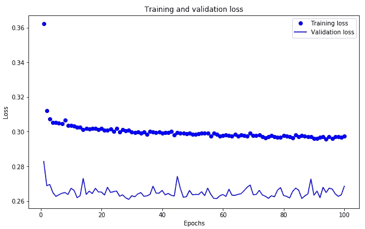
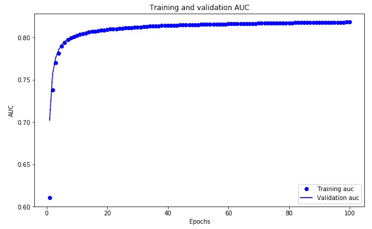
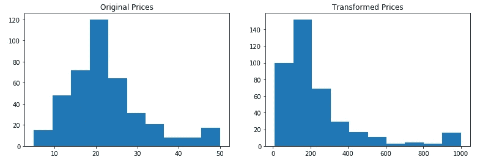
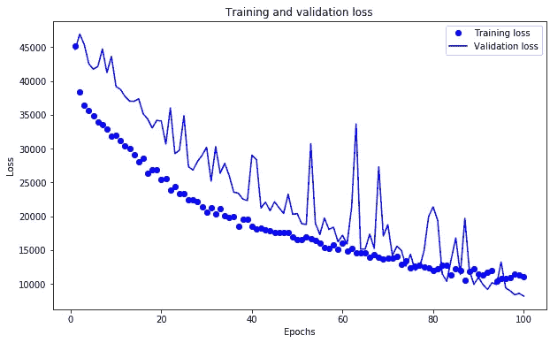
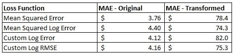
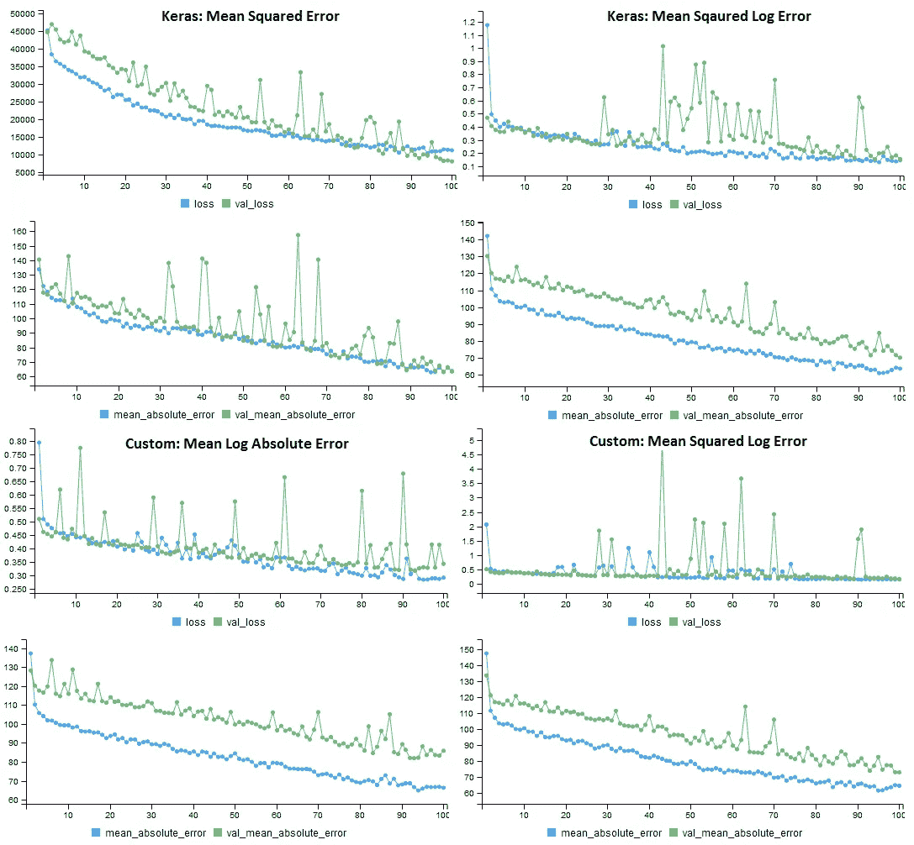

# 创业公司的数据科学:深度学习

> 原文：<https://towardsdatascience.com/data-science-for-startups-deep-learning-40d4d8af8009?source=collection_archive---------3----------------------->


Source: 4047259 at pixabay.com

*我正在进行的关于在创业公司建立数据科学学科系列的第十部分，第一篇文章从* [*R 移植到 Python*](/data-science-for-startups-r-python-2ca2cd149c5c) *。你可以在* [*简介*](/data-science-for-startups-introduction-80d022a18aec) *中找到所有帖子的链接，以及一本基于 R 系列关于* [*亚马逊*](https://www.amazon.com/dp/1983057975) *的书。*

这篇博文是对使用 Keras 深度学习框架解决经典(浅层)机器学习问题的简要介绍。它展示了一个案例研究，来自我在意外之财数据公司的经历，我在那里研究一个模型，预测美国数亿套房产的房价。

我最近开始与 R 一起阅读“[深度学习”，我对 R 对深度学习的支持印象深刻。然而，现在我将我的博客系列移植到 Python，我将直接使用 Keras 库，而不是 R 包装器。幸运的是，这本书还有一个 Python 版本。](https://www.manning.com/books/deep-learning-with-r)

[](https://www.amazon.com/Deep-Learning-Python-Francois-Chollet/dp/1617294438) [## 使用 Python 进行深度学习

### 使用 Python 的深度学习介绍了使用 Python 语言和强大的

www.amazon.com](https://www.amazon.com/Deep-Learning-Python-Francois-Chollet/dp/1617294438) 

书中介绍的一个用例是预测波士顿的房价，这是一个有趣的问题，因为房价可能会有很大的变化。这是一个机器学习问题，可能最适合经典方法，如 XGBoost，因为数据集是结构化的，而不是感知数据。然而，它也是一个数据集，深度学习提供了一个真正有用的能力，即编写新的损失函数的容易程度，这可能会提高预测模型的性能。这篇文章的目标是展示深度学习如何通过使用自定义损失函数来改善浅层学习问题。

我在处理金融数据时遇到过几次的一个问题是，您经常需要构建预测模型，其中的输出值可能有很大的范围，跨越不同的数量级。例如，在预测房价时会发生这种情况，一些房屋的价值为 10 万美元，而其他房屋的价值为 1000 万美元。如果你在这些问题上使用标准的机器学习方法，如线性回归或随机森林，通常模型会过度拟合具有最高值的样本，以减少平均绝对误差等指标。但是，您实际需要的可能是用相似的权重处理样本，并使用相对误差等误差度量来降低用最大值拟合样本的重要性。

```
**# Standard approach to linear regression** fit <- lm(y ~ x1 + x2 + x3 + ... + x9, data=df)**# Linear regression with a log-log transformation** fit <- nls( log10(y) ~ log(x1*b1 + x2*b2 + ... + x9*b9), 
   data = df, start = list(b1=1, b2=1, ... , b9 = 1))
```

我实际上是在 R 中使用诸如非线性最小二乘法( *nls* )之类的包显式地做到了这一点。Python 也有一个 [NLS 库](https://pypi.org/project/nls/)，但是我在解决住房问题时没有探索这个选项。上面的代码示例显示了如何使用内置优化器构建线性回归模型，该优化器将对具有较大标签值的样本进行加权，以及使用 *nls* 方法，该方法显示了如何对预测值和标签执行对数转换，这将给予样本相对相等的权重。第二种方法的问题是，您必须明确地说明如何使用模型中的特性，这就产生了一个特性工程问题。这种方法的另一个问题是，如果不编写自己的似然函数和优化器，它不能直接应用于其他算法，如随机森林。这是一个针对特定场景的，在该场景中，您希望将误差项排除在对数转换之外，而不是简单地将对数转换应用于标签和所有输入变量。

深度学习为处理这些类型的问题提供了一个优雅的解决方案，其中，您可以探索不同的内置和自定义损失函数，这些函数可以与提供的不同优化器一起使用，而不是编写自定义的可能性函数和优化器。本文将展示如何在使用 Keras 时用 Python 编写自定义损失函数，并展示如何使用不同的方法对不同类型的数据集有益。我将首先展示一个使用 Keras 的分类示例，然后展示如何使用自定义损失函数进行回归。

下图是我将在这篇文章中涉及的内容的预览。它显示了在波士顿房价数据集上训练的四个不同的 Keras 模型的训练历史。每种模型使用不同的损失函数，但是根据相同的性能指标，平均绝对误差进行评估。对于原始数据集，自定义损失函数不会提高模型的性能，但在修改后的数据集上，结果更有希望。



Performance of the 4 loss functions on the original housing prices data set. All models used MAE for the performance metric.

## 装置

开始深度学习的第一步是建立一个环境。在我过去的[帖子](/data-science-for-startups-r-python-2ca2cd149c5c)中，我提到了在 AWS EC2 实例上设置 Jupyter。我们将为 Python 安装两个额外的库:tensorflow 和 keras。此外，当处理深度学习问题时，加速更大的机器是有用的，例如 t2.xlarge。下面是我用来在 EC2 上建立深度学习环境的步骤。但是，这种配置不支持 GPU 加速。

```
**# Jupyter setup** sudo yum install -y python36
curl https://bootstrap.pypa.io/get-pip.py -o get-pip.py
sudo python36 get-pip.py
pip3 install --user jupyter**# Deep Learning set up** pip3 install --user tensorflow
pip3 install --user keras
pip3 install --user  matplotlib
pip3 install --user  pandas**# Launch Jupyter** jupyter notebook --ip *Your_AWS_Prive_IP*
```

一旦连接到 Jupyter，就可以通过运行以下命令来测试您的安装:

```
import keras
keras.__version__
```

输出应该显示正在使用 TensorFlow 后端。

## 用 Keras 分类

为了开始深度学习，我们将建立一个二元分类器，根据过去的购买情况，预测哪些用户最有可能购买特定的游戏。我们将使用我在关于[推荐系统](/prototyping-a-recommendation-system-8e4dd4a50675)的帖子中展示的数据集。数据集中的行包含指示玩家是否购买了游戏的标签，以及具有值 0 或 1 的其他游戏的列表，其指示购买了其他标题。目标是预测哪些用户会购买游戏。本节介绍的代码的完整笔记本可在[这里](https://github.com/bgweber/StartupDataScience/blob/master/DeepLearning/Keras_Binary_Classifier.ipynb)获得。

使用 Keras 构建模型的一般过程是:

1.  建立模型的结构
2.  编译模型
3.  符合模型
4.  评估模型

我将在下面更详细地讨论这些步骤。首先，我们需要包含 keras 和绘图所需的库:

```
import pandas as pd
import matplotlib.pyplot as plt
import tensorflow as tf
import keras
from keras import models, layers
keras.__version__
```

接下来，我们下载数据集并创建训练和测试数据集。我拿出了 5000 个样本，我们将把它们作为一个维持数据集。对于训练数据集，我将数据帧分成输入变量( *x* )和标签( *y* )。

```
df = pd.read_csv(
"[https://github.com/bgweber/Twitch/raw/master/Recommendations/games-expand.csv](https://github.com/bgweber/Twitch/raw/master/Recommendations/games-expand.csv)")train = df[5000:]
test = df[:5000]x = train.drop(['label'], axis=1)
y = train['label']
```

现在我们可以创建一个模型来拟合数据。下面的模型使用了三层具有 *relu* 激活功能的全连接神经元。输入结构在第一层中指定，它需要匹配输入数据的宽度。输出被指定为具有 sigmoid 激活的信号神经元，因为我们正在执行二进制分类。

```
model = models.Sequential()
model.add(layers.Dense(64, activation='relu', input_shape=(10,)))
model.add(layers.Dropout(0.1))
model.add(layers.Dense(64, activation='relu'))
model.add(layers.Dropout(0.1))
model.add(layers.Dense(64, activation='relu'))
model.add(layers.Dense(1, activation='sigmoid'))
```

接下来，我们指定如何优化模型。我们将使用 *rmsprop* 用于优化器，使用 *binary_crossentropy* 用于损失函数。我们将使用 ROC AUC，而不是使用准确性作为指标，因为数据集有很大的类别不平衡。为了使用这个度量，我们可以使用 tensorflow 提供的 *auc* 函数。

```
def auc(y_true, y_pred):
    auc = tf.metrics.auc(y_true, y_pred)[1]
    keras.backend.get_session().run(
        tf.local_variables_initializer())
    return auc

model.compile(optimizer='rmsprop',
              loss='binary_crossentropy',metrics=[auc]
```

最后一步是训练模型。下面的代码显示了如何使用训练数据集、100 个训练时期(批量大小为 100)和 20%的交叉验证拆分来拟合模型。

```
history = model.fit(x,
                    y,
                    epochs=100,
                    batch_size=100,
                    validation_split = .2,
                    verbose=0)
```

如果 *verbose* 设置为 1 或 2，模型的进度将在训练期间显示。为了绘制结果，我们可以使用 matplotlib 来显示训练和测试数据集的损失值:

```
loss = history.history['loss']
val_loss = history.history['val_loss']
epochs = range(1, len(loss) + 1)plt.figure(figsize=(10,6)) 
plt.plot(epochs, loss, 'bo', label='Training loss')
plt.plot(epochs, val_loss, 'b', label='Validation loss')
plt.legend()
plt.show()
```

结果图如下所示。虽然训练数据集的损失值随着更多的时期继续降低，但是测试数据集的损失在大约 10 个时期后变平。



Plotting the loss values for the binary classifier.

我们还可以在每个时期后绘制 AUC 指标的值，如下所示。与损失值不同，测试数据集上的模型的 AUC 度量随着额外的训练而继续改善。



Plotting the AUC metric for the binary classifier.

最后一步是评估模型在维持数据集上的性能。可以使用下面所示的代码计算维持数据的损失值和 AUC 指标，从而得到约 0.82 的 AUC。

```
x_test = test.drop(['label'], axis=1)
y_test = test['label']results = model.evaluate(x_test, y_test, verbose = 0)
results
```

本节讨论了使用深度学习模型和 Keras 框架构建一个简单的分类器。一般来说，深度学习在像这样的浅层学习问题上的表现不如 XGBoost，但它仍然是一种有用的探索方法。在下一节中，我将讨论如何使用自定义损失函数来改进模型训练。

## 自定义损失函数

深度学习的一个很大的特点是，它既可以应用于感性数据的深度问题，如音频和视频，也可以应用于结构化数据的浅层问题。对于浅层学习(c*classic ML*)问题，通过使用提供有用信号的自定义损失函数，您经常可以看到对浅层方法(如 XGBoost)的改进。

然而，并不是所有的浅层问题都能受益于深度学习。我发现，在构建需要为不同数量级的数据创建预测的回归模型时，自定义损失函数非常有用。例如，预测某个地区的房价，该地区的房价可能会大幅波动。为了展示这在实践中是如何工作的，我们将使用 Keras 提供的波士顿住房数据集:

[](https://keras.io/datasets/#boston-housing-price-regression-dataset) [## 数据集— Keras 文档

### 来自 IMDB 的 25，000 个电影评论的数据集，由情绪(正面/负面)标记。评论已经过预处理…

keras.io](https://keras.io/datasets/#boston-housing-price-regression-dataset) 

这个数据集包括 20 世纪 70 年代波士顿郊区的房价。每条记录有 13 个描述房屋属性的属性，在训练数据集中有 404 条记录，在测试数据集中有 102 条记录。在 R 中，数据集可以如下加载:`boston_housing.load_data()`。数据集中的标签代表房屋的价格，以千美元计。价格从 5k 美元到 50k 美元不等，价格分布如左图所示。原始数据集具有相似数量级的值，因此自定义损失函数可能不适用于拟合该数据。右侧的直方图显示了标签的变换，这可能得益于使用自定义损失。



The Boston data set with original prices and the transformed prices.

为了转换数据，我将标签转换回绝对价格，对结果求平方，然后除以一个大因子。这导致最高和最低价格之间的差别是 100 倍，而不是 10 倍。我们现在有一个预测问题，可以受益于自定义损失函数的使用。生成这些图的 Python 代码如下所示。

```
**# Original Prices** plt.hist(y_train) 
plt.title("Original Prices") 
plt.show()**# Transformed Prices** plt.hist((y_train*1000)**2/2500000) 
plt.title("Transformed Prices") 
plt.show()
```

# Keras 中的损失函数

Keras 包括许多有用的损失函数，用于训练深度学习模型。像`mean_absolute_error()`这样的方法对于数值数量级大致相等的数据集很有效。还有一些函数，比如`mean_squared_logarithmic_error()`，可能更适合转换后的房屋数据。以下是 Keras 提供的一些损失函数:

```
mean_absolute_error()
mean_absolute_percentage_error()
mean_squared_error()
mean_squared_logarithmic_error()
```

为了真正理解这些是如何工作的，我们需要跳入 Python [损失代码](https://github.com/keras-team/keras/blob/master/keras/losses.py)。我们将探讨的第一个损失函数是[均方误差](https://github.com/keras-team/keras/blob/master/keras/losses.py#L13)，定义如下。该函数计算预测值和实际值之间的差值，对结果求平方(使所有值为正)，然后计算平均值。注意，该函数使用的是对张量对象而不是 Python 原语进行操作的后端操作[。](https://www.tensorflow.org/api_docs/python/tf/keras/backend/)

```
def mean_squared_error(y_true, y_pred):    
    return K.mean(K.square(y_pred - y_true), axis=-1)
```

我们将探讨的下一个内置损失函数基于预测值和目标值的自然对数之间的差异来计算误差。这里定义[为](https://github.com/keras-team/keras/blob/master/keras/losses.py#L28)，如下图所示。该函数使用 *clip* 操作来确保负值不会被传递给对数函数，并且将 1 加到 clip 结果确保所有对数变换的输入将具有非负的结果。这个函数类似于我们将要定义的函数。

```
def mean_squared_logarithmic_error(y_true, y_pred):    
    first_log = K.log(K.clip(y_pred, K.epsilon(), None) + 1.)
    second_log = K.log(K.clip(y_true, K.epsilon(), None) + 1.)    
    return K.mean(K.square(first_log - second_log), axis=-1)
```

我们将探讨的两个自定义损失函数在下面的 Python 代码段中进行了定义。第一个函数 mean log absolute error(*MLAE*)计算预测值和实际值的对数变换之间的差值，然后对结果取平均值。与上面的内置函数不同，这种方法不会平方误差。与上面的对数函数的另一个不同之处是，该函数对数据应用了一个显式的比例因子，将房价转换回其原始值(5，000 到 50，0000)而不是(5，50)。这很有用，因为它减少了将+1 加到预测值和实际值上的影响。

```
from keras import backend as K**# Mean Log Absolute Error** def MLAE(y_true, y_pred):    
    first_log = K.log(K.clip(y_pred*1000, K.epsilon(), None) + 1.)
    second_log = K.log(K.clip(y_true*1000, K.epsilon(), None) + 1.) 
    return K.mean(K.abs(first_log - second_log), axis=-1)**# Mean Squared Log Absolute Error**
def MSLAE(y_true, y_pred):    
    first_log = K.log(K.clip(y_pred*1000, K.epsilon(), None) + 1.)
    second_log = K.log(K.clip(y_true*1000, K.epsilon(), None) + 1.)
    return K.mean(K.square(first_log - second_log), axis=-1)
```

像 Keras 函数一样，自定义损失函数需要对张量对象而不是 Python 原语进行操作。为了执行这些操作，您需要使用 from 语句获得对后端的引用。在我的系统配置中，这将返回对 tensorflow 的引用。

第二个函数计算对数误差的平方，类似于内置函数。主要的区别是，我对值进行了缩放，这是针对住房数据集的。

## 评估损失函数

我们现在有四个不同的损失函数，我们希望评估原始和转换后的住房数据集的性能。本节将介绍加载数据、编译模型、拟合模型和评估性能。本节的完整代码清单可以在 [github](https://github.com/bgweber/StartupDataScience/blob/master/DeepLearning/Custom_Loss_Functions.ipynb) 上找到。

在完成上一节中的安装步骤后，我们将加载数据集，并将我们的转换应用于倾斜房价。最后两个操作可以注释掉使用原房价。

```
**# load the data set** from keras.datasets import boston_housing 
(x_train, y_train), (x_test, y_test) = boston_housing.load_data()**# transform the training and test labels** y_train = (y_train*1000)**2/2500000
y_test = (y_test*1000)**2/2500000
```

接下来，我们将创建一个用于预测房价的 Keras 模型。我已经使用了“用 R 进行深度学习”中的[样本问题](https://github.com/jjallaire/deep-learning-with-r-notebooks/blob/master/notebooks/3.6-predicting-house-prices.Rmd)中的网络结构。该网络包括两层全连接的 relu 激活神经元和一个无变换的输出层。

```
**# The model as specified in "Deep Learning with R"** model = models.Sequential()
model.add(layers.Dense(64, activation='relu', 
          input_shape=(x_train.shape[1],)))
model.add(layers.Dense(64, activation='relu'))
model.add(layers.Dense(1))
```

为了编译这个模型，我们需要指定一个优化器、损失函数和一个度量标准。我们将对所有不同的损失函数使用相同的指标和优化器。下面的代码定义了一个损失函数列表，对于第一次迭代，模型使用均方误差。

```
**# Compile the model, and select one of the loss functions** losses = ['mean_squared_error', 'mean_squared_logarithmic_error',
           MLAE, MSLAE]model.compile(optimizer='rmsprop',
              loss=losses[0],
              metrics=['mae'])
```

最后一步是拟合模型，然后评估性能。我使用了 100 个 epochs，批量大小为 5，20%的验证分割。在训练数据集上训练模型之后，使用测试数据集上的平均绝对误差来评估模型的性能。

```
**# Train the model with validation** history = model.fit(x_train,
                    y_train,
                    epochs=100,
                    batch_size=5,
                    validation_split = .2,
                    verbose=0)**# Calculate the mean absolute error** results = model.evaluate(x_test, y_test, verbose = 0)
results
```

训练完模型后，我们可以使用 matplotlib 绘制结果。下图显示了训练和测试数据集的损失值。

```
loss = history.history['loss']
val_loss = history.history['val_loss']
epochs = range(1, len(loss) + 1)plt.figure(figsize=(10,6)) 
plt.plot(epochs, loss, 'bo', label='Training loss')
plt.plot(epochs, val_loss, 'b', label='Validation loss')
plt.legend()
plt.show()
```



Loss values for the training and validation data sets.

我用不同的损失函数训练了四个不同的模型，并将这种方法应用于原始房价和转换后的房价。所有这些不同组合的结果如下所示。



Performance of the Loss Function of the Housing Price Data Sets

在原始数据集上，在损失函数中应用对数变换实际上增加了模型的误差。这并不奇怪，因为数据是正态分布的，并且在一个数量级内。对于转换的数据集，平方对数误差方法优于均方误差损失函数。这表明，如果您的数据集与内置损失函数不兼容，自定义损失函数可能值得探索。

转换数据集上四个不同损失函数的模型训练历史如下所示。每个模型使用相同的误差度量(MAE ),但不同的损失函数。一个令人惊讶的结果是，所有应用对数变换的损失函数的验证误差都要高得多。



Performance of the 4 loss functions on the transformed housing prices data set. All models used MAE for the performance metric.

深度学习对于浅层学习问题来说是一个有用的工具，因为你可以定义定制的损失函数，这可能会大大提高你的模型的性能。这并不适用于所有问题，但如果您有一个不能很好地映射到标准损失函数的预测问题，这可能是有用的。

本·韦伯是 Zynga 的首席数据科学家。我们正在[招聘](https://www.zynga.com/careers/positions/categories/data-analytics-user-research)！