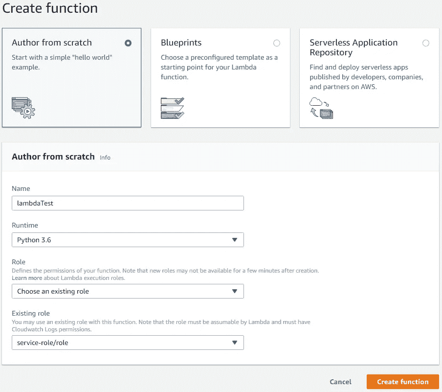
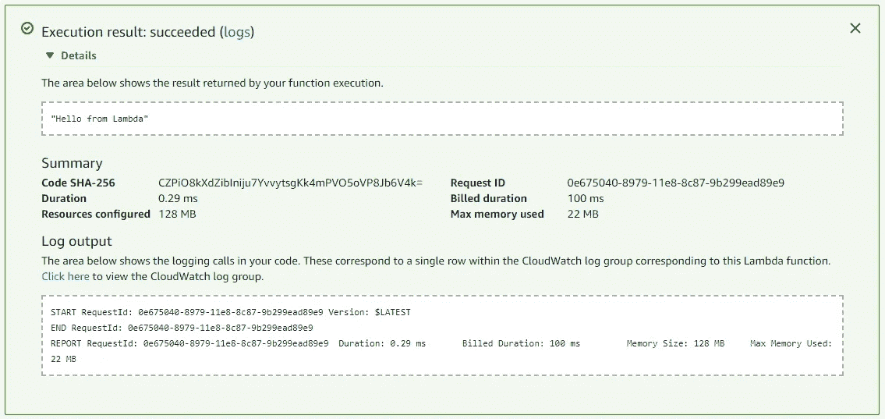
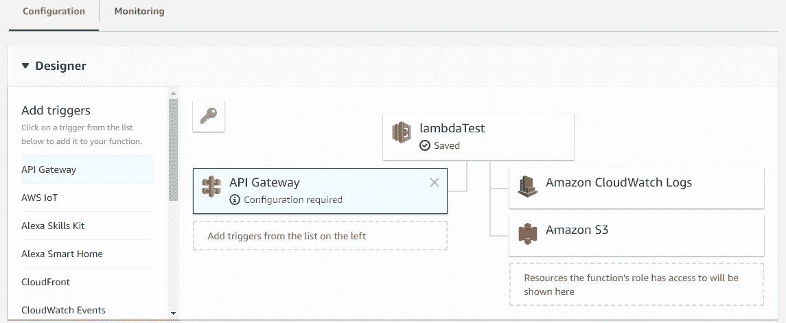
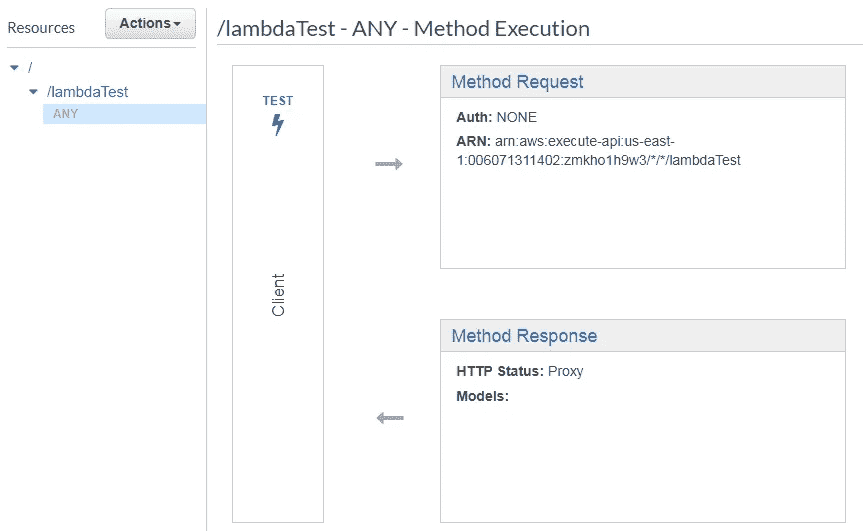
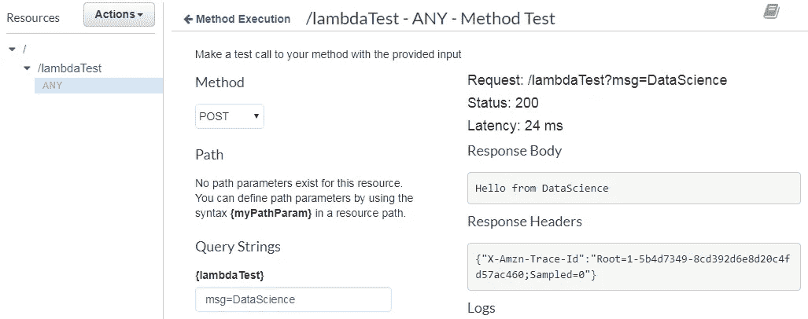

# 创业数据科学:模型服务

> 原文：<https://towardsdatascience.com/data-science-for-startups-model-services-2facf2dde81d?source=collection_archive---------3----------------------->


Source: maxpixel.net

*我的创业数据科学第二部分* [*系列*](/data-science-for-startups-introduction-80d022a18aec) *s 重点介绍*[*Python*](/data-science-for-startups-r-python-2ca2cd149c5c)*。*

为了让数据科学家在初创公司高效工作，他们需要能够构建其他团队可以使用的服务，或者产品可以直接使用的服务。例如，数据科学家不应该仅仅定义一个预测用户流失的模型，而应该能够建立一个端点，为玩家流失的可能性提供实时预测。本质上，目标是提供一个模型作为服务，或者产品可以直接使用的功能调用。

鉴于初创公司的规模较小，数据科学家能够在不需要工程支持的情况下站起来支持一个端点是很有用的。团队实现这一功能的方法之一是使用 AWS Lambda 或 GCP 的云服务。这些通常被称为无服务器计算，但另一种看待它们的方式是功能即服务。AWS lambda 等工具使数据科学团队能够建立面向客户的服务，同时最大限度地减少支持实时服务的开销。

在我的[模型生产](/data-science-for-startups-model-production-b14a29b2f920)帖子中，我介绍了这些服务的一些替代方法，其中讨论了如何使用 Jetty 将模型预测设置为 web 端点。这种方法的主要问题是，数据科学团队现在需要维护一个 web 服务器，这可能不是团队专业知识的一部分。我还讨论了使用 PubSub 进行接近实时的预测，但是这种方法不适合提供需要毫秒级延迟来生成预测的端点。

这种类型的功能提供亚毫秒级延迟的模型预测，可以归类为提供模型即服务。AWS lambda 提供了一种实现这些功能的好方法，但是确实需要一些设置来使用通用 ML 库。这篇文章的目的是展示如何使用 AWS lambda 来设置一个可以提供模型预测的端点。它可用于大多数可使用 pickle 序列化的 [scikit-learn](http://scikit-learn.org/) 型号。我首先讨论设置一个公开在开放 web 上的函数，然后展示如何将 sklearn 预测打包成函数。

这篇文章建立在我之前的文章中讨论的 AWS 设置之上。它假设您已经设置了一个 AWS 帐户，并分配了一个具有 S3 访问权限的角色。这篇教程的完整源代码可以在 [GitHub](https://github.com/bgweber/StartupDataScience/blob/master/ModelService/Lambda_Logit.ipynb) 上找到。

# 创建测试函数

AWS lambda 使团队能够编写服务或 web 客户端可以调用的功能，而无需设置任何基础设施。它被称为无服务器，因为团队专注于编写功能而不是构建系统。首先，我们将设置一个 Hello World 函数，该函数解析输入参数并将参数作为响应的一部分返回。对于本教程，我主要关注 web 请求，其中参数作为查询字符串的一部分输入，响应是一个 web 请求，请求体包含 html 内容。我们将首先设置一个测试功能，然后使用 API 网关将该功能暴露给开放的 web。

第一步是登录 AWS 控制台，然后深入 lambda 屏幕。首先，我们将使用 Python 3.6 和内联编辑器创建一个新函数，如下所示。



Creating our first lambda function

对于没有外部依赖的简单函数，您可以使用“内联编辑代码”功能直接在 AWS web 界面中创作 lambda 函数。对于更复杂的函数，我们需要在本地或 EC2 实例上编写代码，然后上传打包的函数。

创建并保存一个函数后，您应该能够使用“test”按钮来测试它。这将提示一个对话框，您可以在其中配置发送给该函数的参数，我们现在将其留空，但在下一步中进行修改。继续保存默认配置，然后单击“测试”。结果应该看起来像下面的对话框。



A successful run of the Hello World function.

该函数向控制台输出“Hello from Lambda ”,表明该函数调用成功。下一步，我们将希望在函数中使用参数，以便稍后我们可以将这些参数作为输入提供给模型。对于本教程，我们将使用附加到 web POST 命令的查询字符串参数，但是 lambda 可能有许多不同的配置。将服务放入 lambda 函数中是很常见的，这需要一种不同的方法来使用本文没有涉及的参数。

我们将对 AWS 定义的默认 Hello World 函数做一些修改。我添加了一个*事件*对象的打印语句，将*消息*参数附加到 Hello 语句的末尾，并修改了 return 语句以返回 web 响应而不是字符串。下面是我们新函数的代码:

```
def lambda_handler(event, context):
    print(event)    
    esult = 'Hello from ' + event['queryStringParameters']['msg']
    return {  "body": result }
```

如果您尝试运行这个代码块，您将会得到一个错误。该函数试图从查询字符串参数中检索 *msg* 参数，这将引发一个异常，因为它未被定义。为了调用这个函数，我们需要更新我们的测试事件来提供这个参数，如下所示:

```
{
  "queryStringParameters": { "msg": "Data Science for Startups!"}
}
```

如果您再次测试该函数，您现在将得到一个成功的响应:

```
{
  "body": "Hello from Data Science for Startups!"
}
```

我将响应包装为 web 响应，因为我们希望将函数开放给开放的 web，如果 return 语句只提供一个字符串，lambda 函数将不能用作 web 调用。

**设置 API 网关** 我们现在有了一个 lambda 函数，可以在我们的虚拟私有云(VPC)中使用，但不对 web 开放。为了将该函数设置为 web 调用，我们需要配置一个 API 网关，将该函数公开给开放的 web。有了 lambda，你可以在多个函数中使用同一个网关，在本文中，我们将在测试和预测模型函数中使用同一个网关。



Setting up an API Gateway

上图显示了为 lambda 函数添加 API 网关的 GUI。您需要为网关设置一些参数，以下是我用来配置我的设置的内容:

*   "创建新的 API "
*   API 名称:“暂存”
*   部署阶段:“准备阶段”
*   安全性:开放

一旦你设置了这些参数，你需要再次点击保存按钮。然后，您可以单击网关来配置您的设置，如下所示。



Configuring an API Gateway

AWS lambda 提供了几种在将功能部署到野外之前测试它们的方法。上图显示了您的函数在进行调用时将使用的组件的子集，单击“TEST”提供了一种通过网关测试该函数的方法。



Testing the API Gateway

我们现在可以模拟在 web 上调用该函数。选择“POST”作为方法，并设置 *msg* 参数来测试功能。当您点击 test 时，您应该会得到一个类似上面显示的对话框的结果。

既然我们已经测试了 API 网关，我们终于可以向全世界部署我们的功能了。点击“Actions”->“Deploy API”之后，您应该会看到一个对话框，其中列出了您的网关的 URL。如果您点击网关 URL，您将得到一个错误，因为您需要添加函数名和 *msg* 参数。下面是我的端点的 URL，以及如何从 web 上调用它:

```
**# API Url** [https://vkdefzqrb8.execute-api.us-east-1.amazonaws.com/staging](https://vkdefzqrb8.execute-api.us-east-1.amazonaws.com/staging)**# Useable endpoint** [https://vkdefzqrb8.execute-api.us-east-1.amazonaws.com/staging/lambdaTest?msg=TheWeb](https://vkdefzqrb8.execute-api.us-east-1.amazonaws.com/staging/lambdaTest?msg=TheWeb)
```

在所有这些设置之后，我们现在有了一个 lambda 函数，我们可以从开放的 web 上调用它。继续[尝试一下](https://vkdefzqrb8.execute-api.us-east-1.amazonaws.com/staging/lambdaTest?msg=TheWeb)！下一步是创建一个响应传入参数提供模型预测的函数。

## **使用 SKLearn**

如果你想使用外部库，比如在定义 lambda 函数时使用 sklearn，那么这个过程比我们刚刚讨论的要复杂一点。关键区别在于，您不能使用内联代码编辑器，而是需要设置一个目录，其中包含部署该函数所需的所有依赖项。下面是创建依赖外部库的 Python lambda 函数的一般过程:

1.  在本地机器(或 EC2 实例)上创建一个工作目录
2.  使用 *pip -t* 将库安装到这个目录
3.  将所有代码和资产添加到您的工作目录中
4.  将该目录的内容压缩到一个. Zip 文件中
5.  上传。压缩文件到 S3
6.  使用从 S3 上传的. zip 文件定义一个 lambda 函数

您可以在本地机器上完成这项工作，或者使用 EC2 实例来完成这项任务。由于我使用的是 Windows 笔记本电脑，我更喜欢 EC2 路线。我在之前关于 [Python](/data-science-for-startups-r-python-2ca2cd149c5c) 的帖子中讨论过 EC2 的设置。以下是我用来设置环境的步骤:

```
**# set up Python 3.6** sudo yum install -y python36
curl https://bootstrap.pypa.io/get-pip.py -o get-pip.py
sudo python36 get-pip.py
pip3 --version
```

下一步是在本地目录中建立外部库。通过以这种方式安装模块，您可以在定义 lambda 函数以创建模型预测时包含所有依赖项。我喜欢使用的一些库相当大(50MB+)，但是 lambda 现在毫无问题地支持这些库，最大可达 128MB。过去，你必须用一个[特殊设置](https://serverlesscode.com/post/deploy-scikitlearn-on-lamba/)来构建 scikit-learn，以满足 lambda 的有效载荷需求。

```
**# install dependencies to a target directory** mkdir classifier
pip3 install scipy -t classifier
pip3 install pandas -t classifier
pip3 install sklearn -t classifier
cd classifier
```

我们现在已经为 python 模型脚本设置了库。下一步是训练一个模型，我们将把它保存为 pickle 文件。我运行了下面的脚本来输出一个模型文件(logit.pkl ),我们将在 lambda 函数中使用它。

```
import pandas as pd
from sklearn.externals import joblib
from sklearn.linear_model import LogisticRegressiondf = pd.read_csv(
 "[https://github.com/bgweber/Twitch/raw/master/Recommendations/games-expand.csv](https://github.com/bgweber/Twitch/raw/master/Recommendations/games-expand.csv)")y_train = df['label']
x_train = df.drop(['label'], axis=1)model = LogisticRegression()
model.fit(x_train, y_train)joblib.dump(model, 'logit.pkl')
```

下一步是定义我们希望通过 lambda 公开的模型预测函数。我创建了一个新文件， [logit.py](https://github.com/bgweber/StartupDataScience/blob/master/ModelService/logit.py) ，其中包含了我们希望作为端点启用的预测函数:

```
from sklearn.externals import joblib
import pandas as pdmodel = joblib.load('logit.pkl')def lambda_handler(event, context):    
    p = event['queryStringParameters']
    print("Event params: " + str(p))
    x = pd.DataFrame.from_dict(p, orient='index').transpose()
    pred = model.predict_proba(x)[0][1] result = 'Prediction ' + str(pred)
    return {  "body": result }
```

在创建 zip 文件并通过 S3 上传之前，在本地测试代码也很有用。我使用这个片段来测试预测函数:

```
event = { 'queryStringParameters': {'G1':1, 'G2':0, 'G3':1, 'G4':1,
    'G5':0, 'G6':0, 'G7':1, 'G8':0, 'G9':1, 'G10':0 }}
lambda_handler(event, "")
```

我们现在有一个函数和环境设置，我们想上传到 lambda。我使用 zip 命令和 AWS CLI 将文件上传到 S3。要使用这个命令，首先需要运行`aws configure`。

```
zip -r logitFunction.zip .
aws s3 cp logit.zip s3://bucket/logitFunction.zip
```

我们现在有一个函数，我们已经测试并打包成 zip 文件发送到 S3。

**部署功能** 我们将遵循与之前相同的步骤来设置和部署该功能，其中有一个主要变化。我们现在将使用“从亚马逊 S3 上传文件”并选择我们的 zip 文件，而不是使用“内嵌代码编辑器”。我们还需要为函数指定一个入口点，它是文件名和函数名的组合。我用了: *logit.lambda_handler* 。

您可以使用与之前相同的步骤来测试该函数，但是我们需要包括更多的参数。该模型以 10 个参数作为输入:
G1 — G10。我更新了测试事件，以输入以下参数:

```
{ "queryStringParameters": {"G1":1, "G2":0, "G3":1, "G4":1,
    "G5":0, "G6":0, "G7":1, "G8":0, "G9":1, "G10":0 }
}
```

现在，调用该函数将返回模型预测结果:

```
{
  "body": "Prediction 0.10652960571858641"
}
```

最后一步是重用之前的 API 网关并部署 API。一旦一切都设置好了，您应该能够通过 API 调用模型，如下所示:

```
[https://vkdefzqrb8.execute-api.us-east-1.amazonaws.com/staging/logitModel?G1=1&G2=1&G3=1&G4=1&G5=1&G6=1&G7=1&G8=1&G9=1&G10=1](https://vkdefzqrb8.execute-api.us-east-1.amazonaws.com/staging/logitModel?G1=1&G2=1&G3=1&G4=1&G5=1&G6=1&G7=1&G8=1&G9=1&G10=1)
```

您还需要启用限制选项，以确保端点不会被滥用。我们现在已经设置了一个端点，可以在构建产品时使用。本教程将 lambda 函数设置为 web 端点，但是许多其他配置选项也是可能的。

## **结论**

能够将模型设置为不同服务或产品可以调用的端点是很有用的。预测模型可以直接在产品中使用，例如确定是否应该在移动游戏中向用户追加销售某个项目，或者通过其他服务使用，例如确定向用户分配哪个细分市场的实验平台。

本教程展示了如何使用 AWS lambda 部署用 scikit-learn 库构建的预测模型。由于该库提供了各种各样的预测模型，因此相同的配置可以用于许多不同的用例。lambda 和 GCP 上的云功能等服务的关键优势在于，它们以服务的形式提供功能。这意味着维护服务所需的运营开销最小。它们使数据科学团队能够部署可在产品中使用的端点。

这篇文章展示了如何使用一个火车模型，它被打包成上传的 zip 文件的一部分。常用的扩展之一是从 S3 读取模型文件，这样就可以部署新的模型，而不需要重新部署 API 网关。

本·韦伯是 Zynga 的首席数据科学家。我们正在[招聘](https://www.zynga.com/careers/positions/categories/data-analytics-user-research)！