# 创业公司的数据科学:预测建模

> 原文：<https://towardsdatascience.com/data-science-for-startups-predictive-modeling-ec88ba8350e9?source=collection_archive---------4----------------------->


Source: Aichi8Seiran at pixabay.com

我正在进行的关于在创业公司建立数据科学学科系列的第六部分。你可以在 [*简介*](/data-science-for-startups-introduction-80d022a18aec) *中找到所有帖子的链接，还有一本基于这个系列的关于* [*亚马逊*](https://www.amazon.com/dp/1983057975) *的书。*

机器学习可以用来预测未来。您提供一个包含定型实例集合的模型，使该模型适合此数据集，然后将该模型应用于新实例以进行预测。预测建模对初创公司很有用，因为你可以制造基于预期用户行为的产品。例如，如果观众一直在观看流媒体服务上的同一家广播公司，应用程序可以在启动时加载该频道。预测模型也可以用于构建数据产品，例如可以向观众推荐新广播公司的推荐系统。

这篇文章简单介绍了机器学习的预测建模。我将讨论不同类型的预测问题，介绍一些常用的方法，介绍使用开放工具和脚本语言构建模型的方法，并提供一个聚类的应用示例。这篇文章的目标不是提供对具体方法的深入理解，而是展示如何使用各种工具快速构建不同类型的模型。

## 预测模型的类型

机器学习模型通常分为两类:监督学习和非监督学习。对于监督问题，用于拟合模型的数据具有指定的标签或目标变量。比如，如果目标是识别一款手游中哪些用户有可能成为购买者，我们可以用过往用户的交易数据作为标签，其中 1 表示付费用户，0 表示免费用户。标签用作监督算法的输入，以在将模型拟合到训练数据集时提供反馈。分类和回归算法是监督学习的两种类型。在分类任务中，目标是预测结果的可能性，例如移动游戏用户是否会购买。对于回归来说，目标是预测一个连续变量，例如给定不同特征描述的房屋价格。

对于无监督的问题，没有为训练模型提供显式标签。最常见的无监督学习方法是聚类，它通过在数据集中形成不同实例的组来推断标签。聚类有助于回答细分问题，例如产品应该支持哪些不同的用户原型。

还有另外两类机器学习模型我就不在这里讨论了:半监督学习和强化学习。半监督学习是一种识别目标标签的过程，作为训练过程的一部分，通常用深度学习中的自动编码器来实现。强化学习是基于奖励策略更新的模型，其中模型采取的行动提供正面和负面的反馈信号，并用于更新模型。

对于一家初创公司，你可能会从分类和回归模型开始，这通常被称为经典或浅层机器学习问题。有很多种不同的方法可以使用。一些常见的分类方法是逻辑回归、朴素贝叶斯、决策树和集成方法，如随机森林和 XGBoost。常见的回归方法包括许多与分类相同的方法，但线性回归用于代替逻辑回归。十年前我读研究生时，支持向量机很流行，但现在 XGBoost 似乎是浅层学习问题之王。

了解不同的算法是如何实现的很重要，因为如果你想将预测模型作为产品的一部分，它需要是可靠的和可伸缩的。通常，在运送产品时，渴望型模型比懒惰型模型更受青睐。急切模型是在训练过程中生成规则集的方法，如线性回归模型中的系数，而懒惰模型在运行时生成规则集。例如，最近邻(k-NN)模型是一种懒惰的方法。惰性方法通常对构建在线学习系统有用，在这种系统中，模型在部署时会频繁地用新数据更新，但可能存在可伸缩性问题。

如何评估预测模型的性能取决于所执行问题的类型。例如，平均绝对误差(MAE)、均方根误差(RMSE)和相关系数等指标可用于评估回归模型，而 ROC 曲线下面积(AUC)、精度、召回率和提升率可用于分类问题。

## 训练分类模型

本节介绍了几种不同的方法，可用于构建分类模型。我们将使用与 EDA 上的过去帖子相同的数据集，但不是在出生率数据集中预测出生体重，而是试图预测哪些怀孕将导致双胞胎而不是单胎。

首先，我们需要在本地提取一个数据集，作为不同工具的输入。下面的 R 代码展示了如何对 100k 次怀孕进行采样并将数据帧保存到 CSV 文件中。这个查询类似于上一篇文章中的查询，但是我在 where 子句中加入了额外的约束，以避免提取缺少(NA)值的记录。

```
library(bigrquery)
project <- "your_project_id"
options(stringsAsFactors = FALSE)sql <- "SELECT year, mother_age, father_age, gestation_weeks
 ,case when ever_born > 0 then ever_born else 0 end as ever_born
 ,case when mother_married then 1 else 0 end as mother_married
 ,weight_pounds
 ,case when plurality = 2 then 1 else 0 end as label
FROM `bigquery-public-data.samples.natality`
where plurality in (1, 2) and gestation_weeks between 1 and 90
  and weight_pounds between 1 and 20
order by rand() 
LIMIT 100000"df <- query_exec(sql, project = project, use_legacy_sql = FALSE)
write.csv(df, "natality.csv", row.names = FALSE)
```

这个数据集的一个挑战是，这个数据集中的反面例子比正面例子多得多。在抽样数据集中，只有 2.4%的怀孕有“1”的标签，表明是双胞胎。这意味着我们需要使用除准确性之外的指标来衡量不同方法的性能。对于像这样的大类不平衡问题，准确性不是一个好的度量，因为预测每个记录的标签为 0 会导致 97.6%的准确性。相反，我们将使用 AUC 曲线度量来评估不同的模型，因为它对于处理不平衡类的问题很有用。

评估不同模型时的另一个考虑是使用不同的定型、测试和维持数据集。维持数据集保留到模型定型过程结束，并且仅用于一次评估。在构建和调整模型时，可以根据需要频繁使用训练和测试数据集。10 重交叉验证等方法对于构建模型性能的稳健估计非常有用。这是我在构建模型时通常采用的方法，但是为了简洁起见，并没有在下面所有不同的例子中涉及到。

**Weka** 我喜欢用来探索性分析和评估不同建模算法的工具之一是 [Weka](https://www.cs.waikato.ac.nz/ml/weka/) ，它是用 Java 实现的，提供了一个探索不同模型的 GUI。现在它有点过时了，但我仍然发现它对于快速挖掘数据集并确定是否有很多信号可用于预测结果非常有用。

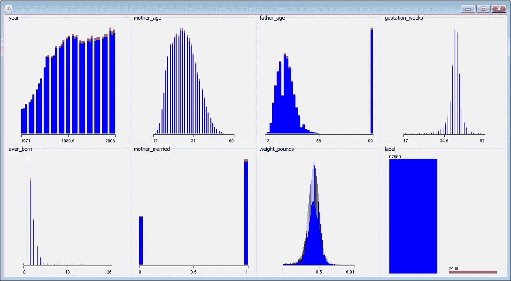

Visualizing different features in the data set with Weka.

上图显示了数据集中不同特征的可视化效果。红色数据点代表正例(双胞胎)，蓝色数据点代表负例(单胎)。对于具有强信号的特征，通常可以画一条垂直线来分隔大部分红色和蓝色数据点。这个数据集就不是这样了，我们需要结合不同的特征来构建一个好的分类器。

我使用 Weka 研究了以下算法，并在使用 10 重交叉验证时计算了 AUC 指标:

*   **逻辑:** 0.892
*   **朴素贝叶斯:** 0.893
*   **LogitBoost:** 0.908

在我研究的算法中，性能最好的算法是 LogitBoost。该算法具有多个超参数，例如迭代次数，可以对其进行调整以进一步提高模型的性能。Weka 中可能有其他算法在这个数据集上工作得更好，但我们最初的探索已经产生了有希望的结果。

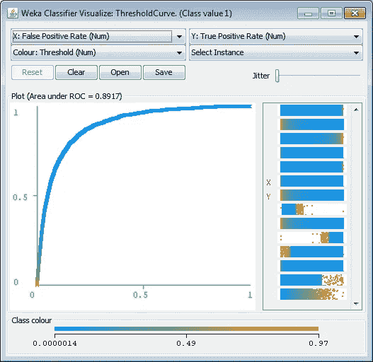

Visualizing the ROC Curve with Weka

上图显示了逻辑回归模型的 ROC 曲线。使用 Weka 还可以探索逻辑回归模型中不同特征的重要性。您可以直接检查模型的系数。比如*体重 _ 磅*的系数值最高，为 0.93。还可以使用 InfoGain 属性排名器来确定哪些特征对分类任务最重要。Weka 发现体重 _ 磅(0.0415)是最有影响力的特征，其次是妊娠 _ 周(0.0243)。

Weka 通常不是产品化模型的最佳选择，但它确实为探索各种不同的算法提供了一个有用的工具。

**BigML** 我在创业经历中用过的另一个工具是 [BigML](https://bigml.com/) 。这个工具类似于 Weka，因为它提供了一个 GUI(基于 web 的),用于探索不同类型的模型，而不需要任何编码。该工具的选项比 Weka 少，但有更新的模型，如 DeepNets。

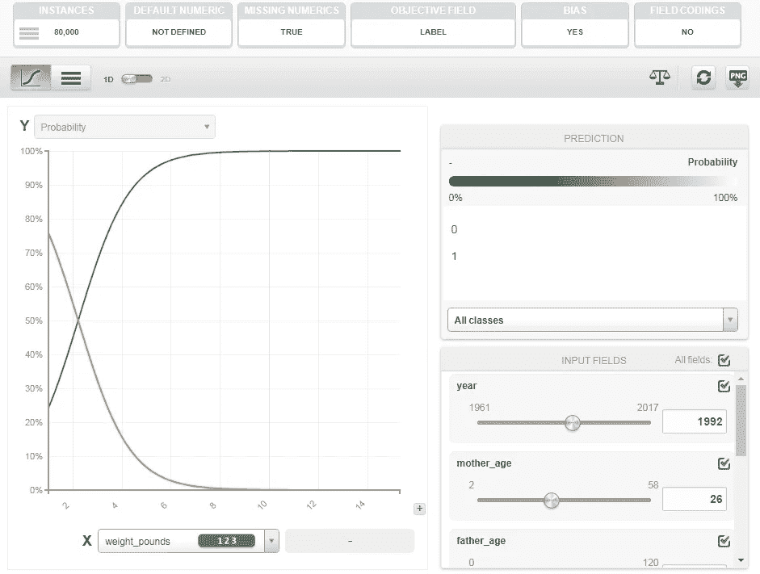

Evaluating Feature Importance in a Logistic Model with BigML

上图展示了 BigML 提供的一个特性重要性工具。这些工具有助于了解哪些特征有助于预测结果。我用 BigML 研究了两种不同的模型，得出了以下 AUC 指标:

*   **逻辑:** 0.890
*   DeepNet: 0.902

我没有使用 10 倍交叉验证，而是使用一个 80/20 的数据分割来评估不同的模型。BigML 中模型的性能与 Weka 相似，但与 LogitBoost 的性能不太匹配。

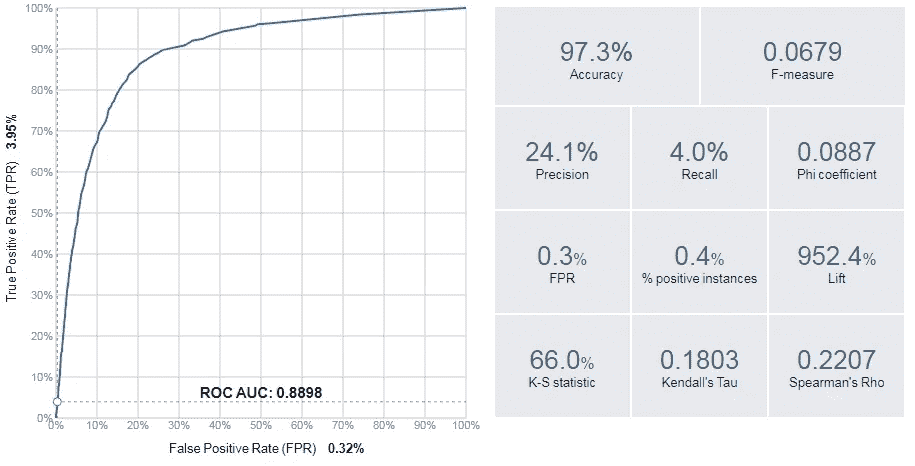

Evaluation Metrics provided by BigML

除了绘制 ROC 曲线，如上所示，BigML 还可以绘制其他有用的可视化图形，如提升图。BigML 还提供了有用的分类指标，比如精度、召回率和 F1 分数。

**R — Glmnet** 我们可以使用 R 中的 glm 库实现我们已经评估过的逻辑回归模型。通过指定二项式族作为输入，可以将广义线性模型函数应用于逻辑回归。加载 CSV 并训练逻辑回归模型的 r 代码如下所示。

```
df <- read.csv("Natality.csv")
fit <- glm(label ~ .,family=binomial(),data=df)
fitlibrary(Deducer)
rocplot(fit)
```

拟合模型后， *fit* 语句输出模型的系数。为了评估模型的性能，我使用了包含 rocplot 函数的演绎库。对于这个基本的模型拟合方法，我没有进行任何交叉验证。结果是训练数据集的 AUC 为 0.890。

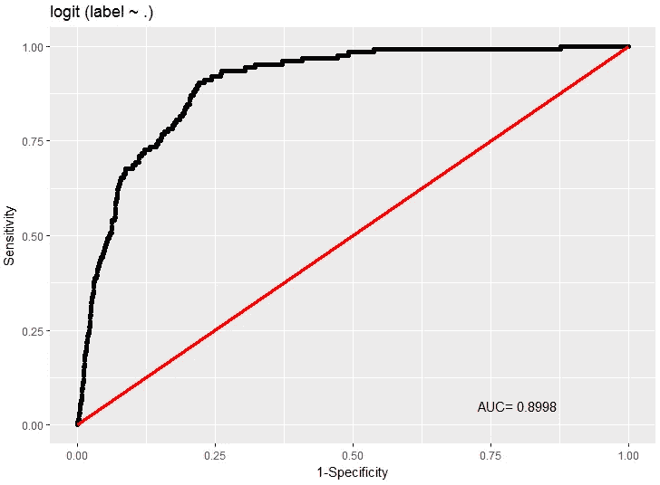

ROC Curve for the logistic regression model in R.

为了在拟合 R 中的逻辑回归模型时使用正则化，我们可以使用 glmnet 库，它提供了 lasso 和 ridge 回归。下面的代码显示了一个使用这个包来评估特性重要性的例子:

```
library(glmnet)
x <- sparse.model.matrix(label ~ ., data = df)
y <- as.factor(df$label)fit = glmnet(x, y, family = "binomial")
plot(fit, xvar = "dev", label = TRUE)
```

默认情况下，使用“最小二乘法”模型来拟合训练数据。下图显示了模型的系数如何随着其他因素用作模型的输入而变化。最初，只有 weight_pounds 要素被用作输入。一旦这一项开始变得不利，大约值为-0.6，就要考虑模型的附加特征。

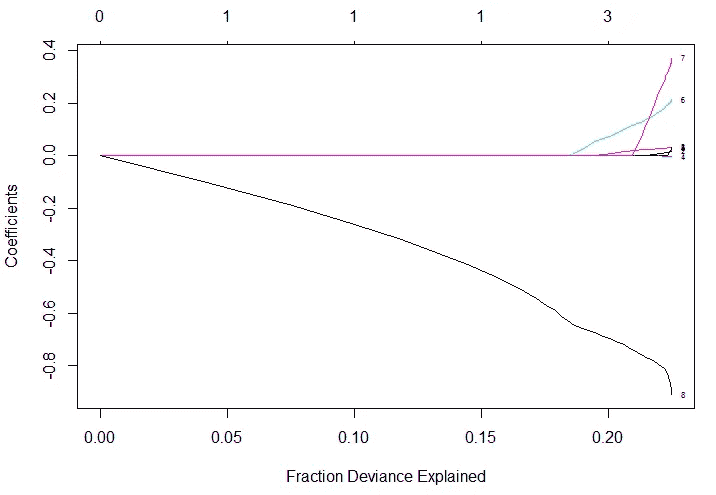

Feature weights based on different lambda values for glmnet.

```
cvfit = cv.glmnet(x, y, family = "binomial", type.measure = "auc")
cat(paste("ROC:", max(cvfit$cvlo)))
plot(cvfit)
```

glmnet 包提供了内置的交叉验证功能，可用于优化不同的指标，如 AUC。上面的 R 代码显示了如何使用这个特性训练一个逻辑回归模型，并在下图中绘制了结果。正则化逻辑回归模型的 AUC 度量是 0.893。

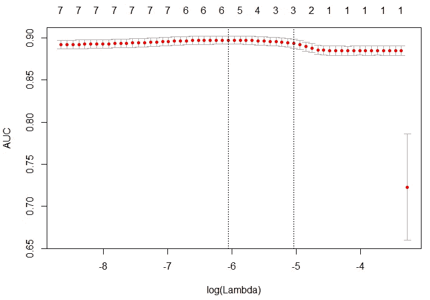

Performance (AUC) of the glmnet model based on different lambda values.

**Python-scikit-learn** 我想在本节介绍的另一个工具是 sci kit-learn，因为它提供了一种探索不同类型模型准确性的标准化方法。到目前为止，我一直专注于模型拟合和 EDA 的 R，但是通过 scikit-learn 获得的 Python 工具非常有用。

```
**# load the data set** import pandas as pd
df = pd.read_csv('./Natality.csv')**# build a random forest classifier** from sklearn.ensemble import RandomForestClassifier
rf = RandomForestClassifier()
x = df.drop('label', axis=1)
y = df['label']
rf.fit(x, y)**# evaluate the results** from sklearn.metrics import roc_curve, auc
false_positive_rate, true_positive_rate, _ = roc_curve(y, rf.predict(x))
roc_auc = auc(false_positive_rate, true_positive_rate)**# plot the curve** import matplotlib.pyplot as plt
plt.plot(false_positive_rate, true_positive_rate, 
    'b', label='AUC = %0.2f'% roc_auc)
plt.legend(loc='lower right')
plt.show()
```

上面的 Python 代码显示了如何使用 pandas 读取数据框，使用 sklearn 拟合随机森林模型，评估模型的性能，并绘制结果，如下图所示。对于这个模型，我在评估模型时没有应用任何交叉验证。使用 scikit-learn 的好处之一是 fit 和 score 函数在不同的算法中是一致的，这使得探索不同的选项变得很简单。

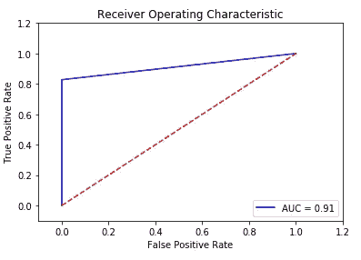

ROC Curve for the Random Forest model in scikit-learn

## **集群**

对初创公司有用的分析类型之一是了解是否有不同的细分市场或用户群。这类工作的一般方法是首先识别数据中的聚类，为这些聚类分配标签，然后根据带标签的聚类为新记录分配标签。本节展示了如何使用 2016 年美联储[消费者金融调查](https://www.federalreserve.gov/econres/scfindex.htm)的数据来执行这种类型的过程。

该调查数据集提供了美国成千上万个家庭的资产明细。这种聚类分析的目的是确定是否存在不同类型的净资产超过 100 万美元的富裕家庭。加载数据和执行分析的完整代码在本 [Jupyter 笔记本](https://github.com/bgweber/WindfallData/blob/master/FED_Reserve_Survey.ipynb)中提供。在这篇[博客文章](https://medium.freecodecamp.org/clustering-the-top-1-asset-analysis-in-r-6c529b382b42)中介绍了之前对该数据集的分析。

对于每一个被调查的家庭，我们都有许多列来说明如何为该家庭分配资产，包括住宅和商业房地产、企业股权、退休金和许多其他资产。我们要做的第一件事是确定哪些资产具有对用户进行聚类的强信号。我们可以使用 PCA 和因子图来实现这个目标:

```
**# filter on affluent households, and print the total number**
affluent <- households[households$netWorth >= 1000000, ]
cat(paste("Affluent Households: ", floor(sum(affluent$weight))))**# plot a Factor Map of assets** 
fviz_pca_var(PCA(affluent,  graph = FALSE), col.var="contrib",    
  gradient.cols = c("#00AFBB", "#E7B800", "#FC4E07"), repel = TRUE)+
  labs(title ="Affluent Households - Assets Factor Map")
```

下图显示了富裕家庭中不同的资产类别。最重要的因素是企业权益。其他一些因素包括投资资产(股票、债券)和房地产资产/退休基金。

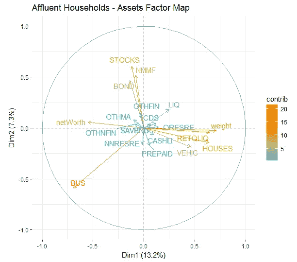

A factor map showing differences in asset allocations.

要使用多少个集群？
我们现在已经有迹象表明，百万富翁有不同的类型，资产也因净资产的不同而不同。为了理解资产配置如何因净值部分而不同，我们可以使用聚类分析。我们首先识别富裕调查受访者中的聚类，然后将这些标签应用于调查受访者的总体人口。

```
k <- 7
res.hc <- eclust(households[sample(nrow(households), 1000), ],
  "hclust", k = k, graph = FALSE) 
fviz_dend(res.hc, rect = TRUE, show_labels = FALSE)
```

为了确定使用多少个集群，我使用上面的代码片段创建了一个集群树图。结果如下图所示。我还改变了集群的数量， *k* ，直到我们有了最大数量的可清楚识别的集群。

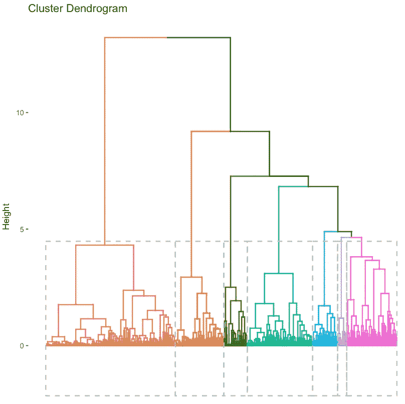

A hierarchical visualization of the cluster assignments.

如果您更喜欢采用定量方法，您可以使用 *fviz_nbclust* 函数，该函数使用轮廓度量计算最佳聚类数。对于我们的分析，我们决定使用 7 个集群。

```
clarax <- clara(affluent, k)
fviz_cluster(clarax, stand = FALSE, geom = "point", ellipse = F)
```

为了将富裕家庭分成独特的群体，我使用了克拉拉算法。不同集群的可视化如下所示。结果类似于上面讨论的 PCA 和因子图方法。


A visualization of the two-principal components identified by PCA.

**聚类描述** 既然我们已经确定了要使用多少个聚类，那么检查这些聚类并根据特征集分配定性标签是很有用的。下面的代码片段显示了如何计算 7 个不同分类的平均特征值。

```
groups <- clarax$clustering
results <- as.data.frame(t(aggregate(affluent,list(groups),mean)))  
results[2:18,]
```

该代码块的结果如下所示。基于这些结果，我们提出了以下集群描述:

*   V1:股票/债券——占资产的 31%,其次是家庭基金和共同基金
*   V2:多元化——53%的商业股权，10%的房产和 9%的其他房地产
*   V3:住宅房地产——占资产的 48%
*   V4:共同基金——资产的 50%
*   V5:退休— 48%的资产
*   V6:企业权益— 85%的资产
*   V7:商业房地产——59%的资产

除了仅包含 3%人口的星团 V7 之外，大多数星团的大小相对均匀。第二小的聚类代表人口的 12%,而最大的聚类代表 20%。您可以使用 *table(groups)* 来显示未加权的集群人口规模。

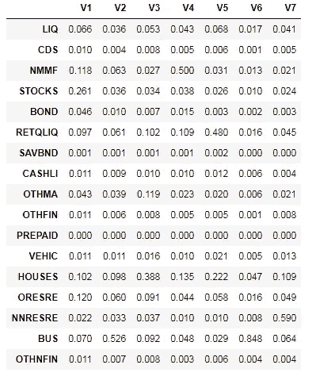

Asset allocation amounts for the 7-identified clusters.

**按净值段对人群进行聚类** 该分析的最后一步是对总体人群应用不同的聚类分配，并按净值段对人群进行分组。因为我们只对富裕家庭进行聚类训练，所以我们需要使用分类算法来标记人口中的非富裕家庭。下面的代码片段使用 *knn* 来完成这项任务。剩余的代码块计算每个净值段被分类为每个聚类的家庭数量。

```
**# assign all of the households to a cluster** groups <- knn(train = affluent, test = households, 
  cl = clarax$clustering, k = k, prob = T, use.all = T)**# figure out how many households are in each cluster** clusters <- data.frame(
  c1 = ifelse(groups == 1, weights, 0), 
  ... 
  c7 = ifelse(groups == 7, weights, 0) 
)**# assign each household to a net worth cluster** nw <- floor(2*log10(nwHouseholds))/2
results <- as.data.frame(t(aggregate(clusters,list(nw),sum)))**# compute the number of households that belong to each segment**
results$V1 <- results$V1/sum(ifelse(nw == 4, weights, 0))
...
results$V11 <- results$V11/sum(ifelse(nw == 9, weights, 0))**# plot the results** plot <- plot_ly(results, x = ~10^Group.1, y = ~100*c1, type = 'scatter', mode = 'lines', name = "Stocks") %>%
  add_trace(y = ~100*c2, name = "Diversified") %>%
  ...
  add_trace(y = ~100*c7, name = "Commercial R.E.") %>%
  layout(yaxis = list(title = '% of Households', ticksuffix = "%"),
     xaxis = list(title = "Net Worth ($)", type = "log"), 
     title  = "Cluster Populations by Net Worth")
```

这一过程的结果如下图所示。图表显示了一些明显和新颖的结果:房屋所有权和退休基金构成了非富裕家庭的大部分资产，2M 美元(不包括商业房地产和商业股权)附近的资产组合相对均匀，商业股权主导了超富裕家庭的净资产，其次是其他投资资产。

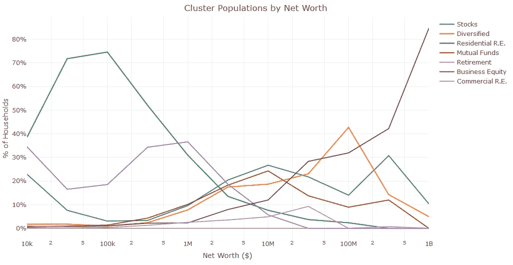

How the distribution of clusters varies based on Household Net Worth.

对于这个聚类示例，我研究了调查数据并确定了七种不同类型的富裕家庭。然后，我使用这些聚类为剩余的家庭分配标签。类似的方法可以在创业时使用，以将细分标签分配给用户群。

# 结论

预测建模是机器学习的一种应用，具有各种各样的工具，可用于入门。建立预测模型时，首先要考虑的事情之一是确定您试图预测的结果，并建立用于衡量成功的指标。

在这篇文章中，我展示了四种不同的方法来建立预测怀孕期间双胞胎的分类模型。我展示了如何使用基于 GUI 的工具 Weka 和 BigML 来评估逻辑回归模型、集成模型和深度网络。我还编写了用 R 执行正则化逻辑回归和用 Python 执行随机森林的脚本示例。我用一个集群的例子结束了这篇文章，这对于执行创业公司的细分任务可能是有用的。

独立于用于构建预测模型的方法，能够输出模型规格作为训练过程的结果是很重要的。这可以是线性回归模型的系数权重列表，随机森林模型的节点和权重列表，或者深度学习网络的神经元权重和激活列表。在下一篇帖子中，我将讨论如何将预测模型扩展到数百万用户，并且能够将训练好的模型表示为规范是生产的先决条件。