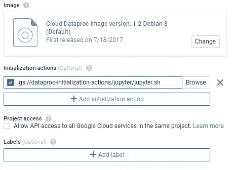
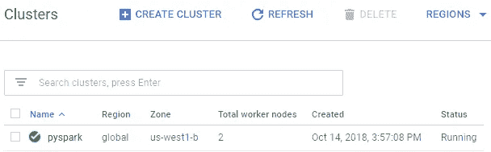
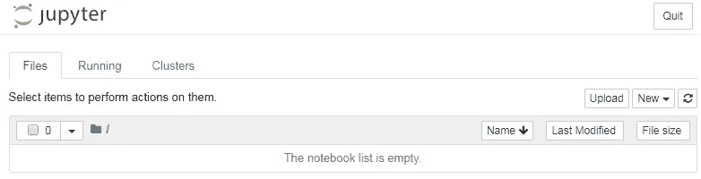
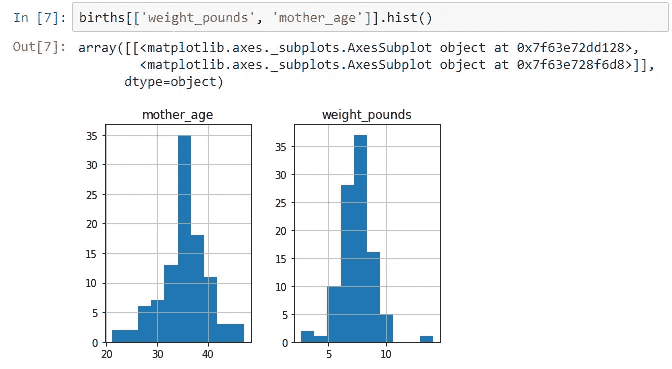

# 创业数据科学:PySpark

> 原文：<https://towardsdatascience.com/data-science-for-startups-pyspark-1acf51e9d6ba?source=collection_archive---------12----------------------->


Source:Wikimedia Commons

*我的创业数据科学第三部* [*系列*](/data-science-for-startups-introduction-80d022a18aec) *s 现在重点介绍*[*Python*](/data-science-for-startups-r-python-2ca2cd149c5c)*。*

Spark 是一个很好的工具，可以让数据科学家将研究代码转化为生产代码，PySpark 使这种环境更容易访问。虽然我一直是谷歌用于产品化模型的云数据流的粉丝，但它缺乏一个易于原型化和部署数据科学模型的交互环境。Spark 对于初创公司来说是一个很好的工具，因为它既提供了执行分析的交互式环境，又提供了将模型投入生产的可伸缩性。这篇文章讨论了如何在 GCP 上启动集群并连接到 Jupyter，以便在笔记本环境中使用 Spark。

有各种不同的生态系统可用于与 Spark 合作，从自托管到供应商选项。以下是我过去探索过的一些 Spark 选项:

1.  阿帕奇安巴里+阿帕奇齐柏林
2.  GCP DataProc + Jupyter
3.  AWS EMR + SageMaker
4.  供应商:DataBricks、Cloudera

除了 SageMaker 之外，所有这些设置我都亲自操作过。在与大型企业合作时，我更喜欢供应商解决方案，但初创公司可能希望避免这种选择。最佳方法取决于您需要处理多少数据，您预计您的公司将增长多少，以及您需要用该基础架构支持多少数据科学家。

这篇文章的目标是展示如何尽快使用 PySpark 的云解决方案。我决定使用 GCP，因为该平台提供免费积分，并且进入笔记本环境是微不足道的。下面的帖子是 GCP 星火计划的一个很好的起点:

[](https://cloud.google.com/blog/products/gcp/google-cloud-platform-for-data-scientists-using-jupyter-notebooks-with-apache-spark-on-google-cloud) [## 数据科学家的谷歌云平台:在谷歌上使用带有 Apache Spark 的 Jupyter 笔记本…

### 结合使用 Jupyter 笔记本电脑和 GCP，您将获得熟悉的数据科学体验，而不会有乏味的…

cloud.google.com](https://cloud.google.com/blog/products/gcp/google-cloud-platform-for-data-scientists-using-jupyter-notebooks-with-apache-spark-on-google-cloud) 

这个例子的完整源代码可以在 [GitHub](https://github.com/bgweber/StartupDataScience/blob/master/Spark/PySpark_Natality.ipynb) 上找到。

## **设置**

首先，我们需要设置一个集群，我们将用 Jupyter 连接到这个集群。我们将使用大多数默认设置，即创建一个包含一个主节点和两个工作节点的集群。我们将指定的一个初始化步骤是运行位于 Google Storage 上的一个[脚本](https://console.cloud.google.com/storage/browser/dataproc-initialization-actions/jupyter?prefix=jupyter.sh&project=gameanalytics-199018)，它为集群设置 Jupyter。

1.  从 GCP 控制台，选择汉堡菜单，然后选择“DataProc”
2.  从 DataProc 中，选择“创建集群”
3.  分配一个集群名:“pyspark”
4.  单击“高级选项”，然后单击“添加初始化选项”
5.  添加如下命令(如下所示):
    GS://data proc-initial ization-actions/jupyter/jupyter . sh
6.  点击“开始”



Adding the Jupyter initialization step.

群集将需要几分钟的时间来启动。准备就绪后，状态将从“正在调配”变为“正在运行”。在开始使用 Jupyter 之前，我们需要为集群设置连接规则。推荐的方法是设置 SSH 隧道，如这里的所述。为了快速启动并运行，我们将修改防火墙以接受来自特定 IP 的连接。



The initialized Spark cluster.

要修改防火墙以接受来自您的计算机的连接:

1.  点击集群“pyspark”
2.  单击“虚拟机实例”
3.  对于“pyspark-m ”,单击 3 个垂直点，然后单击“查看网络详细信息”
4.  从左侧，选择“防火墙规则”
5.  选择“创建防火墙规则”
6.  对规则使用以下设置
    -名称:jupyter
    -目标标签:http-服务器
    -源 IP 范围:您的 v4 IP
    - tcp: 8123(脚本在此端口上设置 jupyter)
7.  点击“创建”

现在您应该能够测试到您的 DataProc 集群的连接了。浏览回“VM Instances”并单击“pyspark-m”以获取集群的外部 IP。然后点击“编辑”，启用“允许 HTTP 流量”，然后“保存”。将“:8123”附加到集群外部 IP 的末尾，并将结果粘贴到您的浏览器中。您应该会看到 Jupyter，如下所示。



Jupyter set up for GCP DataProc.

我们现在已经为 PySpark 的云部署设置了 Jupyter 笔记本！

## **PySpark**

设置好 Jupyter 环境后，您可以通过选择“新建”然后选择“PySpark”来创建新笔记本。虽然已经安装了一些常用库，如 *matplotlib* 和 *numpy* ，但是您可能希望通过 pip 添加额外的库。我们可以直接在笔记本上完成:

```
!pip install --upgrade  pandas
!pip install --upgrade  pandas_gbq
!pip install --upgrade  pyspark
```

上面的代码片段在集群上安装 Pandas，以及 Pandas 的 BigQuery 连接器和 PySpark，我们将使用 py Spark 来获取对 Spark 上下文的引用。我们将遵循 [GCP 的例子](https://cloud.google.com/blog/products/gcp/google-cloud-platform-for-data-scientists-using-jupyter-notebooks-with-apache-spark-on-google-cloud)，从将数据从 BigQuery 拉入 Pandas 数据帧开始。此时，我们实际上并没有利用 Spark 的功能，因为使用 Pandas 需要将所有数据加载到驱动程序节点的内存中。但这是在担心 Spark 的一些复杂性之前快速启动和运行的一种方式。

下面的代码片段显示了如何在 BigQuery 上运行查询，并将结果拉入驱动程序节点上的 Pandas 数据帧。当处理较大的数据集时，应该使用 [BigQuery 连接器](https://cloud.google.com/dataproc/docs/concepts/connectors/bigquery)以 Spark 数据帧而不是 Pandas 数据帧的形式返回结果。

```
from pandas.io import gbqproject_id = "your-project_id"
query = """
    SELECT * 
    FROM `bigquery-public-data.samples.natality` 
    limit 10000
"""births = gbq.read_gbq(query=query, dialect ='standard', project_id=project_id)
births.head()
```

因为我们将结果作为熊猫数据帧返回，所以我们可以使用 *hist* 函数来绘制不同属性的分布。下图显示了出生体重和母亲年龄的分布。



Histograms of different attributes in the data set.

为了充分利用 Spark 的分布式计算能力，在使用 PySpark 时最好避免使用 Pandas。这意味着避免 *toPandas()* ，直接将数据加载到 Spark 而不是 Pandas 数据帧中。然而，[Pandas UDF](https://databricks.com/blog/2017/10/30/introducing-vectorized-udfs-for-pyspark.html)是在 Spark 环境中使用 Pandas 的一种很好的方式，但是调试起来很有挑战性。

首先，我们将展示如何从 Pandas 数据帧转换到 Spark 数据帧。关键的区别在于 Spark 数据帧是延迟评估的，并且分布在集群中，这意味着在需要计算结果之前不执行任何操作。当使用 Pandas 数据帧时，所有的操作都以一种急切的模式执行，并被立即拉入内存，即使结果在后面的步骤中不被使用。在使用 Spark 数据帧之前，我们首先需要获得对 Spark 上下文的引用，如下面的代码片段所示。一旦获得，我们可以用它来转换从熊猫到火花数据帧。

```
from pyspark.context import SparkContext
from pyspark.sql.session import SparkSession# Get a reference to the Spark Session 
sc = SparkContext()
spark = SparkSession(sc)# convert from Pandas to Spark 
sparkDF = spark.createDataFrame(births)# perform an operation on the DataFrame
print(sparkDF.count())# DataFrame head 
sparkDF.show(n=5)
```

许多 Spark 操作类似于 Pandas 操作，但是执行流程有很大的不同。上例显示了如何使用*显示*功能执行与*头*操作类似的结果。Spark 的主要好处是执行是分布式的和懒惰的，从而产生可伸缩的管道。

## 结论

Spark 是构建数据管道的强大工具，PySpark 使这个生态系统更容易访问。虽然使用 spark 有多种选择，但本文主要关注如何使用 GCP 的 DataProc 和一个 Jupyter 初始化脚本来快速交互式访问 Spark 集群。有效地使用 PySpark 需要重新学习许多在 Python 中执行数据科学的标准方法，但结果是大规模可扩展的数据管道和分析。

本·韦伯是 Zynga 的首席数据科学家。我们正在[招聘](https://www.zynga.com/careers/positions/categories)！