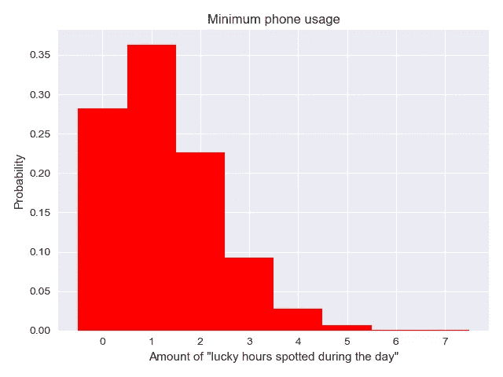
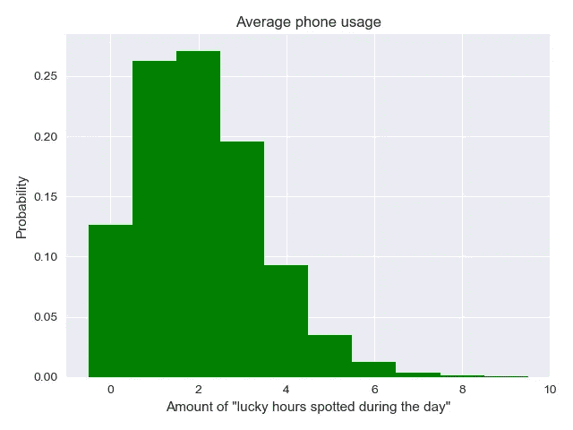
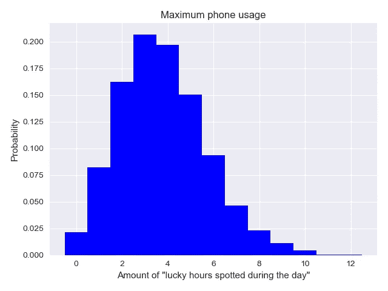

# 数据科学在行动:用统计学解释心理学

> 原文：<https://towardsdatascience.com/data-science-in-action-explaining-psychology-using-statistics-be21abf912fb?source=collection_archive---------12----------------------->


Photo by [Riccardo Chiarini](https://unsplash.com/photos/2VDa8bnLM8c?utm_source=unsplash&utm_medium=referral&utm_content=creditCopyText) on [Unsplash](https://unsplash.com/search/photos/nature?utm_source=unsplash&utm_medium=referral&utm_content=creditCopyText)

## 是的，使用正确的方法，我们可以获得很多真知灼见

想象一下，你正在淋浴，享受热水，你可以听到远处另一个房间的手机铃声。想象一下，下车，擦干身体，头还湿着跑步，几秒钟后当对方挂断电话时拿起电话。多么重大的事件。它一定会留在你的记忆中。不会停留的是你正在洗澡，享受着水，想着“嘿，电话没响”。不会留在你记忆中的是一天中你的电话响了很多次，而你没有在洗澡。

我猜，你肯定收到过你朋友的来信，或者对自己说过“每次我洗澡的时候电话都会响”，“我的公交车总是晚点”，“我写文章的时候总有人给我发信息”(刚刚发生在:D)。这些片面的事件对我们自己产生了巨大的影响。我们倾向于相信预言性的梦，我们倾向于重视罕见但随机的事件，这没关系。因为这是我们大脑的工作方式，这是认知过程。我们把熟悉的面孔放进梦里，随机事件无时无刻不在发生——我们只需要认识到这一点，并更加小心地做出判断。很多事情都可以用自然的手段来解释。但是让我们面对现实——如果有人做了一个梦，梦见明天他们的狗会死，他们的宠物真的会死，我不会说服这个人。即使告诉你狗不是永生的，它们可能会死，这只狗也有可能在你做这个梦的某一天死去。

但是如果我们稍微修改一下这种体验。想象一下，你做了一个关于你的狗死了的噩梦后醒来，你迅速站起来，去查看它，发现你的毛绒绒的伴侣正坐在窗户前思考更重要的事情。一切都好。你回到你的床上，忘记一切。

这是一个极端的例子，但这种事情经常发生。例如，我的同事发起了一场讨论，他说:“每当我看手机时，小时和分钟的数字都是一样的。看都 19:19 了！”。所以我决定做一个小实验，看看每天能看到几次“幸运数字”的概率。我们都是人，我们会说，当我们连续看到某样东西 3-4 次时，我们总是能看到它。知道了上面描述的效果，事情就没那么复杂了，因为一天中看到几次“幸运时刻”就足够了，甚至不一定要连续看到。

让我们从一个我们称之为“幸运时刻”的协议开始。我决定将零时(14:00，22:00)、相同的小时和分钟(21:21，02:02)以及还原的小时和分钟(23:32，15:51)归入这个类别，总共 64 次。我们知道一天有 24 小时或 1440 分钟，通过简单的计算 64/1440 = 0，04(4)，我们发现发现“幸运时刻”的概率约为 4.4%。这并不像掷硬币有 50%的几率或掷骰子有 1/6 的几率那么容易，但这是可能的。

这个过程可以用[二项式分布](https://en.wikipedia.org/wiki/Binomial_distribution)来描述:我在白天随机检查手机- >我看到“幸运时刻”或者正常。真或假。为了应用这一点，我需要一个人查看手机的平均次数。回答这个问题，谷歌是最好的。不同国家的不同研究显示了不同的结果，从 20 到 150，所以我收集了那些在不同来源中重复最多的数字。此外，我采取了三种不同的措施:28，47，86 作为最低，平均和最高。我也认为看到不同之处会很有趣。

下面的代码执行所有的计算。

```
import numpy as np
import matplotlib.pyplot as plt
import seaborn as snssns.set()np.random.seed(666)
a_min = np.random.binomial(28, 0.044, size=10000)
p_a_min_2 = np.sum(a_min > 1) / 10000
p_a_min_3 = np.sum(a_min > 2) / 10000
p_a_min_4 = np.sum(a_min > 3) / 10000a_avg = np.random.binomial(47, 0.044, size=10000)
p_a_avg_2 = np.sum(a_avg > 1) / 10000
p_a_avg_3 = np.sum(a_avg > 2) / 10000
p_a_avg_4 = np.sum(a_avg > 3) / 10000a_max = np.random.binomial(86, 0.044, size=10000)
p_a_max_2 = np.sum(a_max > 1) / 10000
p_a_max_3 = np.sum(a_max > 2) / 10000
p_a_max_4 = np.sum(a_max > 3) / 10000
# print statements removed, link to github will be below
```

这是我打印在控制台上的内容:

*===假设普通人每天查看手机 28 次===* 每天看到两次‘幸运时刻’的概率:0.3543，三次:0.1284，四次:0.0357

*===假设普通人每天查看手机 47 次===* 每天看到两次“幸运时刻”的概率:0.6115，三次:0.3404，四次:0.1449

*===假设普通人每天查看手机 86 次===* 每天看到两次“幸运时间”的概率:0.8966，三次:0.734，四次:0.5271

如你所见，概率相当高！如果我们每天查看手机 86 次，那么看到 4 个“幸运时刻”的几率大约是 53%！不要忘记新机器人的功能——永远显示(如果 Iphones 有同样的功能，就没有线索了)。当然，你会得出结论，你看到的只是这些“神奇的时刻”。

您可能会注意到这种类型的事件甚至超过 4 次，模拟显示这个数字甚至可以达到 12 次。看看这个直方图:



从最后一个数字我们可以看出，如果我们经常查看手机，那么看不到“幸运时刻”的可能性比看到它的可能性要小 8！每天次。

我试图更进一步，找出连续两次看到这些神奇数字的概率，但通过 1000 万次模拟，我一无所获。这是代码，如果有人想试试。(请纠正我，如果我犯了错误，这也可能是:D)

```
n_sequential = 0
size = 28
sample = 10000000

for _ in range(sample):
    rare = np.random.random(size=size) < 0.044
    n_rare = np.sum(rare)
    if n_rare > 1:
        for i in range(size):
            if i == size-1:
                break
            elif rare[i] is True & rare[i+1] is True:
                n_sequential += 1
```

结论:连续发现两个“幸运数字”的概率非常非常低，当然是随机检查手机。那么怎么谈 3、4 呢？但由于我们头脑中的这些过程，我们告诉人们，当我们查看手机时，我们只能看到“神奇的时间”。

这是一个愚蠢的例子，如果你继续告诉别人你拥有奇异博士管理时间的超能力，这不会对你的生活产生任何影响。我希望我们在作出判断和主张之前稍微思考一下，用科学的方法找到我们问题的答案，打开我们的思维，从第一眼看去，考虑对非自然事物的自然解释，考虑可能与我们不同的其他观点。固执就像被关在你自己的房间里，是的，它是舒适、平静和安全的，但外面是多么美丽啊！宽阔平静的湖泊和河流，新鲜冰冷的海水，有着可爱海滩的大海和波涛汹涌的大海，树叶间洒满阳光的宁静森林和无限的五颜六色的花田，有着令人惊叹的景色的山脉和丘陵，繁忙的城市和宁静的村庄…

我猜，离开你的房间是值得的；)

附:用[代码](https://github.com/slehkyi/notebooks-for-articles/blob/master/time-checks.py)链接到 Github。

*最初发表于*[T5【sergilehkyi.com】](http://sergilehkyi.com/data-science-in-action-explaining-psychology-using-statistics/)*。*