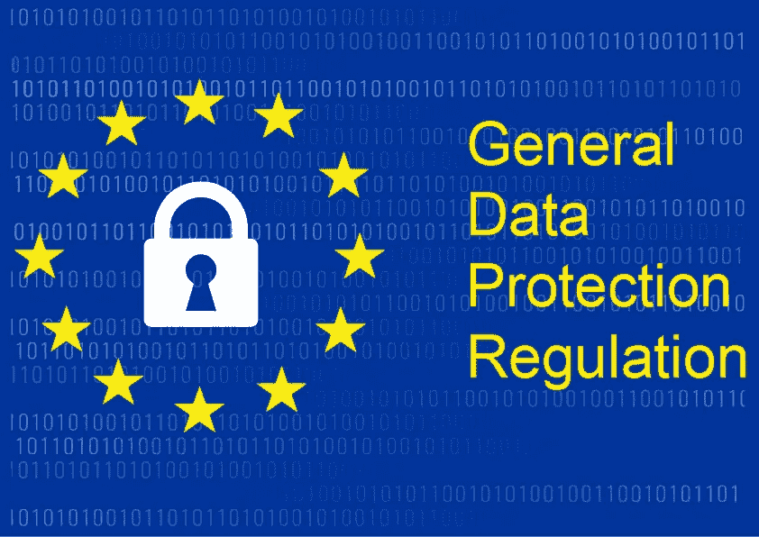
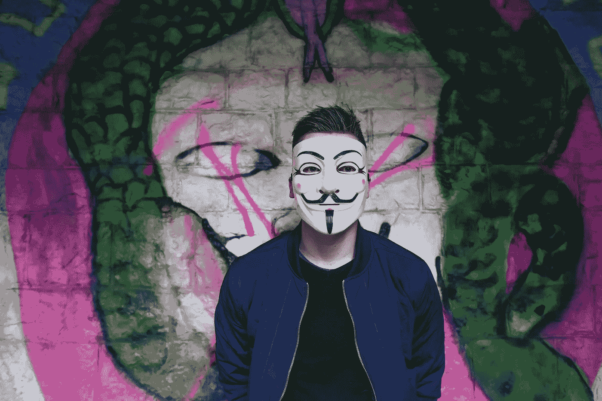
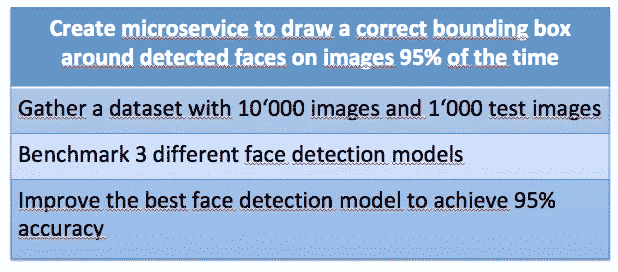
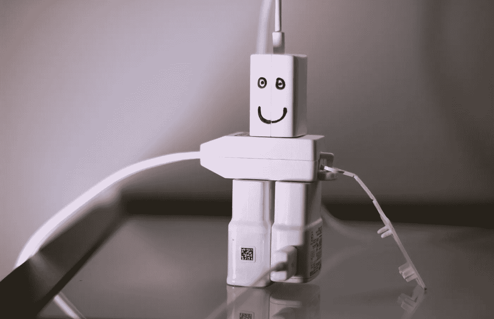
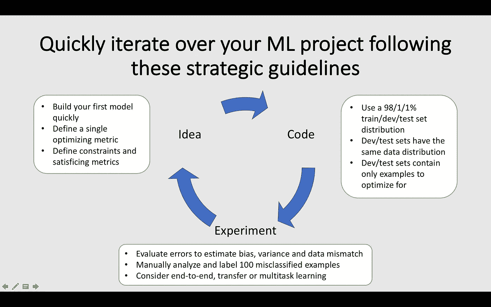
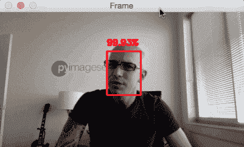
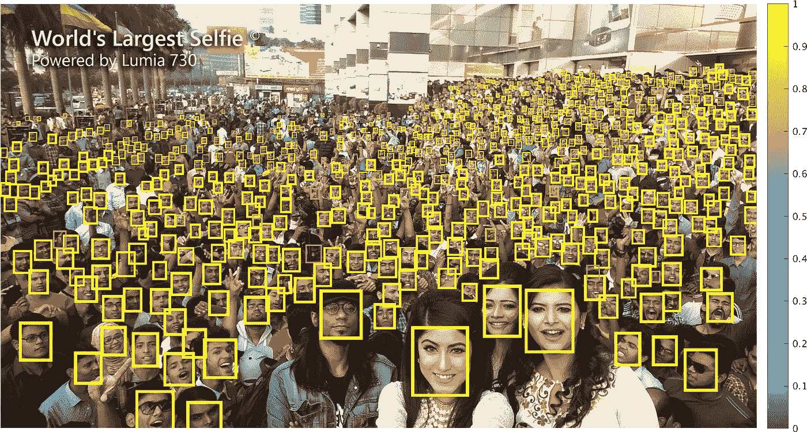
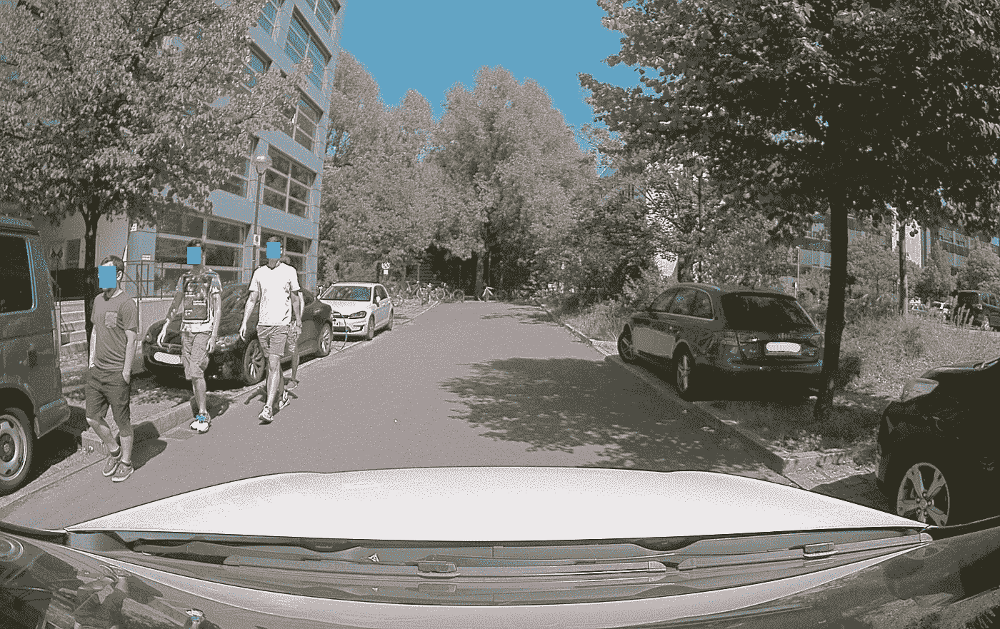

# 现实世界中的数据科学

> 原文：<https://towardsdatascience.com/data-science-in-the-real-world-e97e2534e43?source=collection_archive---------12----------------------->

## 阅读数据科学家的实际工作。剧透:一点也不像 kaggle。

帮助学生和爱好者为数据科学家的工作做准备的网络世界是巨大的。访问数据和获取信息的方式多种多样。有人可能会认为，从数据科学中创造价值就像旋转 Jupyter 笔记本并更改几行代码一样简单。你只要上几门网络课程，全是彩虹独角兽。

Photo by [Boudewijn Huysmans](https://unsplash.com/photos/HtBuc5Ku-tI?utm_source=unsplash&utm_medium=referral&utm_content=creditCopyText) on [Unsplash](https://unsplash.com/search/photos/unicorn?utm_source=unsplash&utm_medium=referral&utm_content=creditCopyText)

我在柏林的大众集团创新车 Carmeq 领导数据和人工智能项目。我们通过在自动驾驶汽车、个人辅助和神经网络验证领域的工作来支持大众品牌。这篇文章旨在揭示作为数据科学家工作时可能遇到的机遇和非常规挑战。您将浏览一个真实的用例，对数据科学家的工作有一个更现实的认识。剧透提醒:不全是彩虹和独角兽。

# 问题是

每个数据科学项目都始于你想要解决的问题。记住这一点很重要。太多时候，数据科学家四处奔走，寻求用机器学习来解决问题。应该是反过来。

> 首先是问题，其次是数据科学。

我们的用例始于法律领域的彻底变革。2018 年欧盟(EU)通用数据保护条例[【GDPR】](https://eugdpr.org/)的出台，影响的行业不仅仅是[网络营销](https://www.wired.com/story/how-gdpr-affects-you/)。GDPR 旨在加强欧盟个人的隐私权。这项规定受到隐私倡导者的广泛欢迎，但在业内也同样遭到疏远。

Convert GDPR — [www.Convert.com/GDPR/](http://www.convert.com/GDPR/)

公司通常很难解释 GDPR 将如何应用于具体的用例，因为还没有任何示范性的规则。本质上，GDPR 要求公司给予个人要求和删除其数据的权利。此外，公司应该只收集特定的、预先确定的用例所需的数据。GDPR 禁止不必要的个人数据囤积。这项立法带来了严重的不确定性，因为执行的实际限制仍有待探索。

This is you, the wandering Data Science unicorn. Photo by [Andrea Tummons](https://unsplash.com/photos/rHVYk9BbRKk?utm_source=unsplash&utm_medium=referral&utm_content=creditCopyText) on [Unsplash](https://unsplash.com/search/photos/unicorn?utm_source=unsplash&utm_medium=referral&utm_content=creditCopyText)

现在想象一辆自动驾驶汽车在欧盟的街道上漫游。他们经常用相机记录他们的环境。根据定义，人脸和车牌被视为个人数据，需要得到保护。汽车制造商应该如何在不无意中收集个人面孔和车牌的情况下四处行驶？有些人会说这几乎是不可能的。在这里，我们发现了一个与我们的合作伙伴相关的问题。我们也相信机器学习可以带来解决方案。让我们开发用例。🚙

# 使用案例

汽车公司需要在不侵犯 GDPR 保护的个人数据权利的情况下收集真实世界的数据。有很多方法可以解决这个问题:只在没有人类或汽车的区域行驶，只在晚上收集数据，完全依赖模拟数据等。这些解决方案都不理想。数据驱动的函数开发需要真实世界的数据，没有约束。

我们可以检测人脸和车牌，并将其匿名。从技术上讲，这将是伪匿名化，但由于缩写，我们将在本文中坚持匿名化。

He is anonymized.

你可能会注意到，我们甚至还没有谈到使用机器学习！我们应该如何解决这个问题完全取决于找到最佳方法，这不一定需要机器学习驱动。

我们理解有必要对图像和视频中的个人进行匿名处理，以保护他们的隐私。在进行一些研究后，我们可以证明深度学习是准确检测图像中对象的最先进方法。接下来让我们定义项目的范围。

主要目标是关注从外部汽车摄像头记录的人脸的匿名化。首先，我们需要检测图像中的人脸。第二，我们会用面具代替脸。还有其他方法可以替代人脸，比如用合成脸，但我们不会在这篇文章中讨论。

# 定义目标

一个机器学习产品，如果只代表自己，那就没什么价值。通常，您会将您的模型集成到现有的管道中，或者围绕产品构建一个管道。当前的工程框架是构建[微服务](https://blog.algorithmia.com/deploying-machine-learning-at-scale/)。微服务只处理它们被设计去做的孤立的任务。它们很容易集成到现有架构中。这样做的标准工具是 [Python Flask](/designing-a-machine-learning-model-and-deploying-it-using-flask-on-heroku-9558ce6bde7b) 和 [Docker containers](/docker-for-data-scientists-5732501f0ba4) 。这就是我们想要的。

为了形式化我们的方法，我们保证使用目标和关键结果(okr)。在这篇[帖子](/the-power-of-goal-setting-for-your-data-science-project-9338bf475abd)中，我们了解了使用 OKRs 来指导我们的数据科学项目的好处，因此我们提出了以下目标:

这些 okr 是成熟的面部匿名化项目的雄心勃勃的延伸目标。在这篇文章的后面，我们将看到项目的范围仅限于原型，因此 OKRs 也应该改变。

# 创建项目

作为一名数据科学家，无论你在哪里工作，你总是与其他利益相关者一起在一个团队中工作。在我们开始工作之前，我们需要跨越第一个障碍，创建一个项目推介来说服我们的合作伙伴。我们的目标是让一个数据科学家在这个项目上工作一段时间，以原型解决方案。

管理层非常清楚数据隐私问题。毕竟，他们有责任确保公司遵守法律要求。对图片内容进行匿名处理也有直观的意义！在小范围内，我们使用上面定义的 OKRs 和一个[有说服力的故事](/storytelling-for-data-scientists-317c2723aa31)来说服管理层赞助一个项目的原型解决方案。如果它足够有前景，我们将寻找更多的合作伙伴，并将项目推向下一个阶段。

Photo by [Steve Johnson](https://unsplash.com/photos/WkJPu3rEeJE?utm_source=unsplash&utm_medium=referral&utm_content=creditCopyText) on [Unsplash](https://unsplash.com/?utm_source=unsplash&utm_medium=referral&utm_content=creditCopyText)

恭喜你！我们得到了一个机器学习项目。现在，让乐趣开始。👩‍🔬

# 这项工作

深度学习大师吴恩达[建议](/structuring-your-machine-learning-project-course-summary-in-1-picture-and-22-nuggets-of-wisdom-95b051a6c9dd)尽快拿出一个工作模型，然后不断重复这个想法，直到目标实现。Andrew 建议在调整现有预训练模型以适应我们的特定用例之前，先对其进行实验。

如果我们看看我们的 okr，我们意识到我们需要采取三个步骤:研究可用的人脸检测模型，收集数据，并比较不同模型的性能。让我们从第一部分开始。

# 研究可用模型

几十年来，人脸检测一直是计算机视觉研究的重要组成部分。我们的假设是，找到一个好的模型来检测人脸应该很容易。像 OpenCV 这样的开源包从一开始就提供内置的[人脸检测模型](https://www.pyimagesearch.com/2018/02/26/face-detection-with-opencv-and-deep-learning/)。

Hi there, [Adrian](https://www.pyimagesearch.com/2018/02/26/face-detection-with-opencv-and-deep-learning/)! Check out [PyImageSearch](https://www.pyimagesearch.com/) for more great OpenCV tutorials.

然而，缺点是许多人脸检测模型专注于识别靠近摄像机的人脸。在我们的汽车环境中，当面孔就在摄像机前时，我们再去识别它们已经太晚了！

[Too late if you recognize the face just now!](https://www.dailystar.co.uk/news/latest-news/518178/shes-mad-at-me-right-now-guy-hangs-to-front-of-moving-car-American-businessman)

此外，道路上的汽车将在昏暗的光线条件下从不同的姿势记录有遮挡的人脸，如帽子和太阳镜。因此，我们应该将研究重点放在满足这些需求的模型上。

我们分析了最近关于最先进的人脸检测模型的研究论文，并从这些论文中获得了关于其他现有模型的线索。一个特别的模型引起了我们的注意:小脸模型！

显然，该模型是在一个数据集上训练的，该数据集包括处于不同姿势、光照条件、有遮挡并且聚焦在小的、远处的人脸上的人脸。它看起来非常适合我们的用例。

# 许可——沉睡的野兽

研究人员很容易做到——发布的数据集或模型的许可证通常可用于科学目的。业余 kagglers 也不必考虑许可证，因为他们只是尝试供个人使用的模型。然而，当你为一家盈利性公司工作时，这种情况就变了。突然之间，很多数据集或者模型都成了禁忌！

作为一个提示，如果你读到一个模型许可，上面写着“不用于商业目的”，那么这个模型对你来说是遥不可及的。你甚至不能测试它的内部原型。让我们忘记这个模型，研究一些预先训练的更有利于行业的模型。

# 收集数据

在我们确定了合适的模型之后，是时候让它们在真实世界的数据上自由活动了。由于我们在汽车行业工作，我们可以确保获得大量干净和有标签的数据！

别急，菜鸟。如果你不在一家初创公司工作，你的公司很有可能被分成不同的品牌和子公司，这些品牌和子公司的组织结构经常变化。此外，GDPR 使得在不同用例的部门之间共享数据变得更加困难。可想而知，找到合适的数据集等于大海捞针！

Go ahead, find the needle. Photo by [Lucas Gallone](https://unsplash.com/photos/9Mq_Q-4gs-w?utm_source=unsplash&utm_medium=referral&utm_content=creditCopyText) on [Unsplash](https://unsplash.com/?utm_source=unsplash&utm_medium=referral&utm_content=creditCopyText)

所以我们没有真正需要的数据。这对于读者来说可能有些离谱，但没有正确的数据是数据科学项目失败的最常见原因之一，不管你为哪家公司工作。

有一个很棒的公共数据集叫做[宽脸](http://mmlab.ie.cuhk.edu.hk/projects/WIDERFace/)。不幸的是，发牌野兽又来了。谷歌发布了其[开放图像](https://storage.googleapis.com/openimages/web/index.html)数据集，其中包含许多带标签的人脸，并可免费用于商业用途。这些图像仍然不是真实世界的数据，我们需要我们的模型在这些数据上表现良好。

因此，我们可以继续的唯一方法是收集我们自己的数据集。幸运的是，我们有设备来收集我们想要做好的真实世界的数据。我们兜一圈，收集一些可控环境下行人的数据。

# 应用模型

现在我们已经收集了一些数据，是时候试验这些模型了。我们花了大部分时间研究模型和收集数据，所以我们没有足够的时间来标记数据集。我们怎样才能摆脱这种痛苦？我们帮助自己进行近似，例如比较检测到的面部计数和关于哪个模型表现更好的良好直觉。

这应该是一个中间结果。表演显示了获胜者，因此我们收集了另一个更真实的数据集，并创建了一个展示视频作为我们的结果。我们尝试了一些东西，如超参数调整，以消除太多的假阳性，以改善展示，但这个项目的时间紧迫。我们将代码容器化，呈现我们的结果。

我们完成了我们的项目！我们展示了人脸检测在汽车工业中保护 GDPR 数据的作用。接下来，我们必须说服其他利益相关者和合作伙伴来赞助我们已经收集了上述 okr 的完整项目。接下来的步骤可能包括车牌检测、超参数调整、准备适当的数据集、收集更多数据等。在这个项目完成后不久，来自 understand.ai 的了不起的人们开源了他们的[匿名化代码](https://github.com/understand-ai/anonymizer)，所以我们肯定也应该尝试一下。

# 结论

正如您所看到的，这个 picture pretty 用例的实际工作是混乱的。数据并不总是可用的。使用许可证时要小心。对你的项目的资助可能会被限制在某一点上。优先事项和情况会发生变化。你必须保持灵活性，在给定的时间限制内工作，即使你不喜欢它。

Photo by [Todd Cravens](https://unsplash.com/photos/g2pdILavGCY?utm_source=unsplash&utm_medium=referral&utm_content=creditCopyText) on [Unsplash](https://unsplash.com/search/photos/rainbow?utm_source=unsplash&utm_medium=referral&utm_content=creditCopyText)

通过这篇文章，我希望我可以通过一个小项目来揭示数据科学家在现实世界中的工作。挑战肯定不总是一样的，但我认为不同的公司面临的挑战是相似的。现在，你要做好准备，数据科学世界并不全是彩虹和独角兽。

# 关键要点

作为一名现实世界的数据科学家，您应该意识到以下挑战:

*   你需要说服管理层和利益相关者赞助你的新项目
*   合并现有模型或数据集时，检查许可是否正确
*   你正在做的大部分工作是研究和数据准备
*   你需要保持在预定义项目的时间范围内

如果你喜欢这篇文章，请不要忘记展示你的💛并且**在[中](https://medium.com/@janzawadzki)或者 [LinkedIn](https://www.linkedin.com/in/jan-zawadzki/) 上关注**我。你也可能[喜欢](/top-5-business-related-books-every-data-scientist-should-read-6e252a3f2713) [这些](/top-5-mistakes-of-greenhorn-data-scientists-90fa26201d51) [帖子](/the-deep-learning-ai-dictionary-ade421df39e4)。如果你认为有什么需要补充的，请评论。干杯！☮️