# 数据科学面试指南

> 原文：<https://towardsdatascience.com/data-science-interview-guide-4ee9f5dc778?source=collection_archive---------0----------------------->

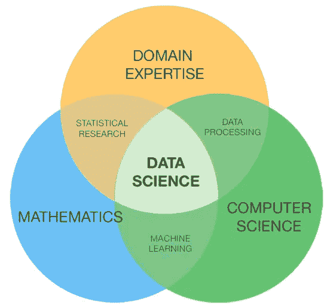

数据科学是一个相当大且多样化的领域。因此，做一个万事通真的很难。传统上，数据科学将专注于数学、计算机科学和领域专业知识。虽然我将简要地介绍一些计算机科学的基础知识，但本博客的大部分内容将主要涵盖数学基础知识，人们可能需要温习这些知识(甚至需要上一整门课)。

# 软件工具

在大多数数据科学工作场所，软件技能是必须的。虽然我知道你们中的大多数人在阅读这篇文章的时候更注重数学，但是要意识到大部分的数据科学(我敢说 80%以上)正在收集、清理和处理数据，使之成为有用的形式。

## 程序设计语言

Python 和 R 是数据科学领域中最流行的。不过我也接触过 C/C++，Java，Scala。不过，我个人会推荐 Python，因为它有所有的数学库，以及用于查询各种数据库和维护交互式 web UIs 的专用库。常见的 Python 库有 matplotlib、numpy、pandas 和 scikit-learn。

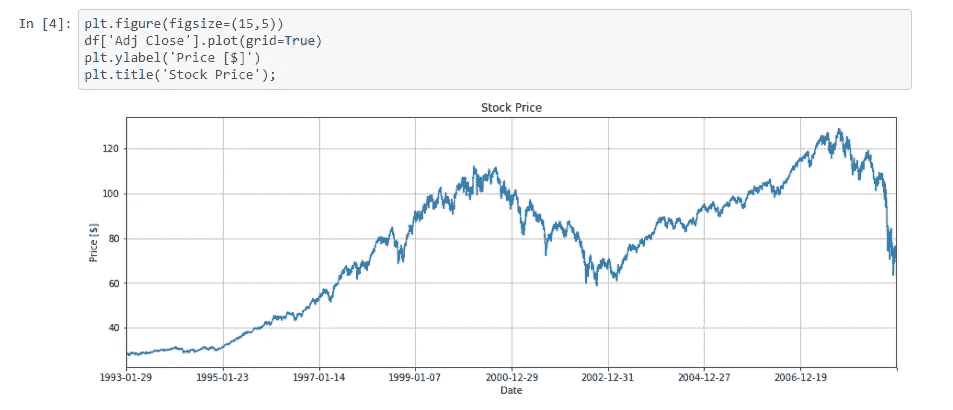

## 数据库管理

常见的情况是，大多数数据科学家属于两个阵营:数学家和数据库架构师。如果你是第二个，博客帮不了你多少(你已经很牛逼了！).如果您是第一类人(像我一样)，您可能会觉得编写双重嵌套的 SQL 查询是一场彻头彻尾的噩梦。也就是说，了解一些查询优化的知识很重要(对于 SQL 和 noSQL 系统都是如此)。

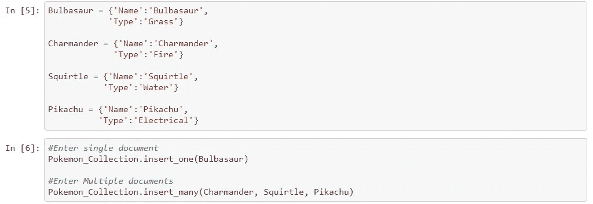

## 地图缩小

考虑到 Apache 项目一直在添加新工具，大数据技术有点难以理解。但是，我会推荐学习 Hadoop 或者 Spark(虽然我个人推荐是 Spark)。两者都使用相似的 Map Reduce 算法(除了 Hadoop 在磁盘上执行，而 Spark 在内存中执行)。Scala、Python 和 Java 中都有常见的 Spark 包装器。

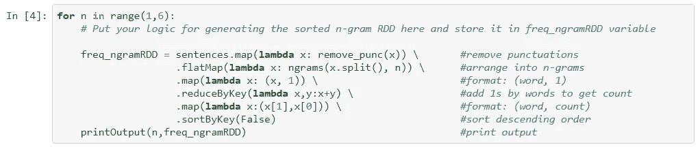

## 附加说明

有关数据科学应用软件开发的更多信息，这里是我的一些其他博客:
- [面向数据科学家的 DevOps:驯服独角兽](/devops-for-data-scientists-taming-the-unicorn-6410843990de)
- [使用 Matplotlib 进行基于 Python 的绘图](/python-based-plotting-with-matplotlib-8e1c301e2799)
- [使用 Conda 进行 Python 包管理](https://medium.com/@sadatnazrul/python-package-management-with-conda-9d3475f42122)
- [如何让您的软件开发体验…无痛……](/how-to-make-your-software-development-experience-painless-2591ebcc69b6)
- [软件开发设计原则](https://medium.com/@sadatnazrul/software-development-design-principles-79d15ef765f3)

# 数据收集和清理

既然我们已经涵盖了软件需求，我们将开始平稳过渡到数学领域。围绕这部分流程，一般需要有一些数据收集和后台清理。这可能是收集传感器数据，解析网站或进行调查。收集数据后，需要将其转换成可用的形式(例如，JSON 行文件中的键值存储)。一旦收集了数据并将其转换成可用的格式，就有必要执行一些数据质量检查。一些常见的质量检查如下所述:

## NaN 处理

NaN 或“不是数字”是缺失数据的常见占位符。如果特定要素的 nan 数量很少，通常用平均值(整个数据集或窗口)或 0(稀疏数据集)填充 nan 就足够了。

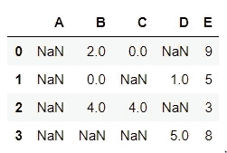

数据集中的 NaNs 通常表示:
-数据不存在
-数据存在但我们不知道它是什么
根据具体的用例，应该采取相应的措施。

## 阶级不平衡

特别是对于监督学习模型，类(或目标)的平衡很重要。然而，在欺诈案件中，严重的类别不平衡是非常常见的(例如，只有 2%的数据集是真正的欺诈)。

这些信息对于确定特征工程、建模和模型评估的适当选择非常重要。如需了解更多信息，请查看我关于极端阶级不平衡下[欺诈检测的博客。](/fraud-detection-under-extreme-class-imbalance-c241854e60c)

## 单变量分析

当试图寻找方差中的异常值和异常峰值时，单个特征的单变量分析(忽略共变量效应)很重要。常见的单变量分析选择是直方图。

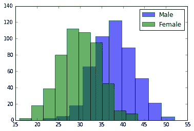

## 双变量分析

在双变量分析中，每个要素都与数据集中的其他要素进行比较。这包括相关矩阵、协方差矩阵或我个人最喜欢的散布矩阵。

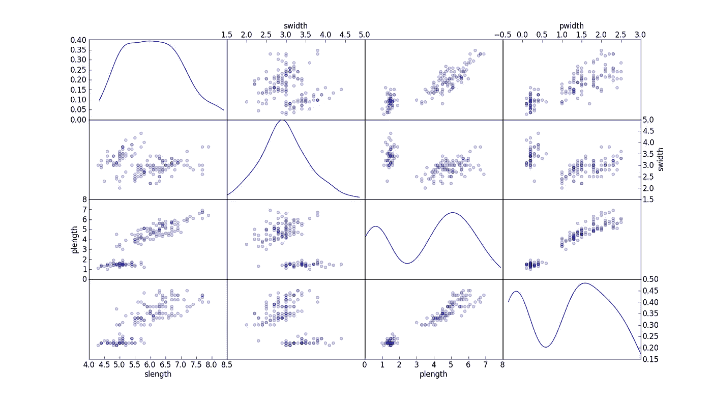

散点图让我们能够找到隐藏的模式，例如
-应该设计在一起的特征
-可能需要消除以避免多重共线性的特征

多重共线性实际上是线性回归等多个模型的问题，因此需要相应地加以处理。

# 特征工程

一旦收集、清理和分析了数据，就该开始创建要在模型中使用的要素了。在本节中，我们将探索一些常见的特征工程策略。

## 转换

有时，该功能本身可能无法提供有用的信息。例如，想象使用互联网使用数据。你会发现 YouTube 用户的流量高达千兆字节，而 Facebook Messenger 用户的流量只有几兆字节。这里最简单的解决方案是取这些值的对数。另一个问题是分类值的使用。虽然分类值在数据科学领域很常见，但要知道计算机只能理解数字。为了使分类值具有数学意义，需要将其转换为数字形式。通常，对于分类值，通常执行一次热编码。在一个热编码中，为每个分类值创建一个新的特征，以表明它是否出现在给定的记录中。下面给出了一个热编码的例子:

## 结合

某些功能本身是多余的，但是组合在一起就很有用。例如，假设您有一个交通密度预测模型，每种类型的汽车都有一列。自然，你不关心车的类型而是车的总数的频率。因此，可以对所有汽车类型进行逐行求和，以创建新的“all_cars”变量。

## 降维

有时，稀疏维度过多会影响模型的性能。对于这种情况(如通常在图像识别中所做的)，使用降维算法。

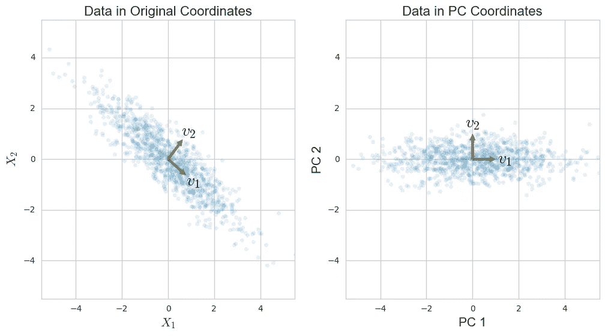

通常用于维数减少的算法是主成分分析或 PCA。学习 PCA 的机制，因为它也是**常见面试问题**中的一个话题！！！要了解更多信息，请查看[迈克尔·加拉尼克](https://towardsdatascience.com/@GalarnykMichael)关于 [PCA 使用 Python](/pca-using-python-scikit-learn-e653f8989e60) 的博客。

# 特征选择

既然您已经设计了您的特性列表，现在是时候选择将有助于为用例构建最佳模型的特性了。本节解释了常见类别及其子类别。

## 过滤方法

过滤方法通常用作预处理步骤。特征的选择独立于任何机器学习算法。取而代之的是，特征的选择是基于它们在各种统计测试中与结果变量的相关性的分数。这里的相关性是一个主观术语。这一类别下的常用方法有皮尔逊相关、线性判别分析、方差分析和卡方检验。

## 包装方法

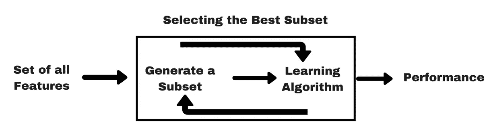

在包装方法中，我们尝试使用特征的子集，并使用它们来训练模型。基于我们从之前的模型中得出的推论，我们决定在您的子集中添加或移除特征。这个问题本质上归结为一个搜索问题。这些方法通常在计算上非常昂贵。这一类别下的常见方法有向前选择、向后消除和递归特征消除。

## 嵌入式方法

嵌入式方法结合了过滤器和包装器方法的优点。它是由具有内置特征选择方法的算法实现的。套索和脊是常见的。作为参考，以下等式中给出了正则化:

套索:

山脊:

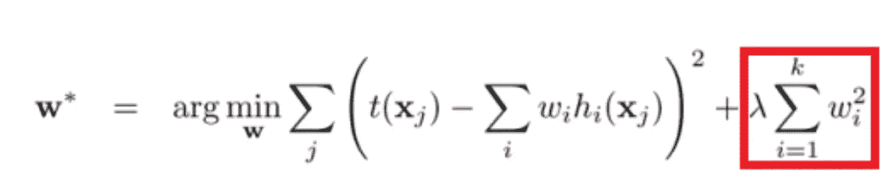

话虽如此，了解 LASSO 和 RIDGE 背后的面试技巧是非常重要的。

# 机器学习模型

既然我们已经有了最佳特性，现在是时候训练我们的实际模型了！机器学习模型分为两个阵营:有监督的和无监督的。监督学习是标签可用的时候。无监督学习是标签不可用的时候。明白了吗？监督标签！双关语。也就是说，**不要混淆监督学习和非监督学习的区别**！！！这个错误足以让面试官取消面试。此外，人们犯的另一个 noob 错误是在运行模型之前没有规范化特征。虽然一些模型对这个问题有抵抗力，但是很多模型(如线性回归)对缩放非常敏感。因此。经验法则。**在使用前，一定要将功能正常化！！！**

## 线性和逻辑回归

线性和逻辑回归是最基本和最常用的机器学习算法。在进行任何分析之前**确保首先进行线性/逻辑回归作为基准！人们在面试中常犯的一个错误是从神经网络这样更复杂的模型开始分析。毫无疑问，神经网络是高度精确的。然而，基准很重要。如果你的简单回归模型已经有 98%的准确率，并且非常接近过度拟合，那么得到一个更复杂的模型就不是明智之举。也就是说，线性回归用于连续目标，而逻辑回归用于二元目标(主要是因为 sigmoid 曲线迫使特征输入朝向 0 或 1)。**

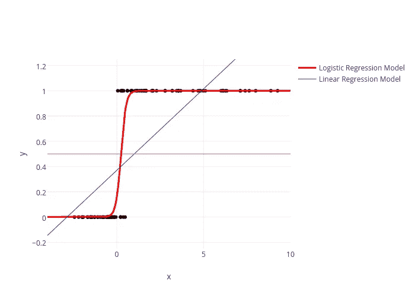

我建议学习逻辑回归和线性回归的推导(单变量和多变量)。除了为面试做准备，线性回归模型还被用作一系列其他机器学习模型的基础。因此，这是一项长期投资。

## 决策树和随机森林

比线性回归模型稍微复杂一点的模型是决策树。决策树算法基于信息增益在不同的特征处分裂，直到它命中纯叶(即，只有 1 个标签的一组记录)。决策树可以在一定数量的分裂后停止，以阻止它获得纯叶子(修复过度拟合问题的常用策略)。

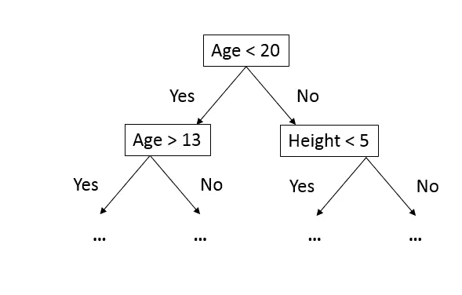

为分裂树而计算的信息增益是重要的。**常见面试问题！确保您知道信息增益是如何计算的！！！**常见的信息增益计算函数有基尼和熵。

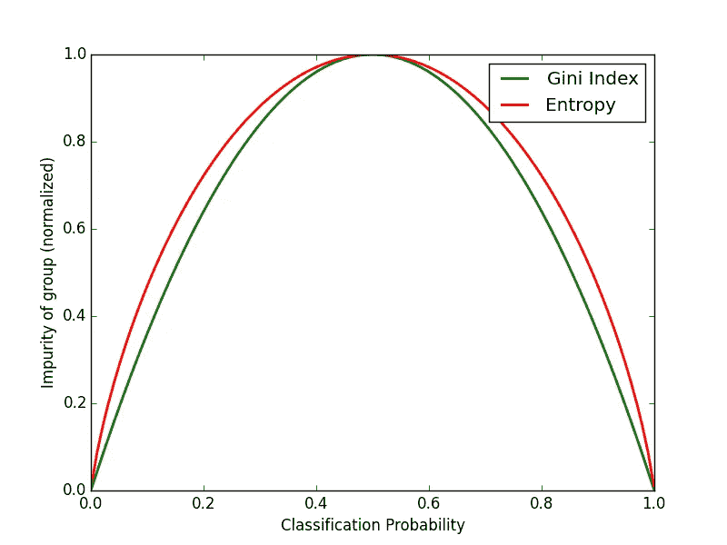

在上面的曲线中重要的是，与基尼系数相比，熵给出了更高的信息增益值，因此导致了更多的分裂。

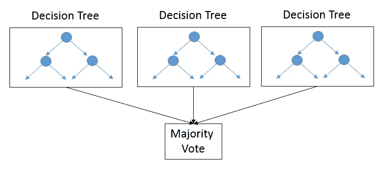

当决策树不够复杂时，通常会使用随机森林(只不过是在数据子集上生长多个决策树，并进行最终多数投票)。如果没有正确确定树的数量，随机森林算法可能会过度适应。关于决策树、随机森林和基于树的集成模型的更多信息，请查看我的另一个博客:[关于 Scikit-Learn 上的决策树和集成的研究](https://medium.com/@sadatnazrul/study-of-decision-trees-and-ensembles-on-scikit-learn-e713a8e532b8)

## k 均值和 KNN

K-Means 是一种无监督的学习模型，它将数据点分类到聚类中。提供了聚类的数量，使得模型移动质心，直到它迭代地找到最佳聚类中心。KNN 是一样的，除了它是一个监督模型，集群充当标签。

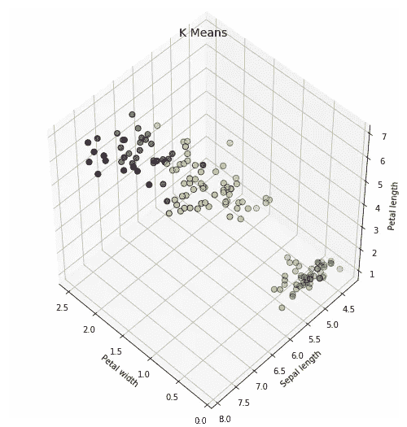

使用肘形曲线来确定聚类的数量。

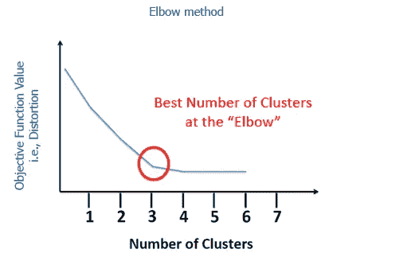

聚类的数量可能容易找到，也可能不容易找到(特别是如果曲线上没有明显的扭结)。此外，要认识到 K-Means 算法是局部优化，而不是全局优化。这意味着您的集群将依赖于您的初始化值。最常见的初始化值是在 K-Means++中计算的，其中初始值尽可能彼此远离。关于 K-Means 和其他形式的无监督学习算法的更多细节，请查看我的另一个博客:[基于聚类的无监督学习](http://Clustering Based Unsupervised Learning)

## 神经网络

神经网络是这些天每个人都在关注的热门算法之一。

虽然我不可能在这个博客上涵盖复杂的细节，但了解基本机制以及反向传播和消失梯度的概念是很重要的。认识到神经网络本质上是一个黑盒也很重要。如果案例研究要求您构建一个解释模型，要么选择一个不同的模型，要么准备好解释您将如何发现权重对最终结果的影响(例如，在图像识别过程中隐藏层的可视化)。

## 集合模型

最后，单一模型可能无法准确确定目标。某些功能需要特殊型号。对于这种情况，使用多个模型的集合。下面给出一个例子:

在这里，模型是分层或堆叠的。每一层的输出是下一层的输入。

# 模型评估

## 分类分数

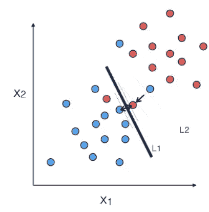

评估模型性能的一种最常见的方法是通过计算记录被准确预测的记录的百分比。

## 学习曲线

学习曲线也是评估模型的常用方法。在这里，我们要看看我们的模型是太复杂还是不够复杂。

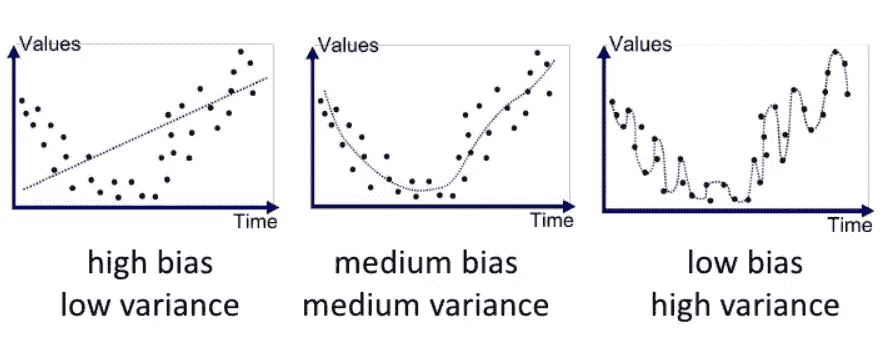

如果模型不够复杂(例如，当模式不是线性时，我们决定使用线性回归)，我们最终会得到高偏差和低方差。当我们的模型太复杂时(例如，我们决定对一个简单的问题使用深度神经网络)，我们最终会得到低偏差和高方差。高方差，因为结果会随着我们对训练数据的随机化而变化(即模型不是很稳定)。不要在面试中混淆偏倚和方差的区别！！！现在，为了确定模型的复杂性，我们使用如下所示的学习曲线:

在学习曲线上，我们改变 x 轴上的训练测试分割，并计算训练和验证数据集上模型的准确性。如果它们之间的差距太大，就太复杂了(即过拟合)。如果两条曲线都没有达到预期的精度，并且曲线之间的差距过小，则数据集有很大偏差。

## 皇家对空观察队

当处理具有严重类别不平衡的欺诈数据集时，分类分数没有太大意义。相反，接收机工作特性或 ROC 曲线提供了一个更好的选择。

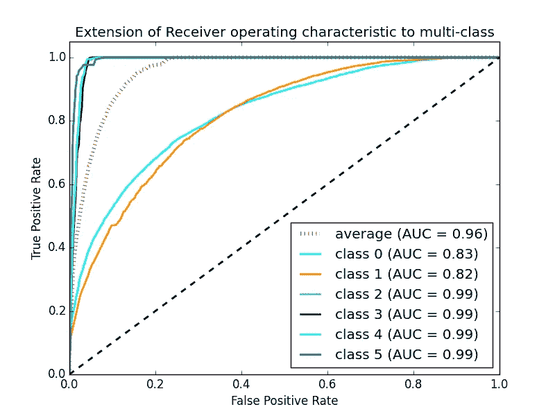

45 度线是随机线，其中曲线下面积或 AUC 是 0.5。曲线离这条线越远，AUC 越高，模型越好。一个模型能得到的最高 AUC 是 1，其中曲线形成一个直角三角形。ROC 曲线也可以帮助调试模型。例如，如果曲线的左下角更接近随机线，则暗示模型在 Y=0 处分类错误。然而，如果右上角是随机的，则意味着误差发生在 Y=1 处。此外，如果曲线上有尖峰(而不是平滑的)，这意味着模型不稳定。对付诈骗模特，ROC 是你最好的朋友。欲了解更多详情，请阅读[接收器工作特性曲线解密(Python 语言)](/receiver-operating-characteristic-curves-demystified-in-python-bd531a4364d0)。

# 附加材料

 [## 如何构建数据科学产品组合

### 数据科学怎么找工作？了解足够的统计，机器学习，编程等，能够得到一个…

towardsdatascience.com](/how-to-build-a-data-science-portfolio-5f566517c79c)  [## 斯坦福机器学习| Coursera

### 关于这门课程:机器学习是让计算机在没有明确编程的情况下行动的科学。在…

www.coursera.org](https://www.coursera.org/learn/machine-learning)  [## 华盛顿大学机器学习专业| Coursera

### 这种专业化从领先的研究人员在华盛顿大学向您介绍了令人兴奋的…

www.coursera.org](https://www.coursera.org/specializations/machine-learning)  [## 深度学习专业化| Coursera

### 来自 deeplearning.ai 的深度学习如果你想打入 ai，这个专精会帮你做到。深…

www.coursera.org](https://www.coursera.org/specializations/deep-learning)