# 数据科学不在 SOL 列表中。我还有资格做公关吗？

> 原文：<https://towardsdatascience.com/data-science-is-not-in-the-sol-list-will-i-still-be-eligible-for-pr-cb15e21b2892?source=collection_archive---------0----------------------->

这里有一个简单的问题——你选择了数据科学，你对在澳大利亚攻读硕士学位感到兴奋。然而，你的最终目标是获得公关。但是你听说数据科学不在技能职业列表(SOL)中。可恶！你的朋友告诉你，你不能用一份已列出的工作申请 PR。你去 Quora、facebook、whatsapp，会听到 100 种不同的观点——有些人说你不能申请公关，有些人建议选择不同的工作，还有一些人说这只是有点困难。然后你会发现一丝希望，相信数据科学将很快被添加到 SOL 列表中，因为来吧，它的需求如此之大！但最终，你只是简单地感到困惑。

我希望在这篇文章结束的时候，你会再困惑 100 次——并最终对整个过程有一个正确的概述，关于一份非技能清单的工作。

但在此之前，我们必须一劳永逸地解决一个问题。

> 首先，为了申请永久居留，有必要有一份工作吗？

答案是响亮的是。这是强制性的，你有一个公关工作。事实上，申请公关的第一步是从名单中提名一个职业！这里有一张来自移民和边境保护部(DIBP)网站的截图，上面提到了技术独立签证的要求。

✪注意:签证子类 189 是 PR 的专有名称。还有一个国家赞助的签证子类 190。

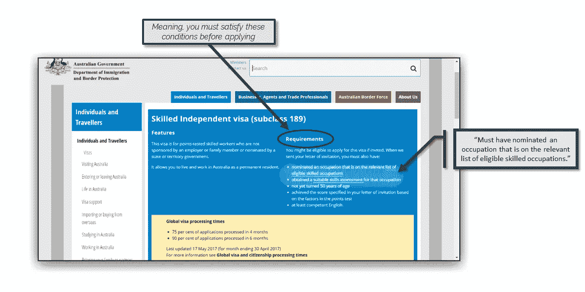

这是另一个来自 DIBP 的—

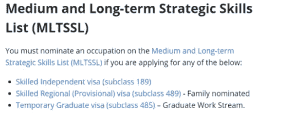

随着时间的推移，这一点会变得更加明显。但在此之前，这份中长期战略技能清单到底是什么？！

> 注:自 2017 年 4 月 19 日'**中长期战略技能清单** ' ( **MLTSSL** )取代之前的'*技能职业清单(SOL)。然而，在本文中，我将继续使用术语 SOL。如果你在任何地方看到这个长短语，只要记住他们指的是被称为 SOL 的东西。*

✪ ✪:当我写这篇文章的时候，DIBP 已经更新了它在 Visa 189 上的页面，新的页面更加清晰。这是一个例子—

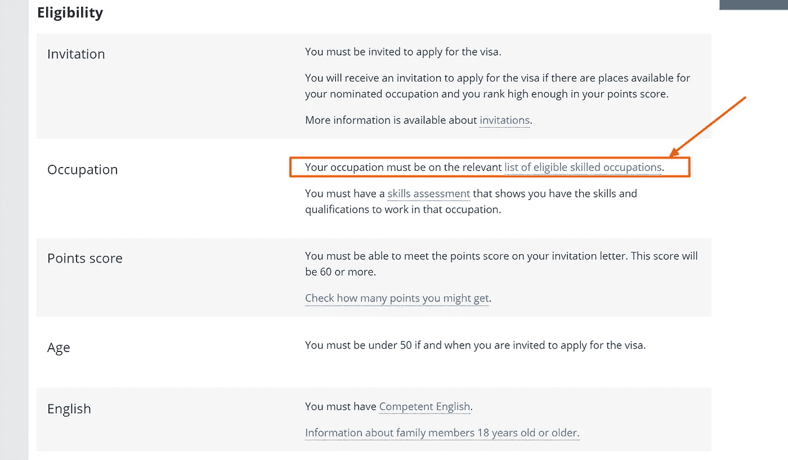

既然我们已经解决了这个问题——首先，让我们从 PR 流程的概述开始，因为它与那些没有 SOL 列出的工作相关——我们将在后面详细检查每个步骤。

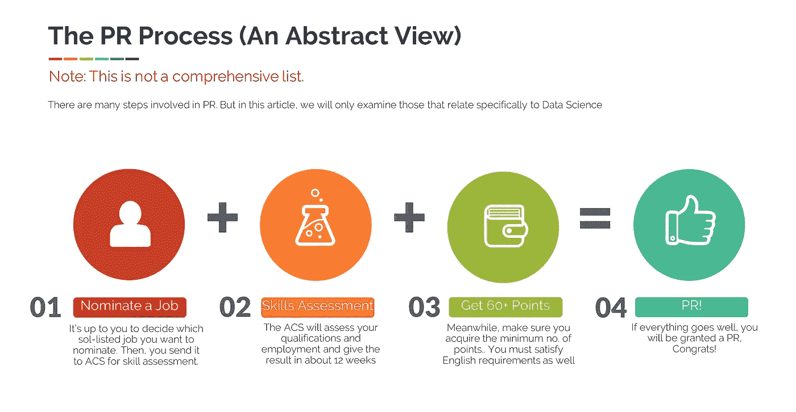

# 步骤 1-提名工作

让我们从第一步开始——从 SOL 列表中提名一份工作。目前，没有“数据分析师”或“数据科学家”的职位，但有一些相近的职位，如“数据库管理员”、“分析程序员”等。

这让我们想到一个重要的问题——

> 问题:既然 SOL 列表中没有数据科学工作，我如何提名一份工作？这是否意味着我将不得不找一份业务分析师或分析程序员的工作，而在获得 PR 之前不能从事数据科学家的工作？

回答:

是的，这是一种选择。你可以攻读数据分析硕士学位，然后开始你的商业分析师生涯——仅仅是为了公关。然而，还有另一个选择。你实际上不需要有确切的工作——你的工作可以是***‘与你提名的*** 密切相关’。这是个好消息！

查看 ACS 网站上的截图。(我们将讨论谁是 ACS？后来)。

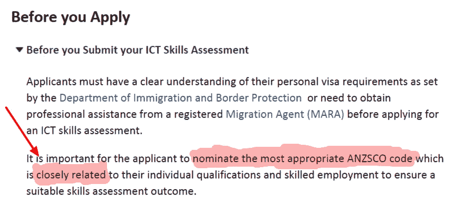

✪注意:ANZSCO 代码仅仅意味着你的职位。比如“261311 —分析师程序员”或者“261111 ICT 商业分析师”。

> 现在一个显而易见的问题来了——“密切相关”是什么意思？谁来决定我的主人是不是近亲？好吧，继续读。我们将在技能评估的第三阶段解决这个问题。

# 步骤 2 —技能评估

一旦你从 SOL 中提名了一份你认为最接近你的资格和就业的工作，你将把你所有的文件送去进行技能评估。

计算机科学、IT、分析相关领域的评估机构是**澳大利亚计算机学会** ( **ACS** )。一旦你最终确定并提名了一个职业，你就可以将你的申请提交给 ACS——并希望他们将结果确定为“密切相关”。

> **最终目标是在评估结束时，你会被贴上“合适”的标签——记住这个词，因为我们会多次提到它。**

重要的是要知道 ACS 将评估两件事—

1.  你的学历(你的硕士学位，包括每个单元)
2.  你的工作经历

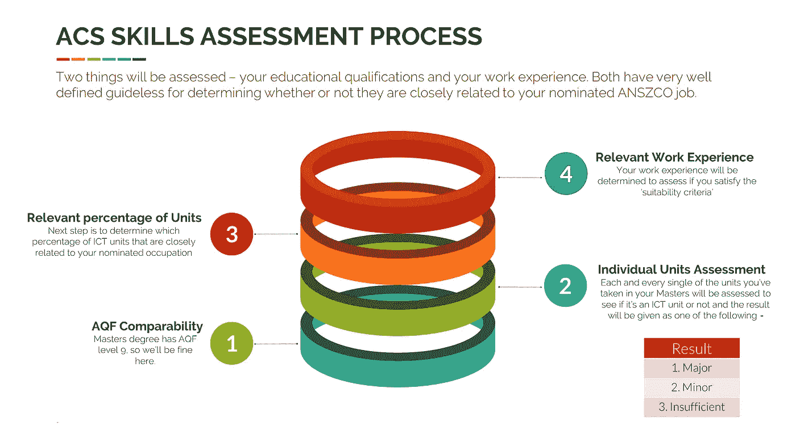

✪ **注** : *ICT 就是“信息和通信技术”的意思，有点像。*

> 第一步——确定你的资格符合哪个 AQF 等级。你会得到一个介于“1 级”和“10 级”之间的结果。我们稍后将探讨这一点。
> 
> 第二步——分析你所有的课程和单元。您的评估结果将是以下之一——ICT 专业、ICT 次要或不充分。再一次，稍后会详细介绍。
> 
> 第三步——确定你的单位中有多少与你提名的工作相关。
> 
> 第五步——评估你的工作经历。

在我们开始详细探讨这四个步骤之前，这将是一个很好的休息时间，来谈谈“适合性标准”——具体来说，**ACS 对合适的 ICT 技能评估结果的标准要求的总结**

> 还记得我们上面说过——被贴上“合适”的标签是公关流程第二步的全部目标。

# 获得“合适的 ICT 技能”评估的要求—

这是 ACS 给出的指导方针的截图。我们将在下面详细分析它。

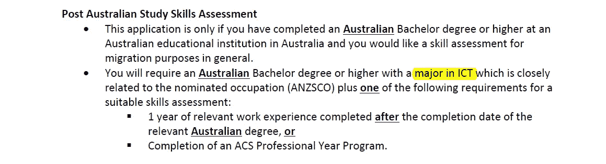

让我们来分解一下——非常重要！

> ●你应该先完成澳大利亚学士或硕士学位——也就是说，你不能在继续攻读的时候申请。
> 
> ●记得在技能评估的第二步中，在分析你的单位后，结果会以三个选项给出吗？(主要、次要或未列出)嗯，您必须接受结果为“**主要**”。你怎么知道的？别担心，我们会搞定的。
> 
> ●你应该有 1 年的相关工作经验，或者你可以完成 ACS 专业年计划(这将花费你大约 60 万卢比)
> 
> ●请记住，你的工作经历应该是在完成硕士学位的 之后的 ***。***

再说一次，有一个非常清晰、明确的准则来决定你的工作经验是否相关。我们很快就会谈到这一点。

好了，现在我们已经理解了适合性标准的要求，让我们回到理解技能评估过程中的每个阶段。

# 第一阶段——AQF 可比性

所以在澳洲，有一种叫做 AQF 水平的东西——你教育的每一部分都有一个特定的水平。我会把这个图表贴出来，我们不需要被这个困扰，但是如果需要的话，你可以来参考这个。

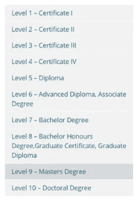

既然我们在 9 级，我们应该担心这个。继续前进。

# 第二阶段——从你的老师那里评估每个单元

这很重要，所以请对我耐心点。

> 决定你的资格是否被视为主要、次要或未列出的指导方针—

首先是截图，然后我们会进一步详述。

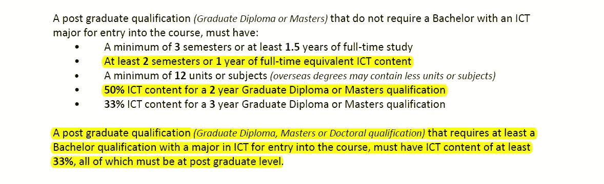

简单来说—

如果你的课程没有先修课程(ICT 专业学士学位——如 IT 专业、计算机科学等),那么，

> ●你至少要有 2 个学期或 1 年的全日制 ICT 内容(什么 ICT 内容？我们会谈到它)
> 
> ●总体而言，在两年制硕士课程中，50%的单元必须是 ICT。
> 
> ●然而，如果你的课程确实有这样的先决条件，你的 33%的单元必须有 ICT 内容。
> 
> 如果你满足这些，你将被归类为拥有 ICT 专业。但这还不够。你还需要让自己的资历与你提名的工作“密切相关”。

> ✪注意——除了“专业”之外，要“与你的工作密切相关”, 65%的单元必须与你第一步提名的职业相关！

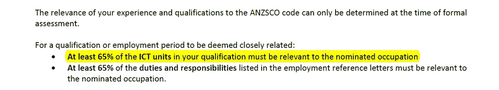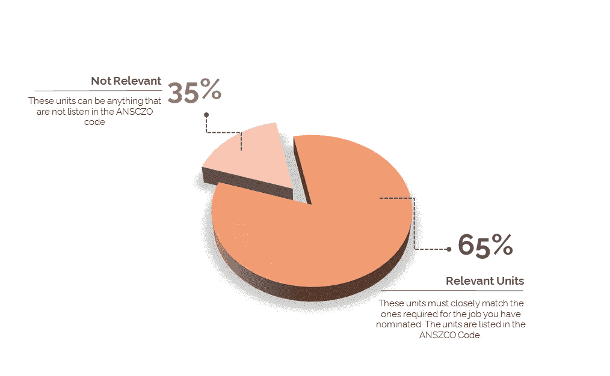

现在一个大问题来了—

# 阶段 3 —这些“相关单元”是什么？

这些相关单位都是针对具体工作的，这就是为什么仔细研究哪份工作最适合你的资历和工作经验是很重要的。

✪注意:假设你通过提名一个职位来提交申请——在评估结束后，他们认为你的资格更适合另一个职位(从而增加你获得 PR 的机会)，你可以支付 200 美元的费用，先改变你提名的职位。然而，在整个评估过程(大约持续 12 周)完成之前，ACS 无法指导您的资格是否合适。

回到正题，有一个东西叫做 ANSZCO 代码，它非常清楚地概述了与你提名的工作“密切相关”的单位和工作经验。我将在下面贴几张截图，并在底部附上手册的链接。

> 了解 ANSZCO 代码中的单元是非常有帮助的，这样你就会在你的硕士课程中选择那些特定的选修课！

首先，这些是我们作为数据科学家可以提名的工作。

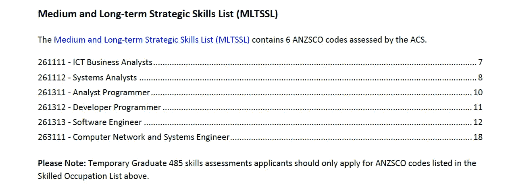

以下是这些工作所需的课程—

# 1.ICT 业务分析师

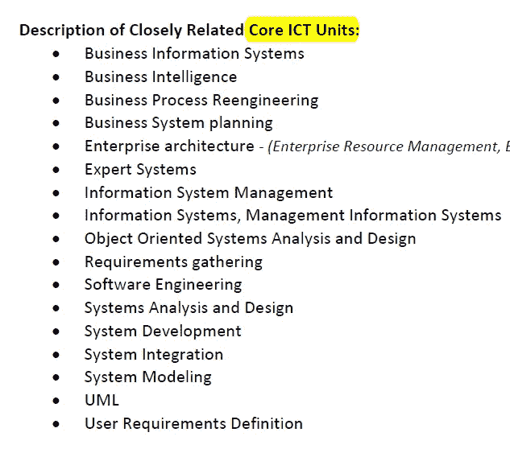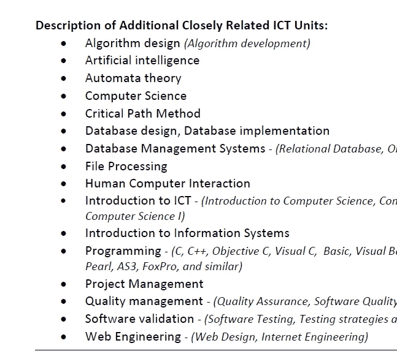

✪:在你的课程中有足够的核心 ICT 课程是很重要的。多少钱？我不确定。

你可以在我下面附上的 pdf 文件(ANZSCO 代码)中查看其他工作的必修课程。

附加信息—

1.  他们还接受微软和思科的认证，但仅限微软认证解决方案专家和微软认证解决方案开发人员。
2.  如果你有这些供应商证书，你将被视为 AQF 五级 **ICT 专业。(文凭级别)。**
3.  关于供应商认证可能还有其他条件，我建议您参考手册(第 10 页)。

我们到达了“资格评估”的末尾，这结束了第三阶段。现在，让我们继续工作经历。

# 第 4 阶段—相关工作经验

这一步也相当复杂，我不能公平对待所有的读者，因为他们来自不同的背景和不同的经验水平。我只是简单地提一下重点，你可以参考手册了解更多细节。

✪ **注意** : *只有你在硕士毕业后的工作经验才会被算作技术就业，并用于移民目的。*

好吧，让我们再看一遍这张截图:

与你的课程单元相似，你推荐信中 65%的“职责和责任”必须与你提名的工作相关。

但是后来，

# 我如何知道哪些“职责和责任”与提名中的工作密切相关？

让我们回到 **ANZSCO 代码信息—** 以及所需的 ICT 课程单元，这也提供了需要在特定工作的推荐信中提及的必要职责和责任。

我就贴一个例子。剩下的你可以自己看。

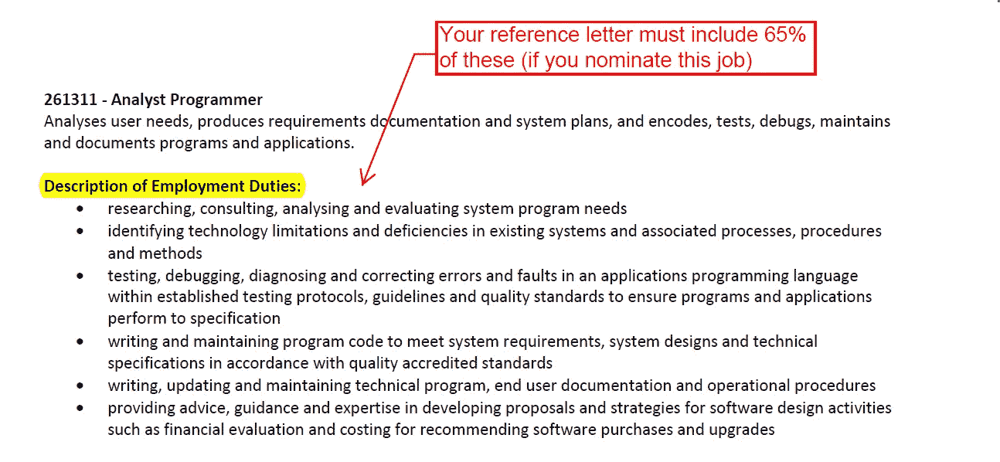

**最后，这里有一封就业推荐信的样本**。(同样，还有许多其他你应该注意的事情和条件可能适用于你个人——因此，我强烈建议你阅读手册第 11 页)

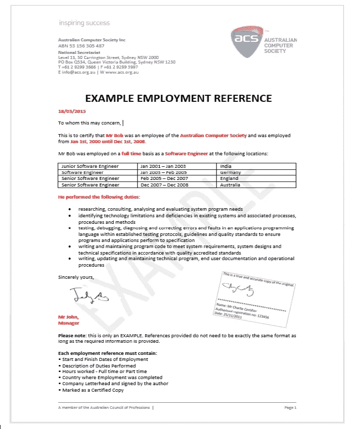

# 最后一个问题:没有相关工作经验怎么办？有替代方案吗？

> 是啊！

幸运的是， **ACS** 还提供了**职业年项目—**

●这个为期一年的培训项目可以弥补任何工作经验的不足

●大约花费 60-70 万卢比

●在技术职业列表中，你还会因为完成这个项目而获得 5 点公关积分。

更多详情和资格标准请点击此处—[https://www . ACS . org . au/CPD-education/professional-year-program . html](https://www.acs.org.au/cpd-education/professional-year-program.html)

好吧，就这样。唷！

当然，还有十亿件其他的小事——但是作为没有工作的数据科学家，在开始我们的项目之前，这些是我们应该知道的事情——这样我们就可以仔细选择我们的选修课。

干杯！

# 参考文献—

1.  **189 签证 DIBP 页及其要求**——【https://www.border.gov.au/Trav/Visa-1/189-#tab-content-1】T4
2.  **申请人技能评估指南** ( **手册**！)—[http://more . ACS . org . au/_ _ data/assets/pdf _ file/0020/7319/Skills-Assessment-Guidelines-for-applicants . pdf](http://more.acs.org.au/__data/assets/pdf_file/0020/7319/Skills-Assessment-Guidelines-for-Applicants.pdf)
3.  **ACS 合适的 ICT 技能评估结果的标准要求概要**—[http://more . ACS . org . au/_ _ data/assets/pdf _ file/0016/7324/Summary-of-Criteria-2014 . pdf](http://more.acs.org.au/__data/assets/pdf_file/0016/7324/Summary-of-Criteria-2014.pdf)
4.  [**ANZSCO 代码描述**](http://more.acs.org.au/__data/assets/pdf_file/0018/7641/ANZSCO-Descriptions-2015.pdf)**——**[http://more . ACS . org . au/_ _ data/assets/pdf _ file/0018/7641/ANZ SCO-Descriptions-2015 . pdf](http://more.acs.org.au/__data/assets/pdf_file/0018/7641/ANZSCO-Descriptions-2015.pdf)
5.  **关于技能评估和评估机构的 DIBP 页面**—[https://www . border . gov . au/Trav/Work/Work/技能评估和评估机构](https://www.border.gov.au/Trav/Work/Work/Skills-assessment-and-assessing-authorities)
6.  **中长期战略技能清单(MLTSSL)——**[https://www . border . gov . au/Trav/Work/Work/Skills-assessment-and-assessing-authorities/skilled-occupations-lists/MLTSSL](https://www.border.gov.au/Trav/Work/Work/Skills-assessment-and-assessing-authorities/skilled-occupations-lists/mltssl)