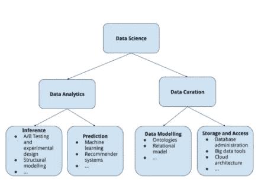

# 面向计算机科学学生、毕业生和软件工程师的数据科学工作

> 原文：<https://towardsdatascience.com/data-science-jobs-for-computer-science-students-grads-and-software-engineers-2fc49a85489a?source=collection_archive---------1----------------------->

数据科学正在迅速从软件工程的一种专门分支扩展到它自己的学科。作为一门学科，它大量利用计算机科学、统计学和数学来实现其主要目标。不幸的是，对于招聘经理来说，这种广度在典型的本科甚至研究生学位中并没有体现出来。尽管大学正慢慢开始引入数据科学课程来解决这一技能短缺问题，但今天的数据科学家主要是那些通过大量自学来弥补正规教育不足的人。

对于自学者来说，好消息是随着数据科学的成熟和组织发展他们的数据科学团队和能力，专业化的机会增加了。这意味着，尽管数据科学团队的成员以前被要求是在数据科学的所有可能领域拥有广泛知识的“独角兽”，但今天许多较大的团队都有专攻某个领域的成员。作为一名计算机科学毕业生或工程师，你在这一领域大有可为。

# 数据监管的机遇

作为一个相对新兴的领域，“数据科学”仍然没有统一的定义，但所有数据科学家都关注两个非常广泛且不同的领域:数据*分析*和数据*管理*。分析是从数据中提取有用的知识。这可能是人们最常与数据科学家联系在一起的广泛活动:数据科学家是处理数字并从数据中产生可操作的见解和预测模型的人。但在数据科学的讨论中，硬币的另一面经常被忽略:沿途某处的某人必须找出如何有效和高效地收集、管理、保存、记录、转换、更改和访问数据，以使分析成为可能。在学术界，这些活动通常被称为数据*管理*，在这一领域能力不强的专业数据科学团队做不了多少事情。

事实上，在一些组织中，相对于监管，历史上一直过度强调分析，这对 2017 年的计算机科学学生、毕业生和工程师来说是个好消息。许多博士统计学家和物理学家因其在分析方面的技能被数据科学团队聘用，而这些团队通常严重缺乏数据监管能力。

在专业领域，数据监管专家的常见头衔包括*数据工程师*、*数据开发人员*或*商业智能开发人员、大数据专家*或有时只是*数据科学家。有计算机科学背景的人在这种职业道路上有很好的开端。物理学家或统计学家可能没有在数据结构或模式或实体关系模型方面受过广泛的培训，但这些都是计算机科学教育的基石。有了这些知识，你就可以直接学习现代科技公司用于数据监管的技术。*

作为一名数据工程师，您至少应该努力深入了解以下内容:

*   关系模型及其各种实现(SQL Server、Oracle 数据库、MySQL 等。).
*   NoSQL 数据库包括:
*   根据[db-engines.com](https://db-engines.com/en/ranking_trend)的说法，文档存储模型，尤其是 MongoDB，是撰写本文时最流行的 NoSQL 数据库。
*   像 Cassandra 这样的宽列数据库。
*   像 Redis 这样的键值存储。
*   尽可能多的处理其他 NoSQL 模型:[这篇维基百科文章](https://en.wikipedia.org/wiki/NoSQL)是一个很好的起点。
*   MapReduce 编程模型及其在 Apache Hadoop 中的实现。
*   云计算平台，比如亚马逊网络服务和微软 Azure。

当然，在我点击“发布”这个帖子的时候，上面提到的具体技术可能会过时，但是概念和想法不会。数据监管专家是数据创建、捕获、建模、管理、文档编制、存储、转换和检索方面的专家，需要熟悉成功的组织用来完成这些任务的所有工具。受过数据结构和计算机科学方面的正规教育和培训的人很有可能成为这些领域的专家，并在数据科学团队中领导数据监管活动。

# 数据分析中的机会

同样，分析可能是大多数人与术语*数据科学家*联系最紧密的领域，与统计学专业或在高度量化领域拥有博士学位的人相比，学习分析需要 cs 专业的正规教育填补更多空白。对计算机科学专业的学生来说，好消息是，与物理学家或纯粹的数学家相比，你将更容易开始使用数据分析的*工具*:作为一名程序员，从示例和文档中学习如何使用新工具是你的第二天性。

记住这一点，您也可以从熟悉这些工具开始。我认识的大多数数据科学家都广泛使用 R 和 Python，有些人更喜欢其中一种。如果你已经知道这些语言中的一种，那么这种语言可能是最好的起点。如果你打算使用 R，我所知道的在数据科学中使用 R 的最佳环境是 [RStudio](https://www.rstudio.com/) ，它是一个 IDE，对交互式编程、编写脚本、制作图形和许多其他分析目标都有很大的支持。如果你想使用 Python，你要安装很多库，把它变成一种数据科学语言；幸运的是，Continuum Analytics 的人们已经构建了一个名为 [Anaconda](https://www.anaconda.com/distribution/) 的 Python 发行版，它附带了用于进行数据科学的主要统计计算库，以及一个名为 Jupyter Notebook 的伟大工具，它以可读的交互式笔记本格式促进计算。顺便提一下，Anaconda 和 Jupyter 笔记本是我们在 BrainStation 即将到来的数据科学课程中使用的主要工具。

从这里开始，一个自然的地方是学习如何使用机器学习来建立一个预测模型。在这里，你可以为不同层次的抽象和理解而努力。为了深入理解各种模型和算法是如何工作的，你需要至少相当于几门本科数学课程的内容:至少两个学期的微积分，至少一个学期的线性代数，可能还有一门概率课程。数据科学团队的成员应该至少具备这种理解水平。也就是说，在 R 中执行线性回归只需要一行代码，使用比这更复杂的模型就行了。从每种算法如何工作的特定细节中抽象出来，有一个更高层次的范式来管理如何用机器学习来构建模型:模型被训练、测试、调整、验证和部署，数据科学家应该理解这个过程中的每一步。有可能实现对如何应用机器学习原理和技术来构建预测模型的高级理解，而不必理解每个特定算法的特定细节。一个很好的起点是 Max Kuhn 的书[应用预测建模](http://appliedpredictivemodeling.com/)，它从试图从真实世界的数据中做出最佳预测的角度介绍了机器学习技术，而不是试图理解任何特定算法或模型的微小细节。参加和研究 [Kaggle 竞赛](https://www.kaggle.com/competitions)也是一个简单地尝试并开始模型制作的好方法。

# 程序员的机会

工具正在被构建，以将极其复杂的机器学习能力带到不一定手头有博士数学家团队的组织。像 [Keras](https://keras.io/) 和 [h2o.ai](https://www.h2o.ai/) 这样的工具包已经在制作了，这样任何有一点编码经验的人都可以轻松地构建生产质量的机器学习应用程序。这为程序员创造了巨大的机会:未来的挑战将不是构建模型，而是将这些现成的工具包集成到他们组织的生产堆栈中，这需要计算机科学知识和编程经验。出于这个原因，对于工程师和程序员来说，现在是开始学习机器学习和数据科学的最佳时机。

**想了解更多关于数据科学的知识吗？**看看我们即将推出的兼职[数据科学课程](http://www.brainstation.io/course/data-science)。