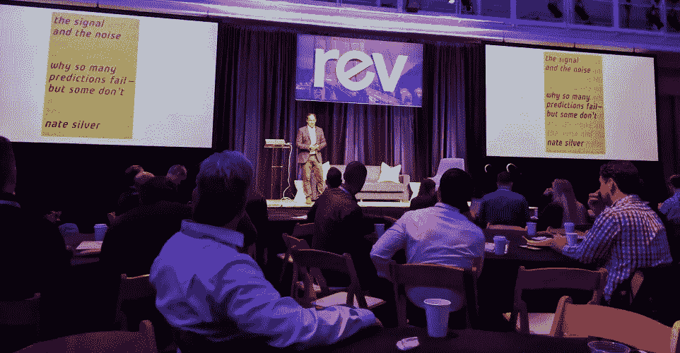

# 数据科学领导者:你们人太多了

> 原文：<https://towardsdatascience.com/data-science-leaders-there-are-too-many-of-you-37bff8088505?source=collection_archive---------1----------------------->

Here’s the audio version of the article, read for you by the author.

[数据科学](http://bit.ly/quaesita_datasci)有问题。[几个问题](http://bit.ly/quaesita_bubble)，其实不过[从头开始](https://www.youtube.com/watch?v=FjJt4P4w8io)，先说一个:领导。

今天，我在[数据科学](http://bit.ly/quaesita_datasci)(横跨[机器学习](http://bit.ly/quaesita_simplest)、[人工智能](http://bit.ly/quaesita_ai)、[统计](http://bit.ly/quaesita_statistics)、[数据汇总和可视化](http://bit.ly/quaesita_analysts)的学科)领导人[峰会上发言。当我看着领导当今数据科学团队的最聪明的开拓者的脸的海洋时，我发现自己在想，*“你们太多了。”*](https://rev.dominodatalab.com/)

Nate Silver of FiveThirtyEight speaking to the same audience of data science leaders

想想这是怎么一回事！在峰会上问任何人，他们可能会告诉你，如果你认为人才短缺很糟糕，那么数据科学领域的领导人才短缺就更糟糕了。

今天的大多数数据科学领导者都是我喜欢称之为“*超越数据科学家*”的人那些追求科学、工程或统计方面正规训练的人，然后，奇迹般地，有一天醒来发现他们更感兴趣的是让数据变得有用，而不是为了追求数学的复杂性。

> 数据科学的领导者克服了所有的困难。

数据科学领导者:*你们太多了，因为你们的存在是排除万难的。因为几乎没有做什么来训练你，你比我们应得的要多。这个幸福的意外是怎么发生的？没有人教你如何做你所做的，所以你的存在是我们的幸运。你的计划是希望在研究了十几年的方程式后，你就能知道如何领导了吗？如何做出好的决策？正如我的 SRE 同事会说的，“希望不是策略。”*

> 你应该有更多的人，但是计划是什么？

如果你喜欢定理，这里有一个:你的时间是有限的，所以如果你用它来学习[费曼](https://en.wikipedia.org/wiki/Richard_Feynman)或[德费内蒂](https://en.wikipedia.org/wiki/De_Finetti%27s_theorem)，你就不会花同样多的时间来培养其他技能。我们不能指望数据科学家超越并立即知道如何成为优秀的领导者和决策者。谁会教他们这些？你不会通过整天写代码或证明定理来学习它。

相反，要成为优秀的领导者和决策者，他们必须谦逊地认识到自己萎缩肌肉中的弱点，并勤奋地掌握第二项技能。有时他们会带着很多伤痕艰难地学习。作为一个一开始就认为[概率论](https://en.wikipedia.org/wiki/Probability_theory)是[宇宙中最热门的东西](https://en.wikipedia.org/wiki/Quark%E2%80%93gluon_plasma)的人，我非常清楚这有多痛苦。

> 有个态度问题。我们真的重视这些技能吗？

如果你的经历和我一样，你可能已经在一个亲数学的亚文化中长大，在这个亚文化中，对任何闻起来像“软”技能的东西表现出蔑视是一种时尚。这都是关于你是多么热衷于熬夜证明一些定理或用你的第六语言编码。当你被夹在那种[视角](https://xkcd.com/435/)中间时，你可能不会想到你应该重视领导力(或者沟通、商业意识、创造力和同理心等)……如果你变得软弱，你的同学会尊重你吗？

> 你称之为“软”技能。我称它们为“最难自动化的”

部分解决方案是改变时尚，让这些技能成为像原始数据科学这样有吸引力的领域中不可或缺的一部分。如果昂首阔步必须是年轻人的一部分，那么让我们至少让他们相信，最高的荣誉是同时拥有两种肌肉。毕竟是事实。

When it comes to ensuring that data science teams are lead effectively, are we relying on luck or training?

> 门槛很高，并不是每个有工作的人都能真正做到。

数据科学领域的领导力不仅仅是一学期的数字。是它自己的怪兽。你不仅必须对决策和信息如何推动行动有深刻的理解，还需要敏锐的嗅觉来发现如何有效地影响特定业务领域的细微差别，如果这还不够，你还需要了解各种技能的生态系统，这些技能需要汇集在一起才能使大规模数据科学项目取得成功。而这只是进入这个游戏的最低要求。

这是一个相当高的门槛，并不是每个领导数据科学团队的人都能达到。雇主们，你怎么知道你是否真的在雇佣一个人来领导你的数据团队呢？如果您的团队已经有了糟糕的数据科学领导，该怎么办？你怎么知道的？几乎没有任何关于这个角色的智慧可供你依靠。你能问谁呢？

> 数据科学是泡沫吗？

当今世界正在产生前所未有的数据。然而，有时我会被问到类似这样的问题， [*“数据科学是泡沫吗？”*](http://bit.ly/quaesita_bubble) 我希望我能回答，坚定而有说服力，*“肯定不会！”*事实是，这要看情况。可悲的是，当我与各行各业的人聊天时，我不断听到同样的故事:*“我们的数据科学家毫无用处！他们所做的就是坐着发表论文。”我们会有足够多有经验的领导者来防止这种太普遍的现象吗？如果数据科学家不能证明自己的价值，他们不会在这些岗位上呆很久。*

期望一个刚毕业的科学博士知道如何对商业做出有意义的贡献是不公平的。那不是他们花了那么多年学的东西。如果没有了解数据科学所涉及的内容并知道如何将数据与业务联系起来的人的指导，他们将面临重重困难。为了确保数据科学不是泡沫，我们迫切需要专业化的领导。它将从哪里来？

> 数据科学领导者的培训项目在哪里？希望不是策略。

人们，让我们感激我们是多么幸运！不知何故，优秀的数据科学领导者确实存在，技能也在那里。不是有效获得的技能，因为双重掌握是连续获得的，也许很痛苦，但仍然是正确的技能。我希望你和我一样强烈地感受到这种紧迫性。我们中少数几个经历了艰难困苦的人需要开始用更好的方式训练我们更多的人。

就我而言，我承诺尽我的一份力量。在过去的几年里，我一直在谷歌努力培养新一代的[思考者](http://bit.ly/quaesita_first)，定位于作为团队的一员有效地领导或工作，专注于将数据科学应用于实际问题。为了培养正确的技能，我们从数据科学和工程中汲取了一些想法，并用行为科学和管理科学对其进行了补充。结果只是看起来跨学科，直到你看到共同的核心:决策和驱动它们的信息。这就是为什么我们开始称它为[决策智能](http://bit.ly/quaesita_di)(不过如果你愿意，你也可以把它当成应用数据科学++来看待)。

> 让我们培养一种新的思考者:拥有让数据科学团队成功的技能的决策者。

我一直认为，数据科学是一项受益于技能多样性的团队运动，所以我设计了我们的培训计划，以鼓励各种背景的人参与进来。事实证明，伟大的数据科学领导者不一定是被超越的数据科学家。

我为我们在谷歌员工中培养这些技能所取得的成就感到骄傲…但这还不够。没有必要让每个人都依赖快乐的意外和完全沉浸在一个以上的学科中来建立相同的技能。我希望阅读这篇文章至少能激发一些了解数据科学决策者技能的人和我一起认识到数据科学本身就是一门学科，并尽可能广泛地分享我们的智慧。

# 感谢阅读！YouTube 课程怎么样？

如果你在这里玩得开心，并且你正在寻找一个为初学者和专家设计的有趣的应用人工智能课程，这里有一个我为你制作的娱乐课程:

Enjoy the entire course playlist here: [bit.ly/machinefriend](http://bit.ly/machinefriend)

# 与凯西·科兹尔科夫联系

让我们做朋友吧！你可以在[推特](https://twitter.com/quaesita)、 [YouTube](https://www.youtube.com/channel/UCbOX--VOebPe-MMRkatFRxw) 和 [LinkedIn](https://www.linkedin.com/in/kozyrkov/) 上找到我。有兴趣让我在你的活动上发言吗？使用[表格](http://bit.ly/makecassietalk)联系。