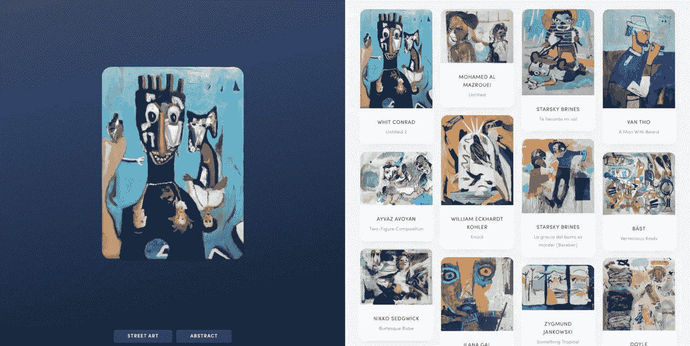
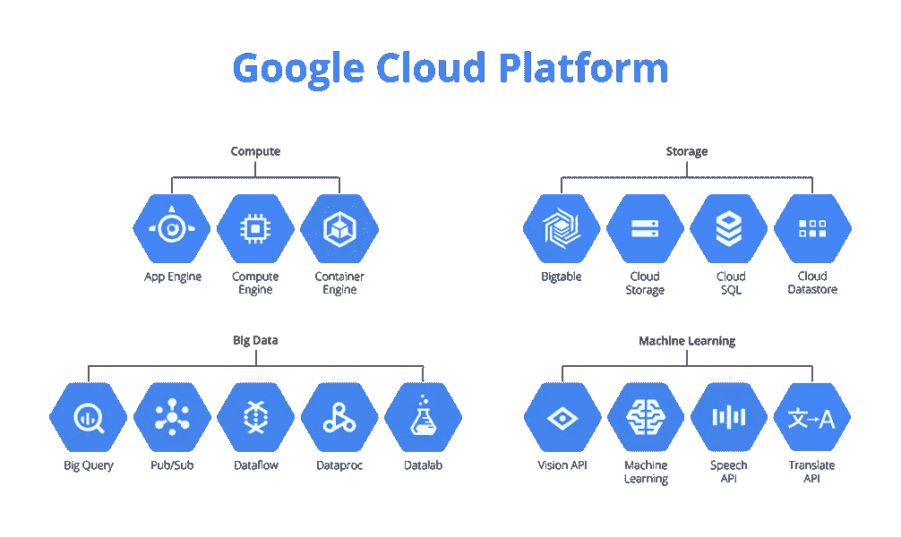
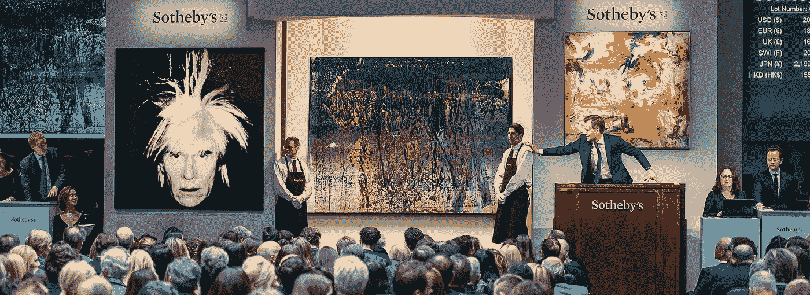

# 艺术的数据科学、机器学习和人工智能

> 原文：<https://towardsdatascience.com/data-science-machine-learning-and-artificial-intelligence-for-art-1ac48c4fad41?source=collection_archive---------2----------------------->

## 在[苏富比](https://medium.com/u/8dd1ecf3fe29?source=post_page-----1ac48c4fad41--------------------------------)与[线程天才](https://medium.com/u/48d331020f0e?source=post_page-----1ac48c4fad41--------------------------------)团队见面

数据科学、机器学习和人工智能是计算机科学中已经渗透到世界各地许多行业和公司的领域。它们的采用几乎肯定与过去十年“大数据”的[崛起](https://trends.google.com/trends/explore?date=all&q=big%20data)有关。

高级数据分析有可能改变公司理解见解、组织活动和创造价值的方式。编程语言、开源库和云计算的进步也使得这些方法更容易有效地应用于数据。

到目前为止，艺术品市场仍然是一个数据分析革命尚未真正开始的领域。

这篇博客文章将解释最先进的数据科学、机器学习(ML)和人工智能(AI)方法如何被 [Thread Genius](https://medium.com/u/48d331020f0e?source=post_page-----1ac48c4fad41--------------------------------) 用于艺术市场，该公司被世界上最古老的国际拍卖行[苏富比](http://www.sothebys.com/en.html)收购。1744).我会给你一些关于我们团队动态的见解，我们正在解决的问题以及我们是如何做的。

An auction at Sotheby’s in 1957

## 机器学习和人工智能到底是什么？

这个问题问得好。首先，**数据科学**是一门使用和分析数据来测试假设、回答问题和理解见解的学科。

**机器学习**是利用计算工具和统计技术赋予计算机从数据中学习的能力。[来自](https://medium.com/u/2a2ae028a675?source=post_page-----1ac48c4fad41--------------------------------) [Google Cloud](https://medium.com/u/4f3f4ee0f977?source=post_page-----1ac48c4fad41--------------------------------) 的 Yufeng在[他的文章](/what-is-machine-learning-8c6871016736):*用数据回答问题*中使用了一个更精炼的定义。

**人工智能**是指计算工具开始拥有认知能力——出于本文的目的，AI 将指的是使用人工神经网络的[“深度学习”技术](https://medium.freecodecamp.org/want-to-know-how-deep-learning-works-heres-a-quick-guide-for-everyone-1aedeca88076)。

## 谁是线程天才？

Thread Genius 是一家人工智能初创公司，由 [Ahmad Qamar](https://medium.com/u/74ee0905879d?source=post_page-----1ac48c4fad41--------------------------------) 和 [Andrew Shum](https://medium.com/u/c54aeb9b6127?source=post_page-----1ac48c4fad41--------------------------------) 于 2015 年创立，并于 2018 年 1 月被[苏富比](https://medium.com/u/8dd1ecf3fe29?source=post_page-----1ac48c4fad41--------------------------------)收购。两位创始人[在创办 Thread Genius](https://techcrunch.com/2018/01/25/sothebys-acquires-thread-genius-to-build-its-image-recognition-and-recommendation-tech/) 之前都曾在 Spotify 工作。其技术的主要用途是一个视觉搜索引擎，该引擎使用人工神经网络为时尚行业应用深度学习技术。

Thread Genius using deep learning to identify similar handbags

通过训练人工神经网络，Thread Genius 能够从图像中识别服装，以找到视觉上相似的服装。阅读他们的媒体文章[“机器人比尔·坎宁汉:用深度神经网络实现时尚的 Shazam”](https://medium.com/machine-intelligence-report/robo-bill-cunningham-shazam-for-fashion-with-deep-neural-networks-7126ea39197b)了解更多信息。

有趣的是，Thread Genius 还将这项技术应用于艺术:阅读[“艺术天才:用视觉搜索发现艺术品”](https://medium.com/sothebys/art-genius-1260726bfebd)了解更多信息。

Art Genius — Thread Genius using deep learning to identify similar art

## 我们的团队是如何分解的？

现在，Thread Genius 是一个由机器学习工程师、软件和数据工程师、数据科学家和设计师组成的不断壮大的团队，总部位于纽约市的苏富比。

我们最初的努力包括大规模数据管道的软件开发，用于清理和标准化历史苏富比的数据宝藏，以便我们可以进行数据分析并大规模应用 ML 和 AI。

[阅读](https://www.fastcompany.com/40575641/can-ai-have-good-taste-auction-giant-sothebys-is-counting-on-it) [Fast Company](https://medium.com/u/ada2289350de?source=post_page-----1ac48c4fad41--------------------------------) 关于我们的这篇文章了解更多详情。

## 我们试图解决的是什么？

那么，我们试图通过使用和分析数据来检验的假设和回答的问题是什么呢？

The galleries at Sotheby’s New York

苏富比拥有艺术市场中一些最好的数据，包括历史交易、每个价位的个人艺术偏好、图像、物品和艺术品信息等等。通过有效利用这些数据，我们希望实现以下任务:

**利用苏富比的梅·摩西数据库。**这体现了我们围绕分析艺术作为一种资产所做的努力。Sotheby's Mei Moses 数据集是一个独特的数据库，包含八个收藏类别中超过 50，000 次重复拍卖——最早记录的拍卖是在 17 世纪初！它是由纽约大学斯特恩商学院教授梅建平博士和迈克尔·摩西博士于 2002 年首次开发的——[点击此处阅读学术论文](https://pdfs.semanticscholar.org/ac7b/1a85db923965d5f229cfda92ab4f24509f6d.pdf)。

该数据集使用同一幅画在两个不同时刻的购买价格(即重复销售)来衡量独特艺术品的价值变化。我们计划使用这些信息来分析独特物品的价值如何随着时间的推移而变化，并将艺术品作为资产的投资业绩与其他资产类别的投资业绩进行比较。

**解锁供给。如果我们的客户选择出售他们的艺术品，我们希望让他们更容易这样做。我们的目标是使用数据来提供更低的壁垒，以帮助人们出售他们的艺术。我们目前正在开发产品，通过各种机器学习技术来提供价格透明度。**

**一个推荐引擎。**在收购之前，Thread Genius 专门研究使用卷积神经网络的基于味道的图像识别和推荐技术。通过使用苏富比的数据，我们将使用深度学习向我们的客户推荐将要出售的艺术品或物品。

**打造最好的数据产品。**通过将这三项任务整合在一起，我们的目标是提高运营效率，打造艺术品市场中最好的数据产品，以便我们的客户在苏富比参与艺术品交易时能够获得最佳体验和透明信息。

## 我们要怎么做？

我们主要使用 [Google Cloud](https://medium.com/u/4f3f4ee0f977?source=post_page-----1ac48c4fad41--------------------------------) 平台来完成我们的所有工作——从 [Dataprep](https://cloud.google.com/dataprep/docs/) 中的数据清理，从[数据流](https://cloud.google.com/dataflow/)中的数据处理和标准化，到[大查询](https://cloud.google.com/bigquery/)中的数据存储，在 [Datalab](https://cloud.google.com/datalab/) 中的数据分析，最后，ML 和 AI 使用 GCP 的[整套机器学习能力](https://cloud.google.com/products/machine-learning/)。

我们主要用 Python 编码，但是我们的软件开发人员正在使用 Node 和 Ruby 进行后端开发。我们将为上面列出的一些任务构建自定义应用程序。

Various products and software offered by Google Cloud Platform

## 为什么这个问题很难

虽然我们正在使用先进的数据分析来理解来自图像和数据的见解，但艺术从根本上来说是主观的——无论是在价值上还是在品味上。

每当我们从分析中发现见解时，对照我们的专家所拥有的领域知识来验证它们是至关重要的。在整个过程中，人的参与是非常重要的。我们很幸运，苏富比拥有世界上最好的艺术专家，他们可以全程帮助我们。

此外，这将是第一次有人在艺术市场上做这样的事情——我们基本上是在一张空白的画布上工作。像这样的挑战非常令人兴奋，我们很高兴能够为未来的发展指明方向。

Auction of Contemporary Art at Sotheby’s New York

## 想帮我们吗？

苏富比的目标一直是成为艺术市场创新和技术的领导者，并支持艺术和技术的未来。

我们很高兴能够在艺术市场应用先进的机器学习和人工智能，并与我们在苏富比的专家直接合作，以便我们能够创造出业内最好的数据产品。

如果你有数据科学、机器学习、NLP 和/或人工智能方面的背景，并且对改变世界感兴趣，请随时与我们联系，我们总是有兴趣与你，我们的观众交谈。

随着我们继续迈向数据科学的旅程，我们将继续在这份出版物上撰写关于我们项目的更多细节，敬请关注！

感谢您的阅读，

Vishal

## 在你离开之前…

*如果您觉得这篇文章很有帮助，请按住👏按钮，在脸书、推特或 LinkedIn 上分享这篇文章，这样每个人都能从中受益。*

Vishal 是苏富比 Thread Genius 的前沿数据科学家。你可以在 [*LinkedIn*](https://www.linkedin.com/in/vishalkumarlondon/) *或* [*上通过邮箱*](mailto:vishal.kumar@sothebys.com) *与他取得联系。*