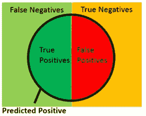
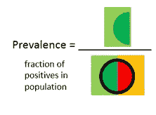
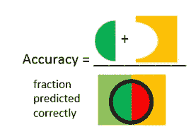
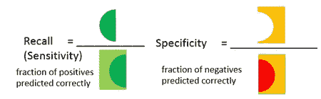
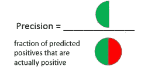
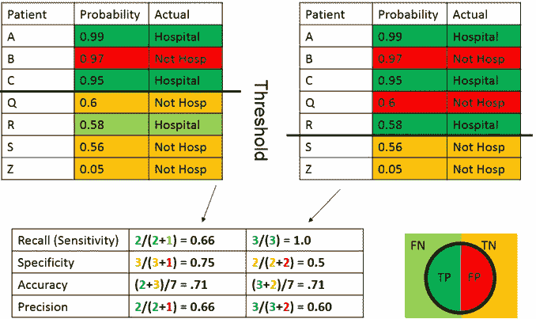
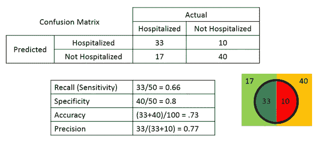
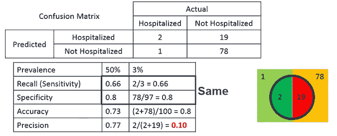

# 面向所有人的数据科学性能指标

> 原文：<https://towardsdatascience.com/data-science-performance-metrics-for-everyone-4d68f4859eef?source=collection_archive---------2----------------------->

准确性、召回率、精确度、灵敏度、特异性……—数据科学家使用如此多的性能指标！你如何向非技术背景的观众解释它们？作为一名数据科学家，我发现向每个人描述这些概念对我的工作来说既有挑战性、有趣又至关重要。这篇博文将使用普通的语言和图片来解释许多绩效指标，这样你公司的每个人都能理解它们。

最近，我开发了一个机器学习模型，来预测下周哪些接受透析的患者将被送入医院。这个模型在我的公司(费森尤斯医疗护理北美公司)受到了很多关注，所以我向包括数据科学家、数据分析师、护士、医生甚至高管在内的广泛受众介绍了这个模型的细节。根据经验，我知道每个人对“准确性”的解释都不一样，所以我必须非常小心地解释性能指标及其含义。

通过这篇博文，我们将使用预测下周哪些病人将住院的例子。这是一个分类问题的示例，我们试图预测每个患者是否应该被放入预测阳性组(即预测将住院)或预测阴性组(即预测将不住院)，如下所示。

预测模型很少能完美地预测一切，因此有许多性能指标可用于分析我们的模型。像我这样的数据科学家喜欢看方程，但这在非技术背景的人的演示中很少奏效。如果你想阅读一篇使用等式作为性能指标的文章，我强烈推荐威廉·科尔森最近的[文章](/beyond-accuracy-precision-and-recall-3da06bea9f6c)。

当你对你的人口进行预测时，你的结果可以分为如下所示的 4 个部分(本文中的数字是受[维基百科](https://en.wikipedia.org/wiki/Precision_and_recall#/media/File:Precisionrecall.svg)的启发):

*   真阳性:住院的人，你预测他们会住院
*   真正的负面因素:没有住院的人，你预测他们不会住院
*   误报:没有住院的人，你预测他们会住院
*   假阴性:你预测住院的人不会住院

在我们继续之前，让我们把患病率这个术语定义为人口中的阳性部分。在我们的例子中，大约 2%的透析人群将在一周内住院(即患病率= 2%)。

## 4 项绩效指标

最常见的性能指标是准确性，它被定义为您正确预测的分数，如下所示

当描述一个模型时，这个度量并不总是最好的。例如，如果你总是预测人们不会住院，你的准确率将是 98%，但你不会预测任何实际住院。

为了解决这个问题，数据科学家使用其他指标来代替。两个常见的是回忆(也称为敏感性)和特异性。在我们的例子中，回忆是指你预测所有住院病人中有多少人会住院。特异性是你预测在所有未住院的人中，有多少人不会住院。

数据科学家使用的另一个性能指标是精确度。在我们的例子中，这将是所有你预测要住院的人中实际住院的比例。

到目前为止，我们还没有讨论预测模型如何将患者分配为预测住院或预测不住院。在大多数情况下，预测模型将给出阳性(即住院)的概率。我们可以选择哪些概率被指定为预测正和预测负。如下所示，我们可以调整这个阈值，这会改变性能指标，这通常会导致指标之间的权衡。例如，降低阈值会增加灵敏度，但会降低特异性。

## 两个真实的例子

在一些演示中，我发现这些抽象的定义直到你为模型提供一个实际的有形数字的表格才被理解。让我们通过两个例子来展示流行对某些固定阈值的影响。在第一个例子中，我们假设患病率为 50% (50%住院，50%未住院)。给定 100 名患者，我们有以下分解和性能指标。

在第二个例子中，让我们假设患病率为 3% (3%住院，97%未住院)

我们可以看到，不同的患病率在两个例子之间保持了相同的灵敏度和特异性，但准确度和精密度发生了变化。事实上，当您的患病率较低时，通常您的精确度较低(即，预计住院人数比实际住院人数多得多)。

## 结论

在本文中，我们讨论了 4 个性能指标(准确度、灵敏度、特异性和精确度)。我们还讨论了流行度如何影响性能指标，特别证明了流行度越低，精度越低。如果您有兴趣，我推荐您阅读其他高级性能指标，如曲线下面积(AUC)或 F1。