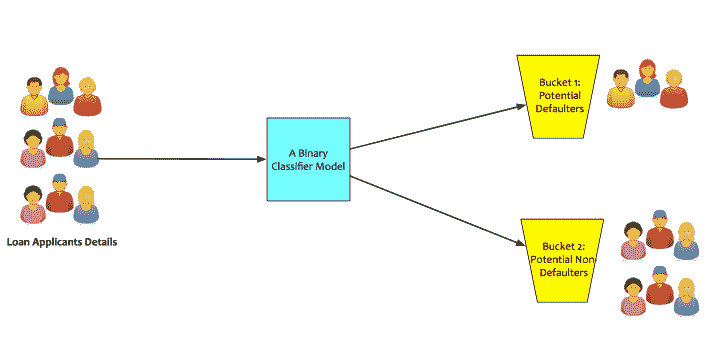
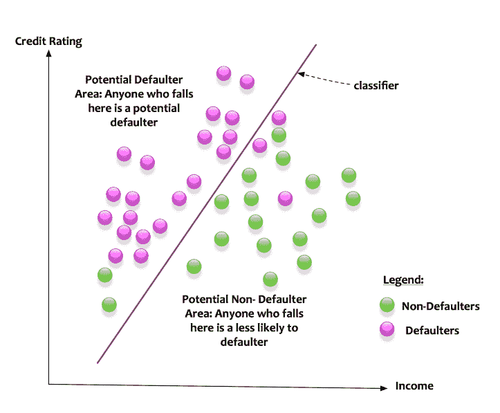
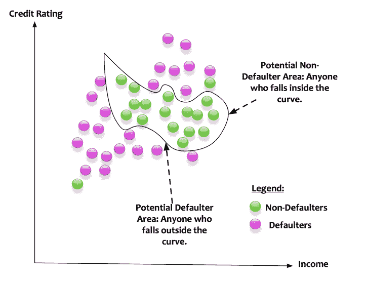
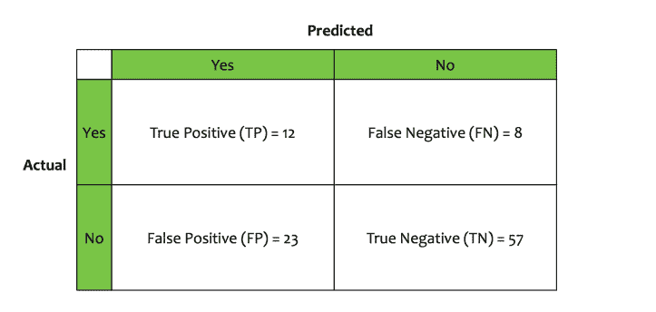
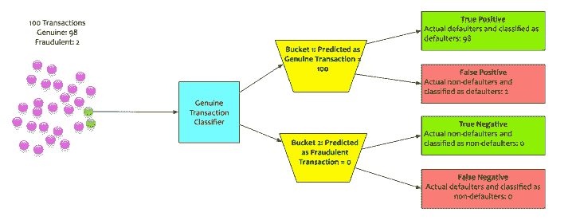
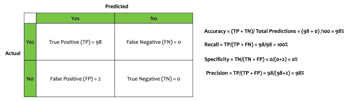
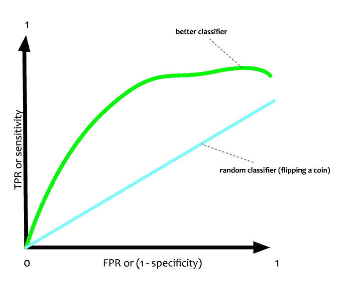
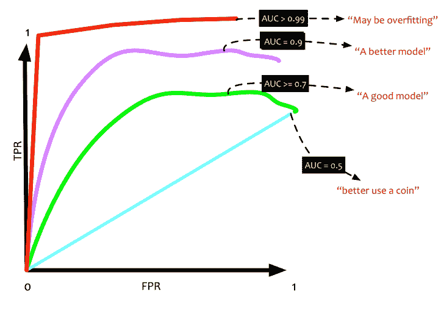

# 数据科学简化版第 10 部分:分类模型介绍

> 原文：<https://towardsdatascience.com/data-science-simplified-part-10-an-introduction-to-classification-models-82490f6c171f?source=collection_archive---------1----------------------->

韦伯斯特对分类的定义如下:

> 根据已建立的标准在组或类别中的系统安排。

周围的世界充满了量词。分类器有助于防止垃圾邮件。分类器有助于识别可能流失的客户。分类器有助于预测是否会下雨。这种监督学习方法在商业应用中无处不在。我们认为这是理所当然的。

在这篇博文中，我将讨论分类模型的关键概念。

# 分类类别

回归模型估计数值变量，也称为因变量。对于回归模型，目标总是一个数字。分类模型有一个定性目标。这些目标也称为类别。

在大量的分类问题中，目标被设计成二元的。二进制意味着目标将只取一个 ***0 或*1**值。这些类型的分类器被称为二元分类器。让我们举个例子来理解这一点。

回归模型估计数值变量，也称为因变量。对于回归模型，目标总是一个数字。分类模型有一个定性目标。这些目标也称为类别。

在大量的分类问题中，目标被设计成二元的。二进制意味着目标将只接受 0 或 1 值。这些类型的分类器被称为**二元分类器。**让我们举个例子来理解这一点。一家银行的贷款审批部门希望使用机器学习来识别潜在的贷款违约者。在这种情况下，机器学习模型将是一个分类模型。根据模型从输入的数据中获得的信息，它会将贷款申请人分为两类:

*   第一桶:潜在违约者。
*   第二桶:潜在的非违约者。

在这种情况下，目标将是一个类似于“ ***will_default_flag”的属性。*** “这个目标将适用于每一个贷款申请人。它的值为 0 或 1。如果模型预测为 1，则意味着申请人很可能违约。如果模型预测它为 0，这意味着申请人可能不会违约。一些分类器还可以将输入分类到许多桶中。这些分类器被称为**多类分类器。**

# 线性和非线性分类器

假设我们想要建立一个分类器，对潜在的贷款违约者进行分类。收入和信用评级的特征决定了潜在的违约者。

上图描述了这个场景。为了简单起见，让我们说特征空间是收入和信用评级的交集。绿点表示未违约，粉点表示违约。分类器基于数据的输入特征(收入和信用评级)进行学习。分类器创建一条线。这条线将特征空间分成两部分。分类器创建一个模型，以下列方式对数据进行分类:

*   任何落在线左侧的人都是潜在的违约者。
*   任何落在线左侧的人都是潜在的非违约者。

分类器可以用一条线分割特征空间。这种分类器称为线性分类器。

在这个例子中，只有两个特征。如果有三个特征，分类器将适合将平面分成两部分的平面。如果有三个以上的特征，分类器创建一个超平面。

这是一个过于简单的场景。一条线或一个平面可以将数据点分成两个桶。如果数据点以下列方式分布会怎样:

在这里，线性分类器无法施展它的魔法。分类器需要绘制一条曲线来区分违约者和非违约者。这种分类器被称为非线性分类器。

有很多算法可以用来创建分类模型。像逻辑回归这样的算法是很好的线性分类器。其他如神经网络是良好的非线性分类器。

分类器的直觉如下:

> *用函数(线性或非线性)划分特征空间。对其进行划分，使特征空间的一部分包含来自一个类的数据。特征空间的另一部分具有来自其他类别*的数据

我们对分类器如何工作有一种直觉。我们如何衡量一个分类器做得好不好？这里出现了**的概念*混乱矩阵。***

让我们举个例子来理解这个概念。我们建立了一个贷款违约分类器。这个分类器接受输入数据，对其进行训练，然后是它学习的内容。

*   分类器将 35 名申请人归类为违约者。
*   分类器将 65 名申请人归类为非违约者。

基于分类器执行的方式，又导出了四个度量:

1.  在那些被归类为违约者 的 ***中，只有 12 人是实际违约者。这个度量被称为**真阳性(TP)。*****
2.  在被归类为违约者 的 ***中，有 23 人实际上没有违约。这个指标被称为**假阳性(FP)。*****
3.  在那些被归类为非违约者 的 ***中，只有 57 人是真正的非违约者。这个度量被称为**真负值(TN)。*****
4.  在被归类为非违约者的*中，有 8 人是实际违约者。这个指标被称为**假阴性(FN)。***

*这四个指标可以列表成一个矩阵，称为 ***混淆矩阵。****

**

*从这四个度量中，我们将为分类器导出**评估度量**。让我们来讨论这些评估指标。*

# *精确度:*

***准确性**衡量分类器对真阳性和真阴性情况的正确率。数学上，它被定义为:*

> **准确率=(真阳性+真阴性)/总预测。**

*在这个例子中，贷款违约分类器的精度是:(12+57) / 100 = 0.69 = 69%。*

# *敏感性或回忆:*

***回忆**测量分类器获得正确真值的次数。数学上，它被定义为:*

> **召回=真阳性/(真阳性+假阴性)**

*在示例中，贷款违约分类器的召回率是:12/(12+8) = 0.60 = 60%。*

# *特异性:*

***特异性**衡量分类器获得正确否定的次数。数学上，它被定义为:*

> **特异性=(真阴性)/(真阴性+假阳性)**

*在示例中，贷款违约分类器的特异性为:57/(57+23) = 0.7125 = 71.25%。*

# *精度:*

*精度衡量预测为正的总数中实际为正的有多少。数学上，它被定义为:*

> **精度=(真阳性)/(真阳性+假阳性)**

*在这个例子中，贷款违约分类器的精度是:12/(12+23) = 0.48 = 48%。*

*这些是很多指标。我们应该依赖哪些指标？这个问题在很大程度上取决于业务环境。在任何情况下，一个单独的度量标准都不能给出分类器有多好的全貌。让我们举一个例子。*

**

*我们建立了一个识别欺诈交易的分类器。该分类器确定交易是否真实。历史模式显示，每 100 笔交易中就有两笔欺诈交易。我们构建的分类器具有以下混淆矩阵。*

**

*   *准确率为 98%*
*   *召回率是 100%*
*   *精确度为 98%*
*   *特异性为 0%*

*如果这种模型是基于准确性、召回率和精确度的标准来部署的，那么公司肯定会完蛋。虽然这个模型表现很好，但事实上，它是一个愚蠢的模型。它没有做它应该做的事情，即标记欺诈交易。这个模型最重要的指标是特异性。其特异性为 0%。*

*因为不能依赖单一的度量来评估分类器，所以创建了更复杂的度量。这些复杂的指标是上述所有指标的组合。这里解释几个关键的。*

# *F1 分数:*

*F1 分数是精确度和召回率之间的调和平均值。常规平均值平等对待所有值。调和平均值对较低值给予更大的权重。因此，只有在召回率和精确度都很高的情况下，分类器才会得到高的 F1 分数。它被定义为:*

> **F1 = 2x(精度 x 召回)/(精度+召回)**

# *受试者工作特征(ROC)和曲线下面积(AUC):*

*接收机工作特性又名 **ROC** 是一个视觉指标。这是一个二维的情节。它在 X 轴上具有假阳性率或 1-特异性，在 Y 轴上具有真阳性率或灵敏度。*

**

*在 ROC 图中，有一条线测量一个 ***随机分类器*** 将如何预测 TPR 和 FPR。它是直的，因为它有相等的概率预测 0 或 1。*

*如果一个分类器做得更好，那么与 FPR 相比，它应该具有更大比例的 TPR。这将把曲线推向西北方向。*

*曲线下面积(AUC)是 ROC 曲线的面积。如果 AUC 是 1，即 100%,这意味着它是一个完美的分类器。如果 AUC 是 0.5，即 50%，这意味着分类器不比掷硬币好。*

**

*有很多评估指标来测试一个分类器。分类器需要根据业务环境进行评估。需要根据上下文选择正确的指标。没有一个神奇的标准。*

# *结论*

*在这篇文章中，我们已经看到了分类器的基础知识。分类器在数据科学中无处不在。有许多实现分类器的算法。各有各的优缺点。我们将在本系列的后续文章中讨论一些算法。*

**原载于 2017 年 9 月 18 日*[*datascientia . blog*](https://datascientia.blog/2017/09/18/dss-p10-class-models/)*。**