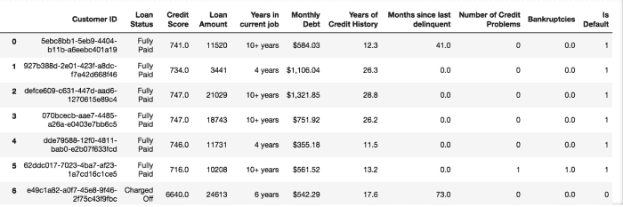
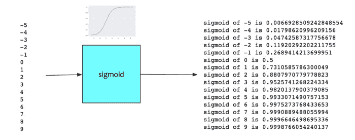
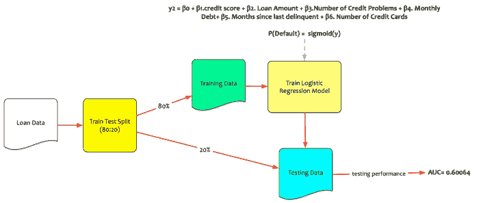

# 数据科学简化版第 11 部分:逻辑回归

> 原文：<https://towardsdatascience.com/data-science-simplified-part-11-logistic-regression-5ae8d994bf0e?source=collection_archive---------4----------------------->

在本系列的最后一篇博文中，我们讨论了分类器。讨论了分类器的类别以及如何对它们进行评估。我们还深入讨论了回归模型。在这篇文章中，我们将深入探讨回归模型如何用于分类任务。

***Logistic 回归*** 是一种广泛用于分类任务的回归模型。像往常一样，我们将通过例子来讨论。

没有一家货币银行向我们提出问题。该银行希望建立一个模型，预测他们的哪些客户会拖欠贷款。提供的数据集如下:

有助于我们构建模型的功能包括:

*   客户 Id:唯一的客户标识
*   信用评分:介于 0 和 800 之间的数值，表示借款人信用历史的风险。
*   贷款金额:这是完全还清的贷款金额或违约金额。
*   当前工作年限:一个分类变量，表示客户在当前工作中已经工作了多少年。
*   信用记录年数:自客户信用记录第一次录入以来的年数
*   月债务:客户现有贷款的月付款额
*   信用问题的数量:客户记录中信用问题的数量。
*   IsDefault:这是目标。如果客户违约，那么它将 1 否则它 0。

这是一个分类问题。

逻辑回归是回归模型的化身。它将回归模型转换为分类器。让我们首先理解为什么普通回归模型不能作为分类器。

默认情况下，目标值为 0 或 1。我们可以把它重新定义为一种概率。重新架构如下:

*   如果违约概率> = 0.5，则客户将违约，即 IsDefault = 1
*   如果违约概率< 0.5 then the customer will not default i.e. IsDefault = 0

Recall our discussion on Linear Regression Model. In the regression model, we had defined an dependent variable **y** 是自变量的函数。为了简单起见，让我们假设我们只有一个自变量 **x** 。等式变成了。

> y = β0 + β1.x

*   β0 是截距。
*   β1 是 x 的系数。

在贷款违约模型的例子中，Tim 使用信用评分作为自变量。因变量(y)是客户违约概率的估计值，即 ***P(违约)*** 。

该等式可以写成:

> p(违约)= β0 + β1 .信用评分

Tim 在统计软件包上运行回归模型。统计软件包为β0 和β1 提供了以下系数:

*   β0 = 0.73257
*   β1 = -9.9238e-05

估计违约概率的等式现在变成了:

> p(默认值)= 0.73257 + -9.9238e-05。信用评分

如果某人有很高的信用评分，比如 8000，那么他会不会违约？让我们引入一些值并检查一下。

> 0.73257+-9.9238 e-05 x 8000 =-0.06134。

如果我们用信用评分和回归线绘制 p(违约),我们会得到以下曲线:

传统回归模型面临挑战。数字-0.06334，一个负概率，没有意义。从图表中也可以明显看出。对于信用分高的，概率小于零。概率需要介于 0 和 1 之间。

怎么做才能把等式转换成概率总是在 0 和 1 之间？

这就是 T2 乙状结肠 T3 的用武之地。

sigmoid 或**逻辑** 函数是具有特征“S”形曲线或 sigmoid 曲线的数学函数。数学上，它定义如下:

> sigmoid = ey/(1+ey)

乙状结肠的形状如下:

它转换 0 和 1 之间的所有值。假设我们有一组从-5 到 10 的数字。当使用 sigmoid 函数对这组数字进行变换时，所有值都在 0 和 1 之间。

这变得有趣了。使用 sigmoid，任何数字都可以转换成等价的概率分数。

既然我们有了将目标转化为概率的方法，让我们看看它是如何工作的。使用 sigmoid 函数转换后的回归方程如下:

> y = β0 + β1 .信用评分
> 
> p(默认值)= ey/(1 + ey)
> 
> p(默认值)= sigmoid(y)

让我们来看看当信用评级较高(即 8000)时，sigmoid 模型的表现如何

> y = 0.73257+-9.9238 e-05 x 8000 =-0.06134。
> 
> p(默认值)= sigmoid(y)= sigmoid(-0.06134)= 0.4846
> 
> p(默认值)= 48.46% => IsDefault = 0

可以通过添加更多的变量来增强逻辑回归模型。我们需要做的就是把简单的线性回归模型提升为多元回归模型方程。这种模型的一个例子如下:

> y2 = β0 + β1 .信用评分+ β2。贷款金额+ β3。信用问题数+ β4。月负债+ β5。自上次拖欠后的月数+ β6。信用卡数量
> 
> p(默认)= sigmoid(y2)

让我们试着用这个模型来预测潜在的违约者。贷款数据集按 80:20 的比例分为训练集和测试集(80%训练，20%测试)。

回想一下，有许多度量来评估分类器。我们将使用 AUC 作为模型评估的指标。让我们看看新型号的性能如何。机器学习程序用于评估测试数据上的模型性能。

新型号性能不太好。测试数据的 AUC 分数约为 60%。

我们现在了解逻辑回归模型的工作原理。我们现在知道它是如何构建分类器的。分类器的 AUC 分数不好。我们需要寻找更好的模型。在本系列的下一篇文章中，我们将研究交叉验证。

*原载于 2017 年 10 月 2 日*[*datascientia . blog*](https://datascientia.blog/2017/10/02/data-science-simplified-part-11-logistic-regression/)*。*