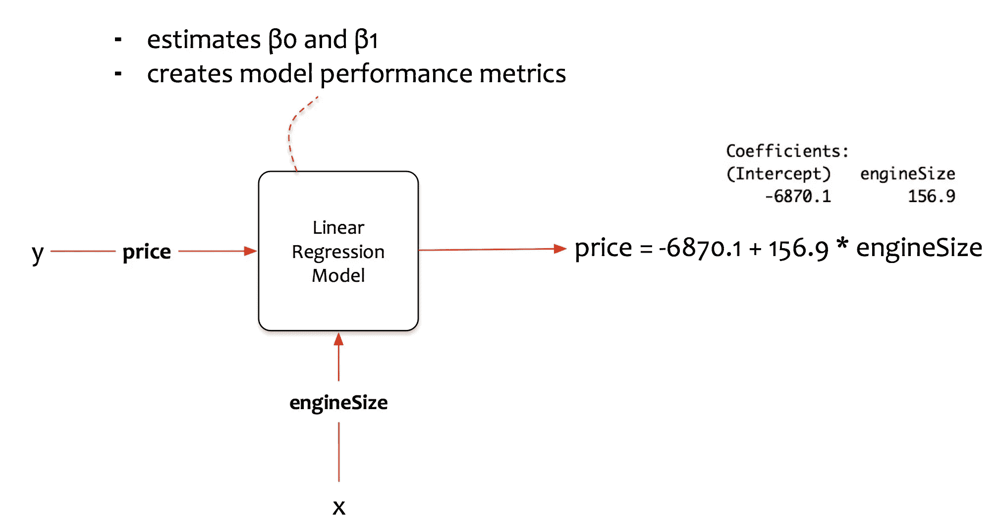
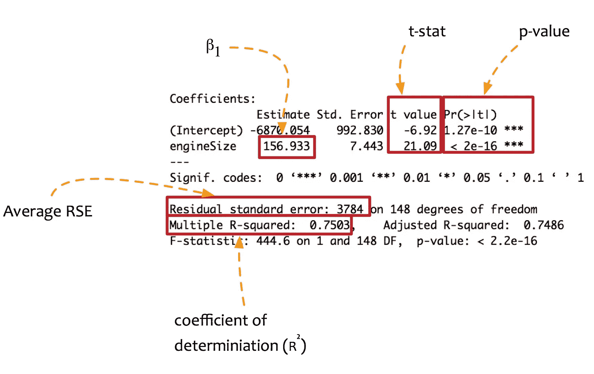
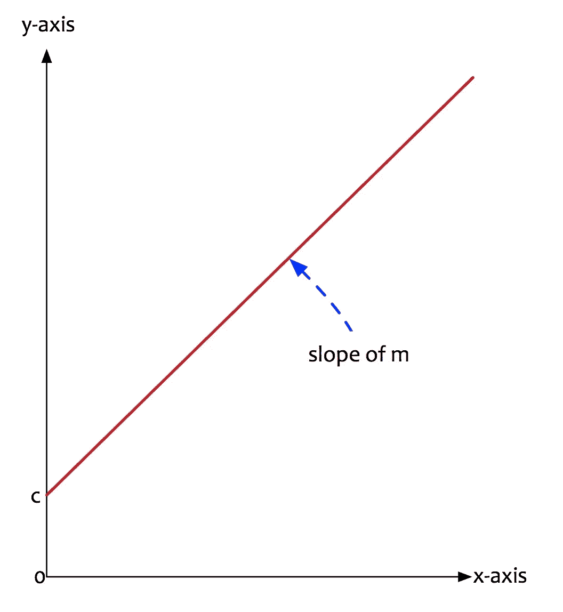
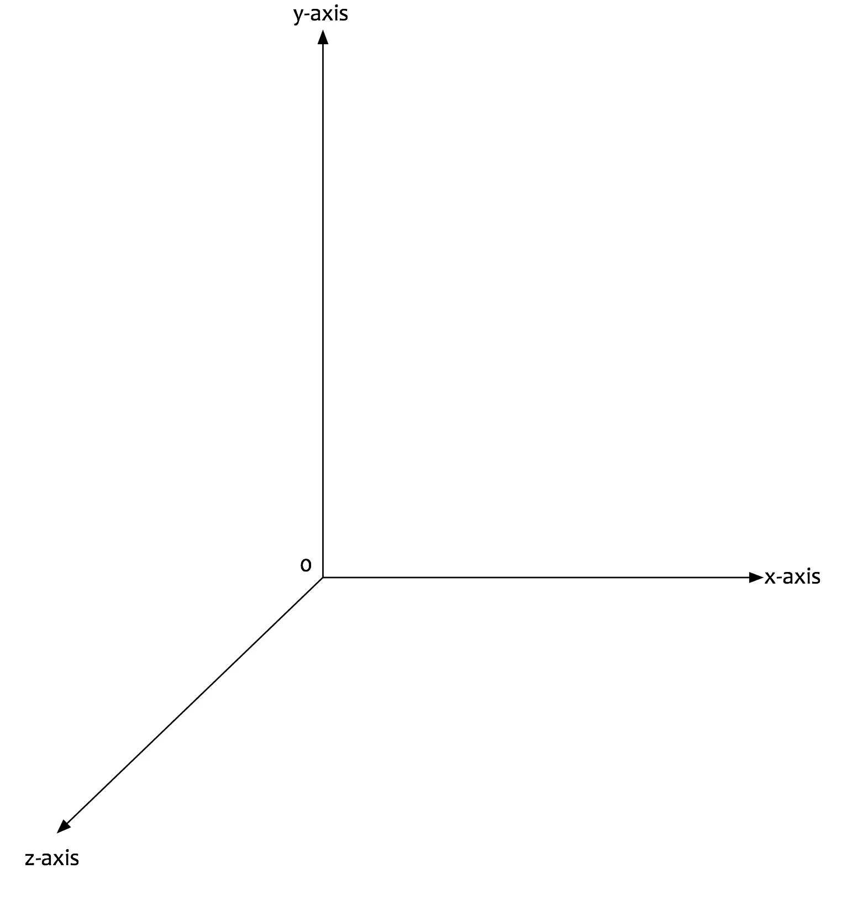
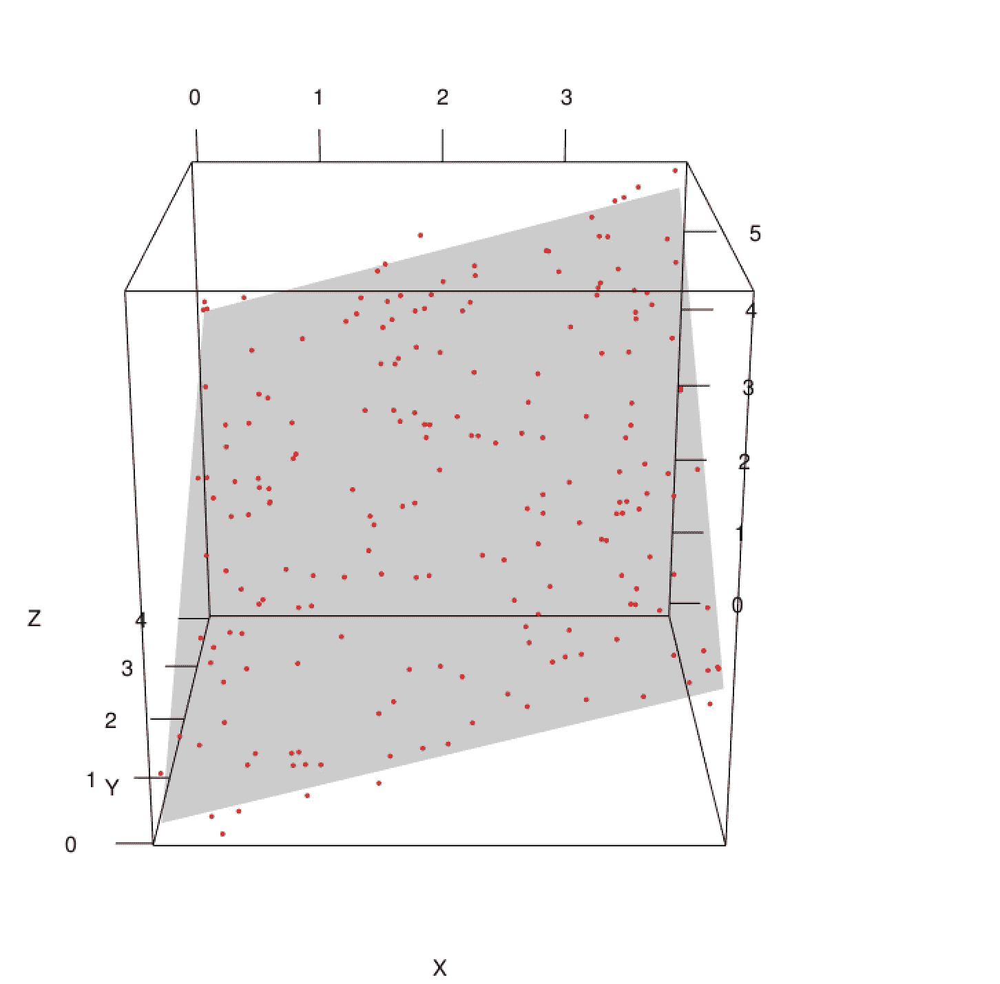
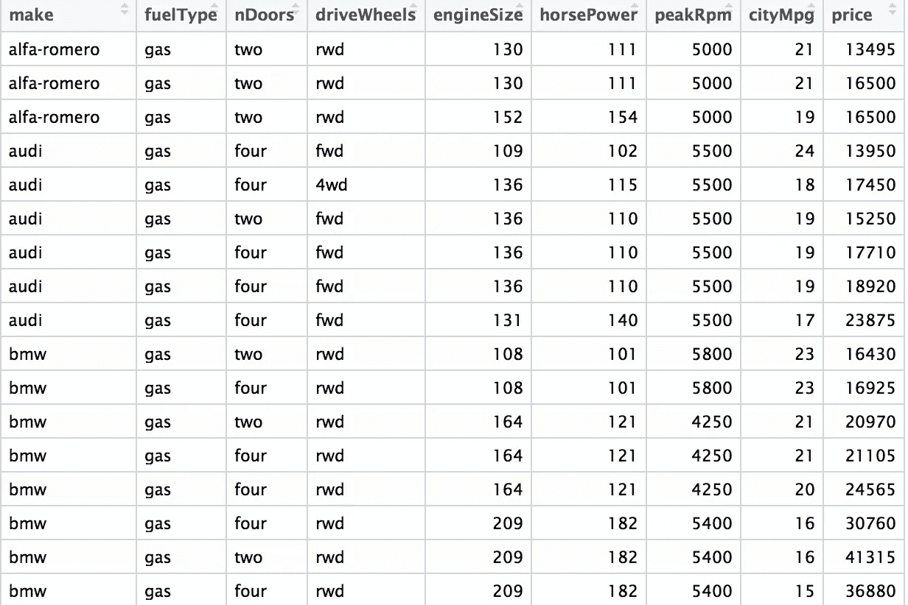
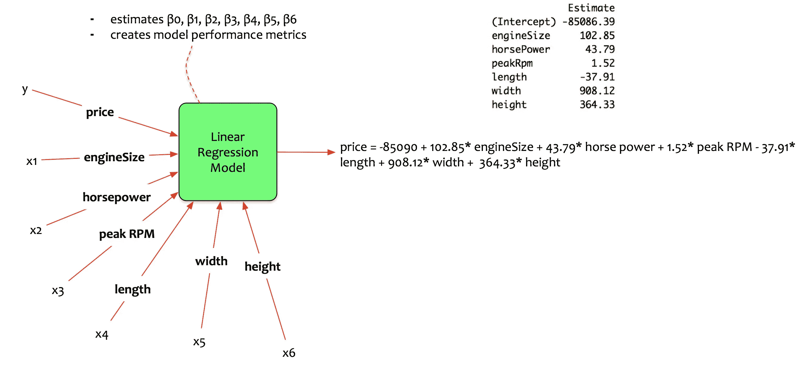
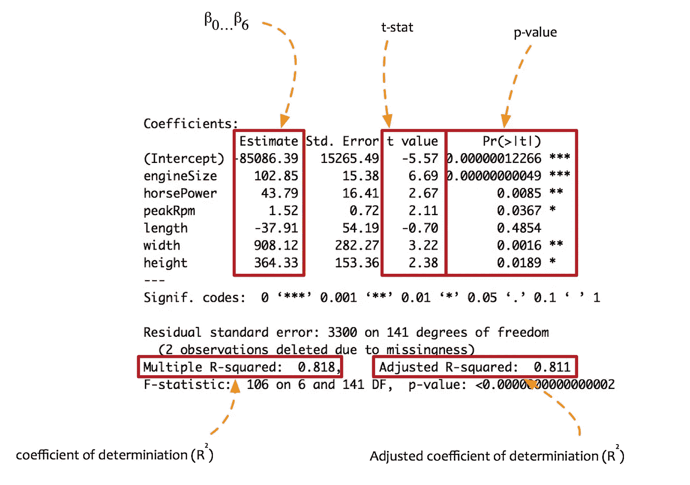

# 数据科学简化第 5 部分:多元回归模型

> 原文：<https://towardsdatascience.com/data-science-simplified-part-5-multivariate-regression-models-7684b0489015?source=collection_archive---------1----------------------->

在这个[系列](https://medium.com/towards-data-science/data-science-simplified-simple-linear-regression-models-3a97811a6a3d)的上一篇文章中，我们讨论了费尔南多的故事。一个想买车的数据科学家。他使用简单的线性回归模型来估计汽车的价格。

Fernando 创建的回归模型根据**发动机尺寸预测**价格**。** *用一个自变量预测一个因变量。*

简单线性回归模型的公式为:

**价格= β0 + β1 x 发动机尺寸**

统计软件包计算了参数。线性方程估计为:

**价格= -6870.1 + 156.9 x 发动机尺寸**

该模型从两个方面进行了评估:

*   鲁棒性——使用假设检验
*   准确度——使用决定系数，即 R 平方

回想一下，度量 R 平方解释了模型预测值与实际值的平均值之间的方差分数。该值介于 0 和 1 之间。它越高，模型就越能解释方差。Fernando 创建的模型的 R 平方是 0.7503，即训练集的 75.03%。这意味着该模型可以解释 75%以上的变异。

然而，费尔南多想让它变得更好。

他沉思道:

*   如果我能给模型输入更多的信息会怎么样？会提高准确率吗？

Fernando 决定通过向模型提供更多输入数据(即更多独立变量)来增强模型。他现在已经进入了多元回归模型的世界。

## 概念:

线性回归模型为监督学习提供了一种简单的方法。它们简单而有效。

回想一下，linear 有如下含义:排列成直线或者沿着直线延伸。线性表明因变量和自变量之间的关系可以用直线**表示。**

这条线的方程是 y = mx + c。一个维度是 y 轴，另一个维度是 x 轴。可以在二维平面上绘制。它看起来像这样:

线的方程是 **y = mx + c.** 一个维度是 y 轴，另一个维度是 x 轴。可以在二维平面上绘制。它看起来像这样:

这种关系的概括可以表示为:

**y = f(x)。**

没有任何花哨的意思。它的意思是:

***定义 y 为 x 的函数*** 即定义因变量为自变量的函数。

如果因变量需要用多个自变量来表示呢？广义函数变成:

**y = f(x，z)** *即把 y 表示成 x 和 z 的某种函数/组合*

现在有三维 y 轴，x 轴和 z 轴。它可以绘制为:

现在我们有不止一个维度(x 和 z)。我们有一个额外的维度。我们想把 y 表示成 x 和 z 的组合。

对于一个简单的回归线性模型，一条**直线**将 y 表示为 x 的函数。现在我们有了一个额外的维度(z)。如果在一条线上增加一个额外的维度会怎么样？**它变成了一架飞机。**

平面是将 **y 表示为 x 和 z 的函数的函数。**外推线性回归方程，现在可以表示为:

**y = m1.x + m2.z+ c**

*   **y** 是因变量，即需要估计和预测的变量。
*   **x** 是第一个自变量，即可控变量。这是第一个输入。
*   **m1** 是 x1 的斜率。它决定了线的角度(x)。
*   **z** 是第二个自变量，即可控变量。这是第二个输入。
*   m2 是 z 的斜率。它决定了线(z)的角度。
*   **c** 是截距。当 x 和 z 为 0 时，确定 y 值的常数。

这就是多元线性回归模型的起源。有一个以上的输入变量用于估计目标。具有两个输入变量的模型可以表示为:

**y = β0 + β1.x1 + β2.x2**

让我们更进一步。如果我们有三个变量作为输入会怎么样？人类的可视化能力在这里是有限的。它只能可视化三维。**在机器学习的世界里，可以有很多维度。**具有三个输入变量的模型可以表示为:

**y = β0 + β1.x1 + β2.x2 + β3.x3**

多元回归模型的通用方程可以是:

**y = β0 + β1.x1 + β2.x2 +…..+ βn.xn**

## 模型公式:

现在我们已经熟悉了多元线性回归模型的概念，让我们回到费尔南多。

费尔南多向他的朋友寻求更多的数据。他要求他提供更多关于汽车其他特征的数据。

以下是他已经掌握的数据点:

*   品牌:汽车的品牌。
*   燃料类型:汽车使用的燃料类型。
*   nDoor:门的数量。
*   引擎大小:汽车引擎的大小。
*   价格:汽车的价格。

他获得了额外的数据点。它们是:

*   马力:汽车的马力。
*   peakRPM:峰值功率输出附近的每分钟转数。
*   长度:汽车的长度。
*   宽度:汽车的宽度。
*   高度:汽车的高度。

Fernando 现在想要建立一个模型，根据额外的数据点预测价格。

他建立的多元回归模型是:

> 估计**价格**作为**引擎大小、马力、峰值转速、长度、宽度和高度的函数。**
> 
> **= >价格= f(发动机尺寸、马力、峰值转速、长度、宽度、高度)**
> 
> **= >价格= β0 + β1。发动机尺寸+ β2 .马力+ β3。峰值转速+ β4 .长度+ β5 .宽度+ β6 .高度**

## 模型构建:

费尔南多将这些数据输入他的统计包。该包计算参数。输出如下所示:

多元线性回归模型为价格估算提供了以下等式。

> **价格= -85090 + 102.85 *发动机尺寸+ 43.79 *马力+ 1.52 *峰值转速- 37.91 *长度+ 908.12 *宽度+ 364.33 *高度**

## 模型解释:

多元模型的解释提供了每个自变量对因变量(目标)的影响。

> 记住，这个等式提供了对**价格平均值的估计。** **每个系数在所有其他预测值保持不变的情况下进行解释。**

现在让我们来解释这些系数。

*   引擎大小:在所有其他预测因素保持不变的情况下，如果引擎大小增加一个单位，平均价格**将增加**102.85 美元。
*   马力:在所有其他预测因素保持不变的情况下，如果马力增加一个单位，平均价格**将增加**43.79 美元。
*   峰值转速:在所有其他预测因素保持不变的情况下，如果峰值转速增加一个单位，平均价格**将增加**1.52 美元。
*   长度:在所有其他预测因素保持不变的情况下，如果长度增加一个单位，平均价格**就会减少**37.91 美元(长度有一个-ve 系数)。
*   宽度:在所有其他预测因素保持不变的情况下，如果宽度增加一个单位，平均价格**就会增加**908.12 美元
*   身高:在所有其他预测因素保持不变的情况下，如果身高增加一个单位，平均价格**就会增加**364.33 美元

## 模型评估

模型已经建立。它被解释了。所有的系数都重要吗？哪些更有意义？这个模型解释了多少变化？

统计包提供了评估模型的指标。现在让我们来评估一下这个模型。

回忆一下[关于 t-stat、p 值和决定系数定义的讨论](https://medium.com/towards-data-science/data-science-simplified-simple-linear-regression-models-3a97811a6a3d)。这些概念也适用于多元回归模型。该模型的评估如下:

*   **系数:**所有系数都大于零。这意味着所有的变量都对平均价格有影响。
*   **t 值:**除了长度，所有系数的 t 值都显著大于零。对于长度，t-stat 是-0.70。这意味着汽车的长度可能不会对平均价格产生影响。
*   **p 值:**对于除长度以外的所有变量，完全偶然观察到 p 值的概率相当低。长度的 p 值为 0.4854。这意味着观察到的 t-stat 是偶然的概率是 48.54%。这个数字相当高。

回想一下关于 R 平方如何帮助解释模型中的变化的讨论。当更多的变量被添加到模型中时，r 平方不会减小。只会增加。然而，必须有一个平衡。调整后的 R 平方努力保持这种平衡。**调整的 R 平方**是 R 平方的修改版本，已经针对模型中的预测器数量进行了调整。调整后的 R 平方补偿变量的增加，并且仅在新项增强模型时增加。

*   **调整后的 R 平方:**R 平方值为 0.811。这意味着该模型可以解释训练数据中出现的 81.1%的变异。优于上一款(75.03%)。

基于这些评估，Fernando 得出以下结论:

*   除了汽车的*长度*之外的所有变量都对价格有影响。
*   汽车的长度对价格没有显著影响。
*   该模型解释了 81.1%的数据变化。

## 结论:

**费尔南多现在有了更好的车型。然而，他有些不知所措。他知道汽车的长度不会影响价格。**

他想知道:

> 如何为模型构建选择最佳的变量集？有没有选择最佳变量子集的方法？

在本系列的下一部分，我们将讨论变量选择方法。