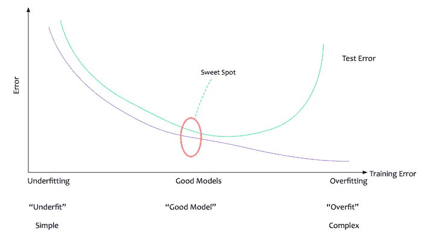
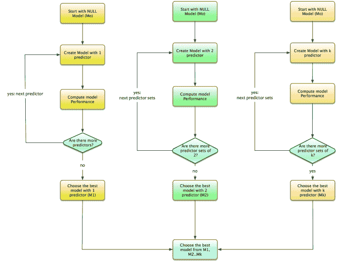
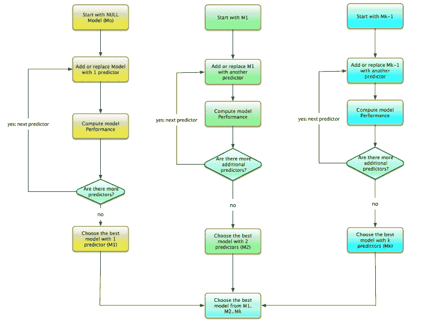
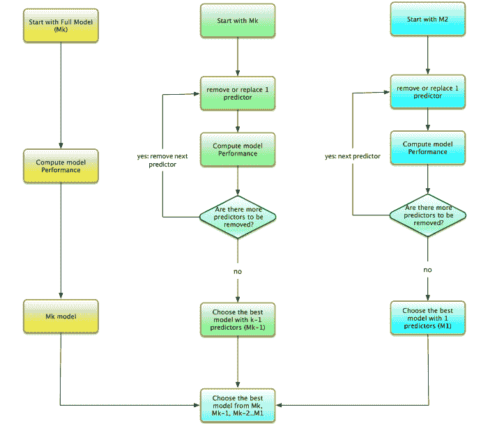
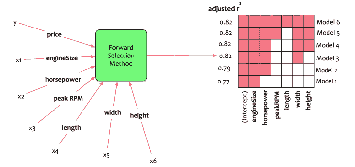
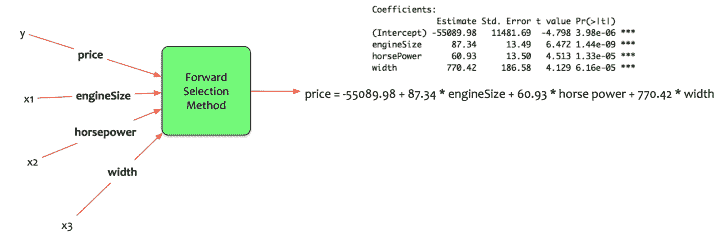
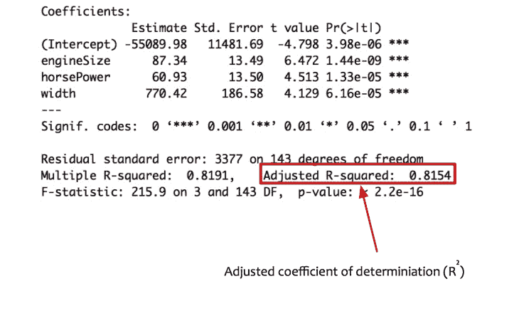
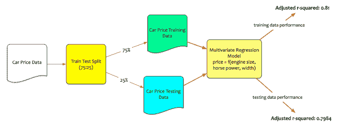

# 数据科学简化第 6 部分:模型选择方法

> 原文：<https://towardsdatascience.com/data-science-simplified-part-6-model-selection-methods-2511cbdf7cb0?source=collection_archive---------6----------------------->

在本[系列](https://datascientia.wordpress.com/2017/08/06/datascience-simplified-part-5-multivariate-regression-models/)的上一篇文章中，我们已经讨论了多元线性回归模型。Fernando 创建了一个基于五个输入参数估算汽车价格的模型。

费尔南多确实有一个更好的模型。然而，他想选择最好的输入变量。

***本文将详细阐述*** 的选型方法

# 概念

模型选择方法的思想是直观的。它回答了以下问题:

> **如何为最优模型选择正确的输入变量？**

最佳模型是如何定义的？

> ***最佳模型是将数据与评估指标的最佳值相匹配的模型。***

可以有很多评估指标。 ***调整后的 r 平方是多元线性回归模型所选择的评价指标。***

有三种方法可以选择最佳的变量集。它们是:

*   最佳子集
*   向前逐步
*   向后逐步

让我们深入了解这些方法的内部工作原理。

# 最佳子集

假设我们有 k 个变量。最佳子集法的过程如下:

1.  从零模型开始，即没有预测值的模型。让我们称这个模型为 M0。
2.  找到有 1 个变量的**最优**模型。这意味着该模型是一个只有一个独立变量的简单回归变量。让我们称这个模型为 M1。
3.  找到有两个变量的**最优**模型。这意味着该模型是一个只有两个自变量的回归变量。让我们称这个模型为 M2。
4.  找出有 3 个变量的最优模型。这意味着该模型是一个只有三个独立变量的回归变量。让我们称这个模型为 M3。
5.  以此类推……我们得到了钻头。重复这个过程。测试最佳模型的所有预测值组合。

对于 k 个变量，我们需要从以下一组模型中选择最佳模型:

*   M1:单预测器的最优模型。
*   M2:有两个预测因子的最优模型。
*   M3:有 3 个预测因子的最优模型。
*   Mk:具有 k 个预测值的最优模型。

从 M1…Mk 中选择最佳型号，即**最适合的型号**

最佳子集是一个复杂的过程。它梳理了整个预测列表。它选择可能的最佳组合。然而，它也有自己的挑战。

最佳子集为每个预测值及其组合创建一个模型。这意味着我们正在为每个变量组合创建模型。模型的数量可以是非常大的数量。

如果有 2 个变量，那么就有 4 个可能的模型。如果有 3 个变量，那么就有 8 个可能的模型。一般来说，如果有 p 个变量，那么就有 2^p 可能模型。可供选择的型号很多。假设有 100 个变量(相当常见)。假设有 100 个变量(相当常见)。会有 2^100possible 模特。令人难以置信的数字。

在 Fernando 的情况下，只有 5 个变量，他必须从 2^5models 创建和选择，即 32 个不同的模型。

# 向前逐步

尽管最佳子集是详尽的，但它需要大量的计算能力。这可能非常耗时。逐步向前尝试减轻痛苦。

假设我们有 k 个变量。向前步进的过程如下:

1.  从零模型开始，即没有预测值的模型。我们称之为 M0。向模型中添加预测值。一次一个。
2.  找到有 1 个变量的**最优**模型。这意味着该模型是一个只有一个独立变量的简单回归变量。我们称这个模型为 M1。
3.  给 M1 再加一个变量。找出有两个变量的**最优**模型。请注意，附加变量被添加到 M1。我们称这个模型为 M2。
4.  给 M2 再加一个变量。找出有 3 个变量的**最优**模型。请注意，附加变量被添加到 M2。我们称这个模型为 M3。
5.  等等..我们拿到钻头了。重复此过程，直到 Mk，即只有 k 变量的模型。

对于 k 个变量，我们需要从以下一组模型中选择最佳模型:

*   M1:单预测器的最优模型。
*   M2:有两个预测因子的最优模型。这个模型是 M1 +一个额外的变量。
*   M3:有 3 个预测因子的最优模型。这个模型是 M2 +一个额外的变量。
*   Mk:具有 k 个预测值的最优模型。这个模型是 Mk-1 +一个额外的变量。

再次选择 M1 Mk 中的最佳模型，即**具有最佳拟合度的模型**

与最佳子集方法相比，向前逐步选择创建更少的模型。如果有 p 个变量，那么将有大约 p(p+1)/2 + 1 个模型可供选择。远低于从最佳子集方法中选择模型。想象有 100 个变量；基于向前逐步方法创建的模型的数量是 100 * 101/2 + 1，即 5051 个模型。

在 Fernando 的案例中，只有 5 个变量，他必须创建 5*6/2 + 1 模型，即 16 种不同的模型，并从中进行选择。

# 向后逐步

既然我们已经理解了模型选择的向前逐步过程。让我们讨论一下向后的逐步过程。这是向前逐步过程的逆过程。向前逐步从没有变量的模型开始，即零模型。相反，反向逐步从所有变量开始。向后步进的过程如下:

1.  假设有 k 个预测器。从完整模型开始，即包含所有预测因素的模型。我们称这个模型为 Mk。从完整模型中去除预测因子。一次一个。
2.  找到 k-1 个变量的**最优**模型。从 Mk 中移除一个变量。计算所有可能组合的模型性能。选择具有 k-1 个变量的最佳模型。我们称这个型号为 Mk-1。
3.  找出 k-2 变量的**最优**模型。从 Mk-1 中删除一个变量。计算所有可能组合的模型性能。选择具有 k-2 个变量的最佳模型。我们称这个型号为 Mk-2。
4.  等等..我们拿到钻头了。重复这个过程，直到 M1，即只有一个变量的模型。

对于 k 个变量，我们需要从以下一组模型中选择最佳模型:

*   Mk:具有 k 个预测值的最优模型。
*   Mk-1:具有 k — 1 个预测值的最优模型。这个模型就是 Mk——一个附加变量。
*   Mk-2:具有 k — 2 个预测值的最优模型。这个模型是 Mk——两个额外的变量。
*   M1:单预测器的最优模型。

# 模型结构

既然车型选择的概念已经很清楚了，让我们回到费尔南多身上。回想一下这个[系列](https://datascientia.wordpress.com/2017/08/06/datascience-simplified-part-5-multivariate-regression-models/)的上一篇文章。费尔南多有六个变量**发动机尺寸、马力、峰值转速、长度、宽度和高度**。他想通过创建多元回归模型来估算汽车价格。他想保持平衡，选择最好的模式。

他选择应用向前逐步模型选择方法。统计软件包计算所有可能的模型，并将 M1 输出到 M6。

让我们解释一下输出。

*   模型 1:它应该只有一个预测器。最佳拟合模型仅使用发动机尺寸作为预测值。调整后的 R 平方为 0.77。
*   模型 2:它应该只有两个预测器。最佳拟合模型仅使用发动机尺寸和马力作为预测指标。调整后的 R 平方为 0.79。
*   模型 3:它应该只有三个预测器。最佳拟合模型仅使用发动机尺寸、马力和宽度作为预测值。调整后的 R 平方为 0.82。
*   模型 4:它应该只有四个预测器。最佳拟合模型仅使用发动机尺寸、马力、宽度和高度作为预测值。调整后的 R 平方为 0.82。
*   模型 5:它应该只有五个预测器。最佳拟合模型仅使用发动机尺寸、马力、峰值转速、宽度和高度作为预测指标。调整后的 R 平方为 0.82。
*   模型 6:它应该只有六个预测器。最佳拟合模型仅使用所有六个预测值。调整后的 R 平方为 0.82。

回想一下关于创建最简单而有效的[模型](https://datascientia.wordpress.com/2017/08/06/data-science-simplified-part-2-key-concepts-of-statistical-learning/)的讨论。

> 所有的模型都应该尽可能的简单，但是不能再简单了

Fernando 选择了性能最佳的最简单型号。**在这种情况下，它是模型 3。**该模型使用发动机尺寸、马力和宽度作为预测值。该模型能够得到 0.82 的调整后的 R 平方，即该模型可以解释训练数据中 82%的变化。

统计软件包提供以下系数。

> **估计价格作为引擎大小，马力和宽度的函数。**
> 
> ***价格= -55089.98 + 87.34* 发动机尺寸+ 60.93 *马力+ 770.42* 宽度**

# 模型评估

费尔南多选择了最好的型号。该模型将使用引擎大小、马力和汽车宽度来估算价格。他想评估模型在训练和测试数据上的性能。

回想一下，他将数据分成了训练集和测试集。Fernando 使用训练数据训练模型。测试数据是看不见的数据。Fernando 根据测试数据评估模型的性能。这是真正的考验。

在训练数据上，该模型表现得相当好。 ***调整后的 R 平方为 0.815*** = >该模型可以解释训练数据 81%的变异。然而，要使模型被接受，它还需要在测试数据上表现良好。

Fernando 在测试数据集上测试模型性能。**模型根据测试数据**计算出调整后的 R 平方为 0.7984。这意味着即使在看不见的数据上，模型也能解释 79.84%的变化。

# 结论

费尔南多现在有了一个简单而有效的模型来预测汽车价格。但是发动机大小，马力，宽度的单位不一样。他沉思着。

*   如何使用通用的比较单位来估计价格变动？
*   发动机尺寸、马力和宽度的价格弹性如何？

本系列的下一篇文章即将发表。它将讨论转换多元回归模型以计算弹性的方法。

*原载于 2017 年 8 月 9 日*[*datascientia . blog*](http://datascientia.blog/2017/08/09/dss-model-selection-methods/)*。*