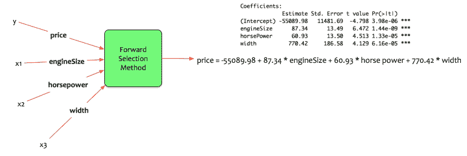
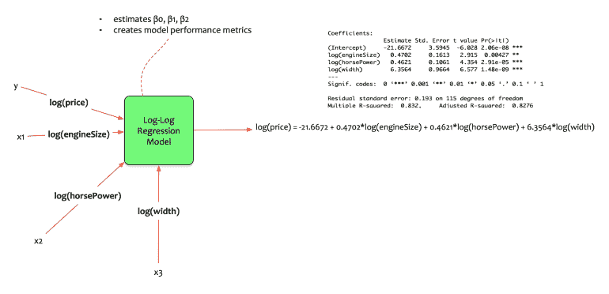
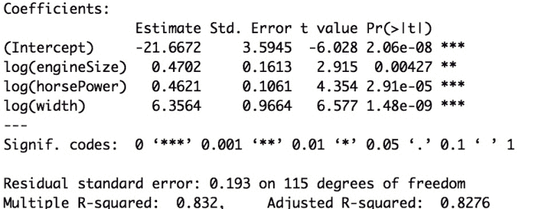
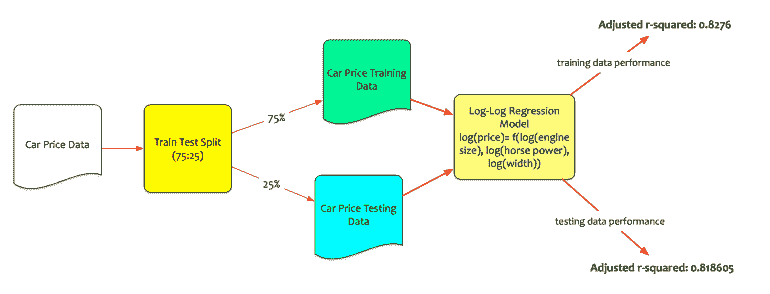

# 数据科学简化版第 7 部分:对数回归模型

> 原文：<https://towardsdatascience.com/data-science-simplified-part-7-log-log-regression-models-499ecd1495f0?source=collection_archive---------3----------------------->

在本系列的最后几篇博文中，我们讨论了[简单线性回归模型](https://datascientia.blog/2017/08/06/data-science-simplified-part-4-simple-linear-regression-models/)。我们讨论了[多元回归模型](https://datascientia.blog/2017/08/06/datascience-simplified-part-5-multivariate-regression-models/)和[选择正确模型](https://datascientia.blog/2017/08/09/dss-model-selection-methods/)的方法。

费尔南多现在创造了一个更好的模型。

> *价格= -55089.98 + 87.34* 发动机尺寸+ 60.93 *马力+ 770.42* 宽度

费尔南多考虑了以下几点:

*   **如何使用通用的比较单位来估算价格变化？**
*   **发动机尺寸、马力和宽度的价格弹性如何？**

在这篇文章中将会解决这个问题。本文将详细介绍**双对数回归**模型。

# 概念:

为了解释对数回归模型的概念，我们需要后退两步。首先让我们了解导数、对数、指数的概念。然后我们需要理解**弹性**的概念。

## 衍生品:

让我们回到高中数学。遇见衍生品。高中数学和物理中教授的最迷人的概念之一。

导数是表示变化的一种方式，即函数在某一给定点的变化量。

变量 y 是 x 的函数，定义 y 为:

**y = f(x)**

我们对 y 相对于 x 求导，表示如下:

**dy/dx = df(x)/dx = f'(x)**

这意味着:

*   **y 相对于 x 的变化，即如果 x 改变，y 会改变多少？**

难道不是费尔南多想要的吗？他想知道价格(y)相对于其他变量(cityMpg 和 highwayMpg)的变化。

回想一下，多元回归模型的一般形式如下:

> *y =β0+β1 . x1+β2 . x2+…+βn . xn+𝛆*

假设 Fernando 构建了以下模型:

> *价格= β0 + β1。发动机尺寸，即将价格表示为发动机尺寸的函数。*

费尔南多对价格和引擎大小进行了求导。他不应该能够根据发动机尺寸的变化来表达价格的变化吗？

唉，事情没那么简单。线性回归模型假设线性关系。线性关系定义为:

**y = mx + c**

如果计算 y 对 x 的导数，则得出以下结果:

**dy/dx = m . dx/dx + dc/dx**

*   某物相对于自身的变化总是 1，即 dx/dx = 1
*   常数相对于任何事物的变化总是 0。这就是为什么它是一个常数。不会变的。即 dc/dx = 0

等式现在变成了:

**dy/dx = m**

对发动机尺寸的价格应用导数只会产生发动机尺寸的系数。

一定有办法改变它。又来了两个数学字符。满足指数和对数。

## **指数:**

现在让我们看看指数。这个字符又是高中数学中的一个常见字符。指数是一个有两个算子的函数。底数(b)和指数(n)。它被定义为 **b^n** 。它的形式是:

**f(x) = b^x**

基数可以是任何正数。欧拉数(e)也是统计学中常用的基数。

几何上，指数关系具有以下结构:

*   x 的增加不会导致 y 的相应增加，直到达到一个阈值。
*   在阈值之后，对于 x 的小幅度增加，y 的值迅速上升。

## 对数:

对数是一个有趣的字符。让我们只了解它适用于回归模型的个性。对数的基本性质是它的底。对数的典型底数是 2、10 或 e。

让我们举一个例子:

*   我们乘多少个 2 得到 8？2 x 2 x 2 = 8，即 3
*   这也可以表示为:log2(8) = 3

> *以 2 为底的 8 的对数是 3*

对数还有另一个共同的基础。它被称为“欧拉数(e)”其近似值为 2.71828。它在统计学中被广泛使用。以 e 为底的对数称为**自然对数。**

它还具有有趣的变革能力。它将 ***指数关系转化为线性关系。*** 让我们看一个例子:

下图显示了 y 和 x 之间的指数关系:

如果对数同时应用于 x 和 y，则 log(x)和 log(y)之间的关系是线性的。它看起来像这样:

## 弹性:

弹性是衡量一个经济变量对另一个经济变量变化的反应程度。

假设我们有一个函数:Q = f(P)那么 Q 的弹性定义为:

E = P/Q x dQ/dP

*   dq/dP 是 Q wrt 变化在 p 中的平均变化。

## 将所有这些整合在一起:

现在让我们把这三个数学特征放在一起。导数、对数和指数。他们的交战规则如下:

*   e 的对数是 1，即 log(e) = 1
*   指数的对数是指数乘以底数。
*   log(x)的导数是:1/x

让我们举一个例子。想象一个函数 y，表示如下:

*   y = b^x.
*   => log(y) = x log (b)

那么对于线性回归模型意味着什么呢？我们可以利用导数、对数和指数来玩数学杂耍吗？能不能改写线性模型方程，求 y 的变化率 wrt 在 x 的变化率？

首先，让我们把 y 和 x 之间的关系定义为指数关系

1.  **y = α x^β**
2.  我们先把这个表示成 log-log 的函数: **log(y) = log(α) + β。log(x)**
3.  方程#1 看起来不像回归模型吗:Y= β0 + β1。x1？其中β0 = log(α)；β1 = β.这个方程现在可以改写为: **log(y) = β0 + β1。log(x1)**
4.  但是它是如何代表弹性的呢？让我们对 log(y) wrt x 求导，我们得到如下结果:

*   **d. log(y)/ dx = β1。log(x1)/dx。**
*   => 1/y . dy/dx = β1。1/x => **β1 = x/y . dy/dx。**
*   **β1 的方程就是弹性。**

# 模型构建:

现在我们理解了这个概念，让我们看看费尔南多是如何建造模型的。他建立了以下模型:

> *log(价格)= β0 + β1。log(发动机尺寸)+ β2。log(马力)+ β3。原木(宽度)*

他想估计汽车价格的变化，作为发动机尺寸、马力和宽度变化的函数。

Fernando 在其统计包中训练该模型，并获得以下系数。

该模型的方程式为:

> *log(价格)= -21.6672 + 0.4702.log(引擎大小)+ 0.4621.log(马力)+ 6.3564。原木(宽度)*

以下是对模型的解释:

*   所有系数都是重要的。
*   调整后的 r 平方为 **0.8276 = >该模型解释了 82.76%** 的数据变异。
*   如果*发动机尺寸* **增加 4.7%** 那么汽车价格**增加 10%。**
*   如果马力**增加 4.62%** 那么汽车价格**增加 10%。**
*   如果汽车**的**宽度**增加 6%** ，那么汽车**的价格就会增加 1 %。**

# 模型评估:

Fernando 现在已经建立了**双对数回归**模型。他评估模型在训练和测试数据上的性能。

回想一下，他将数据分为训练集和测试集。训练数据用于创建模型。测试数据是看不见的数据。测试数据的性能才是真正的考验。

在训练数据上，该模型表现得相当好。调整后的 R 平方为 0.8276 = >该模型可以解释训练数据的 82.76%的变化。要使模型可以接受，它还需要在测试数据上表现良好。

Fernando 在测试数据集上测试模型性能。该模型根据测试数据计算出调整后的 r 平方为 0.8186。这很好。这意味着即使在看不见的数据上，模型也能解释 81.86%的变异。

请注意，该模型估计的是日志(价格)，而不是汽车的价格。要将估算的 log(价格)转换成价格，需要有一个转换。

**该转换将对数(价格)视为 e 的指数。**

> *e^log(price)=价格*

# 结论:

最近的几篇帖子是一段相当长的旅程。[统计学习](https://datascientia.blog/2017/08/06/data-science-simplified-part-2-key-concepts-of-statistical-learning/)奠定了基础。[假设检验](https://datascientia.blog/2017/08/06/data-science-simplified-part-3-hypothesis-testing/)讨论了无效假设和替代假设的概念。[简单的线性回归模型](https://datascientia.blog/2017/08/06/data-science-simplified-part-4-simple-linear-regression-models/)使回归变得简单。然后我们进入了[多元回归模型的世界。](https://datascientia.blog/2017/08/06/datascience-simplified-part-5-multivariate-regression-models/)接着讨论[型号选择方法](https://datascientia.blog/2017/08/09/dss-model-selection-methods/)。在这篇文章中，我们讨论了对数回归模型。

到目前为止，建立的回归模型只有数字自变量。下一篇文章我们将讨论交互作用和定性变量的概念。

*原载于 2017 年 8 月 14 日*[*datascientia . blog*](https://datascientia.blog/2017/08/14/dss-llrm/)*。*