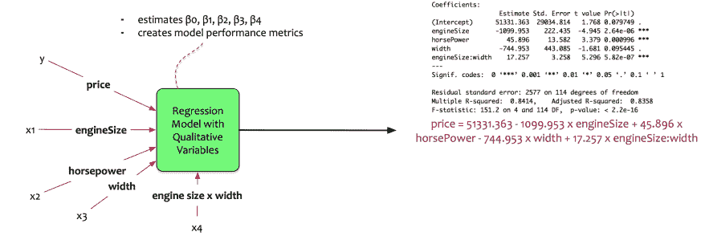
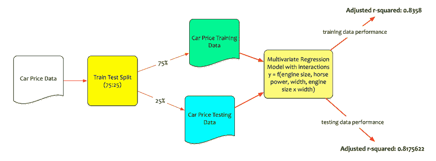

# 数据科学简化版第 9 部分:回归模型的相互作用和局限性

> 原文：<https://towardsdatascience.com/data-science-simplified-part-9-interactions-and-limitations-of-regression-models-4702dff03820?source=collection_archive---------6----------------------->

在本系列的最后几篇博文中，我们详细讨论了回归模型。费尔南多建立了一个多元回归模型。该模型采用以下形状:

> *价格= -55089.98 + 87.34* 发动机尺寸+ 60.93 *马力+ 770.42* 宽度

该模型预测或估计价格(目标)，作为发动机尺寸、马力和宽度(预测值)的函数。

回想一下，多元回归模型假设独立预测因子之间是独立的。它将马力、发动机尺寸和宽度视为不相关。

实际上，变量很少是独立的。

> *如果马力、发动机尺寸和宽度之间有关系呢？这些关系可以建模吗？*

这篇博文将回答这个问题。它将解释互动的概念。

# 概念:

预测值之间的独立性意味着如果一个预测值发生变化，它会对目标产生影响。这种影响与其他预测因子的存在或变化无关。目标和预测值之间的关系是加性和线性的。

让我们举个例子来说明一下。费尔南多的方程式是:

> ***价格= -55089.98 + 87.34 发动机尺寸+ 60.93 马力+ 770.42 宽度***

它被解释为*发动机尺寸的单位变化使价格变化 87.34 美元。*

这种解释从来没有考虑到发动机的尺寸可能与汽车的宽度有关。

***难道不能是车越宽，发动机越大吗？***

第三个预测值捕捉引擎和宽度之间的相互作用。这个第三预测值被称为 ***相互作用项。***

由于发动机尺寸和宽度之间的相互作用项，回归模型具有以下形状:

> *价格= β0 + β1。发动机尺寸+ β2。马力+ β3。宽度+ β4。(发动机尺寸。宽度)*

方程的部分 *(β1。发动机尺寸+ β3。宽度)*称为**主效果。**

术语**发动机尺寸 x 宽度**是相互作用术语。

这个术语如何描述发动机尺寸和宽度之间的关系？我们可以将这个等式重新排列为:

> *价格= β0 + (β1 + β4。宽度)发动机尺寸+ β2。马力+ β3。宽度*

现在，β4 可以解释为宽度增加 1 个单位对发动机尺寸的影响。

# 模型构建:

费尔南多将这些数据输入他的统计包。该包计算参数。输出如下所示:

等式变为:

> *价格= 51331.363–1099.953 x 发动机尺寸+ 45.896 x 马力— 744.953 x 宽度+ 17.257 x 发动机尺寸:宽度*
> 
> *价格= 51331.363—(1099.953–17.257 x 宽度)发动机尺寸+ 45.896 x 马力— 744.953 x 宽度*

让我们来解释这些系数:

*   发动机尺寸、马力和发动机尺寸:宽度(交互项)是重要的。
*   汽车的宽度并不重要。
*   发动机尺寸增加 1 个单位，价格降低 1099.953 美元。
*   马力增加 1 单位，价格增加 45.8 美元。
*   相互作用项是重要的。这意味着真正的关系不是相加的。
*   发动机尺寸增加 1 个单位，价格也会增加(1099.953–17.257 x 宽度)。
*   测试数据的校正 r 平方为 0.8358 = >该模型解释了 83.5%的变化。

注意，汽车的宽度并不重要。那么将其纳入模型有意义吗？

这里出现了一个叫做***的等级原则。***

> ****分层原则:*** *当交互包含在模型中时，主特效也需要包含在模型中。即使单个变量在模型中不显著，也需要包括主要影响。**

*Fernando 现在运行模型，并根据测试数据测试模型性能。*

**

*该模型在测试数据集上表现良好。测试数据的调整后 r 平方为 0.8175622 = >该模型解释了 81.75%的未知数据变化。*

*费尔南多现在有一个最优模型来预测汽车价格和购买汽车。*

# *回归模型的局限性*

*回归模型是数据科学的主力。这是数据科学家工具箱中的一个神奇工具。当被有效利用时，他们在解决许多现实生活中的数据科学问题方面表现惊人。然而，它们也有其局限性。简单解释了回归模型的三个局限性:*

# *非线性关系:*

*线性回归模型假设变量之间是线性的。如果关系不是线性的，那么线性回归模型可能不会如预期的那样执行。*

> **实用提示:使用 log 等变换将非线性关系转换为线性关系**

# *多重共线性:*

*共线性是指两个预测变量相互关联的情况。当有许多预测因子并且这些预测因子之间存在相关性时，称为多重共线性。如果预测值彼此相关，那么特定预测值对目标的影响就很难被隔离。*

> *实用提示:通过仔细选择预测器使模型更简单。限制选择过多的相关预测因子。或者，使用像主成分这样的技术来创造新的不相关变量。*

# *异常值的影响:*

*异常值是指远离模型预测值的点。如果目标变量中有异常值，模型会被拉伸以适应它们。对少数异常点进行了过多的模型调整。这使得模型偏向异常值。这对大多数人来说都没有什么好处。*

> **实用提示:去除建模中的离群点。如果目标中有太多的异常值，可能需要多个模型。**

# *结论:*

*这是一段不平凡的旅程。在最近几篇博文中，[简单线性回归模型](https://datascientia.blog/2017/08/06/data-science-simplified-part-4-simple-linear-regression-models/)被解释。然后我们又涉猎了[多元回归模型](https://datascientia.blog/2017/08/06/datascience-simplified-part-5-multivariate-regression-models/)。[对型号选择方法](https://datascientia.blog/2017/08/09/dss-model-selection-methods/)进行了探讨。处理[定性变量](https://datascientia.blog/2017/08/19/dss8-qual-var/)和交互作用也进行了讨论。*

*在本系列的下一篇文章中，我们将讨论另一种监督学习模型:分类。*

**原载于 2017 年 8 月 27 日*[*datascientia . blog*](https://datascientia.blog/2017/08/27/dss-p9-interactions/)*。**