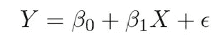
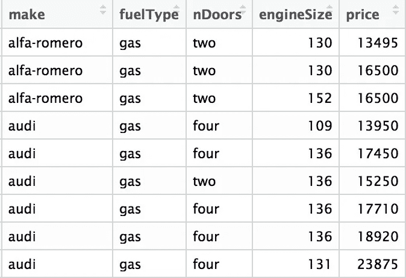
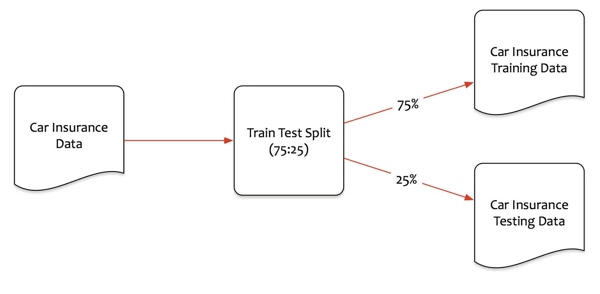
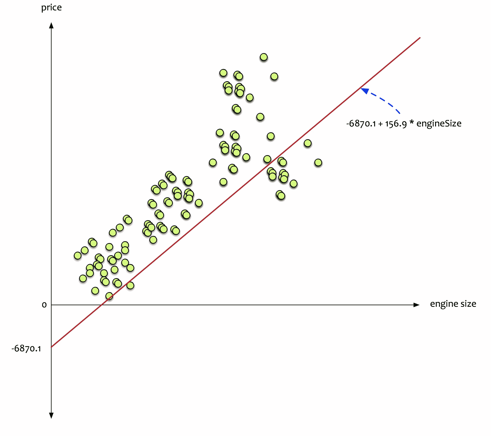
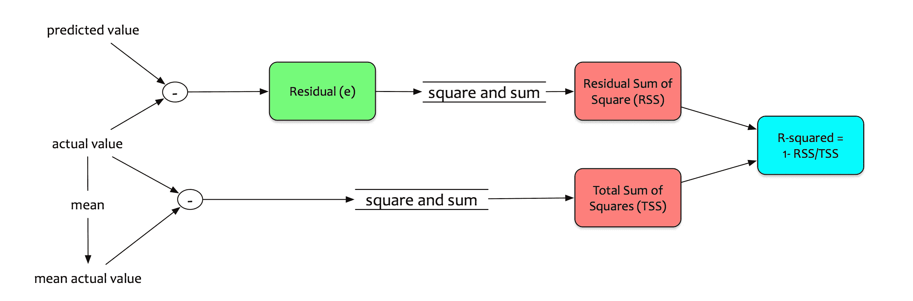
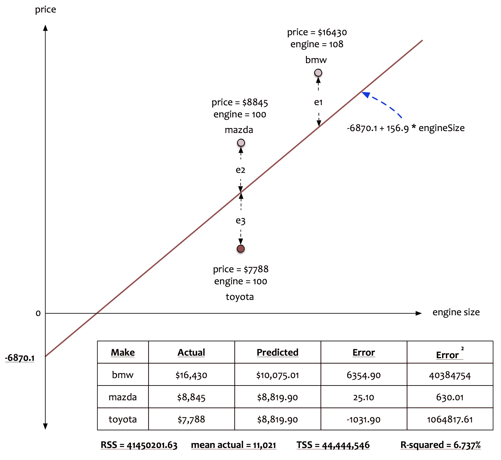

# 数据科学简化版第 4 部分:简单线性回归模型

> 原文：<https://towardsdatascience.com/data-science-simplified-simple-linear-regression-models-3a97811a6a3d?source=collection_archive---------1----------------------->

在本系列之前的文章中，我们讨论了[统计学习](https://medium.com/towards-data-science/data-science-simplified-key-concepts-of-statistical-learning-45648049709e)和[假设检验](https://medium.com/towards-data-science/data-science-simplified-hypothesis-testing-56e180ef2f71)的概念。在本文中，我们深入线性回归模型。

在我们开始之前，让我们回忆一下[统计学习](https://medium.com/towards-data-science/data-science-simplified-key-concepts-of-statistical-learning-45648049709e)的一些重要方面。

**自变量和因变量:**

在统计学习的背景下，有两种类型的数据:

*   自变量:可以直接控制的数据。
*   因变量:不能直接控制的数据。

无法控制的数据，即需要预测或估计的因变量。

**型号:**

**模型是一个转换引擎**，帮助我们将因变量表达为自变量的函数。

**参数:**

参数是添加到模型中用于估计产量的成分。

# 概念

线性回归模型为监督学习提供了一种简单的方法。它们简单而有效。

等等，我们说的线性是什么意思？

Linear 含有如下含义:沿着直线或近似直线排列或延伸。线性表明因变量和自变量之间的关系可以用直线**表示。**

回忆一下高中的几何课。一条线的方程是什么？

**y = mx + c**

线性回归不过是这个简单方程的一种表现形式。

*   **y** 是因变量，即需要估计和预测的变量。
*   **x** 是自变量，即可控变量。它是输入。
*   **m** 是斜率。它决定了线的角度。它是表示为β的参数。
*   **c** 是截距。当 x 为 0 时，决定 y 值的常数。

英国著名统计学家乔治·博克斯曾经引用过:

> “所有的模型都是错的；有些是有用的。”

线性回归模型并不完美。它试图用一条直线来近似因变量和自变量之间的关系。近似导致误差。可以减少一些误差。有些错误是问题的本质所固有的。这些错误无法消除。它们被称为**不可约误差**，真实关系中的噪声项，任何模型都无法从根本上减少。

同一条直线的等式可以改写为:

**β0 和β1** 是代表截距和斜率的两个未知常数。它们是参数。

**ε** 是误差项。

# 制定

让我们通过一个例子来解释线性回归模型的术语和工作原理。

费尔南多是一名数据科学家。他想买一辆汽车。他想估计或预测他将要支付的汽车价格。他有一个朋友在汽车经销公司。他询问了各种其他汽车的价格以及该车的一些特性。他的朋友向他提供了一些信息。

以下是向他提供的数据:

*   品牌:汽车的品牌。
*   燃料类型:汽车使用的燃料类型。
*   nDoor:门的数量。
*   引擎大小:汽车引擎的大小。
*   价格:汽车的价格。

首先，Fernando 想要评估他是否真的可以根据引擎大小预测汽车价格。第一组分析寻求以下问题的答案:

*   汽车价格与发动机大小有关吗？
*   关系有多牢固？
*   关系是线性的吗？
*   我们能根据发动机尺寸预测/估算汽车价格吗？

费尔南多做了相关分析。相关性是两个变量相关程度的度量。它是通过一种叫做**相关系数**的度量来衡量的。其值介于 0 和 1 之间。

如果相关系数是一个大的(> 0.7) +ve 数，这意味着当一个变量增加时，另一个变量也增加。大的 ve 值表示一个变量增加，另一个变量减少。

他做了相关分析。他绘制了价格和发动机尺寸之间的关系。

他将数据分为训练集和测试集。75%的数据用于训练。剩余的用于测试。

他建立了一个线性回归模型。他使用统计软件包来创建模型。该模型创建了一个线性方程，将汽车的**价格表示为**发动机尺寸的函数。****

以下是问题的答案:

*   汽车价格与发动机大小有关吗？
*   *是的，有关系。*
*   关系有多牢固？
*   *相关系数为 0.872 = >有很强的相关性。*
*   关系是线性的吗？
*   *一条直线可以拟合= >使用发动机尺寸可以做出合理的价格预测。*
*   我们可以根据发动机尺寸预测/估算汽车价格吗？
*   是的，汽车价格可以根据发动机的大小来估算。

Fernando 现在想要建立一个线性回归模型，根据发动机的大小来估算汽车的价格。将方程式叠加到汽车价格问题上，Fernando 为价格预测制定了以下方程式。

**价格= β0 + β1 x 发动机尺寸**

# 模型建立和解释

# 模型

回想一下早先的[讨论](https://medium.com/towards-data-science/data-science-simplified-key-concepts-of-statistical-learning-45648049709e)，关于数据需要如何被分成*训练*和*测试*集合。训练数据用于了解数据。训练数据用于创建模型。测试数据用于评估模型性能。

Fernando 将数据分为训练集和测试集。75%的数据用于训练。剩余的用于测试。他建立了一个线性回归模型。他使用统计软件包来创建模型。该模型产生一个线性方程，该方程将汽车的**价格表示为**发动机尺寸的函数。****

他将数据分为训练集和测试集。75%的数据用于训练。剩余的用于测试。

他建立了一个线性回归模型。他使用统计软件包来创建模型。该模型创建了一个线性方程，将汽车的**价格表示为**发动机尺寸的函数。****

该模型估计参数:

*   β0 估计为-6870.1
*   β1 估计为 156.9

线性方程估计为:

**价格= -6870.1 + 156.9 x 发动机尺寸**

# 解释

该模型提供了在给定特定发动机尺寸的情况下预测**平均汽车价格**的方程式。该等式的含义如下:

**发动机尺寸每增加一个单位，汽车均价就会增加 156.9 个单位。**

# 估价

模型已经建立。需要评估模型的稳健性。我们怎么能确定这个模型能够预测出令人满意的价格呢？这一评估分两部分进行。首先，测试以建立模型的稳健性。第二，测试评估模型的准确性。

Fernando 首先根据训练数据评估模型。他得到了以下统计数据。

里面有很多统计数据。让我们把重点放在关键的(用红色标记的)。回想一下关于[假设检验的讨论。](https://medium.com/towards-data-science/data-science-simplified-hypothesis-testing-56e180ef2f71)使用假设检验评估模型的稳健性。

需要定义 H0 和 Ha。它们的定义如下:

*   H0(零假设):x 和 y 之间没有关系，即价格和发动机尺寸之间没有关系。
*   Ha(替代假设):x 和 y 之间存在某种关系，即价格和发动机尺寸之间存在某种关系。

**β1:**β1 的值决定了价格和发动机大小的关系。如果β1 = 0，则没有关系。在这种情况下，β1 为正。这意味着价格和发动机尺寸之间有某种关系。

**t-stat:**t-stat 值是系数估计值(β1)远离零多少个标准差。此外，价格和发动机尺寸之间的关系越远离零越强。系数是显著的。在这种情况下，t-stat 是 21.09。离零足够远了。

**p 值:** p 值是一个概率值。它表示在假设零假设为真的情况下，看到给定 t 统计量的机会。如果 p 值很小，例如< 0.0001，这意味着这是偶然的且没有关系的概率很低。在这种情况下，p 值很小。这意味着价格和引擎之间的关系不是偶然的。

有了这些指标，我们可以安全地**拒绝零假设，接受替代假设。** **价格和发动机尺寸之间有着密切的关系**

关系就建立了。准确性怎么样？模型有多精确？为了感受模型的**准确性，一个名为 R 平方或决定系数的度量是很重要的。**

**R 平方或决定系数:**为了理解这些指标，让我们把它分解成它的组成部分。

*   **误差(e)** 是实际 y 和预测 y 之间的差值。预测 y 表示为ŷ.对每个观察值评估该误差。这些误差也被称为**残差。**
*   然后将所有剩余值平方并相加。这一项称为**残差平方和(RSS)。**RSS 越低越好。
*   R 平方的等式还有另一部分。为了得到另一部分，首先，计算实际目标的平均值，即估计汽车价格的平均值。然后计算平均值和实际值之间的差异。然后将这些差值平方并相加。它是**总平方和(TSS)。**
*   **R 平方** a.k .决定系数计算为 1- RSS/TSS。此指标解释了模型预测值与实际值的平均值之间的差异分数。该值介于 0 和 1 之间。它越高，模型就越能解释方差。

让我们看一个例子。

在上面的例子中，RSS 是基于三辆汽车的预测价格计算的。RSS 值是 41450201.63。实际价格的平均值是 11021。TSS 计算为 44，444，546。r 平方计算为 6.737%。对于这三个特定的数据点，模型只能解释 6.73%的变化。不够好！！

然而，对于费尔南多的模型，这是一个不同的故事。训练集的 R 平方为 **0.7503，即 75.03%。**这意味着该模型可以解释 75%以上的变异。

# 结论

瞧啊。！费尔南多现在有一个很好的模型。它在训练数据上的表现令人满意。但是，有 25%的数据无法解释。有改进的余地。增加更多的独立变量来预测价格怎么样？当添加一个以上的自变量来预测因变量时，会创建一个**多元回归模型**，即一个以上的变量。

本系列的下一期将更深入地研究多元回归模型。敬请关注。