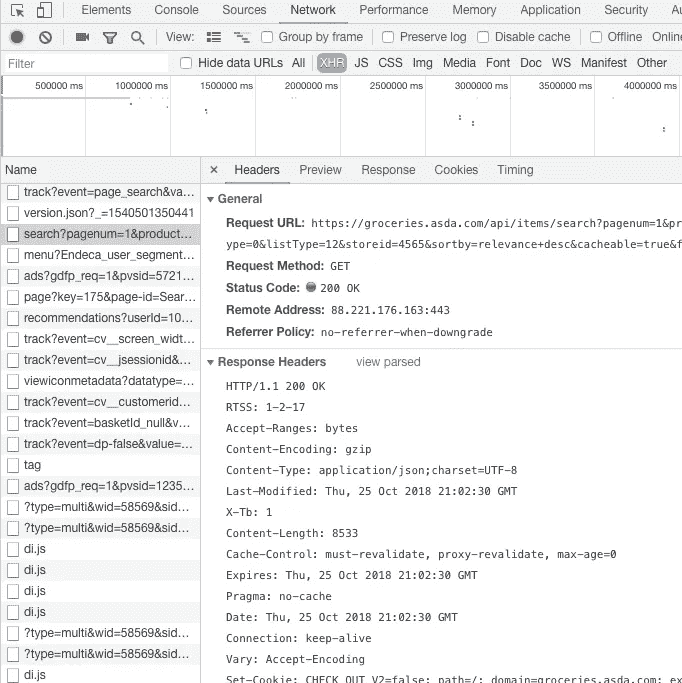
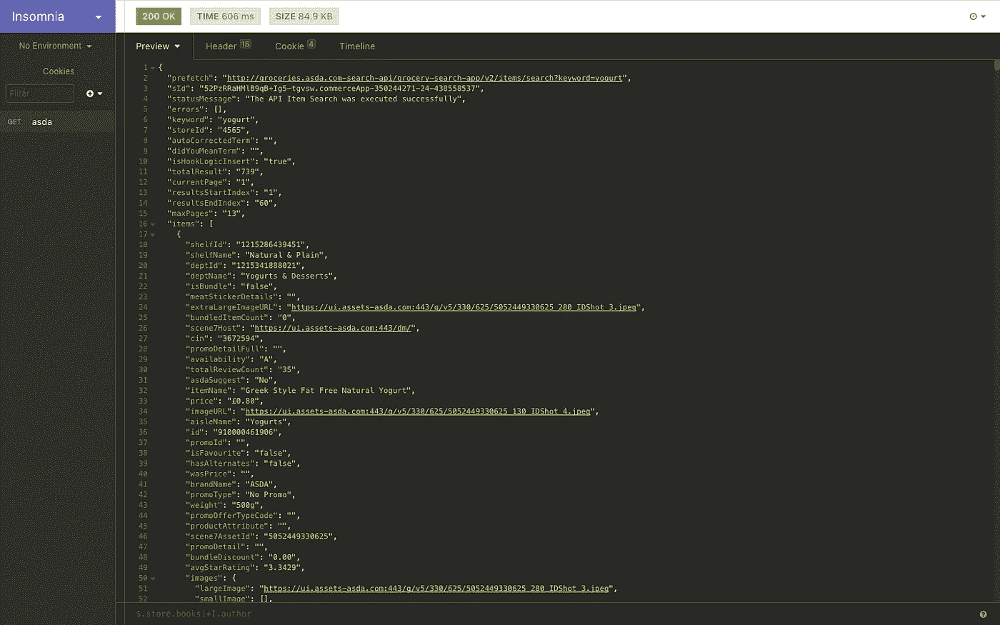

# 数据科学技能:使用 python 进行网页抓取 javascript

> 原文：<https://towardsdatascience.com/data-science-skills-web-scraping-javascript-using-python-97a29738353f?source=collection_archive---------0----------------------->


使用 python 有不同的抓取网页的方法。在我的上一篇文章中，我通过使用库:`requests`和`BeautifulSoup`介绍了 web 抓取。然而，许多网页是动态的，并且使用 JavaScript 来加载它们的内容。这些网站通常需要不同的方法来收集数据。

[](/data-science-skills-web-scraping-using-python-d1a85ef607ed) [## 数据科学技能:使用 python 进行网络搜集

### 作为一名数据科学家，我在工作中接受的第一批任务之一就是网络搜集。这完全是…

towardsdatascience.com](/data-science-skills-web-scraping-using-python-d1a85ef607ed) 

在本教程中，我将介绍几种收集包含 Javascript 的网页内容的不同方法。使用的技术如下:

1.  将`selenium`与 Firefox 网络驱动一起使用
2.  使用带`phantomJS`的无头浏览器
3.  使用 REST 客户端或 python `requests`库进行 API 调用

## TL；DR 关于用 python 抓取 javascript 网页的例子，你可以在 [GitHub](https://github.com/kaparker/tutorials/blob/master/pythonscraper/websitescrapefasttrack.py) 上找到本教程涵盖的完整代码。

2019 年 11 月 7 日更新:请注意，被抓取的网页的 html 结构可能会随着时间的推移而更新，本文最初反映的是 2018 年 11 月发布时的结构。这篇文章现在已经更新，可以在当前网页上运行，但将来可能会再次改变。

# 第一步

开始教程，我首先需要找到一个网站刮。在继续使用 web scraper 之前，务必检查您计划抓取的网站上的条款和条件以及隐私政策，以确保您没有违反他们的任何使用条款。

# 动机

当试图找到一个合适的网站来演示时，我首先看到的许多例子都明确表示禁止使用网络爬虫。直到看了一篇关于酸奶[含糖量](https://www.bbc.co.uk/news/health-45565364)的文章，想知道在哪里可以找到最新的营养信息，激发了我在哪里可以找到合适的网站的另一个思路；网上超市。

在线零售商通常有使用 javascript 加载内容的动态网页，因此本教程的目的是从在线超市的网页中抓取酸奶的营养信息。

# 设置您的环境

由于我们将使用一些新的 python 库来访问网页内容和处理数据，这些库将需要使用您常用的 python 包管理器`pip`来安装。如果你还没有`beautifulsoup`，那么你也需要在这里安装它。

```
pip install selenium
pip install pandas
```

要使用`selenium`作为网络驱动程序，还有一些额外的要求:

## 火狐浏览器

我将使用 Firefox 作为我的网络驱动程序的浏览器，所以这意味着你要么需要安装 Firefox 来跟随这个教程，要么你可以使用 Chrome 和 Chrome。

## 壁虎

要使用 web 驱动程序，我们需要安装一个 web 浏览器引擎 geckodriver。您需要为您的操作系统下载 [geckodriver](https://github.com/mozilla/geckodriver/releases) ，提取文件并设置可执行路径位置。

您可以通过几种方式来完成此操作:
(i)将 geckodriver 移动到您选择的目录中，并在您的 python 代码中定义此可执行路径(参见后面的示例)，

(ii)将 geckodriver 移动到一个已经设置为可执行文件所在目录的目录中，这就是您的环境变量 path。
您可以通过以下方式找到您的`$PATH`中有哪些目录:

**窗口** 转到:

*控制面板>环境变量>系统变量>路径*

**Mac OSX / Linux**
在你的终端中使用命令:

```
echo $PATH
```

(iii)将壁虎驱动程序位置添加到您的`PATH`环境变量中

**窗口
窗口**转到:

*控制面板>环境变量>系统变量>路径>编辑* 

**Mac OSX / Linux** 给你的`.bash_profile` (Mac OSX)或者`.bash_rc` (Linux)加一行

```
# add geckodriver to your PATH
export PATH="$PATH:/path/to/your/directory"
```

重新启动您的终端，并使用(ii)中的命令检查您的新路径是否已经添加。

## 幻象

类似于 geckodriver 的步骤，我们也需要下载 [PhantomJS](http://phantomjs.org/download.html) 。下载完成后，按照上述相同的说明，解压文件并移动到选择的目录或添加到可执行文件路径。

## REST 客户端

在这篇博客的最后一部分，我们将使用 REST 客户端向 API 发出请求。我将使用[失眠](https://insomnia.rest/)，但是你可以随意使用你喜欢的任何一个客户端！

# 使用 BeautifulSoup 抓取网页

按照我的[web 抓取入门教程](https://medium.com/@_kaparker/data-science-skills-web-scraping-using-python-d1a85ef607ed)中概述的标准步骤，我检查了[网页](https://groceries.asda.com/search/yogurt)，并想要提取重复的 HTML 元素:

```
<div data-cid="XXXX" class="listing category_templates clearfix productListing ">...</div>
```

作为第一步，您可以尝试使用 BeautifulSoup 通过以下脚本提取这些信息。

```
# import libraries
import urllib.request
from bs4 import BeautifulSoup# specify the url
urlpage = '[https://groceries.asda.com/search/yogurt'](https://groceries.asda.com/search/yoghurt') 
print(urlpage)
# query the website and return the html to the variable 'page'
page = urllib.request.urlopen(urlpage)
# parse the html using beautiful soup and store in variable 'soup'
soup = BeautifulSoup(page, 'html.parser')
# find product items
# at time of publication, Nov 2018:
# results = soup.find_all('div', attrs={'class': 'listing category_templates clearfix productListing'})# updated Nov 2019:
results = soup.find_all('div', attrs={'class': 'co-product'})
print('Number of results', len(results))
```

没想到的是，在运行 python 脚本时，即使我在网页上看到很多结果，返回的结果数也是 0！

```
[https://groceries.asda.com/search/yoghurt](https://groceries.asda.com/search/yoghurt)
BeautifulSoup - Number of results 0
```

当进一步检查页面时，网页上有许多动态特征，这表明 javascript 用于呈现这些结果。
右键单击并选择`View Page Source`有许多`<script>`元素在使用中，搜索上面包含我们感兴趣的数据的元素不会返回匹配结果。

抓取该网页的第一种方法是使用 Selenium web driver 调用浏览器，搜索感兴趣的元素并返回结果。

# 使用 Selenium 抓取网页

## 1.硒配壁虎

由于我们无法使用 Beautiful Soup 访问 web 页面的内容，我们首先需要在 python 脚本中设置一个 web 驱动程序。

```
# import libraries
import urllib.request
from bs4 import BeautifulSoup
from selenium import webdriver
import time
import pandas as pd# specify the url
urlpage = '[https://groceries.asda.com/search/yogurt'](https://groceries.asda.com/search/yoghurt') 
print(urlpage)
# run firefox webdriver from executable path of your choice
driver = webdriver.Firefox(executable_path = 'your/directory/of/choice')
```

正如在安装 geckodriver 时提到的，如果可执行文件不在可执行路径中，我们可以在 python 脚本中定义路径。如果它在一个可执行路径中，那么上面的行变成:

```
# run firefox webdriver from executable path of your choice
driver = webdriver.Firefox()
```

设置完成后，我们现在可以连接到网页并找到感兴趣的元素。当在浏览器中加载网页时，结果通常需要一段时间来加载，甚至可能直到我们向下滚动页面时才加载。
考虑到这一点，我们可以为 web 驱动程序添加一些 javascript 来执行这些操作。下面是一个让页面滚动的简单例子，有更有效的方法可以做到这一点，为什么不在这里测试你自己的 javascript，让我在评论中知道什么最适合你！

我们还添加了一个睡眠时间，作为等待页面完全加载的另一种方法。

```
# get web page
driver.get(urlpage)
# execute script to scroll down the page
driver.execute_script("window.scrollTo(0, document.body.scrollHeight);var lenOfPage=document.body.scrollHeight;return lenOfPage;")
# sleep for 30s
time.sleep(30)
# driver.quit()
```

如果我们现在运行脚本(你也可以在最后取消对`driver.quit()`的注释以确保浏览器关闭)，当你的 python 脚本运行时，Firefox 将打开指定的 url 并向下滚动页面。希望在脚本运行完成之前，您应该已经加载了许多产品。

接下来，我们要获取感兴趣的元素。以前，我们使用 Beautiful Soup 试图根据标签和类属性查找所有元素，但是，在本例中，我们将使用一种稍微不同的方法来访问产品信息。相反，我们可以基于 XML 结构或 css 选择器，通过 xpath 搜索元素。

我们可以检查感兴趣的元素，在工具栏中，右键单击突出显示的元素，然后*复制>复制 xpath(或复制选择器)*。这是理解 html 结构的另一种有趣的方式。在这种情况下，我们将使用 xpath 来查找元素，然后我们可以打印匹配的结果数:

```
# find elements by xpath# at time of publication, Nov 2018:
# results = driver.find_elements_by_xpath("//*[[@id](http://twitter.com/id)='componentsContainer']//*[contains([@id](http://twitter.com/id),'listingsContainer')]//*[[@class](http://twitter.com/class)='product active']//*[[@class](http://twitter.com/class)='title productTitle']")# updated Nov 2019:
results = driver.find_elements_by_xpath("//*[@class=' co-product-list__main-cntr']//*[@class=' co-item ']//*[@class='co-product']//*[@class='co-item__title-container']//*[@class='co-product__title']")
print('Number of results', len(results))
```

使用 xpath 而不是使用元素的一个主要原因是结果有一些元素，其中 id 的词干是带有一些附加单词的`listingsContainer`，所以`contains`函数被用来选择所有结果，但也排除了容器中的任何其他`div`元素，例如广告。

```
Firefox Webdriver - Number of results 38
```

现在我们已经有了页面的一些结果，我们可以循环每个结果并保存感兴趣的数据。在这种情况下，我们可以保存产品名称和链接。

*注意，网页上实际上有 38 个以上的结果。根据连接到页面时加载的结果数量，这个数字也可能会有所不同。所有的结果都可以通过改变我们执行的 javascript 来收集，或者其他的方法将在下面的章节中探讨。*

```
# create empty array to store data
data = []
# loop over results
for result in results:
    product_name = result.text
    link = result.find_element_by_tag_name('a')
    product_link = link.get_attribute("href")
    # append dict to array
    data.append({"product" : product_name, "link" : product_link})
```

在这个循环之外，我们可以关闭浏览器，因为我们导入了`pandas`库，我们可以通过将我们抓取的数据保存到 dataframe 来利用它。我们可以打印数据帧来查看内容。

```
# close driver 
driver.quit()
# save to pandas dataframe
df = pd.DataFrame(data)
print(df)
```

在这种格式下，我们可以非常简单地将数据写入 csv。

```
# write to csv
df.to_csv('asdaYogurtLink.csv')
```

将 Selenium 与 geckodriver 一起使用是一种快速抓取使用 javascript 的网页的方法，但也有一些缺点。我发现有时页面无法加载(我确信通过改变我们如上所述执行的 javascript 可以更有效，但是我是 JS 新手，所以这可能需要一些时间)，但是加载浏览器和等待页面加载也需要时间。

另一个选择，我们可以使用无头浏览器。这将加快抓取速度，因为我们不必每次都等待浏览器加载。

## 2.带无头浏览器的 Selenium

当使用 PhantomJS 代替 geckodriver 作为无头浏览器时，唯一的区别是 web 驱动程序是如何加载的。这意味着我们可以遵循上面的方法，但是改变初始化 web 驱动程序的行，变成:

```
# run phantomJS webdriver from executable path of your choice
driver = webdriver.PhantomJS(executable_path = 'your/directory/of/choice')
```

这里要注意的是，对 PhantomJS 的 Selenium 支持已经贬值，并提供了一个警告。

通过使用 headless 选项，还可以对 geckodriver 使用 headless 模式:

```
from selenium import webdriver
from selenium.webdriver.firefox.options import Optionsoptions = Options()
options.headless = True
driver = webdriver.Firefox(firefox_options=options, executable_path = 'your/directory/of/choice')
```

通过使用无头浏览器，我们应该看到脚本运行时间的改进，因为我们没有打开浏览器，但不是所有的结果都以类似于在正常模式下使用 firefox webdriver 的方式收集。

# 发出 API 请求

我们将在本教程中讨论的最后一种方法是向 API 发出请求。当检查网页 XHR 文件时，当页面加载时，该页面显示正在进行的请求。在这个列表中有一个`/search`请求，它调用一个 API 端点来获得页面上显示的结果。

我们可以使用 REST 客户机或几行 python 来发出同样的请求。

如果我们检查`search`文件，查看文件头、包含关键字的请求 url 以及发出请求所需的其他参数。在一般细节下面是我们以后可能需要的响应和请求头。



Inspect tool showing the search request headers

为了获得响应，我们可以获取请求 url，并作为测试将它输入到浏览器的地址栏中。因为参数是在字符串中添加的，所以我们也可以尝试删除除关键字参数之外的所有参数，以测试是否还需要其他参数。在这种情况下，关键字查询在浏览器中返回结果，因此我们也可以使用 REST 客户机或 python 来执行相同的请求。

## 失眠休息客户

使用失眠症，我们可以输入请求 url 并发送请求。

这将返回一个包含我们正在寻找的数据的 JSON 响应！



Preview of JSON response in Insomnia

这个例子非常简单，不需要头或安全令牌。对于其他情况，REST 客户机允许您输入任何附加的响应参数，这些参数可以在收集请求细节时从 inspect 工具获得。

## Python 请求

我们也可以使用`urllib.request`库从 python 发出同样的请求，就像我们在抓取之前连接到网页一样。

通过添加一些参数来缩进和排序关键字，可以使 JSON 响应更具可读性，这样我们现在就可以打开文件，并在进行搜索时看到提供给网页的响应数据。

```
# import json library
import json# request url
urlreq = '[https://groceries.asda.com/api/items/search?keyword=yogurt'](https://groceries.asda.com/api/items/search?keyword=yogurt')# get response
response = urllib.request.urlopen(urlreq)# load as json
jresponse = json.load(response)# write to file as pretty print
with open('asdaresp.json', 'w') as outfile:
    json.dump(jresponse, outfile, sort_keys=True, indent=4)
```

目前，我们将保留所有数据。我的下一篇教程将更详细地介绍数据结构和输出，这样我们就可以操作 JSON 并找到相关的数据。

# 摘要

本教程概述了一些我们可以用来抓取使用 javascript 的网页的方法。这些方法包括:

## 使用 web 驱动程序抓取内容

*   使用 selenium web 驱动程序连接到带有 Firefox web 驱动程序、PhantomJS 和 headless 浏览器的网页
*   使用 web 驱动程序查找感兴趣的元素
*   循环结果并保存感兴趣的变量
*   将数据保存到数据帧
*   写入 csv 文件

## 发出 HTTP 请求

*   检查网页以查找 HTTP 请求的详细信息
*   使用浏览器、REST 客户端或 python 发出 GET 请求

虽然 HTTP 请求方法在本教程中实现起来更快，并且从一个请求中提供了我们需要的所有数据，但情况并不总是这样。并非所有网站都会显示它们的请求，过期的身份验证令牌可能会带来额外的安全性，或者输出数据可能需要大量清理，这比使用带有一些 javascript 的 web 驱动程序来加载所有结果并在所有页面上循环需要更多的工作。本教程提供了一些不同的选择，你可以尝试使用它们来抓取 javascript。

在我的下一个教程中，我们将探索数据结构，操作数据和写入输出文件或数据库。

感谢您的阅读！如果你喜欢我的文章，那么[订阅我的每月简讯](https://kaparker.substack.com/)，在那里你可以将我的最新文章和顶级资源直接发送到你的收件箱，或者在我的[网站](http://kaparker.com/)上了解更多关于我正在做的事情。

如果您是 python 的新手或者想要提高，请查看我的文章，其中包含学习资源列表，包括数据科学课程:

[](/learn-to-code-learn-python-efb037b248e8) [## 学习编码。学习 Python。

### 你想学习编码但是不知道从哪里开始吗？开始您的编码之旅，并决定 python 是否…

towardsdatascience.com](/learn-to-code-learn-python-efb037b248e8)