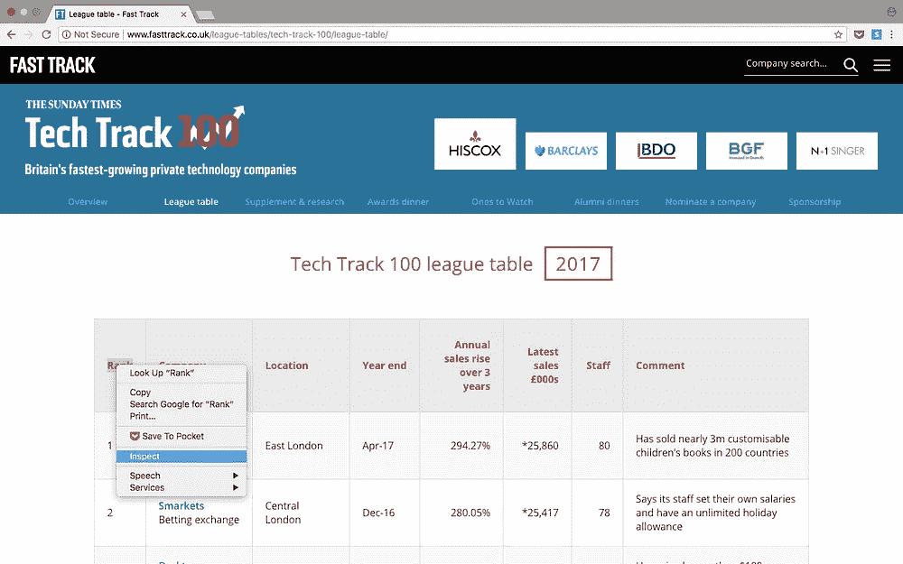
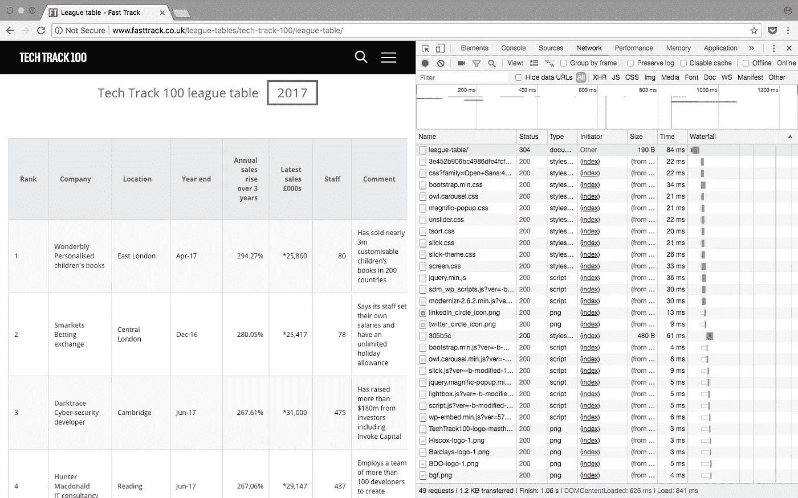

# 数据科学技能:使用 python 进行网络搜集

> 原文：<https://towardsdatascience.com/data-science-skills-web-scraping-using-python-d1a85ef607ed?source=collection_archive---------0----------------------->


作为一名数据科学家，我在工作中接受的第一批任务之一就是网络搜集。这在当时对我来说是一个完全陌生的概念，使用代码从网站收集数据，但这是最符合逻辑和最容易获得的数据来源之一。经过几次尝试，网页抓取已经成为我的第二天性，也是我几乎每天都要使用的技能之一。

在本教程中，我将通过一个简单的例子来说明如何从[快速通道](http://www.fasttrack.co.uk/)中抓取一个网站来收集 2018 年前 100 家公司的数据。使用 web scraper 自动完成这一过程避免了手动收集数据，节省了时间，还允许您将所有公司数据保存在一个结构化文件中。

## **TL；关于 python 中一个简单的 web scraper 的快速例子，你可以在 GitHub 上找到本教程中的完整代码。**

# 入门指南

在开始使用任何 python 应用程序之前，首先要问的问题是“我需要哪些库？”

对于 web 抓取，有几个不同的库可以考虑，包括:

*   美味的汤
*   要求
*   Scrapy
*   硒

在这个例子中，我们将使用美丽的汤。使用 Python 包管理器`pip`，您可以用以下代码安装 Beautiful Soup:

```
pip install BeautifulSoup4
```

安装好这些库之后，让我们开始吧！

# 检查网页

要知道 python 代码中需要哪些元素，首先需要检查网页。

要从[技术跟踪 100 强公司](http://www.fasttrack.co.uk/league-tables/tech-track-100/league-table/)收集数据，您可以通过右键单击感兴趣的元素并选择 inspect 来检查页面。这将显示 HTML 代码，从中我们可以看到包含每个字段的元素。



Right click on the element you are interested in and select ‘Inspect’, this brings up the html elements

因为数据存储在一个表中，所以只需几行代码就可以轻松完成。如果你想熟悉抓取网站，这是一个很好的例子，也是一个很好的起点，但是要记住，事情不会总是这么简单！

所有 100 个结果都包含在`<tr>`元素的行中，这些结果都可以在一个页面上看到。情况并非总是如此，当结果跨越多个页面时，您可能需要更改网页上显示的结果数量，或者循环所有页面以收集所有信息。

在排行榜网页上，显示了包含 100 个结果的表格。当检查页面时，很容易看到 html 中的模式。结果包含在表的行中:

```
<table class="tableSorter">
```

重复的行`<tr>`将通过使用 python 中的循环查找数据并写入文件来保持我们的代码最少！

*补充说明:另一个可以完成的检查是检查网站上是否发出了 HTTP GET 请求，该请求可能已经以结构化响应(如 JSON 或 XML 格式)的形式返回了结果。您可以在 inspect tools 的 network 选项卡中检查这一点，通常在 XHR 选项卡中。页面刷新后，将显示加载的请求，如果响应包含格式化的结构，使用 REST 客户端(如* [*失眠症*](https://insomnia.rest/) *)返回输出通常会更容易。*



Network tab of the page inspect tool after refreshing the webpage

# 使用美汤解析网页 html

现在你已经看到了 html 的结构，并且熟悉了你所抓取的内容，是时候开始使用 python 了！

第一步是导入将用于 web scraper 的库。我们已经在上面谈到了 BeautifulSoup，它帮助我们处理 html。我们要导入的下一个库是`urllib`,它连接到网页。最后，我们将把输出写到一个 csv 文件中，所以我们还需要导入`csv`库。作为替代，这里可以使用`json`库。

```
# import libraries
from bs4 import BeautifulSoup
import urllib.request
import csv
```

下一步是定义您正在抓取的 url。如前所述，此网页在一页上显示所有结果，因此地址栏中的完整 url 在此给出。

```
# specify the url
urlpage =  '[http://www.fasttrack.co.uk/league-tables/tech-track-100/league-table/'](http://www.fasttrack.co.uk/league-tables/tech-track-100/league-table/')
```

然后，我们连接到网页，我们可以使用 BeautifulSoup 解析 html，将对象存储在变量“Soup”中。

```
# query the website and return the html to the variable 'page'
page = urllib.request.urlopen(urlpage)
# parse the html using beautiful soup and store in variable 'soup'
soup = BeautifulSoup(page, 'html.parser')
```

我们可以在这个阶段打印 soup 变量，它将返回我们所请求的网页的完整解析的 html。

```
print(soup)
```

如果有错误或变量为空，则请求可能没有成功。此时，您可能希望使用`[urllib.error](https://docs.python.org/3/library/urllib.error.html)`模块实现错误处理。

# 搜索 html 元素

因为所有的结果都包含在一个表中，所以我们可以使用`find`方法搜索表的 soup 对象。然后我们可以使用`find_all`方法找到表中的每一行。

如果我们打印行数，结果应该是 101，这 100 行加上标题。

```
# find results within table
table = soup.find('table', attrs={'class': 'tableSorter'})
results = table.find_all('tr')
print('Number of results', len(results))
```

因此，我们可以循环结果来收集数据。

打印 soup 对象中的前 2 行，我们可以看到每一行的结构是:

```
<tr>
<th>Rank</th>
<th>Company</th>
<th class="">Location</th>
<th class="no-word-wrap">Year end</th>
<th class="" style="text-align:right;">Annual sales rise over 3 years</th>
<th class="" style="text-align:right;">Latest sales £000s</th>
<th class="" style="text-align:right;">Staff</th>
<th class="">Comment</th>
<!--                            <th>FYE</th>-->
</tr>
<tr>
<td>1</td>
<td><a href="[http://www.fasttrack.co.uk/company_profile/wonderbly-3/](http://www.fasttrack.co.uk/company_profile/wonderbly-3/)"><span class="company-name">Wonderbly</span></a>Personalised children's books</td>
<td>East London</td>
<td>Apr-17</td>
<td style="text-align:right;">294.27%</td>
<td style="text-align:right;">*25,860</td>
<td style="text-align:right;">80</td>
<td>Has sold nearly 3m customisable children’s books in 200 countries</td>
<!--                                            <td>Apr-17</td>-->
</tr>
```

表格中有 8 列，包括:排名、公司、地点、年末、年销售额上升、最新销售额、员工和评论，所有这些都是我们可以保存的有趣数据。

这种结构在网页的所有行中都是一致的(并非所有网站都是如此！)，因此我们可以再次使用`find_all`方法将每一列分配给一个变量，我们可以通过搜索`<td>`元素将该变量写入 csv 或 JSON。

# 遍历元素并保存变量

在 python 中，将结果附加到列表中，然后将数据写入文件，这很有用。我们应该在循环之前声明列表并设置 csv 的头，如下所示:

```
# create and write headers to a list 
rows = []
rows.append(['Rank', 'Company Name', 'Webpage', 'Description', 'Location', 'Year end', 'Annual sales rise over 3 years', 'Sales £000s', 'Staff', 'Comments'])
print(rows)
```

这将打印出我们添加到包含标题的列表中的第一行。

您可能会注意到有几个额外的字段`Webpage`和`Description`，它们不是表中的列名，但是如果您仔细查看我们打印上面的 soup 变量时的 html，第二行包含的不仅仅是公司名称。我们可以使用一些进一步的提取来获得这些额外的信息。

下一步是遍历结果，处理数据并添加到可以写入 csv 的`rows` 。

要在循环中查找结果:

```
# loop over results
for result in results:
    # find all columns per result
    data = result.find_all('td')
    # check that columns have data 
    if len(data) == 0: 
        continue
```

由于表中的第一行只包含标题，我们可以跳过这个结果，如上所示。它也不包含任何`<td>`元素，因此当搜索该元素时，不会返回任何内容。然后，我们可以通过要求数据长度不为零来检查是否只处理包含数据的结果。

然后我们可以开始处理数据并保存到变量中。

```
 # write columns to variables
    rank = data[0].getText()
    company = data[1].getText()
    location = data[2].getText()
    yearend = data[3].getText()
    salesrise = data[4].getText()
    sales = data[5].getText()
    staff = data[6].getText()
    comments = data[7].getText()
```

上面的代码只是从每一列中获取文本，并保存到变量中。然而，这些数据中的一些需要进一步清理，以移除不需要的字符或提取进一步的信息。

# 数据清理

如果我们打印出变量`company`，文本不仅包含公司名称，还包含描述。如果我们打印出`sales`，它包含了不需要的字符，比如脚注符号，删除这些字符会很有用。

```
 print('Company is', company)
    # Company is WonderblyPersonalised children's books          
    print('Sales', sales)
    # Sales *25,860
```

我们想把`company`分成公司名称和描述，这可以用几行代码来完成。再次查看 html，对于该列，有一个仅包含公司名称的`<span>`元素。本专栏中还有一个链接，链接到网站上的另一个页面，该页面有关于该公司的更多详细信息。我们稍后会用到它！

```
<td><a href="[http://www.fasttrack.co.uk/company_profile/wonderbly-3/](http://www.fasttrack.co.uk/company_profile/wonderbly-3/)"><span class="company-name">Wonderbly</span></a>Personalised children's books</td>
```

为了将`company`分成两个字段，我们可以使用`find`方法保存`<span>`元素，然后使用`strip`或`replace`从`company`变量中删除公司名称，这样就只剩下描述了。
为了从`sales`中删除不想要的字符，我们可以再次使用`strip`和`replace`方法！

```
 # extract description from the name
    companyname = data[1].find('span', attrs={'class':'company-name'}).getText()    
    description = company.replace(companyname, '')

    # remove unwanted characters
    sales = sales.strip('*').strip('†').replace(',','')
```

我们希望保存的最后一个变量是公司网站。如上所述，第二列包含到另一个页面的链接，该页面包含每个公司的概述。每个公司页面都有自己的表格，大部分时间都包含公司网站。


Inspecting the element of the url on the company page

要从每个表中抓取 url 并将其保存为变量，我们需要使用与上面相同的步骤:

*   在快速通道网站上查找包含公司页面 url 的元素
*   向每个公司页面 url 发出请求
*   使用 Beautifulsoup 解析 html
*   找到感兴趣的元素

查看一些公司页面，如上面的截图所示，URL 位于表格的最后一行，因此我们可以在最后一行中搜索`<a>`元素。

```
 # go to link and extract company website
    url = data[1].find('a').get('href')
    page = urllib.request.urlopen(url)
    # parse the html 
    soup = BeautifulSoup(page, 'html.parser')
    # find the last result in the table and get the link
    try:
        tableRow = soup.find('table').find_all('tr')[-1]
        webpage = tableRow.find('a').get('href')
    except:
        webpage = None
```

也可能有公司网站不显示的情况，因此我们可以使用`try` `except`条件，以防找不到 url。

一旦我们将所有数据保存到变量中，仍然在循环中，我们可以将每个结果添加到列表`rows`。

```
 # write each result to rows
    rows.append([rank, companyname, webpage, description, location, yearend, salesrise, sales, staff, comments])print(rows)
```

然后在循环之外打印变量是很有用的，在把它写到文件之前，检查它看起来是否像你期望的那样！

# 写入输出文件

您可能希望保存这些数据以供分析，这可以在 python 中从我们的列表中非常简单地完成。

```
# Create csv and write rows to output file
with open('techtrack100.csv','w', newline='') as f_output:
    csv_output = csv.writer(f_output)
    csv_output.writerows(rows)
```

运行 python 脚本时，将生成包含 100 行结果的输出文件，您可以进一步查看详细信息！

# 摘要

这篇关于使用 python 进行 web 抓取的简短教程概述了:

*   连接到网页
*   使用 BeautifulSoup 解析 html
*   遍历 soup 对象以查找元素
*   执行一些简单的数据清理
*   将数据写入 csv

这是我的第一个教程，所以让我知道你是否有任何问题或意见，如果事情不清楚！

感谢您的阅读！如果你喜欢我的文章，那么[订阅](https://kaparker.substack.com/)我的每月简讯，在那里你可以将我的最新文章和顶级资源直接发送到你的收件箱！

你可以在 [Medium](https://medium.com/@_kaparker) 上关注我以获取更多文章，在 [Twitter](https://twitter.com/_kaparker) 上关注我，或者在我的[网站](http://kaparker.com/)上了解更多我正在做的事情。