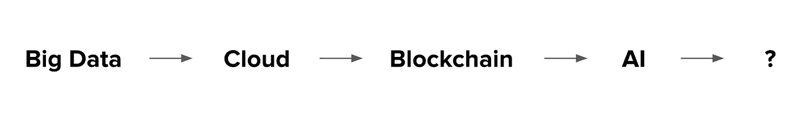
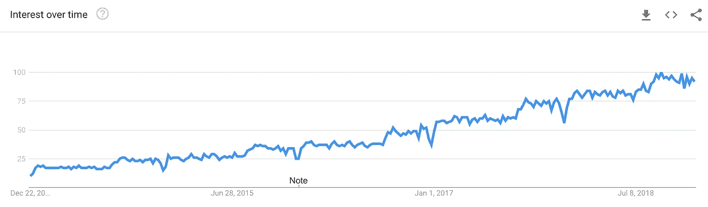
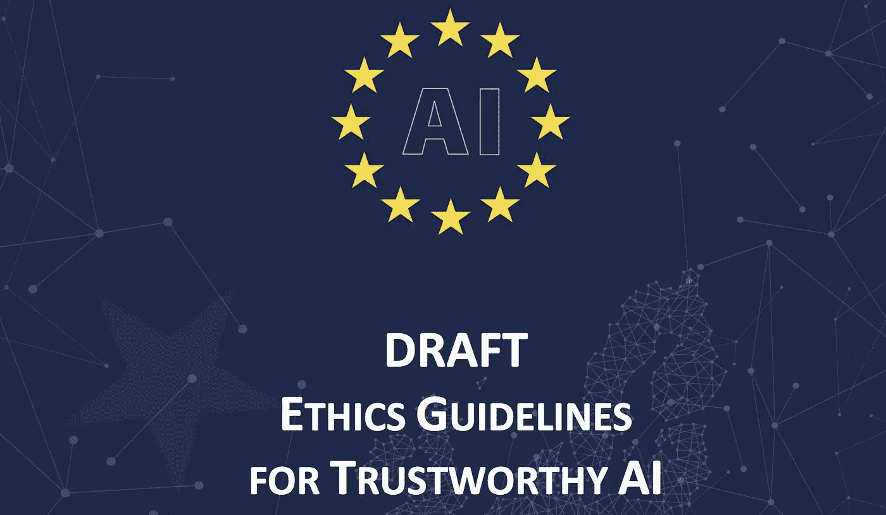
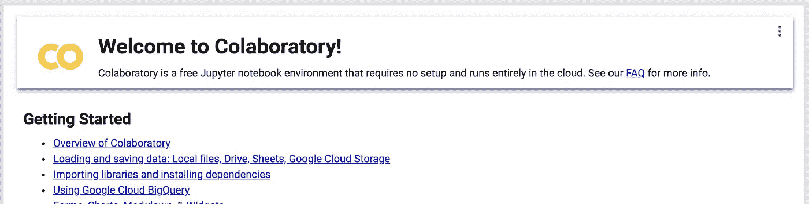
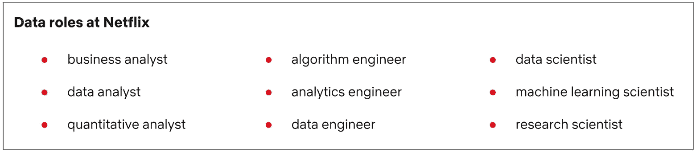

# 2019 年数据科学趋势

> 原文：<https://towardsdatascience.com/data-science-trends-for-2019-11b2397bd16b?source=collection_archive---------6----------------------->

## 发生了很多事情，2018 年发生了什么，2019 年看起来有什么前景？

这一年可以被认为是人工智能(AI)的蓬勃发展。看看那些标语中带有*人工智能*的创业公司的数量就知道了；大公司的收购集中在哪里；以及最大的科技会议的主题。人工智能无处不在——即使只是作为一个*的流行语*。但是人工智能到底是什么？那是一个相当难回答且有争议的问题。

Hype bag-of-words. Let’s not focus on buzzwords, but on what the beneath technologies can actually solve.

明确的是，数据科学正在解决问题。数据无处不在，我们对数据的利用越来越多，对社会的影响也越来越大。让我们关注**数据科学**，而其他人则对人工智能的最佳定义进行哲学思考。

当其他流行语保持繁荣时，*数据科学*怎么样了？

Interest for “data science” term since December 2013 (source: Google Trends)

兴趣一点都不差！我一直坚持认为数据科学不是一个时髦的词。即使对于现在加入数据科学的人来说——他们有很多——你只需要在 LinkedIn 上快速搜索工作，你会惊讶于提供的数量。让我们先来看看 2018 年发生了什么，然后关注 2019 年的热点话题。

# 今天

去年，我发表了一篇[文章，阐述了我对 2018 年](https://www.linkedin.com/pulse/data-science-trends-2018-hugo-lopes/)数据科学趋势的预期。我提到的主要发展是:工作流的自动化、可解释性、公平性、数据科学的商品化以及特征工程/清理工具的改进。

关于**自动化**，数据科学家的工作通常是他们自己工作的自动化。如今，公司开源自己的自动化管道非常普遍。其他的，只是继续卖，但是每天都有更多的竞争(例如，[微软 Azure](https://azure.microsoft.com/en-us/) ， [H2O](https://www.h2o.ai/solutions/) ，[数据机器人](https://www.datarobot.com/)，[谷歌](https://ai.google/tools/))。幸运的是，数据科学是一门横向学科，医疗保健中使用的相同算法经过一些调整也可以用于农业。因此，如果一家公司在一个垂直领域失败了，他们的发展可以很快适应另一个领域。

这些工具正成为常规的商品，你甚至不需要知道如何编码就能使用它们。其中一些诞生于几年前数据科学人才的匮乏，后来变成了有利可图的产品。这让人想起了[返工](https://basecamp.com/books/rework)书的原则之一——卖掉你的副产品。

Ways to make humans trust machines are being paved (image by [rawpixel](https://unsplash.com/@rawpixel/portfolio))

**可解释性**和**公平性**在 2018 年有了很大的发展。现在有更多的可用资源。仅仅是 Python *alpha* 版本的工具已经成熟(例如 [SHAP](https://github.com/slundberg/shap) )。此外，你可以很容易地找到关于这个主题的结构化和支持性的书籍，如 Christoph Molnar 的[可解释机器学习](https://christophm.github.io/interpretable-ml-book/)书。通过减少障碍，理解高度复杂的模型正朝着正确的方向前进——谷歌的 [*假设工具*](https://pair-code.github.io/what-if-tool/) 就是一个很好的例子。

**特征工程**仍然是数据科学解决方案的主要秘密武器之一——看看 Kaggle 中关于[家庭信用违约风险获胜解决方案的描述。虽然许多最好的特征仍然是手工创建的，但是](https://www.kaggle.com/c/home-credit-default-risk)[特征工具](https://github.com/Featuretools/featuretools)成为今年主要的特征工程库之一，为懒人(聪明？)数据科学家。这些工具的问题是，您需要在整个业务中有数据标准，也就是说，如果您的一个客户端以一种格式交付数据，您应该确保第二个客户端遵循相同的过程，否则，您将有许多不希望的手工工作。

最后，如果我们给编程语言颁发奥斯卡奖， **Python** 可能会收到其中一些。根据 Stack Overflow 的说法，[连续第二年成为增长最快的主要编程语言和最受欢迎的语言。按照这种速度，它正迅速成为使用最多的编程语言。](https://insights.stackoverflow.com/survey/2018/)

# 明天

那么，下一步是什么？还能做什么？

上述主题大有可为。在 2019 年和接下来的几年里，它们将继续成为数据科学家的一些主要关注点。重点将放在成熟的技术上，同时回答以下问题:

*   我们如何最大限度地减少数据科学家在数据清理和功能工程上花费的时间？
*   我们如何在机器学习的背景下定义*信任*？
*   如果说一个机器模型是公平的，那么它的特点是什么？

What are the principles according to which we can say that we trust a robot? (image by [Andy Kelly](https://unsplash.com/@askkell))

但是，除了这些难以回答的元问题之外，还有什么有希望的话题呢？

**强化学习**在它的一生中可能经历了许多寒冬。然而，看起来我们正在接近另一个春天。一个很好的例子就是 [Dota 2](https://www.youtube.com/watch?v=w3ues-NayAs) 中的精彩表现。有很多事情要做，需要大量的计算能力……但是，无论如何，强化学习是我们目前最像人类的学习行为，看到它的应用令人兴奋。

我们很可能会看到这些概念验证变成实际的产品。如果你有时间，看看它们，用 [OpenAI gym](https://gym.openai.com/) 来开发它们。

> GDPR 的叙文 71:数据主体应该“有权……获得对所作决定的解释……并对决定提出质疑。”

**通用数据保护法规** (GDPR)自 2018 年 5 月 25 日起在欧盟生效，并直接影响数据科学。问题是:企业仍在理解这一新规定的局限性。两个主要的开放主题是:

*   **数据隐私**。错误处理个人数据的公司现在面临巨额罚款的威胁。这是否意味着获取数据对于研究来说将变得更加困难？我们会看到[数据综合](/synthetic-data-generation-a-must-have-skill-for-new-data-scientists-915896c0c1ae)的新发展吗？我们能真正做到[匿名化数据](https://www.fastcompany.com/90278465/sorry-your-data-can-still-be-identified-even-its-anonymized)吗？
*   [**解释权**](https://en.wikipedia.org/wiki/Right_to_explanation) 。完全自动化的决策必须是可解释的。嗯，那很好…但是“可解释的”实际上是什么意思呢？我们会看到机器学习可解释性算法的标准化吗？欧盟实体对此没有给出答案——我们可能只是在等待有史以来最大的一笔罚款被执行。

> 可信的人工智能有两个组成部分:(1)它应该尊重基本权利、适用的法规以及核心原则和价值观，确保“道德目的”，以及(2)它应该在技术上强大和可靠，因为即使有良好的意图，缺乏技术掌握也可能造成无意的伤害[ [欧盟人工智能伦理](https://ec.europa.eu/digital-single-market/en/news/draft-ethics-guidelines-trustworthy-ai) ]

随着算法对社会的影响越来越大，我们有权确保偏见得到缓解，并且它们的使用是为了整体而不是少数人的利益。幸运的是，公司和机构正在致力于此。欧盟人工智能伦理草案和谷歌人工智能原则就是很好的例子。伦理还有很长的路要走，但它现在是一个经常讨论的话题——这很好。

[EU’s draft on AI ethics](https://ec.europa.eu/digital-single-market/en/news/draft-ethics-guidelines-trustworthy-ai) is an example on how governmental institutions are tackling the subject.

随着算法变得越来越复杂，更多的数据随时可用(现在每个小工具都会产生数据，对吧？)，使用笔记本电脑进行数据科学研究的人会越来越少。我们将使用**基于云的解决方案**，即使是最简单的项目(例如 [Google Colab](https://colab.research.google.com/) )。时间是稀缺的，GPU 不是…笔记本电脑的发展速度不够快，无法跟上所需的计算能力。

[Google Colab](https://colab.research.google.com/notebooks/welcome.ipynb): making it easier to share notebooks and using more computational power.

现在，假设你看到一家公司有一个“工程师”的职位空缺——就是这个。那太好了…但是现在有 100 种工程师。是机械工程师吗？航天？软件？“工程师”太通才了。

一两年前，公司会发布一个“数据科学家”的职位空缺。嗯，开始觉得*不完整*。如果你在这个领域刚刚起步，成为一名*普通*数据科学家可能会太难了。在掌握了这个领域之后，你最好专注于一个特定的主题。以网飞为例，它有[九个*数据*角色](https://medium.com/netflix-techblog/notebook-innovation-591ee3221233):

Netflix data roles (source: [Netflix Tech Blog](https://medium.com/netflix-techblog/notebook-innovation-591ee3221233))

有许多以前不存在的专业领域，数据科学家专注于一个领域来表明立场，这对于 T2 来说变得越来越重要。如果你还没有找到你自己的，现在是时候了。在我看来，[数据工程](https://www.oreilly.com/ideas/data-engineers-vs-data-scientists)技能是未来几年最有趣的技能。如果你的团队中没有他们，你可能只是在 Jupyter 笔记本上玩*数据科学。公司也意识到了这一点。*

2019 年将再次成为令人惊叹的一年。有很多事情要做，这不仅仅是技术和书呆子！真正需要解决的问题正在等待着。

作为结束语，记住时间是我们最大的财富。你花在做无价值的事情上的每一秒钟，都是你没有做伟大的事情而失去的一秒钟。选择你的话题，不要认为你的工作是一切照旧。

[*雨果·洛佩斯*](https://www.linkedin.com/in/hugodlopes/)