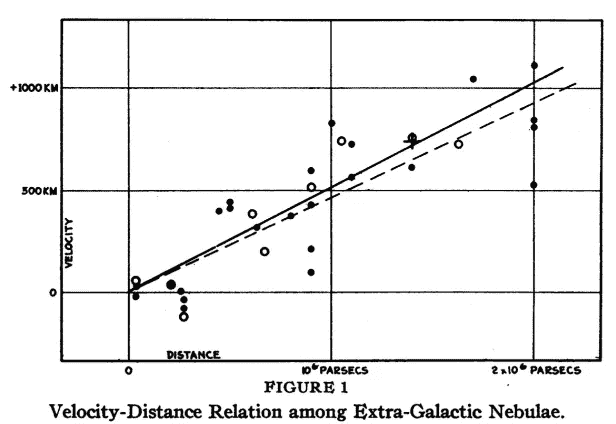
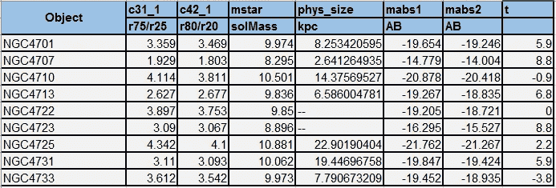
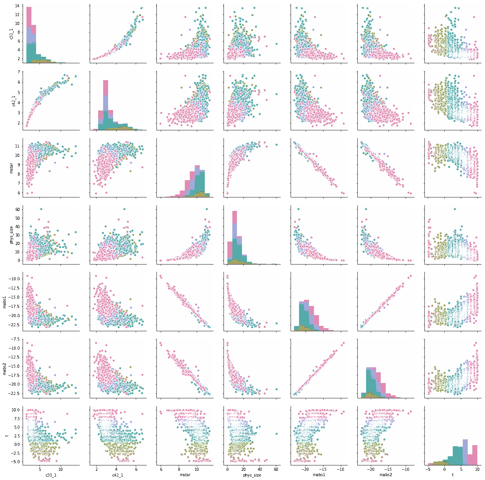
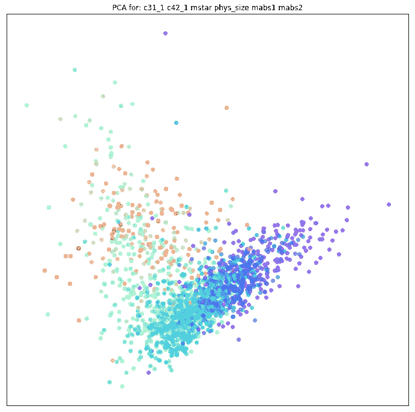
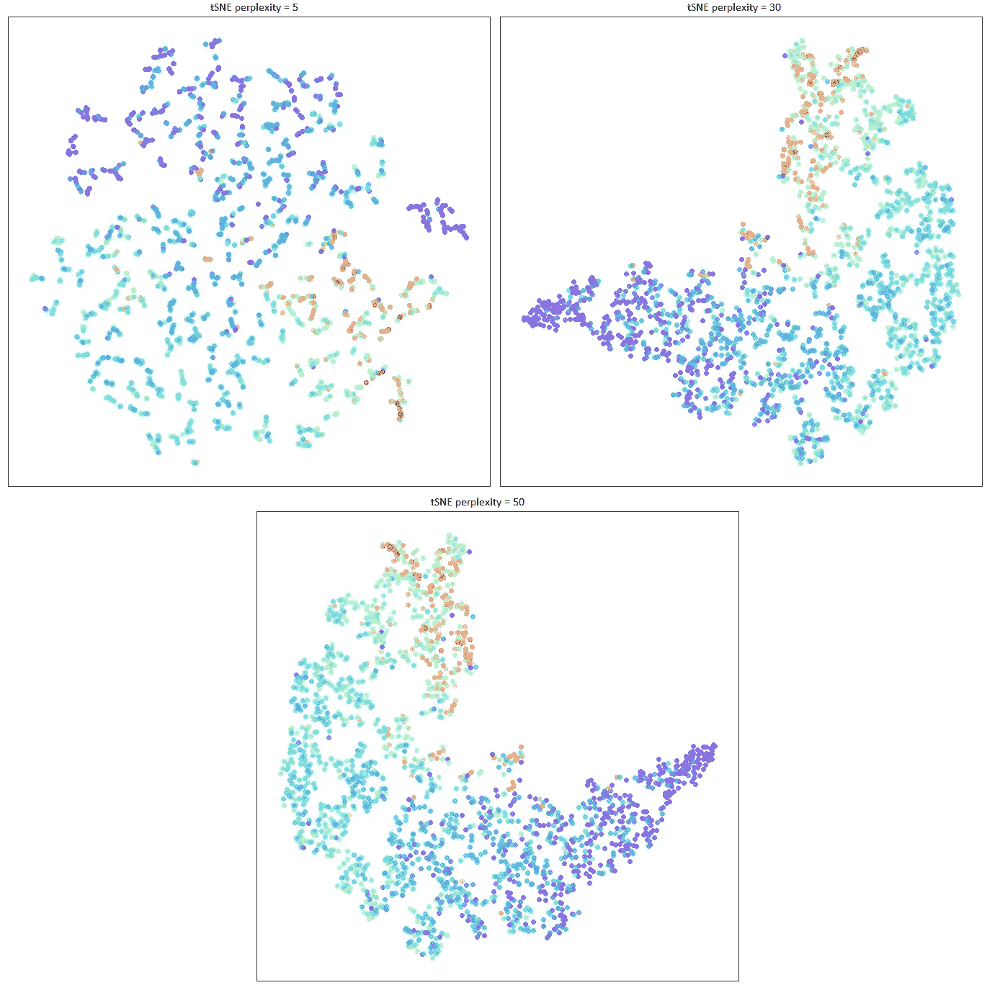
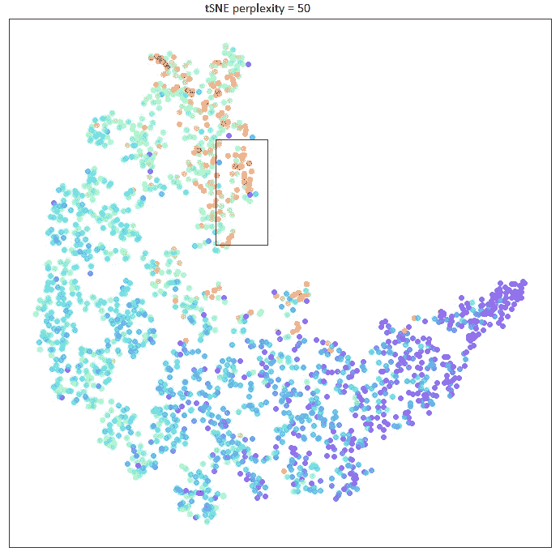
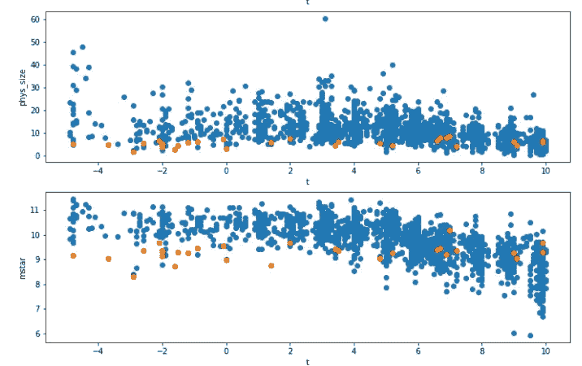
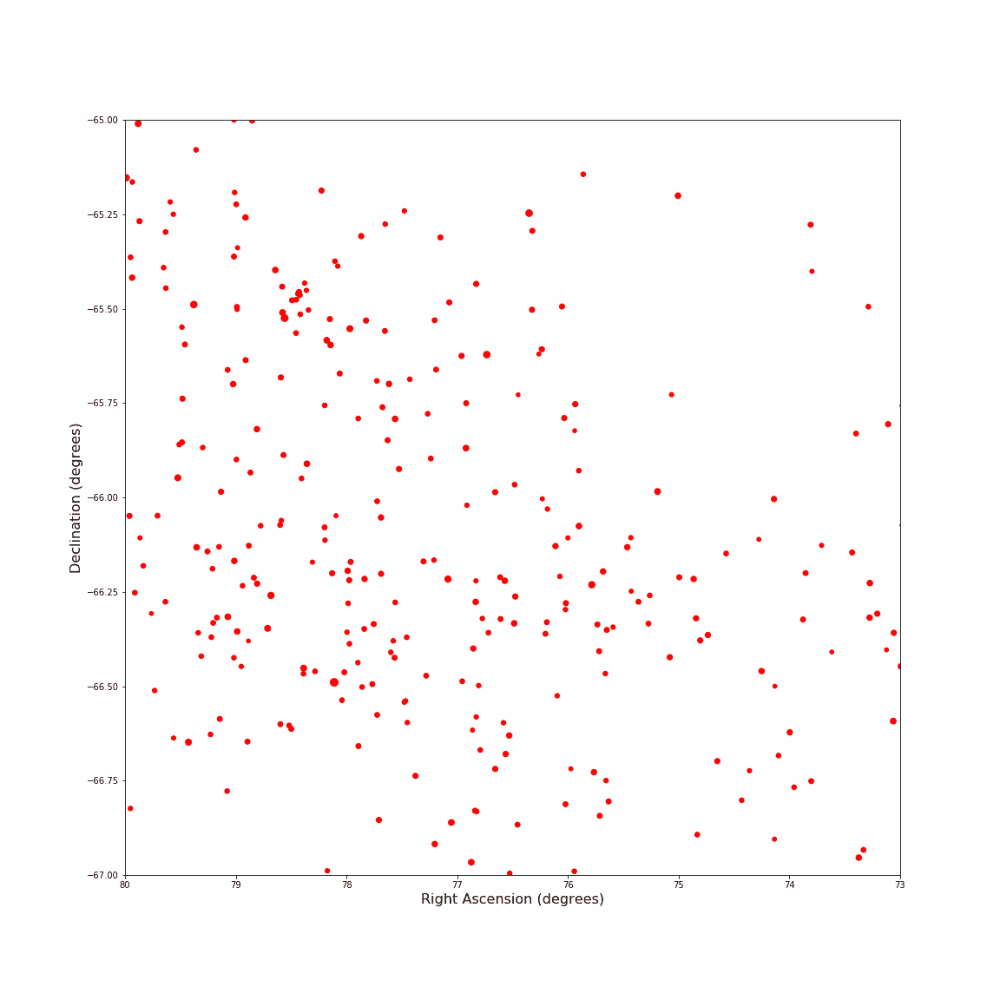
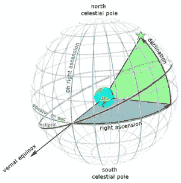
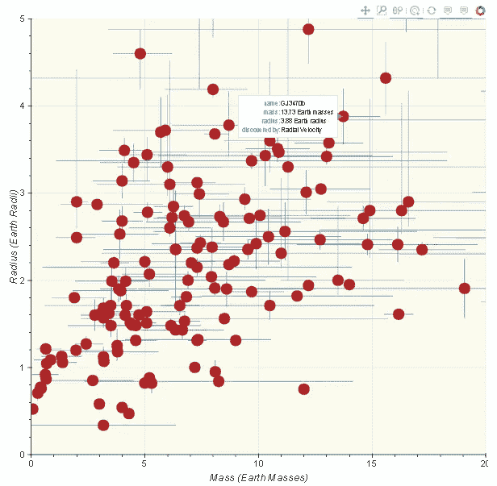

# 使用无监督学习的数据科学&天文学数据的可视化

> 原文：<https://towardsdatascience.com/data-science-using-unsupervised-learning-visualization-of-astronomy-data-b6b1c61f6922?source=collection_archive---------23----------------------->

复杂数据的简单可视化使其背后的科学变得显而易见。

上图是埃德温·哈勃爵士在 1929 年绘制的数据图，显示星系越远，离我们越远，也就是红移。

随着我们绘制更多已知宇宙区域的地图，我们发现了最大尺度的惊人结构。在 2 或 3 维地图中可视化这种结构让我们直观地掌握宇宙中星系的组成和性质，以及创造这种结构的力量。

有大量的公共数据可用于科学研究，如斯皮策 S4G 数据——星系内恒星结构的调查。这是一些星系的斯皮策数据集片段。

SPITZER S4G Data of Galaxy Clusters

*   mstar(太阳质量):log10(恒星质量)
*   在 Eskew 等人(2012 年)的校准中使用单克隆抗体 1 和单克隆抗体 2
*   c31 _ 1:3.6 微米时的 r75/r25 浓度指数
*   c42 _ 1:3.6 微米时的 5*log10(r80/r20)浓度指数
*   phys_size:单位为 KPC(千秒差距)。1 秒差距= 3.26 光年
*   mabs1 和 mabs 2:3.6 和 4.5 微米处光波长的绝对幅度。

注:R75 和 R25 分别是封闭光度为 75%和 25%时的半径

如需更多参考资料，请查阅:

 [## S4G 目录定义

### S4G 目录提供了来自 IRAC 图像的光度学和模型参数，以及一个到摘要的链接…

irsa.ipac.caltech.edu](https://irsa.ipac.caltech.edu/data/SPITZER/S4G/gator_docs/s4g_colDescriptions.html) 

这些星系的样本描述可以在维基百科上找到:

 [## NGC 4725 -维基百科

### NGC 4725 是一个中等棒旋星系，有一个突出的环状结构，距离我们大约 4000 万光年

en.wikipedia.org](https://en.wikipedia.org/wiki/NGC_4725)  [## NGC 4707 -维基百科

### NGC 4707 具有 Sm 或 Im 的形态类型，这意味着它大部分是不规则的或具有非常弱的旋臂。的…

en.wikipedia.org](https://en.wikipedia.org/wiki/NGC_4707) 

做一个散射矩阵图可以快速给出上述参数之间的关系，如星系的物理大小和恒星质量。

使用像 PCA 和 t-SNE 这样的无监督学习可以进一步帮助评估这些数据。

这是该数据与 6 个参数的 PCA 图。

结果是双峰的。主成分分析根据椭圆型(红色)和螺旋型(蓝色)对星系进行聚类

另一种方法是绘制具有各种困惑值的 t-SNE 无监督学习算法。这里尝试的不同值是 5、10、15、30、40 和 50。

这些绘图与主成分分析相一致。我们可以进一步放大以选择该数据中的一个口袋。选择一部分数据用于进一步分析。

绘制 30 个星系的选择性数据的 mstar & phys_size，对照它们的形态类型代码“t”(参考:[https://en . Wikipedia . org/wiki/Galaxy _ morphologic _ class ification)](https://en.wikipedia.org/wiki/Galaxy_morphological_classification))显示:

结论显示，我们在 30 个星系中发现的星系高度集中，并且具有较低的恒星质量。

今年 4 月 25 日，盖亚公布了它的 DR2 档案。我在浏览这个档案时，无意中发现了这个视频。

基于以上学习的一些快速绘图给出了以下可视化

基于有限弧数据的造父变星可视化。造父变星是测量空间距离的烛台。由于每种造父变星的光度都是恒定的，因此很容易推断它们离地球的距离。赤经和赤纬是位置坐标。赤经是从太阳三月分点开始，沿着天赤道向东测量的特定点的角距离。赤纬是天赤道以北或以南一点的角距离。

Above visualization shows the placement of various Cepheid between 73 & 80 RA and -65 and -67 Decl.

使用 python 中的 Bokeh plot 绘制 GAIA 系外行星数据，包括相对于地球的半径和质量。

还有许多其他参数，如亮度、温度等，可以从这些数据中可视化。在我的下一篇文章中，我计划通过从这些数据中创建一些可视化和推论来向开普勒致敬，并在 2019 年迎接苔丝。

一个更一致和更深入的倡议可以促进天文学家、统计学家、数据科学家和信息与计算机专业人员之间的合作，从而有助于加快我们对周围空间的了解。

#数据科学#天文学#盖亚

Dhaval Mandalia 喜欢数据科学、项目管理、培训高管和撰写管理战略。他也是古吉拉特邦管理协会社区的贡献成员。在推特和[脸书](https://www.facebook.com/mandalia.dhaval)上关注他。

参考资料:

盖亚档案:【https://gea.esac.esa.int/archive/ 

斯皮策数据:[https://irsa.ipac.caltech.edu](https://irsa.ipac.caltech.edu)