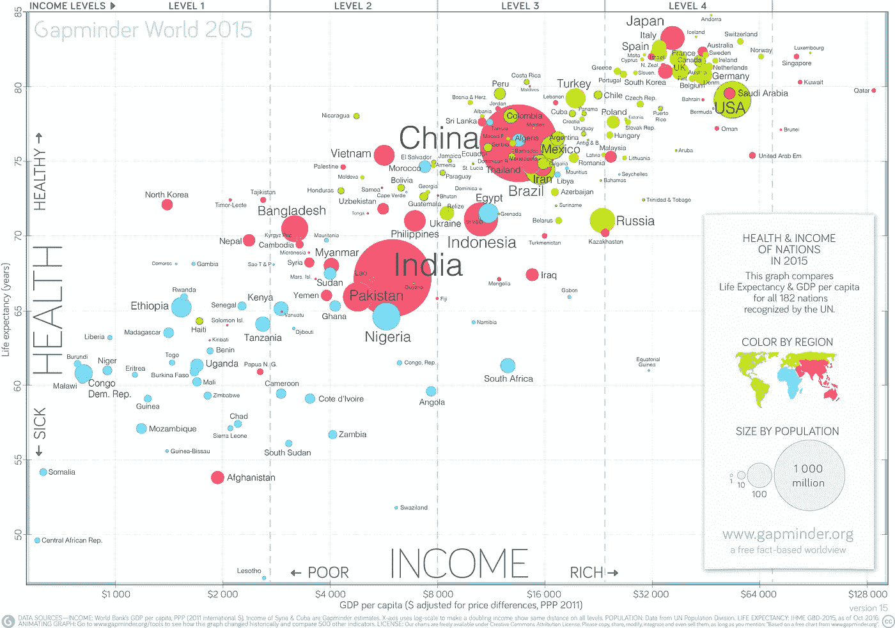
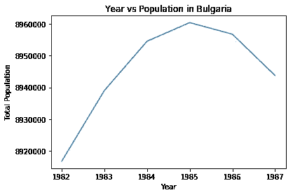
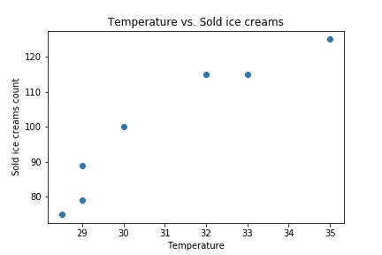
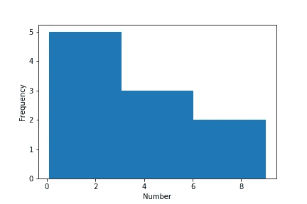
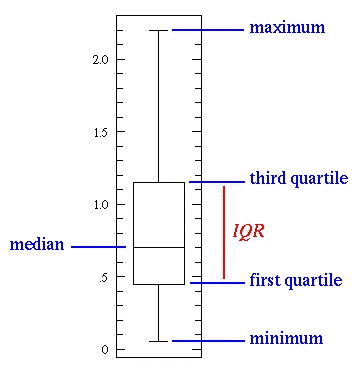
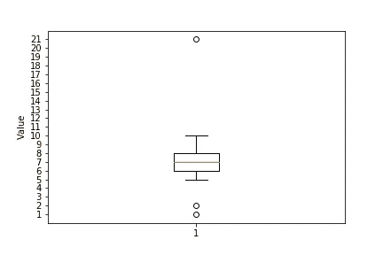
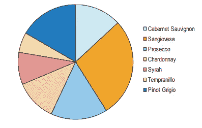
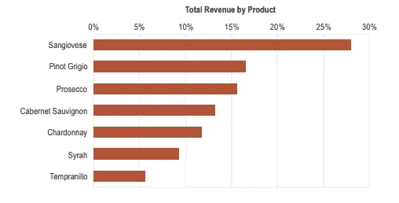
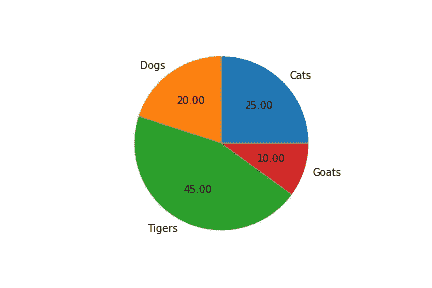

# Python 数据科学:Matplotlib 数据可视化简介

> 原文：<https://towardsdatascience.com/data-science-with-python-intro-to-data-visualization-and-matplotlib-5f799b7c6d82?source=collection_archive---------1----------------------->

# 介绍

当数据科学家处理数据时，数据通常存储在 CSV 文件、excel 文件、数据库和其他格式中。此外，这些数据通常作为[熊猫数据帧](https://pandas.pydata.org/pandas-docs/stable/generated/pandas.DataFrame.html)加载。为了简化示例，我将使用包含我们数据的 Python 列表。我假设您对 Python 数据类型、函数、方法和包有所了解。如果你没有这方面的知识，我建议你阅读[我之前的文章](/python-basics-for-data-science-6a6c987f2755)，它涵盖了这些话题。

# 数据可视化

数据可视化是数据分析中非常重要的一部分。您可以使用它来浏览您的数据。如果你很好地理解你的数据，你将有更好的机会找到一些见解。最后，当你发现任何见解时，你可以再次使用可视化来与他人分享你的发现。

比如看下面好看的剧情。这张图显示了 182 个国家在 2015 年的预期寿命和收入。每个泡泡代表一个国家，颜色代表一个地区，大小代表那个国家的人口。

Life Expectancy vs Income in the 2015 year. Source: [https://www.gapminder.org/downloads/updated-gapminder-world-poster-2015/](https://www.gapminder.org/downloads/updated-gapminder-world-poster-2015/)

如果你对使用的数据来源感兴趣，你可以在这里找到更多信息[。此外，这张图表还有一个很棒的互动版本](https://www.gapminder.org/downloads/updated-gapminder-world-poster-2015/)[在这里](https://www.gapminder.org/tools/#$chart-type=bubbles)，你可以玩历史时间序列，搜索某个国家，改变轴上的数据等等。[这里的](https://vimeo.com/231885967)是一个展示如何使用这个交互式图表的视频。

然而，这里的想法是学习数据可视化和 Matplotlib 的基础知识。所以，我们的情节会比那个例子简单得多。

## 基本可视化规则

在我们看一些类型的情节之前，我们将介绍一些基本规则。这些规则帮助我们做出好的、有信息的情节，而不是令人困惑的。

*   第一步是选择**合适的**绘图类型。如果有各种选项，我们可以尝试比较它们，选择最符合我们模型的一个。
*   第二，当我们选择你的绘图类型时，最重要的事情之一是**标记你的轴**。如果不这样做，剧情信息量就不够。当没有轴标签时，我们可以试着查看代码，看看使用了什么数据，如果幸运的话，我们可以理解这个图。但是如果我们只是将情节作为一个图像呢？如果我们把这个情节给你那个不懂 Python 制作情节的老板看呢？
*   第三，我们可以加一个**标题**，让我们的剧情更加**翔实**。
*   第四，需要时为不同类别添加**标签**。
*   五、可选地，我们可以在**有趣的** **数据点**添加文本或箭头。
*   六、在某些情况下我们可以使用一些数据的**大小**和**颜色**来使情节更具信息性。

## Matplotlib 的可视化类型和示例

有许多类型的可视化。最著名的有:**线图**、**散点图**、**柱状图**、**箱线图**、**条形图**、**饼图**。但是在这么多选择中，我们如何选择正确的可视化呢？首先，我们需要做一些探索性的数据分析。在我们知道数据的形状、数据类型和其他有用的统计信息之后，选择正确的可视化类型将会更加容易。顺便说一下，当我使用“绘图”、“图表”和“可视化”这些词时，我指的是同一个意思。[在这里](http://extremepresentation.typepad.com/blog/2006/09/choosing_a_good.html)，我发现了一个对图表建议有用的图片。

Python 中有很多可视化包。其中最著名的是 Matplotlib。它可以用在 Python 脚本、Python 和 IPython shells、Jupyter 笔记本和 web 应用服务器中。

在我们开始定义和例子之前，我想向您展示一下`matplotlib.pyplot`子包的一些基本功能，我们将在下面的例子中看到。这里，我假设`matplotlib.pyplot`子包是用别名`plt`导入的。

*   `plt.title(“My Title”)`将为您的剧情添加一个标题“我的标题”
*   `plt.xlabel(“Year”)`会在你的 x 轴上加一个标签“年份”
*   `plt.ylabel(“Population”)`将在您的 y 轴上添加一个标签“人口”
*   `plt.xticks([1, 2, 3, 4, 5])`将 x 轴上的数字设置为 1，2，3，4，5。我们也可以传递和标签作为第二个参数。例如，如果我们使用这个代码`plt.xticks([1, 2, 3, 4, 5], ["1M", "2M", "3M", "4M", "5M"])`，它将在 x 轴上设置标签 1M、2M、3M、4M、5M。
*   `plt.yticks()` -与`plt.xticks()`相同，但针对 y 轴。

**线形图** : 一种类型的图，将信息显示为一系列由直线连接的**数据点**称为“标记”**。在这种类型的绘图中，我们需要测量点按**排序**(通常按其 x 轴值)。这种类型的绘图通常用于可视化时间间隔内的数据趋势，即**时间序列**。
用 Matplotlib 做一个线图，我们调用`plt.plot()`。第一个参数用于横轴上的数据，第二个参数用于纵轴上的数据。该函数生成您的图，但不显示它。为了显示绘图，我们需要调用`plt.show()`函数。这很好，因为我们可能想在显示它之前给我们的图添加一些额外的定制。例如，我们可能想要为绘图的轴和标题添加标签。**

Simple Line Plot

**散点图**:这种类型的图显示所有单个数据点。在这里，它们不用线连接。每个数据点都有 x 轴值和 y 轴值。这种类型的图可用于显示趋势或相关性。在数据科学中，它显示两个变量如何比较。
要用 Matplotlib 制作散点图，我们可以使用`plt.scatter()`函数。同样，第一个参数用于横轴上的数据，第二个参数用于纵轴上的数据。

Simple Scatter Plot

**直方图**:数值数据分布的精确表示。要创建直方图，首先，我们将整个数值范围分成一系列区间，然后，我们计算每个区间内有多少数值。间隔也被称为**仓**。箱是变量的连续且不重叠的区间。它们必须相邻，并且通常大小相等。
要用 Matplotlib 制作直方图，我们可以使用`plt.hist()`函数。第一个参数是数字数据，第二个参数是箱的数量。`bins`参数的默认值是 10。

Simple Histogram

Simple Histrogram Ouput

从上面的直方图中我们可以看到:

*   5 个介于 0 和 3 之间的值
*   3 介于 3 和 6 之间的值(包括 3 和 6)
*   2 介于 6(不含)和 9 之间的值

**盒图，**也叫****盒须图**:一种显示基于五位数汇总的数值分布的方式:**最小值**、**第一个四分位数**、**中值**、**第三个四分位数**和**最大值**。**

*   ****最小值**和**最大值**只是我们数据中的最小值和最大值。**
*   ****中位数**是将数据的上半部分与下半部分分开的值。按以下步骤计算:**对你的值**排序，找到**中间的那个**。在我们的数值计数是偶数的情况下，我们实际上有 2 个中间数，因此这里的中值是通过将这 2 个数相加并将和除以 2 来计算的。例如，如果我们有数字`1, 2, 5, 6, 8, 9`，你的**中值**将是`(5 + 6) / 2 = 5,5`。**
*   ****第一个四分位数**是**数据值的**中值**，位于有序值中值的**左侧。例如，如果我们有数字`1, 3, 4, 7, 8, 8, 9`，第一个四分位数是`1, 3, 4`值的中值，所以是`3`。**
*   ****第三个四分位数**是**数据值的**中间值**，在我们的有序值中间值**的右边。例如，如果我们再次使用这些数字`1, 3, 4, 7, 8, 8, 9`，第三个四分位数是`8, 8, 9`值的中值，所以是`8`。**
*   **这里我还想再提一个统计。那就是 **IQR(四分位间距)**。**IQR 近似于数据中间 50%的扩散量。**公式**是**第三个四分位数——第一个四分位数**。****
*   ****这种类型的图也可以显示异常值**。离群值是位于总体模式之外**的数据值。它们被可视化为**圆**。当我们有异常值时，**最小值**和**最大值**被视为非异常值的最小值和最大值。有许多方法可以识别什么是异常值。一个常用的规则是，如果一个值比第一个四分位数****小**-1.5 * IQR**或比第三个四分位数**高**1.5 * IQR**，那么这个值就是异常值。**************

哇！那可是**强大的剧情**不是吗？让我们看一个例子来更好的理解剧情。

Box Plot. Source: [http://www.physics.csbsju.edu/stats/box2.html](http://www.physics.csbsju.edu/stats/box2.html)

现在，当我们有了一些关于盒图的知识，我们可以看到用 Matplotlib 创建这个图是非常容易的。我们需要的只是函数`plt.boxplot()`。第一个参数是数据点。

Simple Box Plot

Simple Box Plot Output

在这个例子中，值`1, 2,`和`21` 是**异常值**，最大值**是`10`，最小值**是`5`。并且，**的意思是**就是`7`。****

如果不是什么都懂也不用担心。我写了很多关于这个的信息。我还想分享一个[免费可汗学院课程](https://www.khanacademy.org/math/statistics-probability/summarizing-quantitative-data)叫做“汇总量化数据”。本课程涵盖了箱线图的许多细节。当你完成这门课程后，你会更容易理解这种类型的情节。

**条形图**:用矩形条表示分类数据。每个条形的高度与其代表的值相对应。当我们想要比较不同类别的给定数值时，这很有用。它也可以与 2 个数据系列一起使用，你可以在这里找到更多信息[。
要用 Maplotlib 制作条形图，我们需要`plt.bar()`函数。](https://pythonspot.com/matplotlib-bar-chart/)

Simple Bar Chart

Simple Bar Chart Output

从这个例子中，我们可以看到不同编程语言的用法是如何比较的。请注意，一些程序员可以使用多种语言，因此这里的百分比总和不是 100%。

**饼状图**:圆形图，分成若干片以显示数字比例。它们在**商界**被广泛使用。然而，许多专家建议**避开它们**。主要原因是很难比较给定饼图的各个部分。此外，很难跨多个饼图比较数据。在许多情况下，它们可以用**条形图**代替**。**

> 我们在看饼状图的时候会做角度判断，但是角度判断的不太好。-娜奥米·罗宾斯

作为一个例子，我们将看到饼状图和条形图上的数据，代表每种特定类型的葡萄酒的收入百分比。查看饼图，并尝试按照从大到小的顺序排列切片。你有什么麻烦吗？

Wines revenue using a pie chart. Source: [http://www.perceptualedge.com/articles/08-21-07.pdf](http://www.perceptualedge.com/articles/08-21-07.pdf)

现在，我们可以看到同样的数据显示在条形图上。这乘以收入百分比很容易比较。

Wines revenue using a bar chart. Source: [http://www.perceptualedge.com/articles/08-21-07.pdf](http://www.perceptualedge.com/articles/08-21-07.pdf)

你可以找到更多关于“为什么饼图不好？”来自[本文档](http://www.perceptualedge.com/articles/08-21-07.pdf)的问题。

用 Matplotlib 做饼状图，可以用`plt.pie()`函数。`autopct`参数允许我们使用 Python 字符串格式显示百分比值。

Simple Pie Chart

# 我的其他博客文章

你也可以看看我以前的博文。

*   [Jupyter 笔记本快捷键](https://medium.com/@ventsislav94/jypyter-notebook-shortcuts-bf0101a98330)
*   [数据科学的 Python 基础知识](/python-basics-for-data-science-6a6c987f2755)
*   [使用 Python 的数据科学:使用 pandas 加载、子集化和过滤数据简介](/data-science-with-python-intro-to-loading-and-subsetting-data-with-pandas-9f26895ddd7f)
*   [文本自然语言处理入门](/introduction-to-natural-language-processing-for-text-df845750fb63)

# 时事通讯

另外，如果你想在我发表新的博客文章时得到通知，你可以订阅我的最新时事通讯。当我找到一些额外的资源时，我会很乐意在整个过程中与您分享。

# 商务化人际关系网

这是我在 LinkedIn 上的简介，如果你想和我联系的话。我将很高兴与你联系在一起。

# 最后的话

谢谢你的阅读。我希望你喜欢这篇文章。如果你喜欢，请按住拍手键，分享给你的朋友。我很高兴听到你的反馈。如果你有什么问题，尽管问。😉