# 使用 Python 的数据科学:使用 pandas 加载、子集化和过滤数据简介

> 原文：<https://towardsdatascience.com/data-science-with-python-intro-to-loading-and-subsetting-data-with-pandas-9f26895ddd7f?source=collection_archive---------1----------------------->

Source: [https://www.star-spain.com/en/blog/transittermstar-nxt-tooltips/filtering-data-records-termstar-nxt](https://www.star-spain.com/en/blog/transittermstar-nxt-tooltips/filtering-data-records-termstar-nxt)

# 介绍

作为数据科学家，我们经常处理大量数据。我们想要加载的数据可以用不同的方式存储。最常见的格式是 **CSV 文件**、 **Excel 文件**或**数据库**。此外，数据可以通过 **web 服务**获得。当然还有很多其他的格式。为了处理数据，我们需要用一个**表格结构**来表示它。任何表格形式的东西都排列在一个有**行**和**列**的表格中。

在某些情况下，数据已经是表格了，很容易加载。在其他情况下，我们处理非结构化数据。 [**非结构化数据**](https://en.wikipedia.org/wiki/Unstructured_data) 不是以预定义的方式组织的(**纯文本**、**图像**、**音频**、**网页**)。在这篇文章中，我们将着重于从 CSV(**C**omma**S**separated**V**alues)文件中加载数据。

# 熊猫

Pandas 是 Wes McKinney 开发的 Python 编程语言的开源库。这个库非常高效，提供了易于使用的数据结构和分析工具。

## 数据帧

**Pandas** 包含一个用于**数据操作**的**快速高效对象**，称为 DataFrame。熊猫的一个常用别名是`pd`。该库可以加载许多不同格式的数据。当我们的数据是干净的和结构化的，每一行代表一个观察，每一列代表一个特征。行和列可以有**标签**。

在下面的例子中，为了更好地理解我们正在改变的东西，我将用透明矩形标记一些部分。此外，为了简单起见，我们将使用数据集中非常小的子集。该数据集包含给定国家和年份的移动电话用户。完整数据可在[这里](https://docs.google.com/spreadsheet/pub?key=0AkBd6lyS3EmpdEhWLWtqNzljbWg4ZXV6M09JQXNGaUE&output=xlsx)找到。我事先做了一些清理，使数据整洁。

这是我们想要加载到 Pandas **数据框架**中的数据。它被上传到 [GitHubGist](https://gist.github.com) web 应用程序中，并在这里以表格结构显示出来。不过，我们可以在这里看到它的 raw 格式。同样，我们可以看到这个文件包含了 **c** omma **s** 单独的 **v** 值。

为了加载这些数据，我们可以使用`pd.read_csv()`函数。

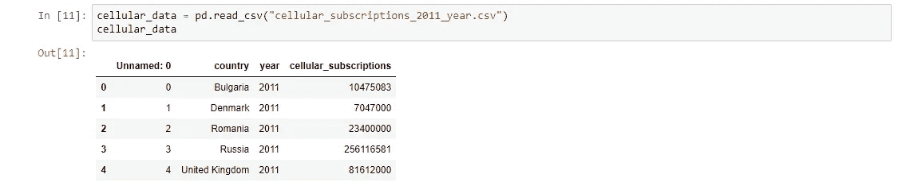

Loading data from a **CSV file**.

为了创造这些例子，我用了一个 Jupyter 笔记本。如果代码单元格中的最后一行包含值，则打印该行。所以，这就是为什么我把变量`cellular_data`放在例子的最后一行。

我们可以看到数据已加载，但有些奇怪。这个`Unnamed: 0`栏目是什么？我们的 CSV 文件中没有这样的列。在我们的例子中，这一列包含数据的**行标签** ( **行索引**)，我们必须告诉熊猫。我们可以使用`index_col`参数做到这一点。

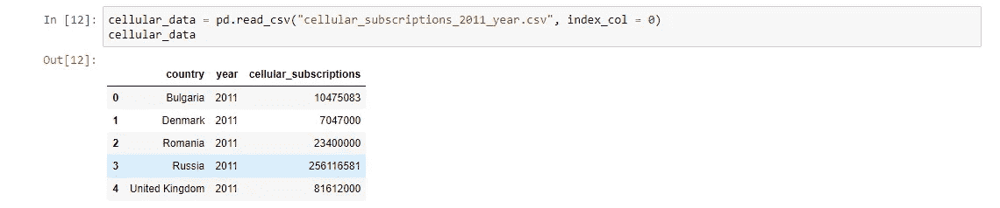

Loading data from a **CSV file** using **index_col**

在其他情况下，我们的**数据**可以是**而没有行标签**。在这些情况下，熊猫会从`0`开始到`rows — 1`的长度**自动生成**这些**标签**。让我们看看没有行标签的相同数据的例子。

Loading data from a **CSV file**.

现在我们的数据帧看起来很好。有时，我们希望更改行标签，以便以后更容易地处理数据。在这里，我们可以将**行标签**设置为每行的**国家代码**。我们可以通过将熊猫数据帧的`index`属性设置为一个列表来实现。列表的**长度**和行的**长度**必须与**相同**。之后，我们可以很容易地对我们的数据进行子集划分，或者使用国家代码查看给定的国家。

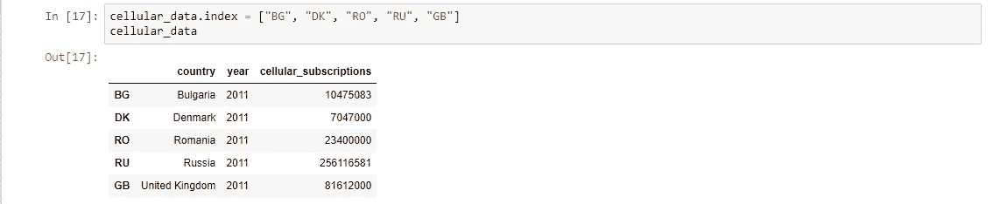

在许多情况下，**我们不希望手动设置索引**，我们希望索引是数据帧中的**列之一。在这种情况下，我们可以使用 DataFrame 对象的**方法**调用`set_index`。注意 **pandas 不会永久设置索引** **，除非我们告诉它**。如果我们想永久地设置索引**，我们可以使用`inplace`参数来实现。****

**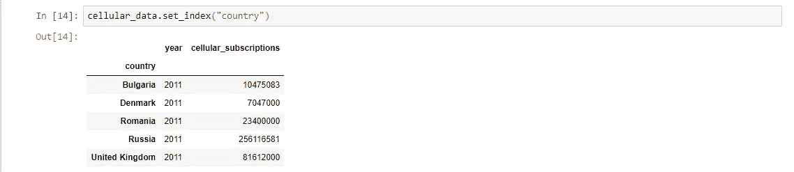**

**Setting the country column to be the index for our DataFrame.**

**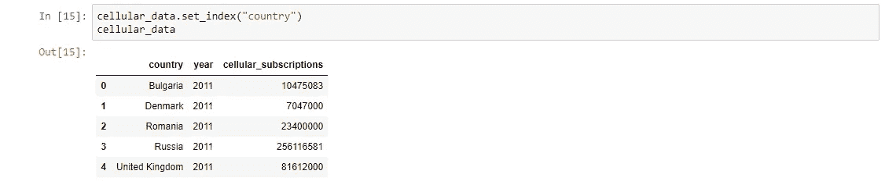**

**Setting the country column to be the index for our DataFrame.**

**在上面的例子中，**我们没有告诉熊猫**永久设置索引，当我们打印`cellular_data`数据帧时，我们看到**索引没有改变**。让我们用`inplace`参数再试一次。**

**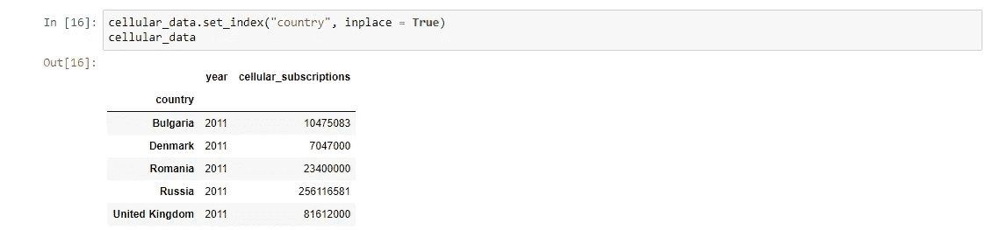**

**Setting (inplace) the country column to be the index for our DataFrame.**

**现在，我们可以清楚地看到，当我们使用`inplace = True`时，我们的数据帧的**索引**被**永久地**改变**。****

## ****索引和选择数据****

****有许多方法可以从数据框中选择数据。在这篇博文中，我们将看到如何使用**方括号**和方法 **loc** 和 **iloc** 来实现这一点。****

****使用**方括号**，您可以从行中选择选项，也可以从列中选择选项。对于一个**行选择**，我们可以使用一个**索引列表**或者一个**切片**。我们可以像这样使用**切片**来选择行:`sliceable[start_index:end_index:step]`****

****end_index 不包含。我已经在之前的一篇名为[数据科学 Python 基础](/python-basics-for-data-science-6a6c987f2755)的博客文章中写过关于切片的内容。可以快速看一下“**子集列表**”**部分**了解一下。虽然那里的例子都是带列表的，**这里的想法**和**是一样的**。我们这里只使用数据帧，它们也是**可切片的**。****

****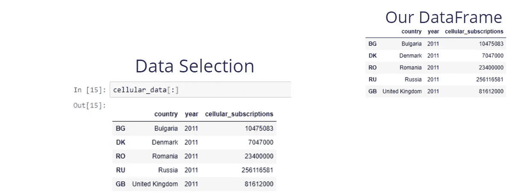****

****Select all rows.****

****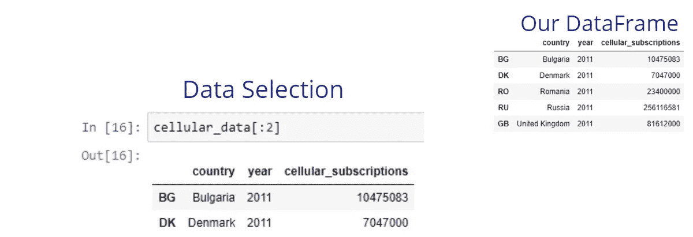****

****Select the first 2 rows.****

****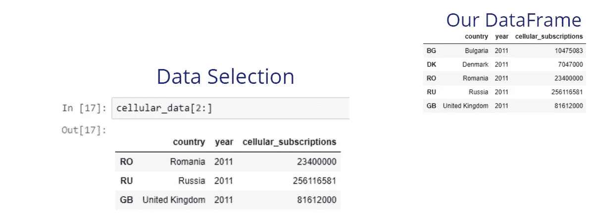****

****Select the all rows from the third to the end.****

****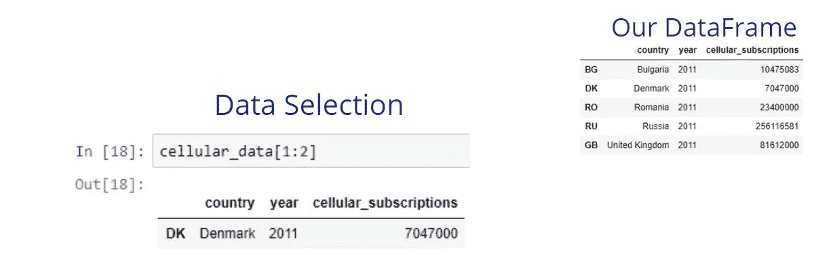****

****Select the second row.****

****对于一个选择的**列，我们可以使用一个包含**所需**列**的**列表。如果我们只将**一列作为字符串**而不是列表传递，结果将是 [**熊猫系列**](https://pandas.pydata.org/pandas-docs/version/0.22/generated/pandas.Series.html) 。熊猫系列是一个**一维数组，可以标为**。如果我们将 **2 个或更多系列**粘贴在一起，我们将创建一个**数据框架**。在某些情况下，我们可能只想选择一列，但将数据保存在 DataFrame 中。在这种情况下，我们可以传递一个只有一个列名的列表。******

**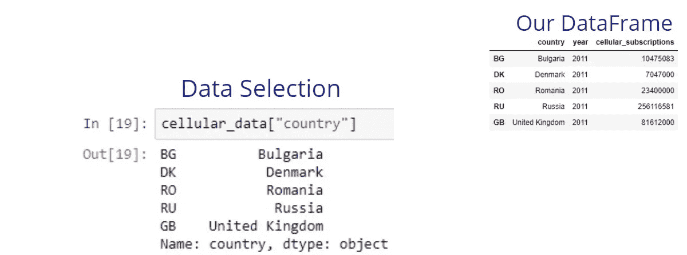**

**Select the “country” column only as series.**

****

**Select the “country” and “cellular_subscriptions” columns.**

****方括号**很有用，但是它们的**功能有限**。我们可以从给定的数据帧中只选择**列**或**行**。在许多情况下，我们需要同时选择列和行。 **loc** 和 **iloc** 方法给了我们这种能力。**

****loc** 方法允许我们根据**标签**选择数据的行和列。首先，你指定左侧的**行标签** **，然后你指定右侧**的列标签**。 **iloc** 允许我们做同样的事情，但是基于我们数据帧的**整数位置**。****

**如果我们想选择所有的行或列，我们可以简单地输入`:`来选择行或列。同样，如果我们想要选择**特定行**而**所有列**，我们可以只传递**行标签**。**

**用例子理解比较容易，那就来看一些吧。在这些例子中，我们将比较这两种方法的用法。**

**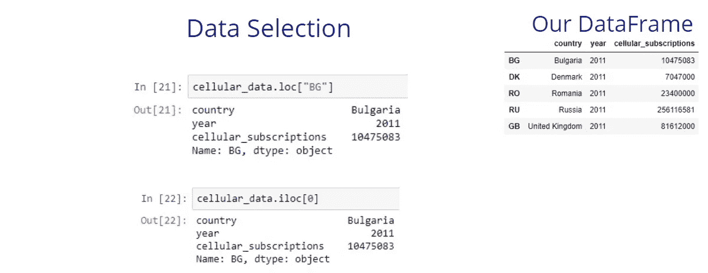**

**Select the **first row** as **Series**.**

**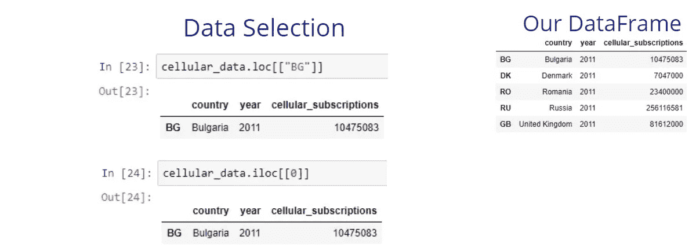**

**Select the **first row** as **DataFrame**.**

**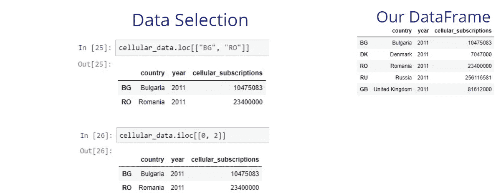**

**Select the rows for **Bulgaria** and **Romania**.**

****

**Select the rows for **Russia** and **the United Kingdom** and the “**year**” and “**cellular_subscriptions**” **columns**.**

**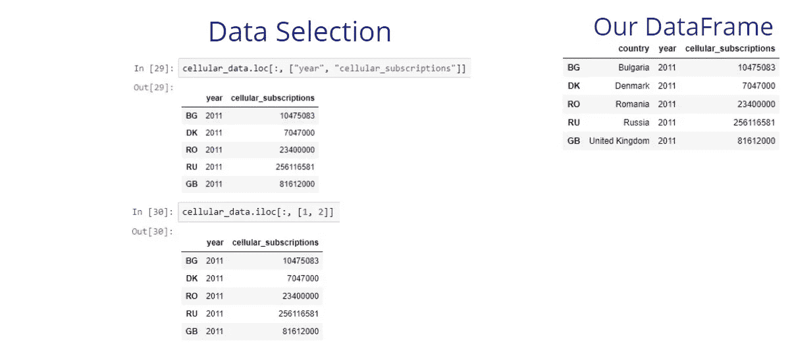**

**Select **all the rows** and the “**year**” and “**cellular_subscriptions**” **columns**.**

**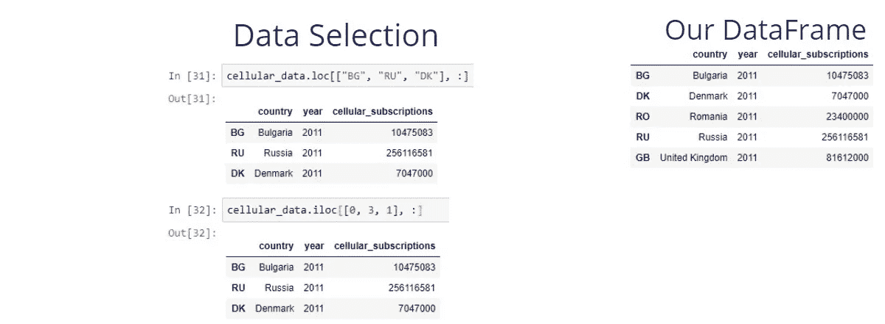**

**Select the **all the columns** and the rows for **Bulgaria, Russia,** and **Denmark**.**

# **Python 中的比较运算符**

****比较运算符**可以告诉我们 2 个值**如何将**相互关联。在很多情况下， **Python 无法告诉我们不同类型的 2 个值如何相互关联**，但也有一些**例外**。比如我们可以比较**浮点数和整数**。需要记住的是，我们可以比较**布尔值和**整数。`True`对应 **1** ，`False`对应 **0** 。这些运算符非常简单。**

**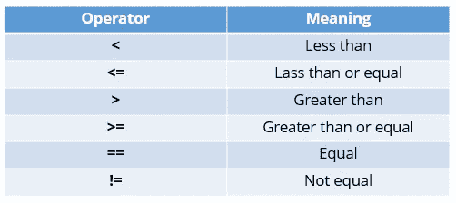**

**The comparison operators in Python.**

**让我们看一些非常简单的例子。**

**Simple Comparison Operators**

# **过滤熊猫数据帧**

****比较运算符**可用于熊猫**系列**。这可以帮助我们根据特定条件过滤我们的数据**。我们可以对序列使用比较运算符，结果将是一个**布尔序列**。如果满足条件，这些系列的每一项将为`True`，否则为`False`。有了这些布尔序列后，我们可以应用一个**行选择**来得到一个过滤后的数据帧。****

**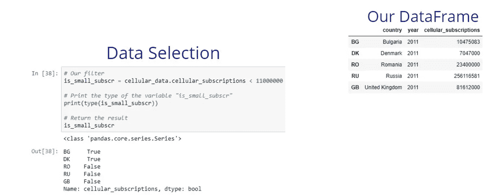**

**Creating a **boolean series** called **is_small_subscr****

**注意，我们已经使用了**的另一种语法**在这里**得到了** `cellular_subcription` **列**。`DataFrame[column_name]`和`DataFrame.column_name`代码块返回**相同的结果**。**

**但是，要小心使用**点语法**(在这些示例中使用)，因为您的列可能与 **DataFrame 的方法**同名。例如，如果我们有一个名为“ **min** ”的列，我们就不能使用点语法从该列中获取值。那是因为 DataFrame 对象有一个名为“ **min** ”的方法。现在让我们看看如何使用上面的布尔序列来过滤我们的数据帧。**

**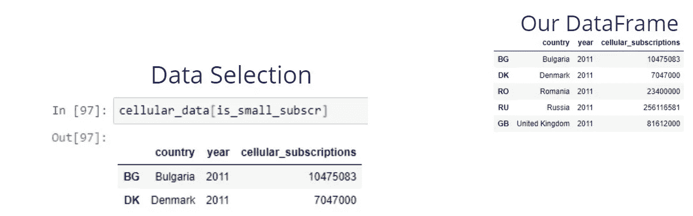**

****Filtering** the **DataFrame** using the **boolean series** from the **previous example****

**让我们看另一个例子。假设我们希望**获得所有记录，其中**国家**是**英国**。****

**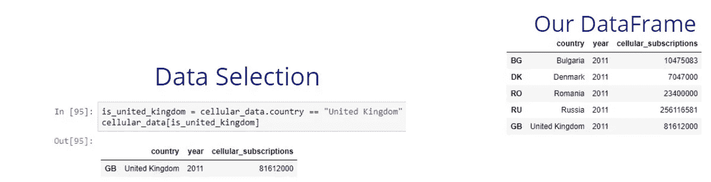**

**Get **all records** where the **country** **is** the **United Kingdom****

# **布尔运算符**

**既然我们知道了如何生成满足某些条件的布尔序列，我们现在可以对它们使用**布尔运算符**来创建更多的**复杂过滤**。**

**有 **3** 种类型的**布尔运算****

*   ****和**——取 2 个布尔值，如果**和**都是**则返回`**True**`值** `**True**`。这个操作符是一个**短路**，如果第一个参数是`**True**`，它只计算第二个参数。**
*   ****或** -取 2 个布尔值，如果**中至少有一个**为 T1，则返回`**True**`。这个操作符也是一个短路符**，如果第一个参数是`**False**`，它只计算第二个参数。****
*   ******非**——取一个布尔值，返回对面的**。该运算符优先级低于非布尔运算符。例如，`not x == y`被解释为`not (x == y)`，而`x == not y`是一个语法错误。还有就是当我们需要**组合不同的布尔运算**然后想要**对结果**求反时常用的**。********

****Simple Boolean Operations****

# **多条件子集化**

**当我们想要通过**多个条件**过滤我们的数据帧时，我们可以使用**布尔运算符**。这里需要注意的一点是，当我们想要对熊猫使用布尔运算符时，我们必须**如下使用它们**:**

*   **`&`用于**和****
*   **`|`为**或****
*   **`~`为**而非****

**当我们对两个大小相同的布尔序列应用布尔运算时，布尔运算将适用于每一对。**

## **使用“与”运算符**

**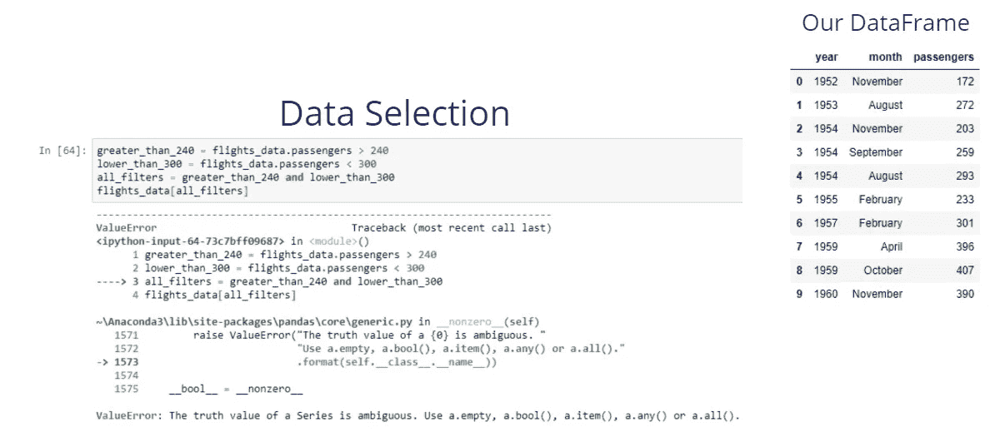**

**我们可以看到 pandas 不使用`and`操作符，它需要`**&**`操作符。现在，让我们再试一次。这里的目标是只得到那些**多于** **240** 乘客**而** **少于** **300** 乘客的航班。**

**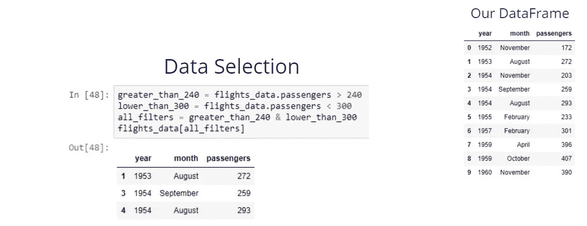**

## **使用“或”运算符**

**让我们找出所有**低于** **200** **或** **大于 375 名乘客**的航班。记住，对于**或**操作符，我们使用**管道** `**|**` **字符**。**

**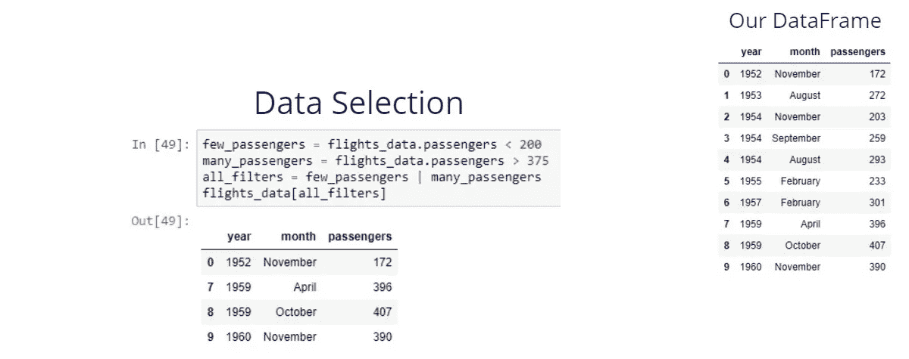**

## **使用 not 运算符反转条件**

**在某些情况下，我们希望**否定**我们的**条件**。在这种情况下，我们可以使用**而不是**操作符。对于这个操作符，我们使用**波浪号** `**~**` **字符**。**

**假设我们想得到 11 月的**而不是** **的所有航班。****

**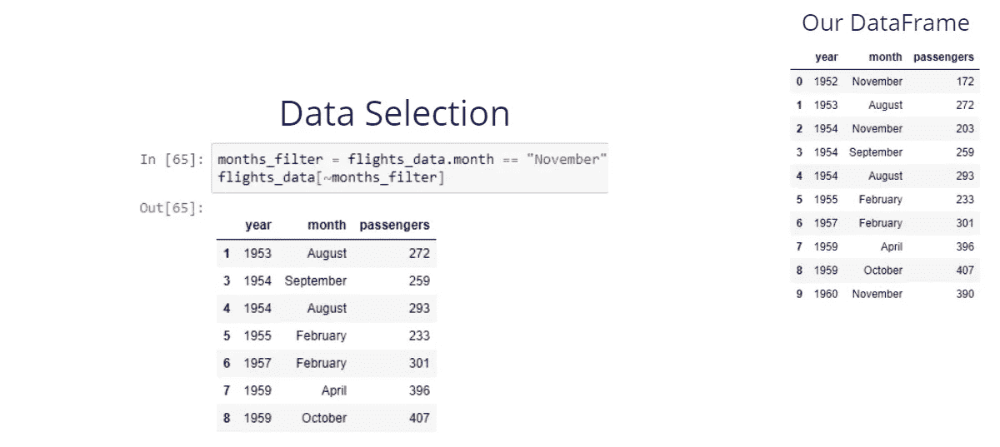**

## **复杂条件**

**我们可以基于**非常具体的条件**进行更加**复杂的过滤**。**

**让我们看看 1952 年和 1954 年 11 月 22 日在 T21 的所有航班。**

**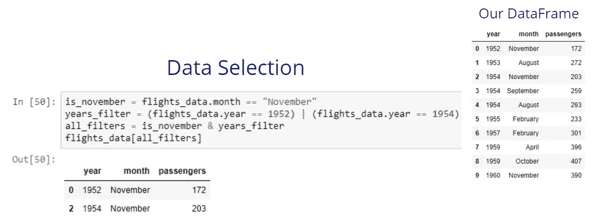**

**现在，让我们得到 1952 年和 1954 年之间的所有航班，月份是八月或九月。**

**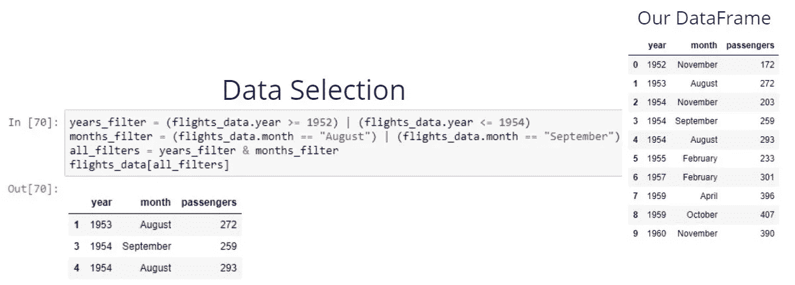**

## **isin 方法**

**假设我们想要比较单个列与多个值的**相等。假设我们想要得到以下月份的所有航班:**二月**、**八月**和**九月**。实现这一点的一种方法是像这样使用多个`or`条件。****

**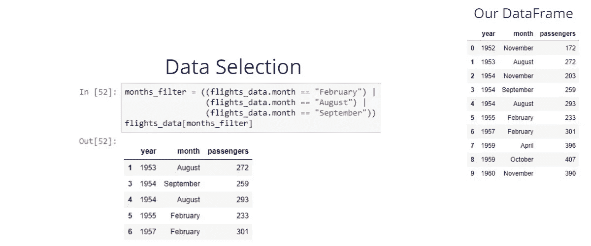**

**有一个**重复码**这是**繁琐的**。使用**`**isin**`**方法**还有一种**更好的方法**可以达到同样的效果。我们需要传递一个列表或者设置**值**给这个方法，它将返回想要的**布尔序列**。****

****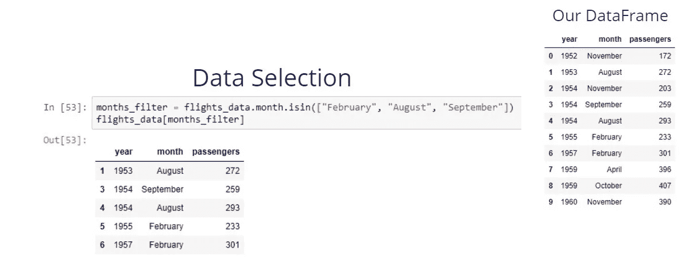****

****当然，**我们可以把这个方法返回的**布尔级数**和其他布尔级数**组合起来。****

**假设我们想得到 1954 年**和 2 月**、**8 月**和**9 月**的航班。******

****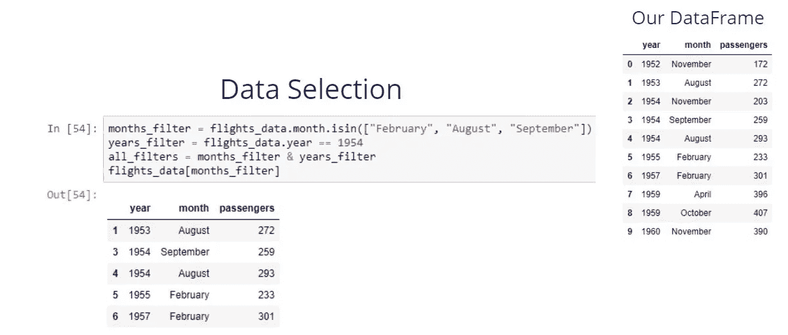****

## ****between 方法****

****当我们想要**选择一个范围**内的值时，这个方法可以使我们的代码更干净。**代替**的写法 **2 布尔条件**，我们可以用这个方法。****

****假设我们想要得到 1955 年到 1960 年之间的所有航班**。******

****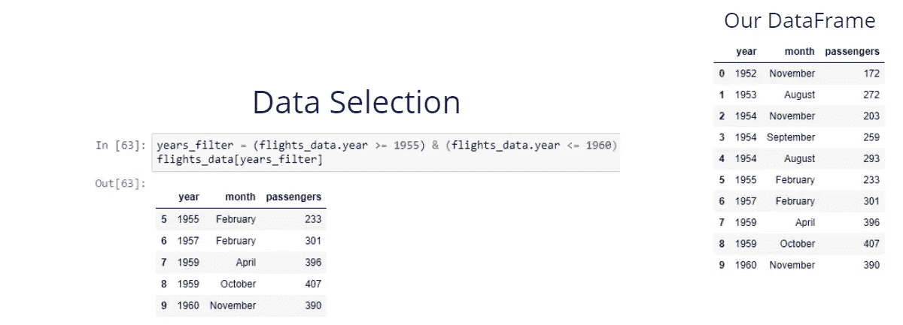********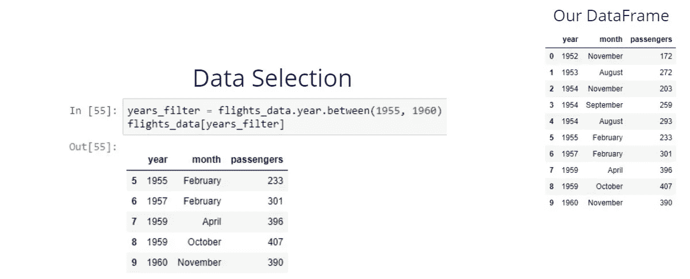****

****同样，我们可以将这种方法与另一种条件过滤相结合。****

****让我们得到所有在 1955 年和 1960 年之间**并且在 10 月**的航班。****

****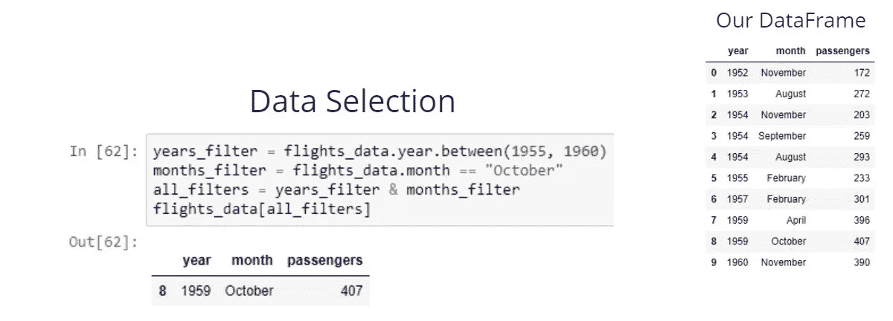****

## ****isnull 和 isna 方法****

****这个`**isna**`方法指示值是否缺失(数值数组中的`**NaN**`，对象数组中的`**None**`或`**NaN**`，datetimelike 中的`**NaT**`)。`**isnull**`方法是`**isna**`方法的别名。这意味着**这两种方法完全相同**，但是名称不同。****

****我已经改变了我们使用的航班数据框架。在**月**列中有一些`**NaN**`值。让我们来看看如何获取**有**个月**缺失的所有记录**。****

**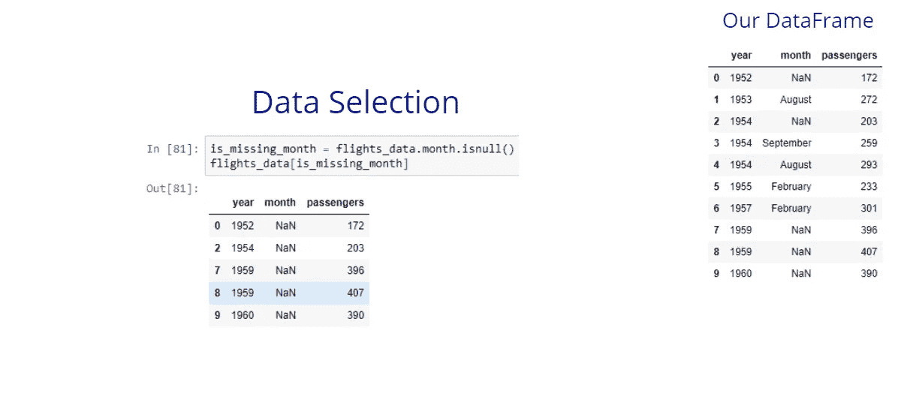****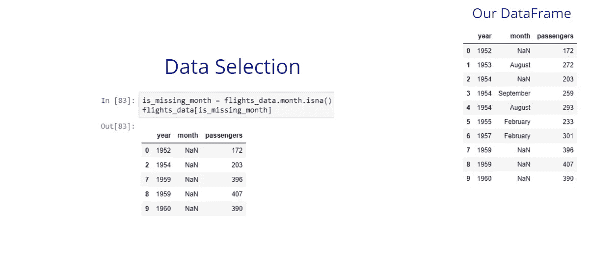**

**在许多情况下，我们希望得到没有缺失值的数据。让我们设法得到没有错过月份的航班。我们可以使用带有`**~**` **字符**的 **not 运算符**对`**isna**`方法返回的布尔序列**求反。****

**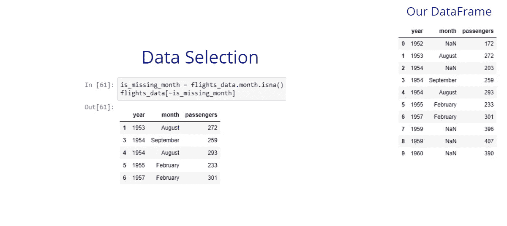**

## **notna 方法**

**还有一种方法叫`**notna**`。此方法是 `**isna**` **方法**的 **对面的**。使用这种方法，我们可以获得与上一个示例相同的结果。******

**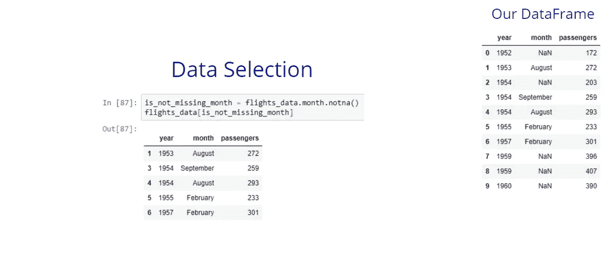**

## **通过一行中的条件进行子集设置**

**我们现在看到的所有例子都可以用**一行**写出来。有人喜欢，有人讨厌。当我们通过**只设置一个条件**时，在很多情况下，在一行中编写我们的过滤器会更好更容易。**

**我们先来看一个只有一个条件的子集化例子。**

**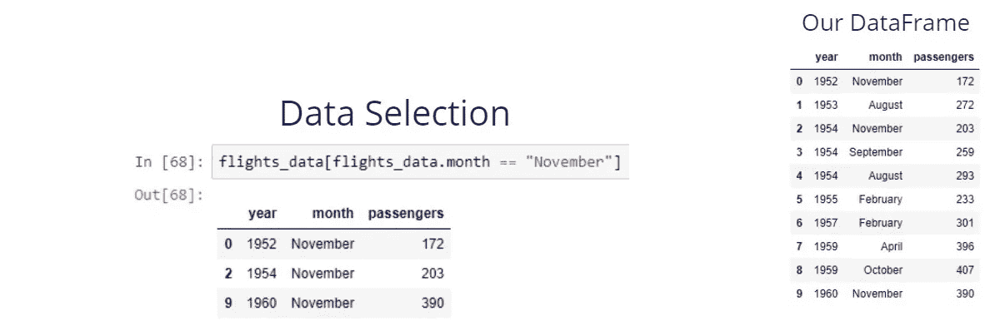**

## **通过一行中的多个条件进行子集设置**

**在某些情况下，用一行写一个**简单的表达式还行，但在另一些情况下，就非常**不可读**。我这里的建议是**把简单的写一行**复杂的写多行**。如果你的行很长，它可能**不可读**，所以要小心。**

**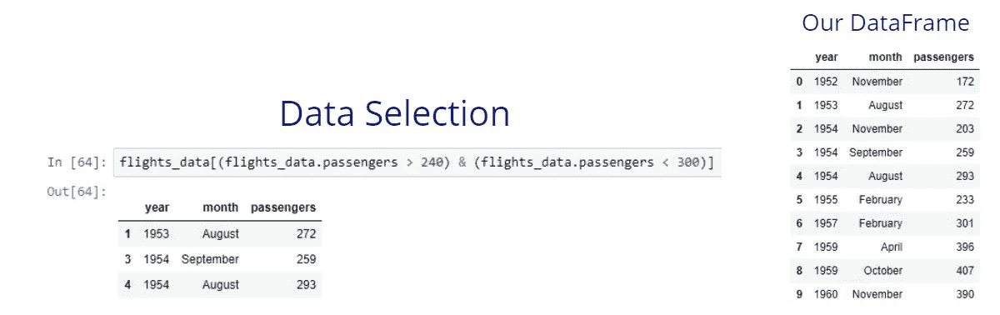****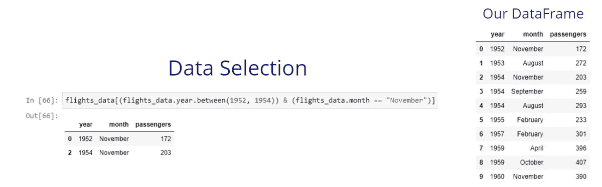****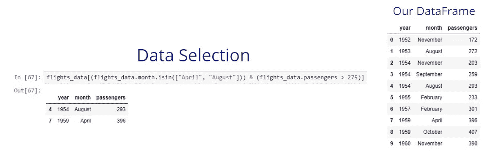**

## **使用`.loc`方法对布尔序列进行子集化。**

**还记得`**.loc**`法吗？我们可以用这种方法根据**标签**选择行和列。好的一面是我们可以传递**布尔序列**而不是传递行或列选择的标签，这样就可以了。**

**我们在上面的例子中使用的所有生成的布尔序列都可以传递给行选择。**

**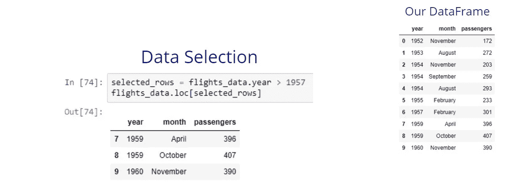****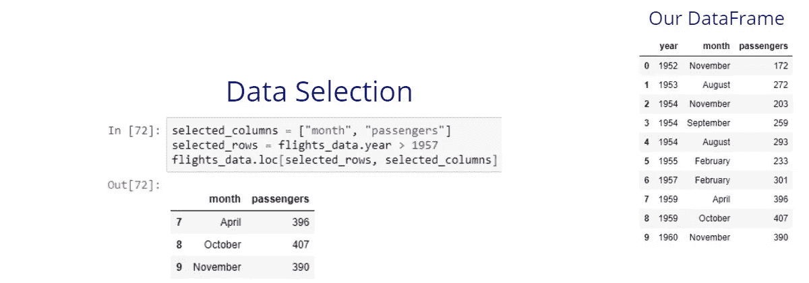****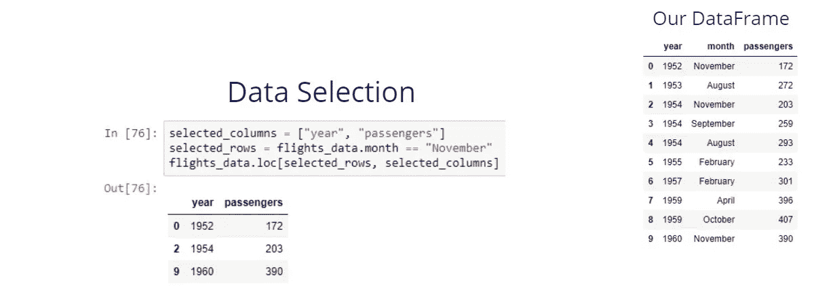**

**注意，如果我们**不使用** `**loc**` **方法**进行列选择 **，那么**的结果与使用方括号** `**[]**`进行**子集化的**是相同的。****

# **文章注释**

**为了简单起见，本文中使用的数据集非常小。实际上，我们需要处理的数据集要大得多。但是不管您是在处理 100 MB 还是 10 GB 的数据集，子集化总是一种有用的技术！**

# **练习**

**我已经创建了一个 **Jupyter 笔记本文件**，里面有一些关于**加载和子集化数据**的练习。如果你想检查你的技能，你可以从这个库下载。该存储库还包含另一个 Jupyter 笔记本文件，其中包含**解决方案**。**

# ****数据资源****

*   **手机:[gapminder.org](https://www.gapminder.org/data/)**
*   **航班:[GitHub seaborn 数据库示例](https://github.com/mwaskom/seaborn-data)**

# **我的其他博客文章**

**你也可以看看我以前的博文。**

*   **[Jupyter 笔记本快捷键](https://medium.com/@ventsislav94/jypyter-notebook-shortcuts-bf0101a98330)**
*   **[数据科学的 Python 基础知识](https://medium.com/@ventsislav94/jypyter-notebook-shortcuts-bf0101a98330)**
*   **[Python 数据科学:Matplotlib 数据可视化简介](/data-science-with-python-intro-to-data-visualization-and-matplotlib-5f799b7c6d82)**
*   **[文本自然语言处理入门](/introduction-to-natural-language-processing-for-text-df845750fb63)**

# **时事通讯**

**如果你想在我发表新的博客文章时得到通知，你可以订阅我的[时事通讯](https://buttondown.email/Ventsislav)。**

# ****领英****

**这是我在 LinkedIn 上的简介，如果你想和我联系的话。**

# **最后的话**

**谢谢你的阅读。你喜欢这篇文章吗？如果你喜欢，请按住鼓掌按钮👏并分享给你的朋友。**