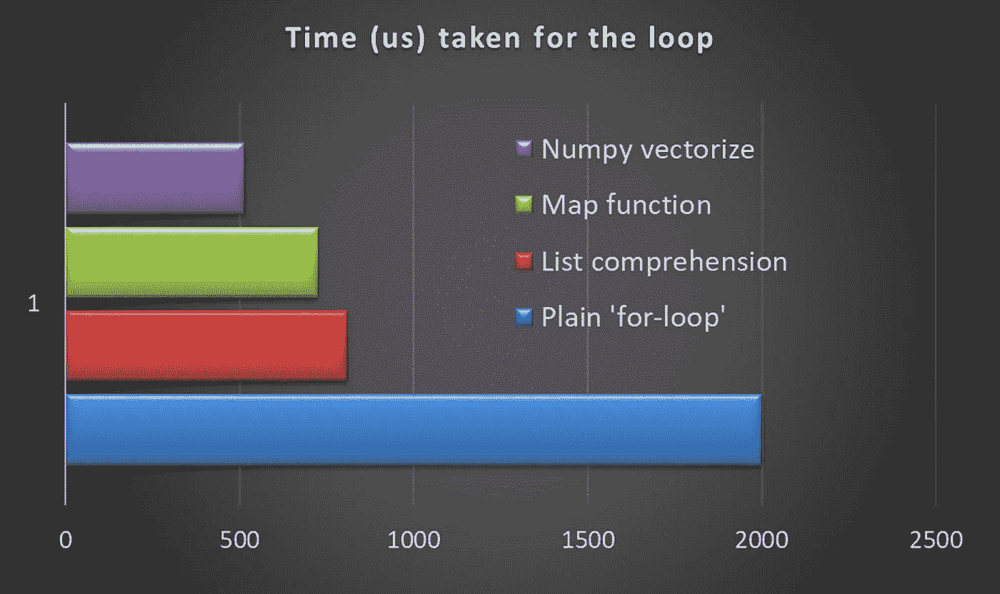

# Python 数据科学:将条件循环转化为 Numpy 向量

> 原文：<https://towardsdatascience.com/data-science-with-python-turn-your-conditional-loops-to-numpy-vectors-9484ff9c622e?source=collection_archive---------0----------------------->

## 矢量化技巧是数据科学家非常熟悉的，通常用于编码，以加速整体数据转换，其中简单的数学转换是在可迭代对象(如列表)上执行的。不太为人所知的是，对非平凡的代码块(如条件循环)进行矢量化也是值得的。


”[http://www.freepik.com](http://www.freepik.com)" Designed by Harryarts / Freepik

Python 正迅速成为数据科学家选择的事实上的编程语言。但与 R 或 Julia 不同，它是一种通用语言，没有现成的函数语法来分析和转换数字数据。因此，它需要专门的图书馆。

**Numpy** ，简称[数值 Python](http://numpy.org) ，是 Python 生态系统中高性能科学计算和数据分析所需的基础包。它是几乎所有高级工具如 [Pandas](https://pandas.pydata.org) 和 [scikit-learn](http://scikit-learn.org/) 构建的基础。 [TensorFlow](https://www.tensorflow.org) 使用 NumPy 数组作为基本的构建模块，在此基础上他们构建了用于深度学习任务的张量对象和 graphflow(在一个长列表/向量/数字矩阵上大量使用线性代数运算)。

许多 Numpy 操作都是用 C 实现的，避免了 Python 中循环、指针间接和每元素动态类型检查的一般开销。速度提升取决于您正在执行的操作。**对于数据科学和现代机器学习任务来说，这是一个无价的优势。**

我最近的故事[展示了基于](/why-you-should-forget-for-loop-for-data-science-code-and-embrace-vectorization-696632622d5f) [Numpy](http://www.numpy.org/) 的简单数据转换任务矢量化的优势，引起了读者的兴趣[也受到了读者的好评](https://www.kdnuggets.com/2017/11/forget-for-loop-data-science-code-vectorization.html)。关于向量化对代码简单性的效用，有一些有趣的讨论。

现在，基于一些预定义条件数学变换在数据科学任务中相当常见。事实证明，通过首先将简单的条件循环块转换成函数，然后使用`numpy.vectorize`方法，可以很容易地对其进行矢量化。在我之前的文章[中，我展示了简单数学转换的 numpy 矢量化](/why-you-should-forget-for-loop-for-data-science-code-and-embrace-vectorization-696632622d5f)的速度提升数量级。对于目前的情况，加速没有那么显著，因为内部条件循环仍然有些低效。然而，与其他普通 Python 代码相比，执行时间至少有 20–50%的改进。

下面是演示它的简单代码:

```
import numpy as np
from math import sin as sn
import matplotlib.pyplot as plt
import time**# Number of test points**
N_point  = 1000**# Define a custom function with some if-else loops**
def myfunc(x,y):
    if (x>0.5*y and y<0.3):
        return (sn(x-y))
    elif (x<0.5*y):
        return 0
    elif (x>0.2*y):
        return (2*sn(x+2*y))
    else:
        return (sn(y+x))**# List of stored elements, generated from a Normal distribution**
lst_x = np.random.randn(N_point)
lst_y = np.random.randn(N_point)
lst_result = []**# Optional plots of the data**
plt.hist(lst_x,bins=20)
plt.show()
plt.hist(lst_y,bins=20)
plt.show()**# First, plain vanilla for-loop**
t1=time.time()
for i in range(len(lst_x)):
    x = lst_x[i]
    y= lst_y[i]
    if (x>0.5*y and y<0.3):
        lst_result.append(sn(x-y))
    elif (x<0.5*y):
        lst_result.append(0)
    elif (x>0.2*y):
        lst_result.append(2*sn(x+2*y))
    else:
        lst_result.append(sn(y+x))
t2=time.time()print("\nTime taken by the plain vanilla for-loop\n----------------------------------------------\n{} us".format(1000000*(t2-t1)))**# List comprehension**
print("\nTime taken by list comprehension and zip\n"+'-'*40)
%timeit lst_result = [myfunc(x,y) for x,y in zip(lst_x,lst_y)]**# Map() function**
print("\nTime taken by map function\n"+'-'*40)
%timeit list(map(myfunc,lst_x,lst_y))**# Numpy.vectorize method**
print("\nTime taken by numpy.vectorize method\n"+'-'*40)
vectfunc = np.vectorize(myfunc,otypes=[np.float],cache=False)
%timeit list(vectfunc(lst_x,lst_y))**# Results** Time taken by the plain vanilla for-loop
----------------------------------------------
**2000.0934600830078** us

Time taken by list comprehension and zip
----------------------------------------
1000 loops, best of 3: **810 µs** per loop

Time taken by map function
----------------------------------------
1000 loops, best of 3: **726 µs** per loop

Time taken by numpy.vectorize method
----------------------------------------
1000 loops, best of 3: **516 µs** per loop
```



请注意，我在任何地方都使用了**% time it**[Jupyter magic command](http://ipython.readthedocs.io/en/stable/interactive/magics.html)来编写一行表达式。通过这种方式，我有效地运行了至少 1000 次相同表达式的循环，并平均执行时间以避免任何随机影响。因此，如果您在 Jupyter 笔记本上运行整个脚本，您可能会对第一种情况(即普通 for-loop 执行)产生略微不同的结果，但接下来的三种情况应该会给出非常一致的趋势(基于您的计算机硬件)。

有证据表明，对于这种基于一系列条件检查的数据转换任务，使用 numpy 的矢量化方法通常比一般的 Python 方法提高了 20–50%的速度。

> **这可能看起来不是一个巨大的改进，但每一点时间节省都会在数据科学管道中累积起来，从长远来看是值得的！如果数据科学工作需要这种转换发生一百万次，这可能会导致 2 天到 8 小时的差异。**

简而言之，只要您有一个很长的数据列表，并且需要对它们执行一些数学转换，就应该考虑将这些 python 数据结构(列表、元组或字典)转换成`numpy.ndarray`对象，并使用固有的矢量化功能。

Numpy 提供了一个 C-API 来实现更快的代码执行，但是它带走了 Python 编程的简单性。[这篇简洁的讲稿](http://www.scipy-lectures.org/advanced/interfacing_with_c/interfacing_with_c.html)展示了你在这方面的所有相关选项。

一位法国神经科学研究者写了一整本关于这个主题的开源在线书籍。[点击这里查看](https://www.labri.fr/perso/nrougier/from-python-to-numpy/#id7)。

如果您有任何问题或想法要分享，请联系作者在[**tirthajyoti【AT】Gmail[DOT]com**](mailto:tirthajyoti@gmail.com)。你可以查看作者的 [**GitHub 资源库**](https://github.com/tirthajyoti) 中其他有趣的 Python、R 或 MATLAB 代码片段和机器学习资源。此外，如果你像我一样对机器学习/数据科学/半导体充满热情，请随时[在 LinkedIn 上添加我](https://www.linkedin.com/in/tirthajyoti-sarkar-2127aa7/)或[在 Twitter 上关注我](https://twitter.com/tirthajyotiS)。