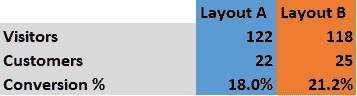
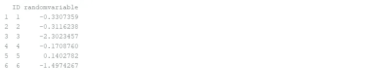
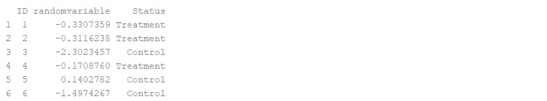
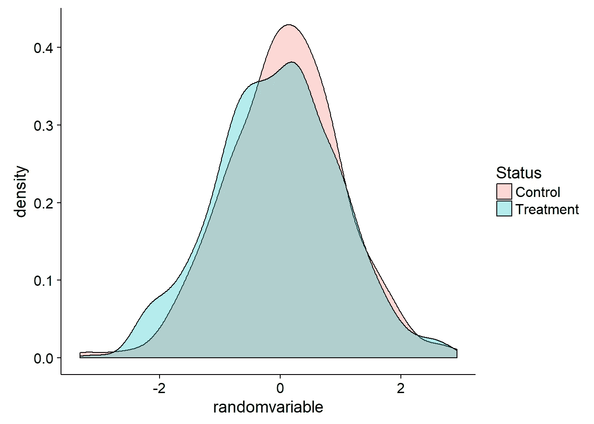
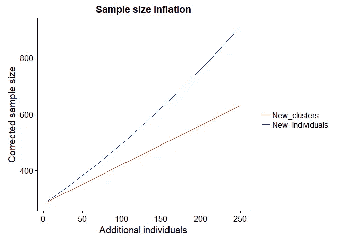
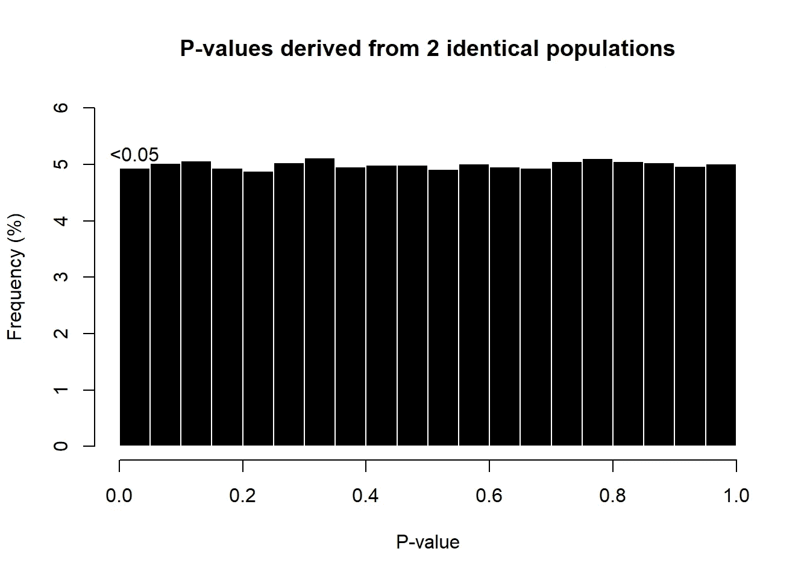
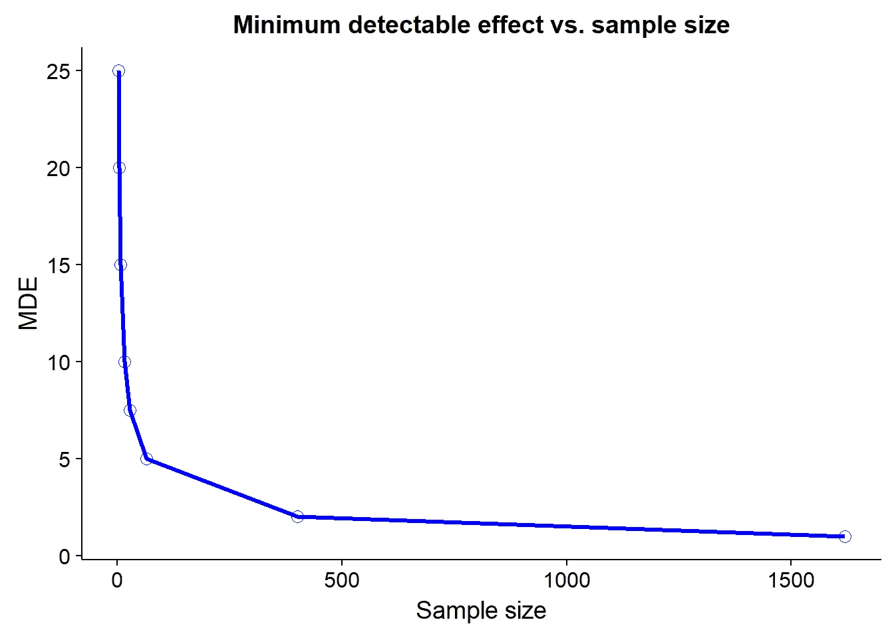

# 你需要知道的数据科学！A/B 测试

> 原文：<https://towardsdatascience.com/data-science-you-need-to-know-a-b-testing-f2f12aff619a?source=collection_archive---------2----------------------->

这是 5 篇系列文章的第 2 部分，旨在快速介绍数据科学和数据分析中的一些核心概念，特别关注我认为被忽略或在其他材料中简单讨论过的领域。

*这篇文章概述了 A/B 测试，以及计划和建立你自己的健壮的 A/B 测试的必要步骤。*

*这个职位适合从事产品开发的数据科学家，以及希望与数据科学家更好沟通的产品经理。*

谦逊的 A/B 测试(在其他科学中也称为随机对照试验，或 RCT)是产品开发的有力工具。

除了可能是估计效果大小(以及 ROI)最准确的工具之外，它还能够为我们提供**因果关系**，这是数据科学中非常难以捉摸的东西！有了因果关系，我们终于可以平息“相关性与因果性”的争论，并证明我们的新产品确实有效。

假设你是亚马逊的首席执行官，并试图找出将你的网站重新安排成一种新的格式是否会影响转化率(即亚马逊的访问者成为客户的比例):


一种方法是对选定的客户运行两个版本，并仅根据这些数字做出判断:



在这种情况下，我们会得出结论，布局 B 优于布局 a。

然而，这种简单的方法有两个可能的错误，统计学学生对此非常熟悉:

*   第一类错误——或者错误地认为你的干预是成功的(这里可能错误地认为布局 B 比布局 A 好)。也称为假阳性结果。
*   第二类错误——错误地认为你的干预不成功。也称为假阴性结果。

> 这些错误源于我们在[上一篇文章](http://“Data science concepts you need to know! Part 1” https://towardsdatascience.com/introduction-to-statistics-e9d72d818745)中提到的一个问题；也就是说，试图从一个**样本**(在这种情况下，是参与我们布局试验的访问者)中得出关于**人群**(在这种情况下，是所有亚马逊客户)的结论。

A/B 测试将使我们能够*准确地*量化我们的效应大小和误差，从而计算出我们犯下 I 型或 II 型错误的概率。

我认为，只有当我们理解了我们的结果的真实影响大小和稳健性，我们才能继续做出商业影响决策。换句话说，*一旦我们了解了我们的效果大小和误差，我们应该只估计新产品的 ROI(投资回报)。*

# 输入统计数据:

这篇文章将概述 A/B 测试的设计原则，以及如何确保一个试验是有效的和经济的。我们将依赖于在我们的[上一篇文章](http://“Data science concepts you need to know! Part 1” https://towardsdatascience.com/introduction-to-statistics-e9d72d818745)中介绍的概念(统计功效和 p 值)，所以如果这些需要更新，请随意返回一篇文章。

一旦你理解了数据科学中的 A/B 测试，你也会理解随机试验，它通常用于:

*   医学，了解一种药物是否有效
*   经济学，来理解人类行为
*   外国援助和慈善工作(至少是有声望的)，以了解哪些干预措施在缓解问题(健康、贫困等)方面最有效

## A/B 测试的原则

我们可能会根据同事的问题或想法开始考虑 A/B 测试。例如，我们可能有预感*贷款还款短信提醒将减少贷款违约*。稍加努力，我们可以将这个问题转化为一个假设，然后进行 A/B 测试，评估新 SMS 系统带来的确切收益(或收益缺失)

为此，我们首先需要将我们的问题形成一个**假设**，然后我们需要制定出我们的**随机化策略**、**样本量**，最后是我们的**测量方法**。

## 假设

假设是描述您想要测试的关系的正式陈述。假设必须是一个简单、清晰且可测试的陈述(更多关于可测试性的内容见下文),将对照样本(如布局 A)与处理样本(如布局 B)进行对比。

为了形成一个假设，我们将“SMS 系统能改善还款吗”重新表述为两个陈述，一个无效假设和一个替代假设:

*   零假设(H0):零假设通常表示治疗组和对照组之间没有差异。(换句话说，我们说我们的治疗结果在统计上与我们的控制结果相似)
*   替代假设(H1):替代假设表明治疗组和对照组之间存在差异。(换句话说，治疗结果将在统计上不同于对照结果)

值得注意的是，假设应该包括参考被研究的 ***人口***(Amazon.com 美国游客、伦敦银行客户等)、干预*(网站布局 A 和 B、有针对性的贷款偿还短信)、比较*组(比较什么)、结果*(你将测量什么)以及时间*(你将在什么点测量它****

*****P** 人口增长， **I** 干预， **C** 比较， **O** 结果， **T** ime = **PICOT** 。在定义你的假设时，请记住 PICOT。***

***从我们的亚马逊例子中给出一个结构良好的假设的例子:***

*   ***零假设(H0):与接受布局 A 的游客相比，接受布局 B 的 Amazon.com 游客不会有更高的参观结束转化率***
*   ***另一个假设(H1):与接受版面 A 的游客相比，接受版面 B 的 Amazon.com 游客将有更高的最终转化率***

***请注意，上面清楚地说明了我们的 PICOT:***

*   ***人群:访问过 Amazon.com 网站的个人***
*   ***干预:新网站布局(布局 B)***
*   ***比较:访问者接收布局 A***
*   ***结果:转换率***
*   ***时间:Amazon.com 访问结束***

***我们可以将此与农业背景下的弱假设进行对比，例如:***

*   ***H0:颜色好看的银行不会还贷***
*   ***H1:颜色好看的银行会还贷***

***为什么这么糟糕？在继续阅读之前，花点时间思考一下。***

*   ***“更好的颜色”没有明确的定义，我的好和你的好可能不匹配。这是 PICOT 的不良干预定义的一个例子***
*   ***什么银行？在哪里，什么级别？我们指的是银行分行吗，如果是，我们是研究世界各地的所有分行，还是只研究曼彻斯特市中心的分行？这是一个很差的人口规格***
*   ***我们如何衡量这一点？贷款违约率、逾期天数、分行总损失？这是来自 PICOT 的结果规范的一个例子。***

***强有力的假设将 A/B 测试结合在一起，并为设计和分析提供指导。你可以看到，上述假设对这些任务是没有用的。***

## ***随机化***

***回到我们的亚马逊例子，一旦我们有了一个良好的假设，我们就可以考虑随机化策略。为了扩展上面的例子，我们可以用两种方法随机选择我们的访问者:***

*   ***将游客随机分配到布局 A 或布局 B***
*   ***允许访问者选择加入新的布局测试版***

***这两种设置有什么不同？在我们回答这个问题之前，让我们检查一下为什么我们在 A/B 测试中随机化的原因。***

***A/B 测试中的随机化有两个相关目的:***

1.  ***均匀分布协变量***
2.  ***消除统计偏差***
3.  *****共变量**是可能影响你的结果变量的因素，例如，游客地理位置、性别和风险偏好。请注意，其中有些是*可观察*和可测量的(如位置和性别)，有些是*不可观察*(如风险偏好，难以测量)。***
4.  ****当你的样本与你的目标人群大相径庭的时候*就会出现统计偏差***。在 A/B 测试中，我们假设我们的样本代表我们的总体，偏离这一假设会导致我们对我们的总体产生不正确的理解，并得出看似可靠但实际上无效的结论！**

**在 A/B 测试设计的这一阶段，常见的偏差形式(也会影响我们的协变量分布)有:**

*   ****随机化偏倚** —由于不良随机化导致的偏倚*不平衡的治疗/对照组*(例如，与我们的对照组来访者相比，我们的治疗组来访者中德州来访者过多)。这使得一些共同变量(如德州人)在一个群体中比在另一个群体中发挥更大的影响。**
*   ****选择偏差** —如果我们允许访问者将*他们自己*分配到治疗/对照组，也会产生偏差。这是因为可能存在与治疗/控制选择相关的*不可观察的*协变量。例如，有更多风险偏好的访问者可能会选择进入测试组，因此我们的治疗访问者可能会同时产生治疗效果*和*风险偏好效果**

****这两种情况都将导致所谓的*混杂偏倚*，这意味着将很难理清由于不良随机化造成的影响与由于实际干预造成的影响。****

**然而，如果每个参与者都有平等的机会被随机分配到治疗/对照组，那么随机化将没有偏倚。这将导致可观察的(如位置)和不可观察的共变量(如风险偏好)被平均分配到治疗组和对照组。正是这种共变量的传播让我们能够理解因果关系。**

**回到我们在这一节的开头的例子，我们在两个策略之间的选择:**

1.  **将游客随机分配到布局 A 或布局 B**
2.  **允许访问者选择加入新的布局测试**

**从统计学的角度来看，这些策略中哪一个更好？**

**虽然可能有后勤或组织上的原因，为什么我们不能做前一个策略，但它肯定是一个更有统计学意义的试验。这是因为我们有完全的控制权来分配访问者(因此协变量)到每个组。如果我们使用策略 2，允许访问者选择新的布局，那么可能会有不可观察的因素在起作用，这可能会削弱我们的 A/B 测试，并将不可观察因素的影响与我们的结果变量混淆。**

**因此，完全随机地选择治疗组和对照组是很重要的，最好的方法是让 R 为你做这件事。我在下面加入了一个函数，可以帮你做到这一点。请注意 set.seed 函数的使用——我们将使用随机数将我们的参与者分配到治疗/控制状态，因此 set.seed 将使这种随机性可重现。**

**现在让我们看看分配治疗/控制状态的函数，我在这里称之为*RCT _ 随机*:**

```
**#lets first make up a fake list of  IDS from 1 to 1000 and 1000 random variables drawn from a normal distributiondf = data.frame("ID"=seq(1,1000), "randomvariable"=rnorm(1000))#lets now make a function to do the work - you can copy paste this function into your own scripts
# it needs to be given a dataframe and a list of naming options
# Options might be "treatment" and "control", or if there are more than 2 options then it might be "Control", "treatment1", "treatment2", or just "LayoutA", "LayoutB"RCT_random = function(dataframey, values_to_add){

  set.seed(111)
  dataframey$values_to_add[sample(1:nrow(dataframey), nrow(dataframey), FALSE)] <- rep(values_to_add)
  colnames(dataframey)[which(colnames(dataframey)=="values_to_add")] = "Status"
  return(dataframey) }# so this will take the dataframe called "df" and randomly assign each ROW to "Treatment" or "control"
df_new = RCT_random(df, c("Treatment","Control"))**
```

**我们现在已经获得了原始数据帧**

****

**并用我的函数“RCT _ 随机”给他们随机分配治疗和控制状态:**

****

**我们现在应该仔细检查我们的随机化，以确保它按预期进行，为此，我们可以查看最重要的关键变量的分布。也可以运行适当的假设检验来评估分布是否不同。对于这些假设检验，我们将 P 值阈值设置为 0.01(而不是通常使用的 0.05)，这是由于我们将在另一篇文章中讨论的*多重比较问题*。**

**现在让我们看看治疗组和对照组的汇总统计数据，并确保“randomvariable”是相似的:**

****

**他们看起来非常相似！到目前为止，随机化是成功的。**

## **突击测验**

**让我们看看下面的一些随机化策略的例子，并尝试判断它们是正确的还是不正确的随机化:**

1.  **参与者可以决定是加入治疗组还是对照组**
2.  **任何身份证号码以奇数结尾的参与者被分配到治疗组，任何身份证号码以偶数结尾的参与者被分配到对照组。**
3.  **我办公室东边的参与者被指定为控制组，我办公室西边的参与者被指定为治疗组**
4.  **我们抛硬币来决定一个参与者是控制还是治疗**

**以上哪些是真正随机化的？在继续下面的建议答案之前，花点时间思考一下这个问题。**

1.  **参与者可以决定是加入治疗组还是对照组。*这不是随机的，因为参与者可能有理由选择一个会导致自我选择偏差的群体***
2.  **任何身份证号码以奇数结尾的参与者被分配到治疗组，任何身份证号码以偶数结尾的参与者被分配到对照组。几乎是随机的，但不完全是！这里的问题是，可能有一些未知的因素与影响我们的结果的国民身份证。如果我们 100%知道国家 id 是随机产生的，那就没问题，但是我们不知道我们应该使用另一种方法**
3.  **我办公室东边的参与者被指定为对照组，我办公室西边的参与者被指定为治疗组。*这是一个可怕的想法，这可能会导致混淆性偏见，因为东西方参与者之间可能存在地理差异***
4.  **我们抛硬币来决定参与者是控制还是治疗，正面意味着治疗，反面意味着控制。*这是唯一一个真正随机的系统，因为它仅仅基于偶然性***

# **聚类随机化**

**有时，我们不能在个体水平上随机化，但我们仍然想在那个水平上测量。例如，如果我们要随机评估对银行员工的激励对客户贷款偿还率的影响，那么不可能在客户层面进行随机化(因为这些*共享*银行，因此也共享银行员工)，我们需要在银行层面进行随机化，同时仍然测量客户层面的结果(偿还率)。**

**在一个水平上随机化而在另一个水平上测量的过程导致我们的 A/B 测试设计复杂化。具体来说，共享一家银行的客户的固有相似性(在上面的例子中)将导致我们有更窄的分布，并低估我们的误差。反过来，这将对我们的研究能力和研究结果产生连锁反应(即，由于我们数据中的错误置信度，我们将有更高的假阳性率)。在群体中接受治疗的个体行为相似的概念被称为**群集**，我们的解决方案是使用**群集随机试验**或**群集 A/B 测试。****

**整群随机试验类似于 A/B 试验，但是我们的随机单元变成了整群而不是个体(所以在上面的例子中，银行就是整群)。我们可以使用**群内相关性**或 **ICC** 来测量聚类，这将告诉我们群内个体的响应有多相关。ICC 从 0(同一个集群的成员之间没有关联)到 1.0(完全关联)运行。更高的相关性会导致更多的分析问题，所以我们希望这个值为 0！**

**ICC 会导致我们的分布看起来比实际更窄，这反过来会对我们的统计功效、系数、置信区间和 p 值产生连锁反应。它本质上导致了对我们结果的错误信任。使用[前一篇文章](https://medium.com/@michaelbarber_63724/introduction-to-statistics-e9d72d818745)中概述的概念，你应该能够合理解释为什么低估我们的误差会导致这些影响。**

**使用历史数据在审判前计算 ICC 是可能的。这个估计的 ICC 将使您能够根据需要调整您的方法，以产生一个可靠的试验。**

**让我们首先看看如何计算 ICC:**

```
***# make some fake data*

*#this data will have an ID number, variableA (our variable of interest), the bank name and the district name*
df = data.frame(ID=seq(1,100), variableA=rnorm(100,500,50),  bank_name=c("first_bank","second_bank","third_bank","last_bank"), District=c("A","B"))

library(knitr)
kable(df[1:5,], format="markdown", align="c")**
```

**我们可以使用下面的代码片段来计算 ICC:**

```
**ICC_CI <- function(cluster_level,outcomevar, dataf){

  #load library
require(ICC)
  set.seed(123)
  si = round(dim(dataf)[1]*0.66)
  values_f <- c()
  for(i in seq(1:50)){
  samp_f = dataf[sample(nrow(dataf), si), ]
  x_f = ICCbare(cluster_level,outcomevar,samp_f)
  values_f <- c(values_f, x_f)
  }
  # note that 1.96StDevs = 95% confidence interval bounds in a normal dist.
   ret = data.frame("Mean ICC" = round(mean(values_f, na.rm=TRUE),3), "CI" = round(1.96*sd(values_f, na.rm=TRUE),3))
   ret$Significant = ifelse(ret$Mean.ICC > ret$CI, "Y", "N")
  return( ret)

  }

stored_ICC <- ICC_CI("bank_name", "variableA", df)**
```

****

**从这个计算可以看出，我们在同一家银行的客户之间的 ICC 是(0.022 +/- 0.081)。当置信区间(CI)过零时，我们可以看到这并不显著(因此“显著= N”)。换句话说，银行似乎在客户之间的相似性中占的比例可以忽略不计。**

**然而，如果我们有一个重要的 ICC，那么我们将需要调整我们的试验设计和分析计划，以减轻 ICC 的影响。我们通常有两种选择:**

## **ICC 解决方案 1**

****选项 1:计算每个集群的汇总指标(如集群平均值)。然后，每个聚类只提供一个数据点，并允许我们继续假设*我们的数据是独立的*，然后我们可以像往常一样继续使用标准统计工具(例如 T-test)。****

**因此，如果我们有 45 组 500 个人，我们最终有 45 个数据点。这意味着我们的功率、样本大小和分析计算**也需要在集群级别**执行。这也意味着我们可以简单地在聚类级别分析我们的数据，并从这里开始忽略 ICC(因为我们本质上设置 ICC = 1.0 并继续这个假设)。**

## **ICC 解决方案 2**

****使用 ICC 和个人数量来计算我们的新样本量。****

**对于选项 2，我们将继续在个人层面计算功效、样本大小和分析指标，但会进行一些修正，以解释错误的窄分布。**

**对于我们的样本大小，我们将使用下面的`ICC_correction`函数来扩大它:**

```
**ICC_correction <- function(samplesize, num_clusters, ICC_estimate){

  average_cluster_size = samplesize/num_clusters

  factor_inflate = 1 + (average_cluster_size - 1) * ICC_estimate

  return(data.frame("New sample size"=round(samplesize*factor_inflate), "Old sample size"=samplesize   ))
}

ICC_correction(200, 50, 0.2)**
```

****

**因此，`200`个客户的初始样本量，30 个集群(银行)和一个`0.2`的 ICC 将导致新的样本量为`320`。请注意一个相对较小的 ICC 是如何将我们的样本量增加 50%以上的。**

**我们还可以探索添加新集群与在现有集群中添加新个体之间的区别。例如:**

```
**scenario1 <- ICC_correction(200,20,0.2)$New.sample.size #average 10 farmers per cluster, and  20 clusters

scenario2 <- ICC_correction(200,40,0.2)$New.sample.size # average 5 farmers per cluster, and 40 clusters**
```

**`场景 1= 560 '**

**`场景 2= 360 '**

**我们可以看到，将集群数量增加一倍(但保持参与者数量不变，以便客户分散到更多的集群中)会导致校正后的样本量大幅减少。**

**我在下面运行了一个模拟，该模拟将绘制添加新个体(到现有聚类)与添加新聚类之间的关系，以及这如何影响样本大小(保持功效常数为 0.8):**

****

**总的来说，我们可以看到，在现有的集群中增加**新的集群**而不是**新的个体**，在较小的程度上扩大了我们校正后的样本量(在这篇文章的底部有一个到这个模拟代码的链接)。**

**通过添加新的聚类，我们将最小化由聚类内方差解释的*总*方差，从而获得信息。另一个直观的解释是，如果我在一个群集中已经有 10 个个体，并且我们有非零 ICC，那么该群集中的每个额外个体提供的信息越来越少，并且她的特征基于群平均值越来越可预测。**

****NB。在下一篇文章中，我们将看看用固定和随机效应模型对 ICC 数据的实际分析。****

## **p 值阈值，也称为 alpha**

**一旦我们有了一个可检验的假设和随机化策略，我们将会考虑数据分析。通常，我们会用假设检验来检验干预的有效性。这个假设检验将产生一个 p 值，这是我们的数据可能纯粹是偶然产生的*概率*——换句话说，我们错误拒绝 H0 的概率(一个**假阳性结果**)。**

**当使用假设检验时，我们必须设置一个可接受的假阳性率，也称为 *p 值阈值*或*α水平*。最常见的 p 值阈值是 0.05 ( [一个非常随意的数字](http://www.jerrydallal.com/lhsp/p05.htm))。这意味着我们愿意接受产生假阳性的 5%的风险，并错误地断定我们的治疗之间有差异，而事实上没有差异。**

**我们可以在下面证明这一点，如果我们从相同的**人群* *中随机测试两个**样本*，那么我们将有 5%的机会错误地将样本识别为来自不同的人群:**

****

**在某些情况下，我们可能希望将阈值设置为 0.01 (1%)或 0.1 (10%)。一般来说，我们越不愿意不正确，门槛就越低。因此，对于可能对客户产生负面影响的干预，我们希望非常确定正面影响(0.01 阈值)，而不愿意接受负面影响(0.1 阈值)。请注意，我们的阈值越低，检测任何效果所需的样本量就越大。**

**和往常一样，这些数字的完整 R 代码可以在这篇文章的底部找到。**

# **实践中的样本量计算**

**结合这篇文章和[文章#1](https://medium.com/@michaelbarber_63724/introduction-to-statistics-e9d72d818745) 的材料，给了我们一个很好的样本量计算的理论基础。然而，我想在这里提出的一个常见问题是:*“我从哪里获得样本量计算的数据？”*。我们可以使用上面的亚马逊布局试用示例来理解如何回答这个问题。**

**在计算样本量之前，需要的主要信息是对干预效应大小的估计。通常有两种方法可以为我们的计算得出效应大小的估计值:**

*   **分析历史数据或试点研究**
*   **设置最小可检测效应(MDE)**

## **根据历史数据或试点研究进行估计**

**第一个包括文献回顾和/或小规模试点研究，以评估治疗组和对照组之间的差异。请注意，如果您使用试点数据，那么效果大小的估计可能会非常粗略，因此我建议将效果大小减半以保守，并将其用于计算。如果你再次使用文献值，谨慎对待它们，将任何文献值视为效应大小的上限估计(这是由于[赢家的诅咒](https://en.wikipedia.org/wiki/Winner%27s_curse)现象，这将在后面的帖子中讨论)。**

## **最小可检测效应**

**也许对这个问题最有商业头脑的方法是利用 MDEs。**

**MDE 方法将询问*“为了使干预有价值，我需要看到的最小效果是什么？”*，然后我们将效果大小设置为该值。这里的理由是，如果提议的干预的投资回报(ROI)是负的(或非常小)，那么我们不需要能够精确地测量这样小的值来做出决定。**

**例如，在 Amazon.com 实施布局 B 可能相当昂贵。我们可以计算出该实现将花费大约 20，000 美元的员工时间，在这种情况下，我们只关心是否能够检测到超过 20，000 美元的影响。为了便于讨论，我们假设 20，000 美元相当于美国市场转换率增加 2 个百分点，然后我们将 MDE 设置为 2 个百分点，将我们的效果大小设置为 2 个百分点。**

**MDE 方法可能非常强大。在预分析(估计样本大小)和后分析期间明智地使用它来说明*使用 0.8 倍的光焦度*我们能够检测到什么样的尺寸效应。您可以在下面看到一个预分析 MDE 的工作示例，我还包含了一个函数`plot_MDE`，您可以对自己的数据使用它。**

```
**#make some fake data, let's pretend its baseline data

dat <- data.frame("mean.client.expenditure" = rnorm(1000,100,10))

#this function will plot MDE for various differences
# differs is a list of intervention effects that you want to consider
plot_MDE <- function(historical_data, differs){

  #initialise empty vec
p <- c()

#remember our effect size function from post 1?
cohen_d <- function(d1,d2) {  
  m1 <- mean(d1, na.rm=TRUE)
  m2 <- mean(d2, na.rm=TRUE)
  s1 <- sd(d1, na.rm=TRUE)
  s2 <- sd(d2, na.rm=TRUE)
  spo <- sqrt((s1**2 + s2**2)/2)
  d <- (m1 - m2)/spo
  rpb <- d / sqrt((d**2)+4)
  ret <- list("rpb" = rpb, "effectsi" = d)
  return(ret)  } 

#load libs
require(pwr)

for(i in seq(1:length(differs) ) ) {
  samp1 <- historical_data
  xnu = differs[[i]]
  #this is a better version if you can understand it:
    samp2 <- samp1 + rnorm(length(samp1), xnu, xnu/10) #add some noise
  inp <- cohen_d(samp1, samp2)

  p[i] <- pwr.2p.test(h=inp$effectsi , sig.level=0.05, power=0.8, n=NULL)$n

}

require(ggplot2)
print(ggplot() + geom_point(aes(x=p, y= differs), size=3, color="blue", shape=1) + geom_line(aes(x=p, y=differs), size=1.2, color="blue") + xlab("Sample size")+ ylab("MDE") + ggtitle("Minimum detectable effect vs. sample size"))

library(knitr)
mde_tab = data.frame("MDE"=differs, "Sample size"=p)
kable(mde_tab, digits=2) 

}

#set some differences for the loop, here, 1,2,5 (etc) are dollar increases
diffs <- c(1,2,5,7.5,10,15,20,25)

#plot
plot_MDE(dat$mean.client.expenditure, diffs)**
```

****

**请注意，这个函数将为您提供 Y 轴，无论您为该函数提供什么单位(在本例中是美元)。您可以使用 MDE 来计算初始样本大小，然后使用 ICC 校正来获得该 MDE 的 ICC 校正样本大小。**

# **尺寸**

**A/B 测试的最后一部分是测量本身。这通常是测试设计中被忽视的部分，因此也是后来分析问题的主要来源。任何假设都需要有一个好的测量策略才有用。**

**我想用一个题外话来描述我对马拉维一家电信公司的通话时间使用(又名电话信用)的 A/B 测试所做的一些分析，以说明这里的陷阱。**

**这项 A/B 测试考察了新产品对通话时间使用的影响。在 A/B 测试中，我们要求人们回忆他们上个月在通话时间上花了多少钱，而他们不知道的是，我们还从电信公司获得了相同客户的实际花费数据。当我们比较这两个指标时，我们发现相关性很小！此外，当我们观察谁最有可能高估他们的通话时间时，我们发现是年轻的城市男性。**

**现在考虑一下——如果我们只有自我报告的数据，我们会认为年轻的城市男性是广播时间的大支出者，从中得出许多结论，并发现许多“具有统计学意义”(根据< 0.05) relationships! We would have made many recommendations to the telecommunications company about the new product, and our results would have held up to thorough statistical interrogation. In short — there would have been very little way to know we were wrong, but we would have been wrong nevertheless!**

****的 P 值，这个故事的寓意是，世界上最好的统计数据也不能挽救糟糕的测量试验。另一个寓意是，自我报告的数据往往是可怕的(当心调查-重非政府组织！)，因为它受人们希望被如何看待的影响(可能是面试官、社区或他们自己对“低”通话时间的尴尬)。****

**重要的是花一些时间思考衡量策略的注意事项和弱点，然后尝试尽可能地减轻这些弱点(例如，通过获得上述确证数据)。**

**最后，一旦数据被收集和分析，让它可访问和可复制是很重要的。这意味着编写干净的代码(最好是在 R-markdown 或 Jupyter notebook 中)并将原始数据保存在公司服务器上。**

**一家新接触大数据的公司中的每一位数据科学家都目睹了散布在数十个员工硬盘上的一连串随机 CSV 文件和分析脚本。一个存储这些文件和脚本以备将来使用的系统是必要的，并且完全值得拥有自己的博客帖子！**

**如果你喜欢这个帖子，或者觉得有用，那么请鼓掌让我知道！**

# **摘要**

**我们现在已经看到了 A/B 测试的关键部分:**

*   ****假设**:一个好的假设是*可检验*且*可测*。它必须有一个明确定义的评估标准(例如，我们是测量平均值还是中位数？个人层面还是群体层面？).**
*   **随机化:我们必须使用 R 随机化，并确保我们的治疗组和对照组是平衡的。我们可以使用 RCT 随机函数来实现这一点。我们还应该考虑群集效应，并使用正确的随机化*单位*。可以计算 ICC 并相应地调整样本大小，假设 ICC 为 1.0 并根据聚类数计算样本大小也是合理的**
*   ****功效**:了解你在试验前后的统计功效、样本量和 MDE([见上一篇](https://medium.com/@michaelbarber_63724/introduction-to-statistics-e9d72d818745))**
*   ****测量**:测量必须稳健可靠，考虑我们可能不准确的地方，并在您设计的任何研究中尽量减少自我报告指标的重要性！**

**你可以在我的 [GitHub](https://michael-bar.github.io/Introduction-to-statistics/AMP-2-RCT-principles.html) 上查看这篇文章的完整版本(包括所有 R 代码)**

## **下次**

**线性模型，混合效应模型，以及更多关于假设检验的内容！**

***原载于*[*Michael-bar . github . io*](https://michael-bar.github.io/Introduction-to-statistics/AMP-2-RCT-principles.html)*。***