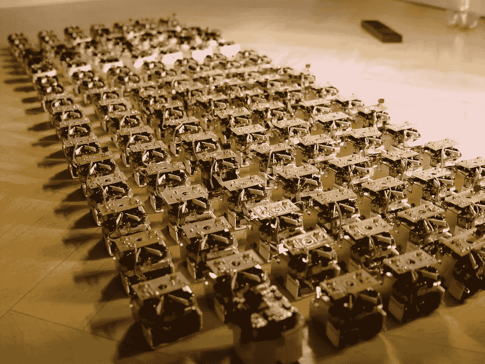
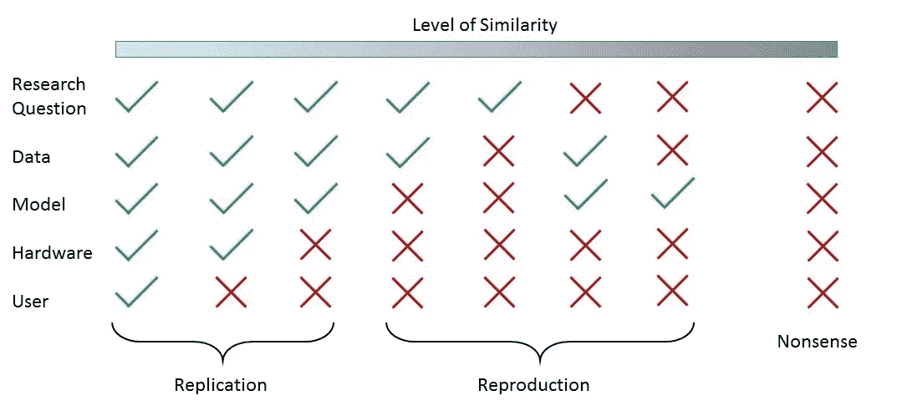

# 数据科学的再现性危机

> 原文：<https://towardsdatascience.com/data-sciences-reproducibility-crisis-b87792d88513?source=collection_archive---------4----------------------->

Photo credit: Serg from the [Swarmrobot.org](http://swarmrobot.org/) project via [Wikipedia](https://en.wikipedia.org/wiki/Robot#/media/File:SwarmRobot_org.jpg)

*什么是数据科学中的再现性，我们为什么要关注它？*

紧接着 Joelle Pineau 在今年的[国际学习表示会议(ICLR)](https://iclr.cc/) 上关于深度强化学习的[可复制性、可重用性和健壮性](https://www.youtube.com/watch?v=Vh4H0gOwdIg)的精彩演讲，似乎数据科学世界(或至少是数据科学研究世界)中的每个人都在谈论可复制性和可复制性。

这个问题不是数据科学独有的。事实上，根据 *Nature* 杂志 2016 年的调查，[大多数科学领域都面临着可复制性危机](https://www.nature.com/news/1-500-scientists-lift-the-lid-on-reproducibility-1.19970)。具有讽刺意味的是，根据调查受访者的说法，导致再现性危机的最重要因素之一是统计知识不足。这一结果很可能至少部分受到生物和医学领域大量受访者的影响(906/1500)，他们通常在相关统计数据方面接受过[次优培训](http://journals.plos.org/plosbiology/article?id=10.1371/journal.pbio.1002430)。鉴于数据科学和机器学习从业者的职业性质，人们会希望他们具有更高的统计培训总体水平。然而，尽管该领域强调统计和确定性建模，但数据科学仍然面临着再现性方面的挑战，这些挑战往往突出了在大多数科学领域推动再现性危机的结构和组织力量。

**什么是再现性？**

在我们讨论数据科学中的再现性之前，我们需要从一个明确的定义开始。Chris Drummond 认为，许多关于“可复制性”的讨论实际上都是围绕着“可复制性”展开的(有些人将后者称为“可重复性”)。在他看来，可复制性是另一个人使用同样的工具和同样的数据产生同样结果的能力。在像数据科学这样的计算领域中，这个目标经常是微不足道的，对于“真实世界”的研究来说并不成立。任何人都可以派生一个开放访问的存储库，使用相同的数据运行完全相同的代码，并获得相同的结果。实验室环境很少如此完美地可复制，这意味着实验复制通常涉及一些实验参数的低水平扰动。通常，即使完全相同地复制别人的实验室工作也意味着从相同的来源订购原材料，重新配制他们的试剂，在你的机构中找到类似的设备，并在出版物允许的范围内尽可能严格地遵循他们的方法。正如 bench 科学家所说，“我为自己的研究复制了这个实验，这个方法在我手里也管用。”

但是实验复制的保真度在实验室和计算学科之间是不同的。计算复制的保真度通常被认为是非常高的。如果另一位研究人员将相同的代码应用于相同的数据，那么任何确定性算法都会产生相同或非常相似的结果。从本质上来说，大多数开源项目都满足这种可复制性要求，因此对于该领域大多数有意义的研究来说，停止在这种实验性复制水平上可能是微不足道的。然而，尽管它是琐碎的，这种练习仍然是至关重要的，可以作为其他从业者推出新工具或算法的积极控制。

相反，在德拉蒙德看来，再现性涉及更多的实验变异。我们可以把实验性复制看作是一种存在于从近乎完美的相似到完全不相似的连续体上的活动。在高保真度的一端，我们有一个分叉的项目，在没有任何改变的情况下重新执行。在天平的另一端，我们有通常保留给烹饪博客上食谱评论的那种废话。"我没有做这种面包的面粉，所以我用碎牛肉代替，它尝起来很难吃！"从这个角度来看，实验室实验中的实验复制看起来更像是计算实验中的复制。

Good reproduction is about finding a middle ground between replication and irrelevance.

**我们为什么要关心？**

可重复的实验是每个科学领域的基础，事实上，甚至是科学方法本身。卡尔·波普尔在《科学发现的逻辑》中说得好:“不可复制的单一事件对科学没有意义。”如果你是这个世界上唯一能取得特殊成果的人，其他人可能会发现很难信任你，尤其是如果他们已经花费时间和精力试图复制你的工作。在一个单一的未经证实的轶事上建立一个产品或理论是鲁莽和不负责任的，如果你把轶事作为一个可靠的现象，它会消耗时间和资源，否则这些时间和资源会花在实际的生产工作上。

不可复制性并不总是恶意的，甚至是故意的，但在科学领域它很少是积极的。科学贡献的有效性在于它们作为一种工具或视角对其他人应用于他们自己的问题的有用性。我们钦佩那些解决我们发现难以解决的问题的研究人员，或者那些开发工具来解决我们苦苦挣扎的困境的研究人员。作为科学家，我们应该努力创造工具和想法，帮助他人实现自己的目标。这样做，我们(希望)能丰富我们自己的成功和职业地位。

如果我们缺乏再现性的标准，或者如果我们陷入实施再现性护身符的陷阱而不考虑它们的真正目的，我们就有浪费我们自己和其他人的时间的危险。科学是超越单个从业者的思维连续性。当我们离开时，不管出于什么原因，其他人应该能够从我们离开的地方继续产生新的知识。同事们应该能够实施我们的想法，而不用我们在他们的肩膀上徘徊。

科学是一种将我们独特的经历和兴趣运用到世界上的方式，这种方式可以帮助其他人的经历和兴趣。我们不能总是预见到我们的新知识如何应用到我们自己的兴趣中去帮助别人，我们也不需要这样做。我们只需要尽最大努力，用可靠的方法解决我们感兴趣的问题。以无法复制的方式获得的知识对任何人都没有帮助，也没有潜力这样做。所以没有可重复的实践，我们只是在浪费我们自己和其他人的时间。

Photo credit: rawpixel.com on [Pexels](https://www.pexels.com/photo/group-hand-fist-bump-1068523/).

**数据科学再现性的障碍**

既然我们已经有了一个基本的框架来解释什么是再现性以及为什么它很重要，我们可以开始讨论如何解决它。有几个障碍导致了数据科学中的再现性危机，其中一些将非常难以解决，如果不是不可能的话。常见的问题包括数据和模型的可用性、基础设施、出版压力和行业标准，以及许多其他不经常讨论的问题。几乎所有这些问题都有多种不同的驱动因素，每个因素都需要自己的解决方案。因为我们是数据科学家，谈论模糊和复杂的概念，它可以帮助做我们最喜欢的任务之一:分类。

大多数问题都有“硬”和“软”因素驱动。硬驱动代表着执行上不可逾越的障碍。具备适当的基础设施就是一个很好的例子。有时你只是没有足够的存储空间或 GPU 来复制别人的作品。也许你不能访问临床或商业数据，因为你不能获得许可这样做。

另一方面，软挑战代表了这样一类问题，其中有一个概念性的解决方案，但行业或专业压力阻止你这样做。最典型的例子就是学术实践者，他们真的很想复制别人的作品，但是没有理由花时间去研究一些期刊不愿意发表的东西。

在许多情况下，解决数据科学家面临的再现性挑战需要对多个不同领域有细致入微的了解。这些问题中的大多数无法通过单一的规则或政策来解决，因此有时可用的最佳解决方案是开始讨论如何改进数据科学和相关分析领域的实践。随着本系列的继续，我希望深入探讨影响数据科学可再现性危机的每个最大挑战，并讨论我们作为一个新的独特的行业可以采取的潜在解决方案。