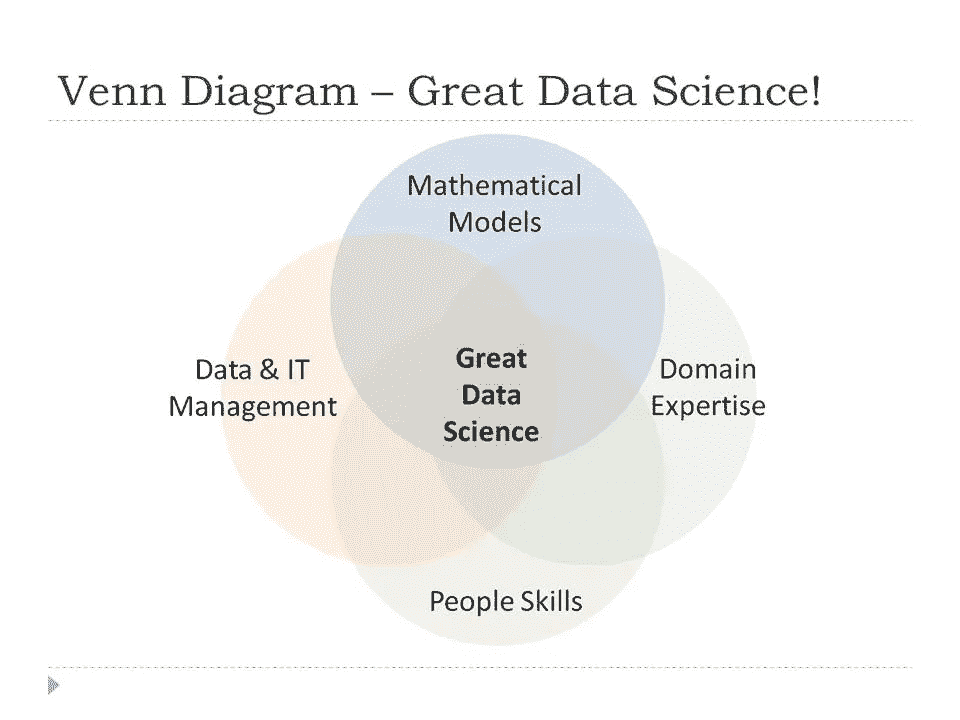

# 数据科学家:从优秀到卓越

> 原文：<https://towardsdatascience.com/data-scientist-from-good-to-great-5e6aed447b69?source=collection_archive---------6----------------------->

你们中的许多人刚开始学习数据科学，并且正在寻找关于学习什么的资料，可能已经遇到过[绘制的康威的维恩图](http://drewconway.com/zia/2013/3/26/the-data-science-venn-diagram)关于数据科学的含义。我有一个改编自他的不同版本，并写在我的帖子[中。](https://medium.com/@koolanalytics/moving-into-data-science-as-a-career-10b5f400a28e)

经过深思熟虑，我看了吴恩达关于[在百度研究院](http://bit.ly/baiduml)建立他的数据科学团队的帖子(当时他还和他们在一起)，我问自己一个问题:一个优秀的数据科学家如何才能成为一名伟大的数据科学家。

**团队成员**

我想到的一件事是，对于任何从事数据科学工作的人来说，他们都无法逃避成为团队的一员。他们必须学会如何成为一名好的领导者和好的追随者，以便扮演好支持角色，尤其是当数据科学家必须与数据工程师和业务用户沟通时。每个人都在使团队有效和高效的过程中发挥作用，没有团队成员的合作，领导者就不能有效，没有领导者的指导、保持专注、管理时间表和激励团队成员，团队成员也不能有效。

**沟通技巧**

除此之外，在我看来，要成为一名伟大的数据科学家，沟通技巧非常重要。能够以管理层能够理解的方式传达相关的见解，需要投入大量的思考。例如，演示应该如何组织，以便见解易于理解。

伟大的数据科学家需要了解人们是如何学习的，什么样的沟通媒介可以有效地传递信息/见解，以便他们容易理解并可以用来做出更好的决策。

**移情**

综上所述，作为一名优秀的领导者、优秀的追随者和优秀的沟通者，他们都需要一个共同的“要素”，那就是换位思考，能够设身处地为他人着想。

拥有同理心可以让一个人明白，如果“故事”以某种方式呈现，哪些行为可能被选择，哪些感知可能被采纳。这使数据科学家能够预测可能的结果，并为此做好准备，还能提出成功的演示。

例如，如果一个数据科学家必须准备一个特别的分析，他/她应该能够预料到听众可能会问的问题，并相应地准备好数字，以便在提问时可以方便地使用。能够回答观众的这些问题，可以增加数据科学家的可信度。

因此，要成为一名优秀的数据科学家，我建议这个人接受培训并具备以下方面的知识:

1) [数学建模](/moving-into-data-science-as-a-career-mathematical-models-e13f30690b00)

2) [数据& IT 管理](/moving-into-data-science-as-a-career-data-it-management-8de5360cb06c)

3) [领域专长](/moving-into-data-science-as-a-career-domain-expertise-3e36cafad1e7)

要从优秀的数据科学家成长为伟大的数据科学家，需要的第四项技能是

4)人际技能——团队精神、沟通技能和同理心

Moving from Good to GREAT!

总之，数据科学家不仅应该拥有可以通过书籍和其他媒介获得的“硬”技能、知识和技能，还应该拥有只能通过经验和实践获得的“软”技能。

好消息是它们可以并行拾取。所以去把它捡起来！开始团队项目，抓住更多的机会做演示！

希望博客有用！如果你有兴趣了解还需要哪些软技能，请访问第二部分[这里](https://medium.com/@koolanalytics/data-scientist-from-good-to-great-part-2-614f1ed2aaeb)。祝您的数据科学学习之旅愉快，请务必访问我的[其他博客文章](https://medium.com/@koolanalytics)和 [LinkedIn 个人资料](https://www.linkedin.com/in/koopingshung/)。

**补充说明:**作为我 2020 年新年计划的一部分，我已经建立了自己的网站，最新消息请访问[这里](http://koopingshung.com)。感谢支持！