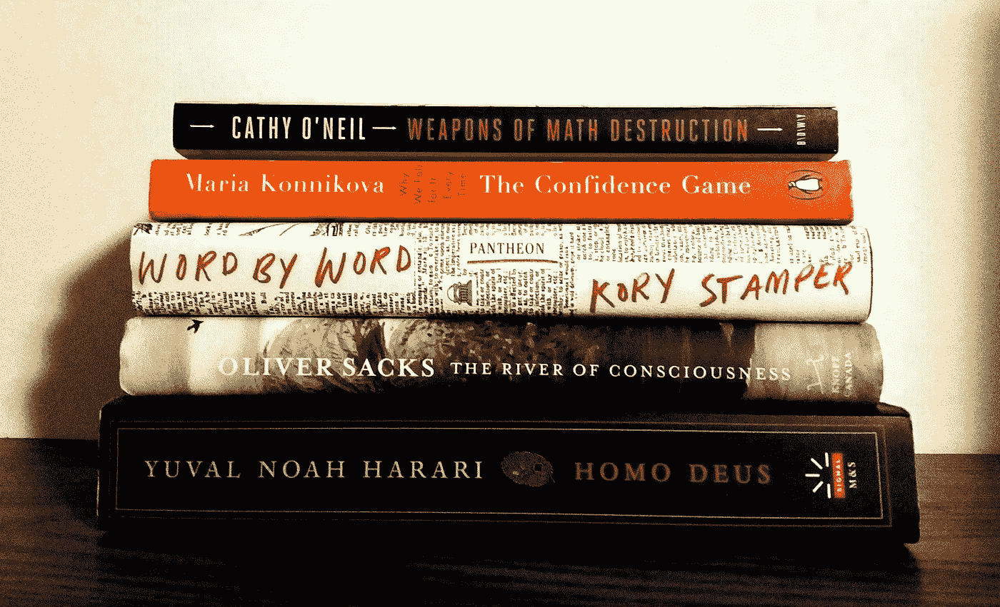
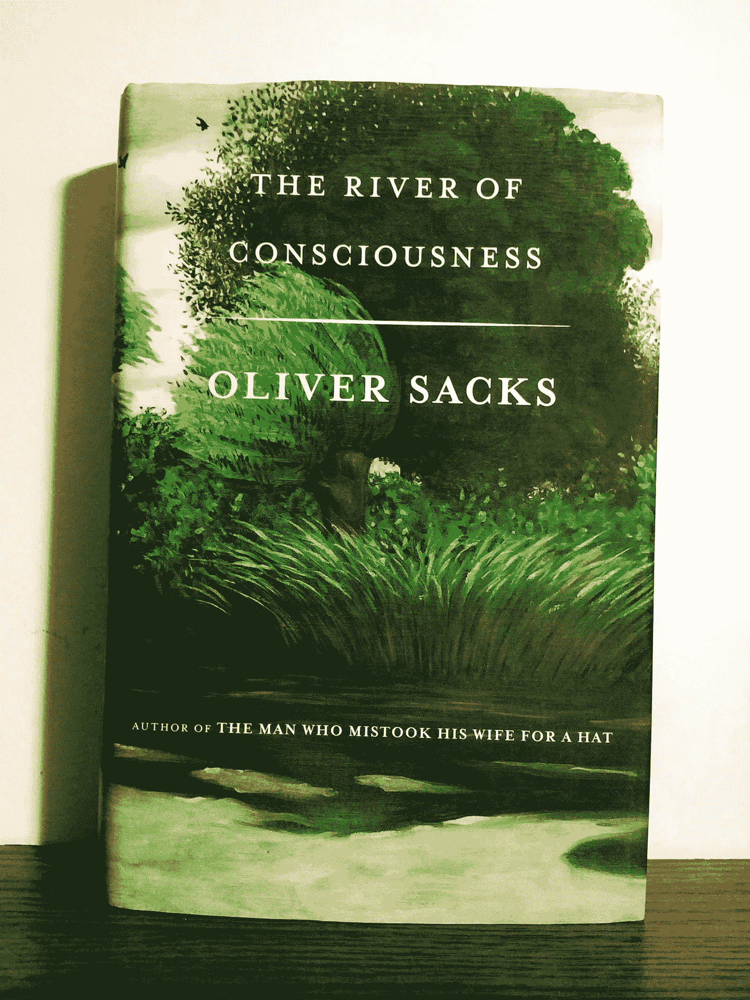
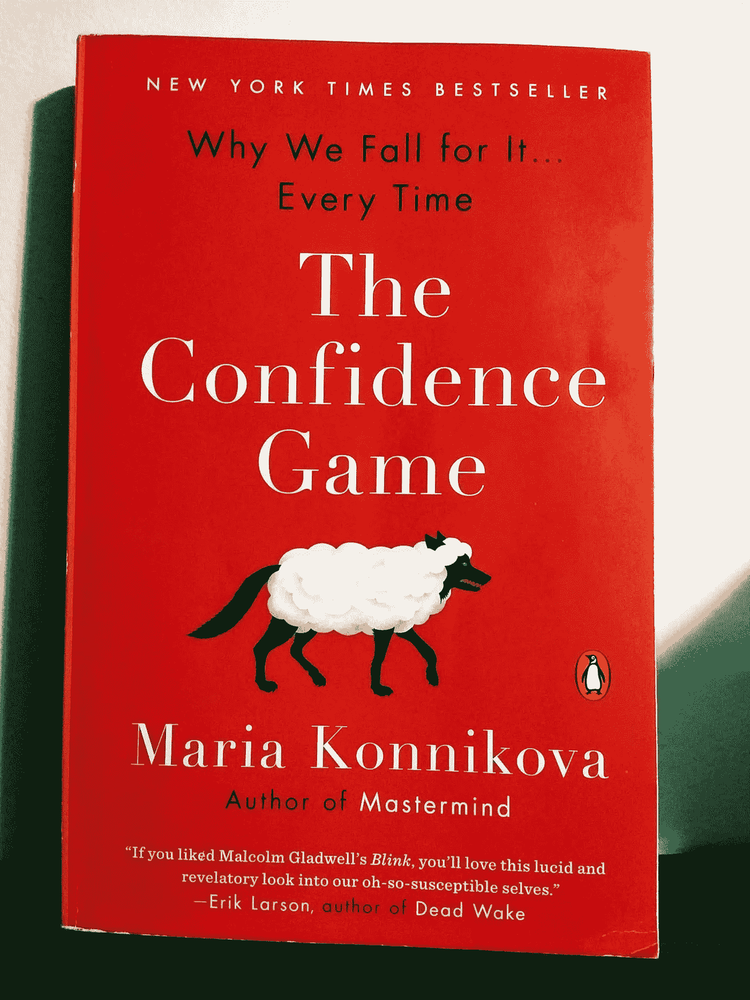
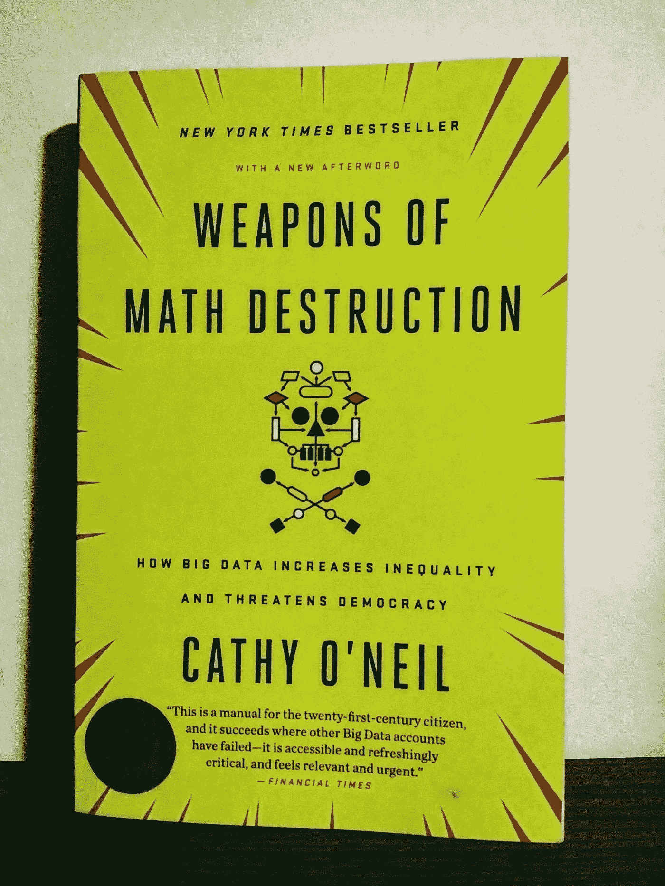
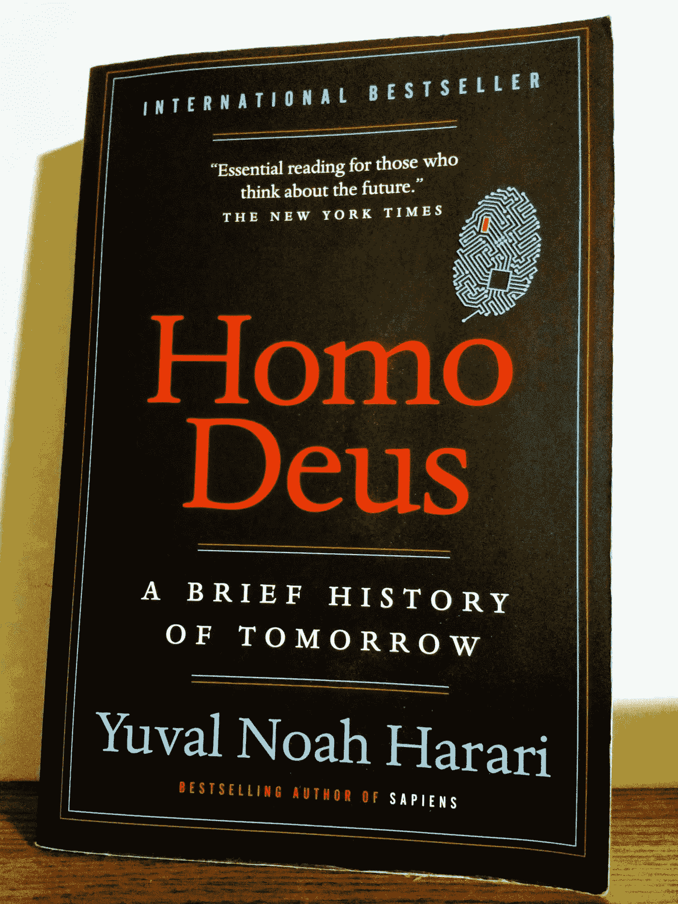

# 数据科学家:通过这 5 个领域外的阅读增长你的专业知识

> 原文：<https://towardsdatascience.com/data-scientists-grow-your-expertise-with-these-5-out-of-field-reads-7dee32570630?source=collection_archive---------23----------------------->

## 我在 2018 年阅读的前 5 本非数据科学书籍帮助我设计了更好的人工智能

从一名优秀的数据科学家转变为一名伟大的数据科学家的关键不仅仅是技术知识。相反，你在职业生涯中取得的进步越大，就越有必要联系和综合其他地方的想法。对各种主题领域的主题有很好的理解可以在日常生活中激发伟大的想法，并最终在你的技术工作中带来巨大的突破。

那么如何培养这种能力呢？阅读各种各样的主题可以让你建立一个知识基础来联系想法，让创新变得更容易。我在 2018 年读的这五本书对我在数据科学和人工智能领域的工作影响最大。

这五本书跨越了多个学科，包括神经学、词典学、心理学、社会学和进化生物学——这些主题乍一看似乎并不相关。但是每一个都对我构建人工智能系统的方式产生了重大影响，以及它们可能带来的影响。

# 1.[意识之河](https://www.amazon.com/River-Consciousness-Oliver-Sacks/dp/0385352565/)奥利弗·萨克斯著

**数据科学家致力于:**人类级人工智能、AGI、计算机视觉、强化学习、机器人技术。

**阅读:**更好地理解进化和神经科学的科学发现，包括视觉系统、记忆和意识。

## 内容是:

这本散文集在萨克斯 2015 年去世前概述，探索了生物学、心理学和神经科学历史上许多相互关联的主题。我为我们这些构建复杂人工智能应用的人找到了无数的见解，包括对记忆可靠性的丰富讨论，动物王国中存在的各种视觉系统，以及认知速度差异带来的问题。萨克斯对包括达尔文和弗洛伊德在内的其他著名科学家的深思熟虑的讨论是亮点，并鼓励我更深入地挖掘他们与这位科学家的作品。萨克斯深入研究了作为历史人物的这些巨人以及他们的重要工作，从而对背后的科学和科学家有了更深入的了解。

虽然有些人喜欢保持他们的藏书整洁，但我却相反。我越喜欢这本书，它的磨损就越严重——我把边角折起来，写在页边空白处。《意识之河》是我图书馆里标记最多的书之一。

**热门引用:**

> 在通常情况下，视觉是无缝的，并且没有给出它所依赖的潜在过程的指示。它必须被分解，通过实验或在神经疾病中，以显示组成它的元素。在某些中毒或严重的偏头痛中所经历的闪烁、持续、时间模糊的影像，使人相信意识是由离散的时刻组成的。
> 
> 不管是什么机制，离散的视觉画面或快照的融合是连续性的先决条件，是流动的、移动的意识。这种动态意识可能最早出现在 2 . 5 亿年前的爬行动物身上。两栖动物似乎不存在这样的意识流。例如，一只青蛙没有积极的注意力，也没有对事件的视觉跟踪。正如我们所知，青蛙没有视觉世界或视觉意识，只有一种纯粹的自动能力，如果有人进入它的视野，它就能识别出一个类似昆虫的物体，并伸出舌头作为回应。它不扫描周围环境，也不寻找猎物。

这本书给了我很多关于如何从机器学习系统设计的角度思考意识的见解，并给了我很多关于构建计算机视觉系统的最佳方式的新想法，这些系统随着时间的推移变得越来越聪明。

**下一步:**读完这本书后，我拿起了一本[《把妻子错当成帽子的男人》](https://www.amazon.com/Man-Who-Mistook-His-Wife/dp/0684853949/)，这是一本非常好的读物，尤其是如果你喜欢神经学案例研究的话。无线电实验室已经做了一些关于这些主题的优秀节目，包括许多专门关于萨克斯和他的作品的[。还可以看看精彩的一集](https://www.wnycstudios.org/story/dr-sacks-looks-back)[揭开 Bolero](https://www.wnycstudios.org/story/unraveling-bolero) 关于一个患有奇怪疾病的艺术家和[关于植物的奇怪意识的聪明植物](https://www.wnycstudios.org/story/smarty-plants)。

# 2.科里·斯坦普逐字逐句地写道

**面向从事以下工作的数据科学家:**自然语言理解和对话界面。

**阅读:**对语言学有更深的理解，并对词典的创建有一个有趣的看法。

## **关于什么:**

词典编纂者 Kory Stamper 向我们展示了在杰出的词典公司之一韦氏词典工作的情况，包括词典的历史以及社交媒体如何改变语言。这本书对斯坦普优雅的文笔特别过瘾；她显然有“语感”。

每一章都通过一个引人入胜的例子来探索词典学的一个新的维度:词的定义是如何被创造和改变的？单词是如何添加到词典中的？单词之间是如何联系的？意义是如何随着时间而变化的？但更广泛地说，斯坦普提出了关于语言本身的问题，比如:我们是如何理解意义的？这些讨论对于在任何处理非结构化语言数据的应用程序中工作的数据科学家来说都是最有用的。

自从读了这篇文章，发现一个新的词义就成了我的一个梦想。目前为止，没有运气。但我充满希望:这本书不仅让我对词义有了更好的理解，对如何解释单词嵌入有了新的视角，而且让我探索如何改进自然语言处理的方法。

PS。“不管不顾”绝对是一个词。

**热门引用:**

> 当你一整天都在仔细观察单词时，你会与它们建立起一种非常疏远和不自然的关系。我想象，这很像当医生:一个漂亮的人走进你的办公室，脱去他们所有的衣服，而你则全神贯注地盯着血压计。
> 
> 一旦你把他们带到办公室，脱掉他们的衣服，所有的单词对词典编纂者来说都是一样的。粗鲁、粗俗、令人尴尬、淫秽或其他令人厌恶的词语被视为临床科学术语和其他普通词汇。需要一些时间来适应。

**经验教训:**这是我第一次进入语言学领域，鉴于我在自然语言处理方面的工作，它给了我许多关于如何设计我正在构建的系统的新想法。从词典学的角度理解单词非常有用。

**下一步:**由于路易斯·拉帕姆的[世界及时播客](https://www.laphamsquarterly.org/content/kory-stamper)，我发现了斯坦普的作品，尽管词典编纂不是播客的常见主题(它通常是政治和历史的同等融合)，但这本季刊非常值得一读，尤其是最近的[心态](https://www.laphamsquarterly.org/states-mind)期。同样值得注意的是，《文学评论》最近一期的主题是理解。

# 3.玛丽亚·孔尼科娃的《信心游戏》

**数据科学家致力于:**预测人类行为。

**阅读:**深入了解人类行为以及我们在自我认知和决策中的偏见。

## 内容是:

Maria Konnikova 带我们穿越骗子艺术家的不可思议的世界，将科学研究与臭名昭著的骗子和欺诈以及他们周围的历史事件的丰富故事编织在一起。有些故事绝对令人震惊，比如一个男人扮演了几十种职业，包括在朝鲜战争期间给士兵做手术的海军外科医生。Konnikova 带我们经历了骗局的所有不同部分，如搭建、分解、发送和触摸。每一个都融入了不同的心理学。

我们大多数人都带着嘲弄和怀疑的混合情绪对待这场信任游戏；普遍的情绪类似于“你能相信他们会上当吗？”但在这里，Konnikova 巧妙地用最新的实验研究结果来羞辱我们，痛苦地解释了为什么我们这些认为自己永远不会爱上这种东西的人可能会爱上它。

这本书充满了围绕心理学研究的讨论。这对我们这些构建旨在预测人类行为的机器学习系统的人来说具有重大意义。它挑战了我们对决策的*为什么*的理解，尤其是当我们表现得不理性的时候。

**热门引用:**

> 这是崩溃的核心问题，在这个时刻，骗子艺术家看到了他可以带我们走多远…事情还没有完全崩溃-那将会完全失去我们，游戏将会过早结束。但是裂痕开始显现。我们损失了一些钱。有些事情没有按计划进行。一个事实似乎是错误的。一个图形被错误地标注。一个酒瓶就是“故障”。关键问题是:我们会注意到还是会加倍努力？

**经验教训:**虽然我们认为被欺骗的人是幼稚、愚蠢或容易受骗的，但 Konnikova 的书很好地证明了这种过度自信正是导致我们首先陷入这些欺骗的原因。毕竟，最好的骗局是目标甚至不知道自己被骗了。考虑到人类推理的缺陷，这本书为我们这些致力于理解和预测人类行为的人提供了很多东西。

**下一步:** Konnikova 也有一本即将出版的关于扑克的书，但是[她开始赢得太多了，以至于她暂停了这个项目](https://www.pokernews.com/tours/ept/2018-pokerstars-and-monte-carlo-casino-ept/feature-coverage/chips.204366.htm)。所以，我拿起一本更老的经典，[卡尼曼的*思考快与慢*](https://www.amazon.com/Thinking-Fast-Slow-Daniel-Kahneman/dp/0374533555) 关于我们在判断中经常犯的错误，尤其是在概率和预测方面，同时我在等她的新书。

# 4.凯西·奥尼尔的《摧毁数学的武器》

**数据科学家致力于:**道德人工智能和透明度，可解释的人工智能，以及人类行为的预测。

**阅读:**举例说明当我们无法不带偏见地设计系统时会出现什么问题，以及它可能给我们的社会带来的危险。

## 内容是:

我们刚刚开始意识到有偏见的算法对我们社会的各个部分产生的许多负面影响，数据科学家凯西·奥尼尔的《数学毁灭武器》带我们了解了算法和数据分析产生不幸结果的各种例子。从掠夺性贷款和高不可攀的工作表现评分系统，到加剧不平等的预测性监管，我们许多人都没有意识到这项技术在我们的现代世界中有多普遍。更糟糕的是，这些系统中固有的反馈回路会产生严重的后果。奥尼尔带我们经历了许多人的生活，他们亲身受到这些数学毁灭武器(WMDs)的影响，她讲故事的天赋加强了她为这本书所做的娴熟的分析。

随着偏见成为目前机器学习中最重要的话题之一，并呼吁人工智能系统更加透明，任何正在大规模构建机器学习应用程序的人都会从阅读本书中受益。作为一名数据科学家，许多例子对我来说已经很熟悉了，但将它们集中在一个地方是一种很好的方式，可以从社会的角度看到我们将面临的巨大挑战。

**热门引用:**

> 正如许多大规模杀伤性武器(数学毁灭武器)一样，这个问题从一开始就存在，当时管理员建立了这个模型的两个目标。第一是提高效率，让机器处理大量繁重的工作。它会自动从 2000 份申请中筛选出 500 份，届时人类将接管漫长的面试过程。第二个目标是公平。电脑不会因为管理者的情绪或偏见，或者上议院议员和内阁大臣的紧急请求而动摇。在第一次自动筛选中，每个申请人都将按照相同的标准进行评判。
> 
> 这些标准是什么？这看起来很简单。圣乔治已经有了前几年的大量放映记录。这项工作是教计算机系统如何复制人类一直遵循的相同程序。我相信你能猜到，这些输入是问题所在。计算机从人类那里学会了如何辨别，并以惊人的效率完成了这项工作。

**经验教训:**在野外释放算法有可能导致重大的社会和社会问题，我们需要做好准备来处理我们社会中的这些问题。数据科学家有责任成为这场对话的重要组成部分，这本书有助于构建我们需要进行的讨论。

**下一步:**其他几本书最近出版了，详细介绍了我们在一个算法做出重要决定的世界中面临的额外挑战，如[萨菲亚·诺布尔的*压迫算法*](https://www.amazon.com/Algorithms-Oppression-Search-Engines-Reinforce/dp/1479837245) 和[维吉纳·欧班克斯的*自动化不平等*](https://www.amazon.com/Automating-Inequality-High-Tech-Profile-Police-ebook/dp/B0739MF8VF) 。Joy Buolamwini 关于面部识别系统偏见的 TED 演讲也很值得一看。

# 5.尤瓦尔·诺亚·哈拉里的《德乌斯人》

**数据科学家研究:**初创公司和未来技术。

**阅读:**人类社会的历史视角，包括超人类主义、政治、技术进步，以及我们人类的未来。

## 内容是:

当哈拉里在 TED 2018 舞台上全息亮相时，我坐在他右边远处的观众席上。从这个角度，我可以看到薄玻璃屏幕显示哈拉里的数字化身。效果是戏剧性的——我们确实生活在未来。德乌斯人给我留下了类似的敬畏感。在书中，哈拉里向我们展示了一段从一个地方到另一个地方的旅程，讨论了许多有趣的关于智人的历史观点，以及我们是如何走到今天这一步的:人类是如何接管世界的？我们如何在其中找到意义？最重要的是，我们将何去何从？

《德乌斯人》是我在 2018 年读过的最好的书，无论什么主题，我对数据驱动世界的社会变化的理解都要好得多。哈拉里触及技术及其对社会的影响，将许多不同的世界事件、信仰体系、科学突破和历史事件联系起来。这是一个充满可能性的世界，也是一个对未来生命延长、冲突和技术挑战的伟大概述。任何从事前沿研究和人工智能系统部署的人都将从这本书中受益匪浅。

**顶级报价:**

> 科幻电影通常认为，为了达到并超越人类的智能，计算机必须发展意识。但是真正的科学讲述了一个不同的故事。可能有几种或替代的方式通向超智能，只是其中一些通过意识的海峡。几百万年来，有机进化一直沿着意识路线缓慢前行。无机计算机的进化可能会完全绕过这些狭窄的海峡，为超级智能开辟一条不同的、更快的道路。
> 
> 这就提出了一个新颖的问题:智力和意识，两者哪个真正重要？只要它们是齐头并进的，辩论它们的相对价值对哲学家来说只是一种有趣的消遣。但在 21 世纪，这正成为一个紧迫的政治和经济问题。我们清醒地认识到，至少对军队和公司来说，答案很简单:智力是强制性的，但意识是可选的。

**经验教训:**正如他在[他的 TED 演讲](https://www.ted.com/talks/yuval_noah_harari_why_fascism_is_so_tempting_and_how_your_data_could_power_it)中提到的，记住为什么超人类主义中的一些观点很诱人，但也可能很危险，这一点极其重要。

**接下来:**看完这本书，我拿起他之前的一本书，[智人](https://www.amazon.com/Sapiens-Humankind-Yuval-Noah-Harari/dp/0062316117)，也是一本同样优秀的读物。哈拉里还有一本新书 [21 世纪的 21 课](https://www.amazon.com/gp/product/0525512179/)，并在《纽约时报》上接受了一次[精彩的采访](https://www.nytimes.com/2018/10/18/business/q-and-a-yuval-harari.html)，他在采访中讨论了人工智能，尤其是人工智能、武器化人工智能和移情作用对失业的影响。

## 最后的想法

无论你是职业生涯的早期还是行业老手，形成丰富的知识可以带来巨大的新机会。数据科学在我们这个世界的兴起有可能在许多不同的领域释放大量新的机会，只要我们关注这些领域正在发生的事情。

我希望这些选择能帮助你以不同的方式思考你的数据科学项目，并激发新的方法来应对数据科学中的挑战，就像我一样。

**关于作者:**

*Briana Brownell 是一名从数据科学家转型而来的科技企业家、未来学家和创新者。目前，Briana 是 PureStrategy.ai 的创始人兼首席执行官，pure strategy . AI 是一家技术公司，旨在创建人工智能同事并将其部署到企业中，以便员工可以更快地做出数据驱动的决策。作为一名频繁的主题演讲人、专家和作家，她以让非专家也能接触到高度技术性的话题而闻名，同时也领导了一场关于人工智能背后的科学的深思熟虑的技术讨论。*

*更多请看* [*这里*](http://www.leopardless.com/)*[*这里*](https://linkedin.com/in/briana-brownell-08067921/) *和* [*这里*](http://www.purestrategy.ai/) *。**