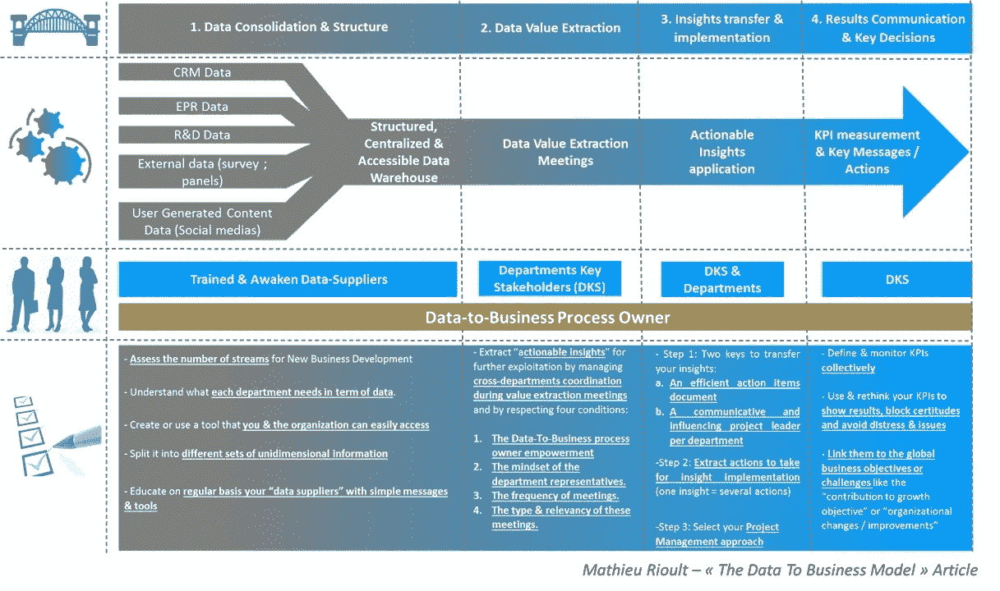

# 数据到业务桥梁模型:提取、应用和跟踪可行的见解，以应对您的业务发展挑战

> 原文：<https://towardsdatascience.com/data-to-business-bridge-model-extract-apply-track-actionable-insights-to-answer-your-business-2fdbfd39ac25?source=collection_archive---------2----------------------->

几个月前， [SAP 表示](http://news.sap.com/what-is-digital-transformation/)数字化转型强调并关注众多主题&公司面临的挑战:收集所有公司内部信息&整合来自外部来源的数据，这些数据一旦经过处理&分析，就可以改变现有的工作流程。积极使用数据的结果是商业模式的转变&决策。

那是为了理论和预期的大局。**现实不幸要复杂得多**。我有机会为一家公司工作，该公司多年来在收购和实施多渠道方面支持了 100 多家化工行业的新业务开发组织，其中 90%的公司起点是相同的:**这些公司的结构都不能处理&利用其数据——无论这些数据来自传统渠道还是新渠道——包括数字流。**

理解这种说法的一个关键是**不规则&无组织地使用 CRM 工具**。大多数时候，这样的系统被用来存储原始数据，但不经常被利用。销售人员通常认为 CRM 工具是一个存储设备，用来保存他们的电话报告或销售过程中获取的原始信息。这是一个很好的做法，但不够有效——因为他们**添加了自己的措辞，或者可能会忘记一些信息**。因此，非结构化数据很难分析和提取相关的见解。

但是，销售人员并不是唯一应该受到责备的人。**该数据结构必须来自产品&业务开发中涉及的不同部门的具体要求。销售人员应该从其他人那里知道他们需要收集什么类型的数据。而这些部门应该明白如何提取这些信息的价值。**如果很好地识别和设计了价值，它会很快转化为洞察力，帮助采取或支持战略决策或改进业务流程。

随着数字化转型和“数据使用”的觉醒在我们身边发生，你可能已经听到过这样的说法。数百篇文章声称需要采用数字结构和自动化数据提取模型，但最终，让我们面对现实吧。**采用“随时可用”的解决方案是必须的，但这需要巨额投资和大量时间**来唤醒和教育部门意识，在组织中建立解决方案基础设施，并使其在日常工作中发挥作用。此外，**一种风险似乎切断了大多数跨部门的互动，而这种互动让你的见解变得有价值，让你的组织有一个持续学习的环境。**另一方面，仅仅依靠你的“上帝的感觉”或你的业务开发人员或部门变得越来越不适应这个世界**需要来自服务于整个组织的市场的结构化洞察力，作为学习机器(而不仅仅是一个人)和所需业务决策的燃料，例如与弱信号识别或蓝海存在证据相关的有争议的明智之举**。

今天，我在这里提出的是一个折衷方案，**一种从结构化数据集和跨部门交换中提取、证明、应用和跟踪可行见解的方法，而无需投资于众多组织无法实现的全方位解决方案。**它是基于我在过去五年中观察到的情况，即化学行业中超过 **30 家 NBD 组织应用的解决方案摘要。**因此，要实现这一目标并在您的组织内产生相应的收益，您需要构建我所说的“数据到业务的桥梁”。基于四大支柱及其相关关键行动的简单“协调&行动”概念。请在下面找到它的简化结构:

除了这个模型之外，我还在这里提供了一种方法来应用强有力的原则，这些原则每天都在滋养你的组织:**生长细胞&“可食用的”燃料**。**人类交互并协作学习&他们可以理解和利用的结构化数据**。由于这两者和我提供的 D2B 桥指导，您的组织将能够识别和实施可操作的见解，这些见解将**积极影响您的整体业务增长和组织流程**。此外，你的组织将**自己建造一台学习机器，每个人都将从中受益**。由某人的神的感觉运行的行动现在看来是过时的。当然，独自一人，我们走得更快。一起，我们走得更远。

对于可能出现的合理问题——“它背后的具体商业价值是什么？”—这 5 年的经验告诉我，建造这座桥梁来填补空白(并实施正确的思维、方法、流程和工具)的公司受益于以下结果:

**将潜在客户转化为销售额的机会更大&销售人员的关注度更高**

**加快将前景转化为销售额的速度**

**期房结算营销策略**

**更深入的市场理解**

**更快的响应&更高效率的技术支持**

**潜在客户的项目获得技术成功的几率更高**

**对市场挑战的技术反应更强**

**加速&相关应用研究**

我建议你下载整篇文章(最后有链接),根据我在过去五年中观察到的情况，共同发展这四个支柱。最后，我建议你做一个简短的练习，来评估你提取和利用数据为你的新业务发展战略服务的能力。

感谢您的关注。我欢迎你的任何评论，也非常欢迎你想和我开始的任何讨论。

马修·里奥特

[https://www . slide share . net/mat VOD/data-to business-bridge-model-for-NBD-optimization-mrioult-75237043](https://www.slideshare.net/Matvod/data-tobusiness-bridge-model-for-nbd-optimization-mrioult-75237043)