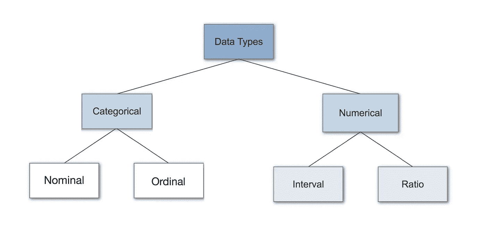
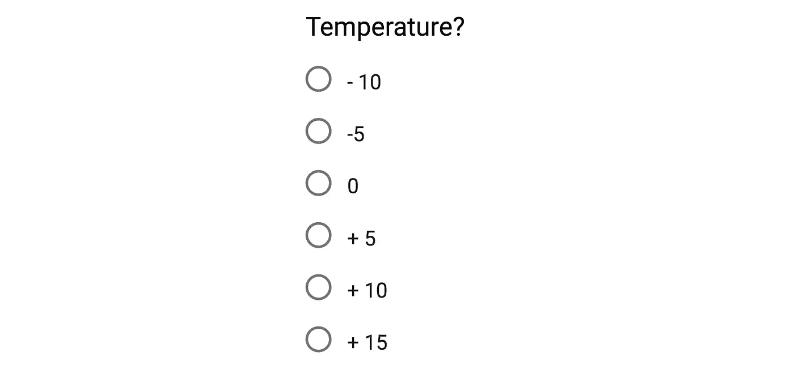
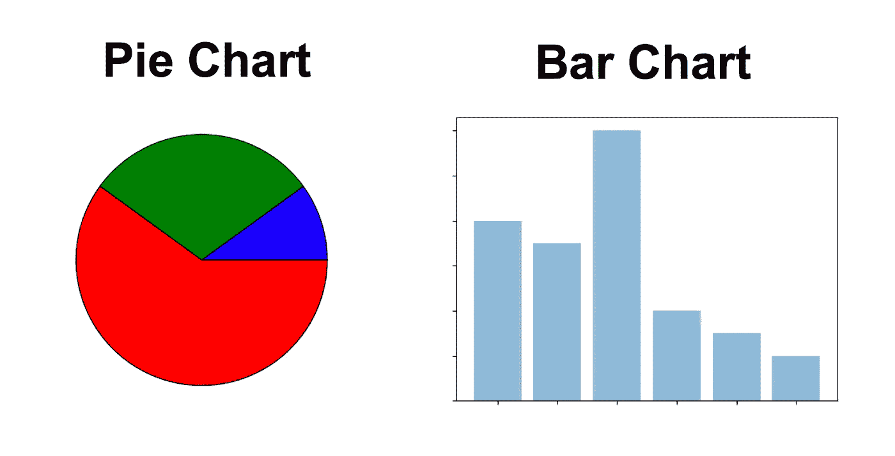
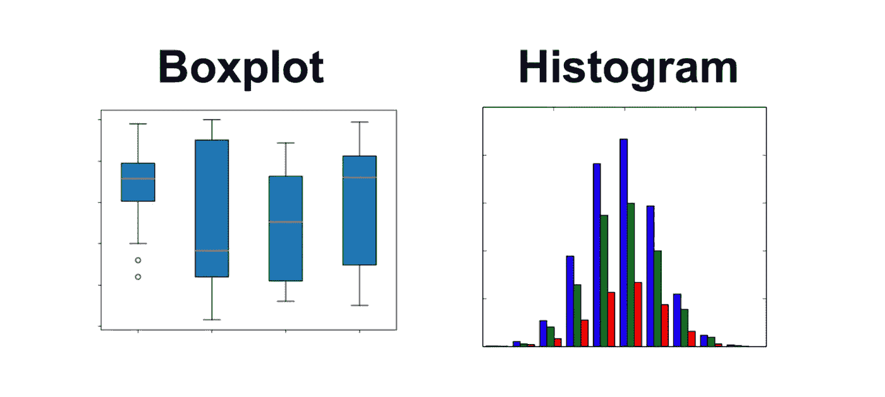

# 统计中的数据类型

> 原文：<https://towardsdatascience.com/data-types-in-statistics-347e152e8bee?source=collection_archive---------0----------------------->

**数据类型是统计学的一个重要概念，需要理解这一概念，才能正确地对数据进行统计测量，从而正确地得出关于数据的某些假设。这篇博客文章将向您介绍您需要了解的不同数据类型，以进行适当的探索性数据分析(EDA)，这是机器学习项目中最被低估的部分之一。**

**目录:**

*   数据类型简介
*   分类数据(名义数据、序数数据)
*   数字数据(离散、连续、区间、比率)
*   为什么数据类型很重要？
*   统计方法
*   摘要

# 数据类型简介

很好地理解不同的数据类型(也称为度量尺度)是进行探索性数据分析(EDA)的重要前提，因为您只能对特定的数据类型使用特定的统计度量。

您还需要知道您正在处理的数据类型，以便选择正确的可视化方法。将数据类型视为对不同类型的变量进行分类的一种方式。我们将讨论变量的主要类型，并查看每种类型的示例。我们有时将它们称为测量尺度。

# 分类数据

分类数据代表特征。因此，它可以代表一个人的性别，语言等。分类数据也可以采用数值(例如:1 代表女性，0 代表男性)。请注意，这些数字没有数学意义。

# 标称数据

标称值代表离散单位，用于标记没有定量值的变量。就把它们想象成“标签”。请注意没有顺序的名义数据。因此，如果你改变它的值的顺序，它的意义不会改变。您可以在下面看到两个名义特征示例:

描述一个人是否已婚的左侧特征被称为“二分法”，这是一种名义尺度，只包含两个类别。

# 序数数据

序数值表示离散的和有序的单位。因此，除了排序问题之外，它几乎与名义数据相同。你可以看到下面的例子:

注意，小学和高中的区别不同于高中和大学的区别。这是序数数据的主要局限性，数值之间的差异并不真正为人所知。正因为如此，序数量表通常被用来衡量非数字特征，如快乐、顾客满意度等。

# 数据

# 1.离散数据

如果数据的值是不同的和独立的，我们称之为离散数据。换句话说:如果数据只能取某些值，我们称之为离散数据。这类数据**无法测量，但可以计算**。它基本上代表了可以分类的信息。一个例子是 100 次掷硬币中的人头数。

你可以通过问以下两个问题来检查你是否在处理离散数据:你能统计它吗，它能被分成越来越小的部分吗？

# 2.连续数据

连续数据代表测量值，因此它们的值**无法计算，但可以测量**。一个例子是人的身高，你可以用实数线上的区间来描述。

**区间数据**

间隔值代表具有相同差值的**有序单元。因此，当我们有一个包含有序数值的变量，并且我们知道这些值之间的确切差异时，我们称之为区间数据。一个例子是包含给定地点温度的要素，如下所示:**

区间值数据的问题在于它们**没有“真零”**。就我们的例子来说，这意味着没有温度这回事。对于区间数据，我们可以加减，但不能乘、除或计算比值。因为没有真正的零，所以大量的描述性和推断性统计无法应用。

**比率数据**

比率值也是具有相同差值的有序单位。比率值**与区间值相同，不同之处在于它们有一个绝对零点**。很好的例子是身高、体重、长度等。

# 为什么数据类型很重要？

数据类型是一个重要的概念，因为统计方法只能用于特定的数据类型。你必须以不同于分类数据的方式分析连续数据，否则会导致错误的分析。因此，了解你正在处理的数据类型，使你能够选择正确的分析方法。

我们现在将再次检查每种数据类型，但这一次是关于可以应用什么统计方法。为了正确理解我们将要讨论的内容，你必须了解描述统计学的基础知识。如果你不了解他们，可以看看我关于此事的博文(9 分钟阅读):[https://towardsdatascience . com/intro-to-descriptive-statistics-252 e 9 c 464 AC 9](/intro-to-descriptive-statistics-252e9c464ac9)。

# 统计方法

# 标称数据

当您处理名义数据时，您通过以下方式收集信息:

**频率**:频率是某件事情在一段时间内或者在一个数据集中发生的频率。

**比例**:用频率除以事件总数，可以很容易地计算出比例。(例如，某件事发生的频率除以它可能发生的频率)

**百分比。**

可视化方法:为了可视化名义数据，你可以使用饼图或条形图。

在数据科学中，您可以使用一种热编码将名义数据转换为数字特征。

# 序数数据

当您处理序数数据时，您可以使用与处理名义数据相同的方法，但是您还可以使用一些额外的工具。因此，你可以用频率、比例、百分比来总结你的序数数据。你可以用饼状图和柱状图来展示它。此外，您可以使用百分位数、中位数、众数和四分位数范围来总结您的数据。

在数据科学中，您可以使用一种标签编码，将序数数据转换为数字特征。

# 连续数据

当你在处理连续数据时，你可以用最多的方法来描述你的数据。您可以使用百分位数、中位数、四分位数范围、平均值、众数、标准差和范围来总结您的数据。

可视化方法:

为了显示连续的数据，你可以使用直方图或箱线图。使用直方图，您可以检查分布的集中趋势、可变性、模态和峰度。请注意，直方图无法显示您是否有任何异常值。这就是为什么我们也使用箱线图。

# 摘要

在这篇文章中，您发现了统计中使用的不同数据类型。您学习了离散数据和连续数据之间的区别，以及什么是名义、顺序、间隔和比率测量尺度。此外，你现在知道你可以在哪个数据类型下使用什么统计测量，以及哪个是正确的可视化方法。您还了解了可以将分类变量转换为数值变量的方法。这使您能够在给定的数据集上创建探索性分析的大部分。

# 资源

*   [https://en.wikipedia.org/wiki/Statistical_data_type](https://en.wikipedia.org/wiki/Statistical_data_type)
*   https://www.youtube.com/watch?v=hZxnzfnt5v8
*   [http://www . dummies . com/education/math/statistics/types-of-statistical-data-numerical-categorial-and-ordinal/](http://www.dummies.com/education/math/statistics/types-of-statistical-data-numerical-categorical-and-ordinal/)
*   [https://www.isixsigma.com/dictionary/discrete-data/](https://www.isixsigma.com/dictionary/discrete-data/)
*   [https://www.youtube.com/watch?v=zHcQPKP6NpM&t = 247s](https://www.youtube.com/watch?v=zHcQPKP6NpM&t=247s)
*   [http://www . mymarketresearchmethods . com/types-of-data-nominal-ordinal-interval-ratio/](http://www.mymarketresearchmethods.com/types-of-data-nominal-ordinal-interval-ratio/)
*   [https://study . com/academy/lesson/what-is-discrete-data-in-math-definition-examples . html](https://study.com/academy/lesson/what-is-discrete-data-in-math-definition-examples.html)

**这篇文章最初发表在我的博客上(**[**【https://machinelearning-blog.com】**](https://machinelearning-blog.com/)**)。**