# 使用 R 可视化 1948 年以来美国航空悲剧的数据

> 原文：<https://towardsdatascience.com/data-visualisations-of-aviation-tragedies-in-the-us-since-1948-4f1d7371b799?source=collection_archive---------7----------------------->


NTSB investigators looking at the fuselage of Asiana Airlines Flight 214 after it crash landed in San Francisco (Wikimedia Commons)

在这篇文章中，我看了一个来自 NTSB 航空事故数据库的数据集，它包含了关于民航事故的信息。在 [Kaggle](https://www.kaggle.com/khsamaha/aviation-accident-database-synopses) 上也有一个数据集。

这种[探索性数据分析](https://towardsdatascience.com/tagged/exploratory-data-analysis) ( [EDA](https://en.wikipedia.org/wiki/Exploratory_data_analysis) )旨在对数据进行初步探索，并初步了解数据集中存在的各种变量之间的关系。

我的目的还在于展示简单理解[数据分析](https://towardsdatascience.com/tagged/data-analysis)和[争论](https://towardsdatascience.com/tagged/data-wrangling)以及领域知识如何能够更好地理解数据集中变量之间的关系。R Markdown 文件可以在这个 [GitHub repo](https://github.com/hamzaben86/Exploratory-Data-Analysis-Projects/tree/master/NSTB-Aviation-Accidents-EDA-R) 中找到。

# 介绍

首先，快速介绍一下我将探索的数据集。该数据集包含与记录的航空事故相关的 31 个变量的 81，013 个观察值。

```
## [1] 81013 31
```

变量提供各种主题的信息，包括观察的日期和位置、飞机的型号和类型、乘客和飞机持续受伤的信息以及当时报告的天气情况。

```
## [1] "Event.Id" "Investigation.Type" 
## [3] "Accident.Number" "Event.Date" 
## [5] "Location" "Country" 
## [7] "Latitude" "Longitude" 
## [9] "Airport.Code" "Airport.Name" 
## [11] "Injury.Severity" "Aircraft.Damage" 
## [13] "Aircraft.Category" "Registration.Number" 
## [15] "Make" "Model" 
## [17] "Amateur.Built" "Number.of.Engines" 
## [19] "Engine.Type" "FAR.Description" 
## [21] "Schedule" "Purpose.of.Flight" 
## [23] "Air.Carrier" "Total.Fatal.Injuries" 
## [25] "Total.Serious.Injuries" "Total.Minor.Injuries" 
## [27] "Total.Uninjured" "Weather.Condition" 
## [29] "Broad.Phase.of.Flight" "Report.Status" 
## [31] "Publication.Date"
```

# 数据争论

由于这是来自美国的 NTSB 数据库，该数据库中的大多数事故(超过 94%)是在美国观察到的。因此，在这次分析中，我将重点关注发生在美国的事故。除去国际观测数据后，新的数据框架现在有 76，188 个观测数据。

```
## [1] 76188 31
```

当然，一些数据争论是必要的(细节可以在 [GitHub repo](https://github.com/hamzaben86/NSTB-Aviation-Accidents-EDA-R) 中的 R Markdown 文件中找到)。例如，列出的位置名称(城市，州)被分成两个变量:一个用于城市，一个用于州，用于每个观察。

将与观察事件日期相关的变量按日、月和年分解为观察事件日期，以调查一年内事故数量和特定时期之间是否存在任何相关性。更多的数据争论是必要的

此外，显示与给定观测的总死亡人数相关的数据的更好方法是将死亡人数分组。这将使我们能够更好地表示数据集中所有观测数据的死亡率分布。

# 单变量绘图部分

在这一节中，我将为感兴趣的变量创建单变量图。

## 按年份、月份和工作日划分的事故

让我们在数据集中绘制事故发生的年份、月份和工作日的频率直方图。数据框架中的大部分观察数据来自 20 世纪 80 年代早期以后。所以我们来生成一个 1980 年到 2017 年的剧情。

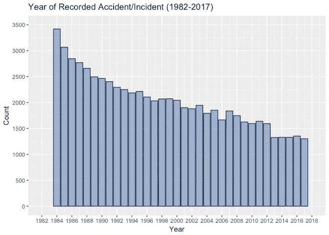

事故数量总体上减少了大约。从 1982 年到 2017 年间的约 47%。大约 3400 次观察。1600 次观察。

接下来，让我们看看一年中各月的观测分布。


在给定年份的数据集中，最高数量的事故发生在北半球夏季(6 月-7 月-8 月)。这也可能与暑假期间航班数量增加有关。

最后，让我们看看一周中每天的观察分布。

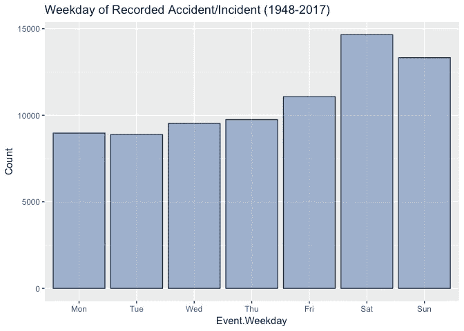

一周内事故发生频率最高的时间是周末(周六至周日)。同样，这也可能与暑假期间航班数量的增加有关。

## 致命伤害总数

下一个感兴趣的变量与数据集中每个观察值的致命伤害总数相关。这可以通过每次记录的观察中致命受伤的人数来量化。让我们按照下图所示，对铲斗中的死亡人数进行分组。注意下图中 y 轴使用了 Log10 标度。

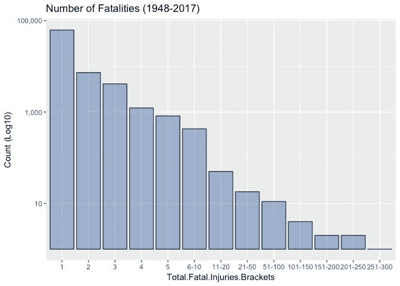

大部分记录在案的事故死亡人数为 100 人。

## 发动机类型

接下来，我查看数据集中记录的[飞机发动机型号](https://en.wikipedia.org/wiki/Aircraft_engine)。我已经缩写了引擎类型名称，以改进 x 轴的标注。注意下图中 y 轴使用了 Log10 标度。

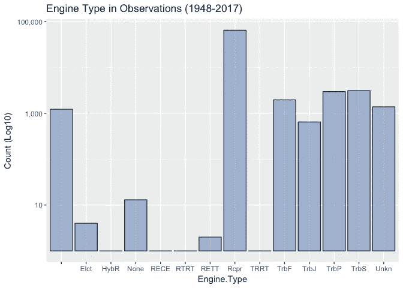

根据上面的图表，报告事故中的大部分发动机类型是商用飞机中流行的[往复式发动机](https://en.wikipedia.org/wiki/Reciprocating_engine)类型，特别是在 20 世纪建造的飞机中。最近的飞机，像[空客 A380](https://en.wikipedia.org/wiki/Airbus_A380#Engines) 或波音 [787 梦想飞机](https://en.wikipedia.org/wiki/Boeing_787_Dreamliner#Engines)依靠[喷气发动机](https://en.wikipedia.org/wiki/Jet_engine#Turbine_powered)(例如涡轮风扇发动机、涡轮螺旋桨发动机)。

## 气象条件

接下来，我查看数据集中记录的天气情况。这里需要熟悉两个关键的航空气象条件: [VMC](http://VMC which stands for visual meteorological conditions and IMC stands for instrument meteorological conditions.) 这意味着条件是飞行员有足够的能见度驾驶飞机，与地形和其他飞机保持目视间隔。 [IMC](https://en.wikipedia.org/wiki/Instrument_meteorological_conditions) 指天气条件要求飞行员主要参照仪表飞行。

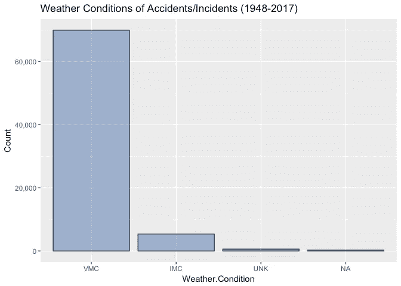

数据集中的大部分事故发生在 VMC 天气条件下，这是飞行的好条件，因为 VMC 比 IMC 需要更大的能见度和云层间隙。

当谈到天气状况和航空事故之间的关系时，我想这将违背大多数人的直觉。飞行员确实训练有素，能够在各种天气条件下飞行，仅仅依靠由他们支配的航空电子仪器。

## 飞行的大致阶段

接下来，让我们看看数据集中记录的事故的飞行阶段。根据情节，大部分事故发生在着陆或起飞期间。业内众所周知，这些都是高风险的——通常被称为“[飞行关键阶段](http://aviationknowledge.wikidot.com/sop:critical-phases-of-flights)”。

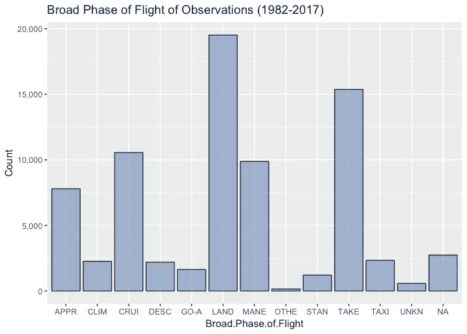

# 二元地块剖面

让我们来看看变量对之间的关系，它们可能显示出有趣的关系。

## 发动机类型和致命伤害总数

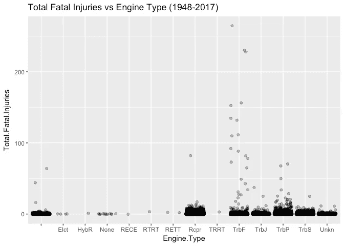

大部分分布的致命伤害总数在 10 以下，让我们放大这部分数据。R 函数 [*geom_jitter*](http://ggplot2.tidyverse.org/reference/geom_jitter.html) 用于放大数据点的可视化。

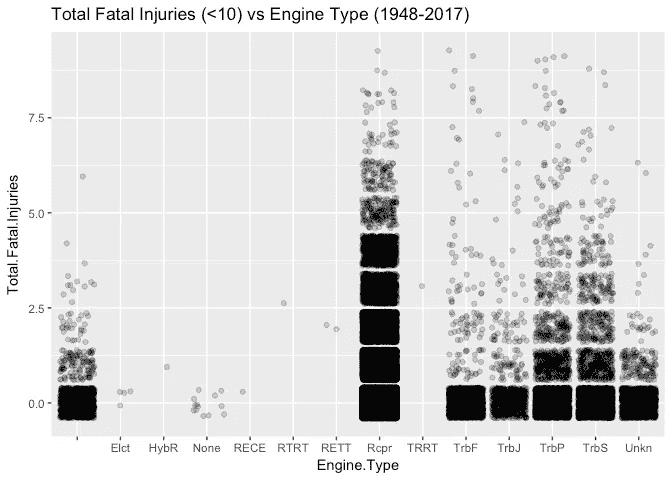

根据该图，10 岁以下死亡人数的大部分数据来自 r 型[往复式发动机](https://en.wikipedia.org/wiki/Reciprocating_engine)型。第一个图显示，涡轮风扇发动机比其他发动机有更多的异常值，死亡人数更高。这可能与大型商用飞机上使用的涡轮风扇发动机有关。

## 天气条件和致命伤害总数

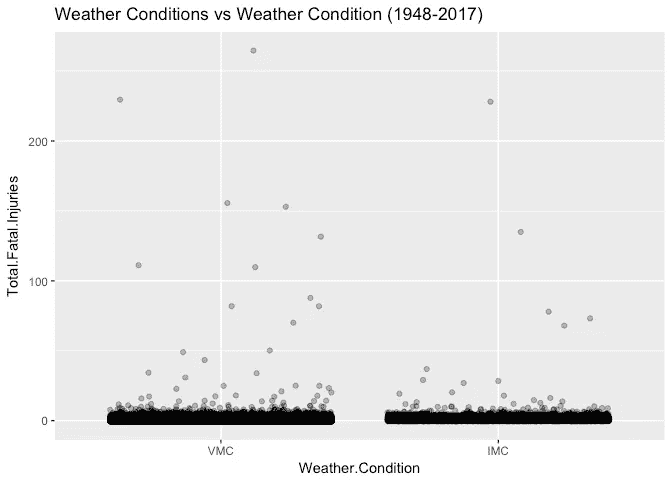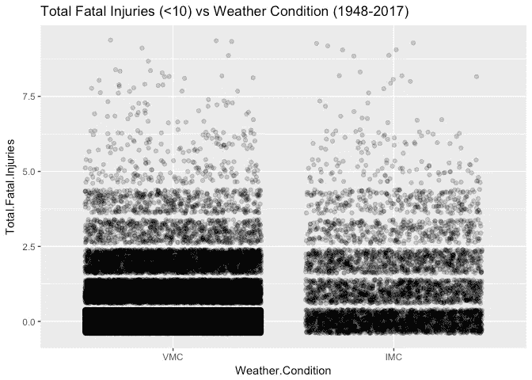

如前所述，天气条件并没有显示出与总致命伤害有特别强的关系。大部分分布与 VMC 的天气条件有关。然而，这可能是因为绝大多数航班都是在 VMC 条件下飞行的。

## 飞行阶段和致命伤害总数

让我们看看飞行阶段和致命伤害总数之间的关系

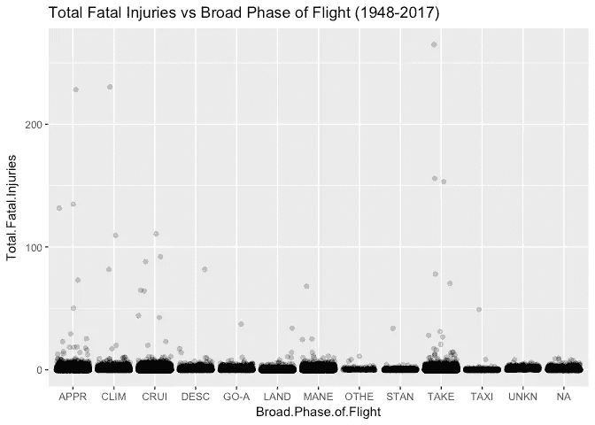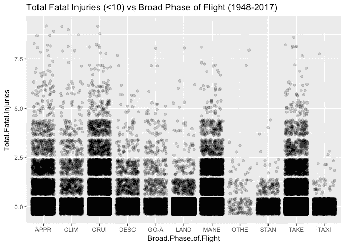

这些图表明，起飞和进场与高死亡率的异常值有关。如前所述，由于这个特殊原因，这两个飞行阶段通常被称为“T6”飞行的关键阶段“T7”。

## 事件月份和工作日以及致命伤害总数

让我们看看事件日期和致命伤害总数之间的关系。我们将关注死亡人数少于 10 人的大部分分布。似乎没有任何特定的月份或工作日显示出特别高的事故频率。

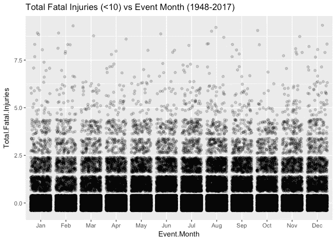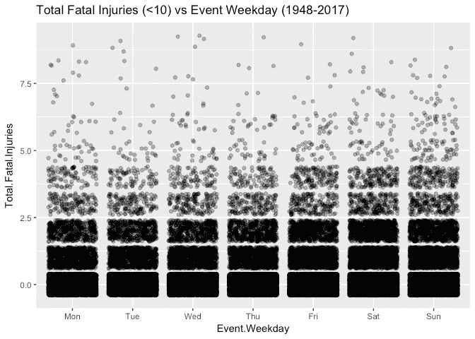

## 广泛的飞行阶段和天气条件

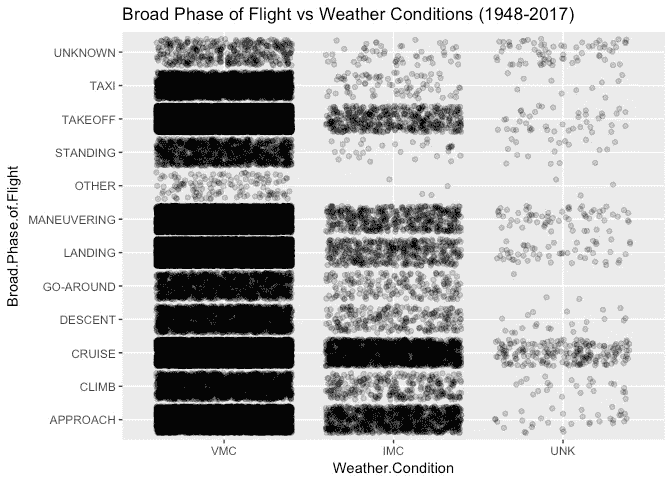

这些图表明，对于某些天气和飞行阶段的组合，记录的观测频率更高，例如，在飞行的“巡航”或“进场”阶段的 IMC 飞行条件。

## 飞行和活动月的主要阶段

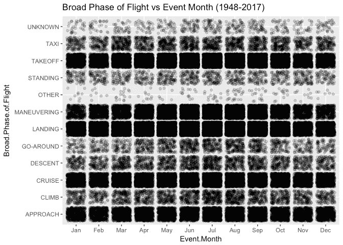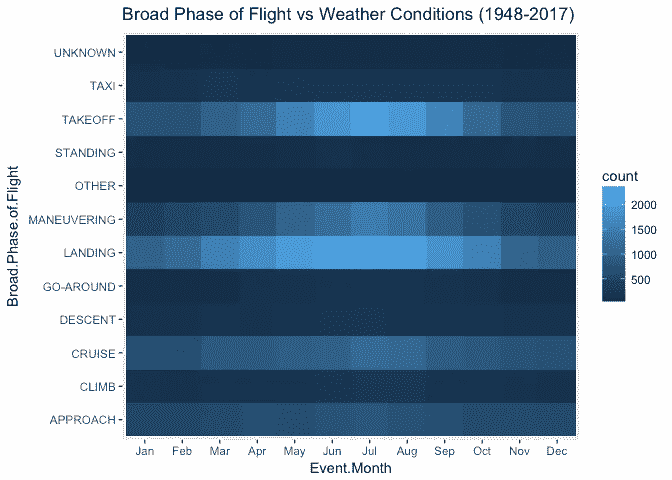

这些图表明，在着陆和起飞期间，北方夏季月份的记录观测频率更高。在所有月份中，热图还显示起飞和着陆记录了最多的观察数据。

## 记录事故的经度和纬度

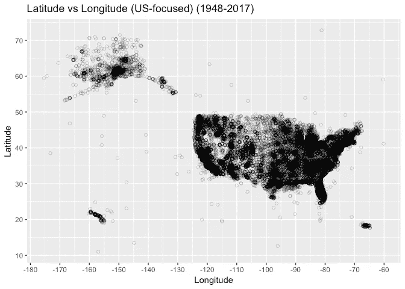

绘制事故发生地的纬度和经度基本上给了我们美国的地图。这些图还表明，与中西部各州和阿拉斯加大部分地区相比，沿海各州受到的影响更大。这可以用往来于美国这些地区的航班数量来解释。然而，一个令人悲伤的图表显示，美国绝大多数州在 1948 年至 2017 年期间遭遇了航空悲剧。

# 多元图部分

现在我们来看看多元图。

## 一年中各月观测值的纬度与经度

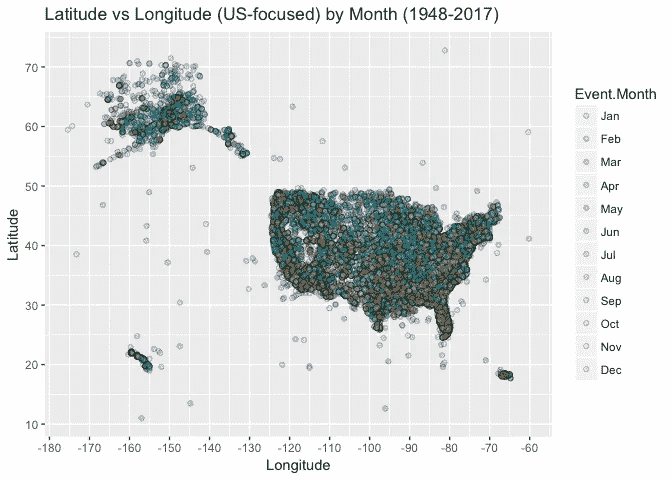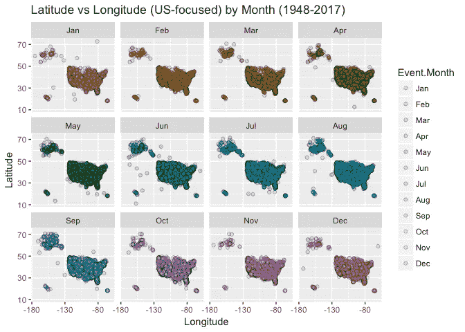

跨纬度和经度的事故月份分布在整个美国相当广泛，在佛罗里达州等南部各州，冬季的观测数据略高。

## 天气条件下的经度和纬度

现在让我们来看看纬度与经度的关系，并为天气状况添加图层。

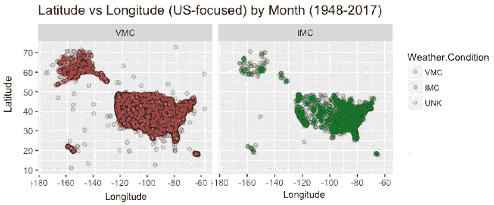

VMC 的天气状况似乎相当稳定，除了中西部某些不连续的地区出现了一些主要的 IMC 状况。

## 根据天气条件划分的飞行和活动月份的大致阶段

现在让我们来看看飞行的主要阶段与天气条件下的月份之间的关系。我决定留下“未知”天气条件下的观察，因为我认为有不可忽略的观察数量，特别是对于飞行的“巡航”阶段。

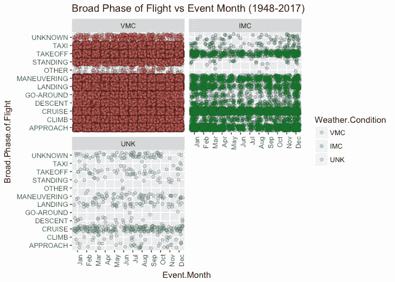

当观察飞行的主要阶段与月份和天气条件之间的关系时，我们可以看到事故主要发生在 VMC 天气条件下。然而，对于一年中的某些月份，如 12 月和 1 月，IMC 条件是观测值中不可忽略的一部分，尤其是在飞行的进近和巡航阶段。

## 致命伤害总数和按天气条件划分的飞行阶段

接下来，让我们看看总致命伤害与天气条件下飞行的主要阶段。我决定把重点放在低于 40 的致命伤害总数上，以突出记录的致命伤害的大部分分布。

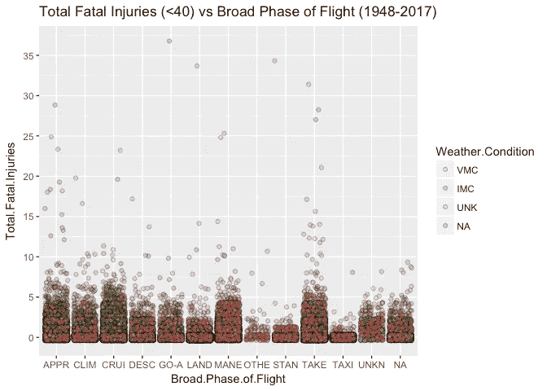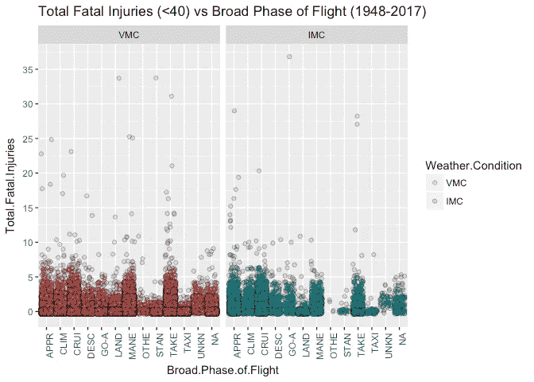

IMC 天气条件与飞行“巡航”和“进场”阶段的事故有关，其发生频率高于 VMC 天气条件。

## 每年致命伤害总数和发动机类型


这个图很有趣，因为它显示了某些引擎是如何在不同时期变得流行的。例如，涡轮喷气发动机和涡轮风扇发动机驱动的飞机在以后的几年中显示出较高的死亡人数，而往复式发动机在早些年中显示出死亡人数的分布，这与现代飞机中越来越多地使用喷气发动机相对应。

# 结束语

我希望你喜欢这个 EDA，并在这个过程中学到了一些关于航空的东西。我希望这篇文章也展示了用 R 中的 [ggplot2 实现简单数据可视化的强大功能。当在](https://www.statmethods.net/advgraphs/ggplot2.html)[数据科学管道](/a-beginners-guide-to-the-data-science-pipeline-a4904b2d8ad3)的初始阶段探索数据集时，这种技能特别有用。我当然喜欢这个周末做的有趣的小研究。