# 仅使用熊猫的数据可视化和探索:初学者

> 原文：<https://towardsdatascience.com/data-visualization-exploration-using-pandas-only-beginner-a0a52eb723d5?source=collection_archive---------1----------------------->

关于熊猫你需要知道的一切

Pandas 是一个用于 python 编程的开源数据结构和数据分析工具。正如我们从这篇[文章](https://www.springboard.com/blog/best-language-beginner-data-scientists-learn/)中看到的，Python 是 2018 年最受欢迎的数据科学语言。熊猫这个名字来源于 Panel Data 这个词——多维数据的计量经济学。本教程将提供一个初学者指南，如何与熊猫进行数据争论和可视化。

**进口熊猫**

我们首先导入 pandas，并将其别名化为 pd，以便在分析中使用。

**进口熊猫当 pd**

**加载数据**

Pandas 允许您导入各种[格式的文件](https://pandas.pydata.org/pandas-docs/stable/io.html)。最流行的格式是 CSV。

第一步是将要加载的文件分配给一个变量，以便能够在以后的分析中操作数据框。数据框基本上是数据集中的行和列的表示

**对于 csv 文件**

df = PD . read _ CSV(' pathtoyourfile . CSV ')

**对于 Excel 文件**

df = PD . read _ excel(' pathtofyourfile . xlsx '，sheetname='nameofyoursheet ')

**读取在线 HTML 文件**

Pandas 还可以使用下面的命令在线读取 HTML 表格

df = PD . read _ html(' linktoonlinehtmlfile ')

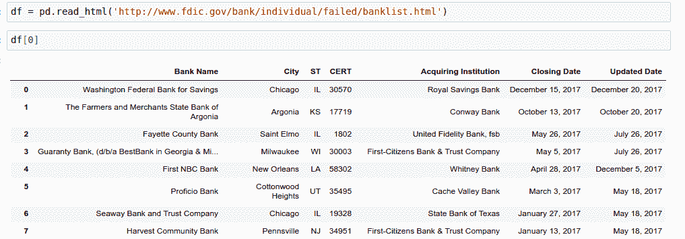

您可能需要安装以下软件包才能工作

**pip 安装 Beautifulsoup htmllib5 lxml**

为了说明你可以对熊猫做的一些事情，我们将使用我在 2017 年收集的来自主要孵化器的[推文](https://www.kaggle.com/derrickmwiti/twenty-four-thousand-tweets-later)。

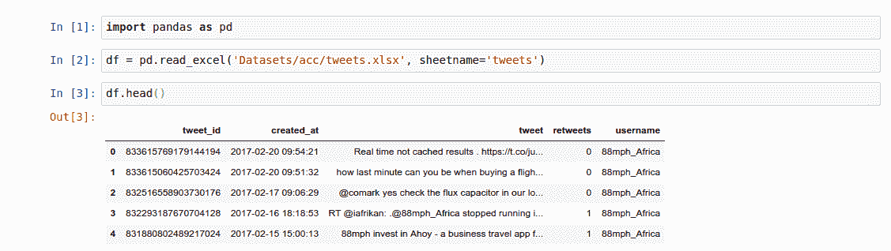

为了查看前五项，我们在数据集上调用 head 命令。同样，为了查看数据集中的最后五个元素，我们使用了 **tail** 函数。检查列的数据类型以及是否有空值通常很重要。这可以使用 info 命令来实现。

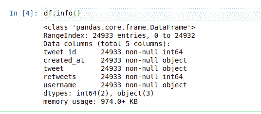

从这里我们可以看出，我们的数据集有 24933 个条目，5 列，它们都是非空的。情况不会总是这样。如果有些行是空的，我们必须根据当前的情况适当地处理它们。一种方法是放下它们，另一种方法是填满它们。让我们假设我们的数据集中有一个**年龄**列，代表发出推文的人的年龄。我们将用如下的平均值来填充它

**df['年龄']。fillna(value=df['age']。平均值())**

我们也可以决定这样放下它们

**df.dropna()** 这将删除所有包含空值的列。处理空值非常重要，因为它会影响您从数据中获得的洞察力。

您还可以使用此方法来检查空值

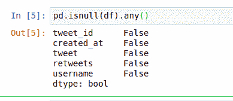

正如我们前面看到的，这个数据集没有空值。

**分组通过**

我们可能希望按照用户名对所有的推文进行分组，并统计每个组织的推文数量。我们可能也有兴趣看看推文最多的前 10 个组织。

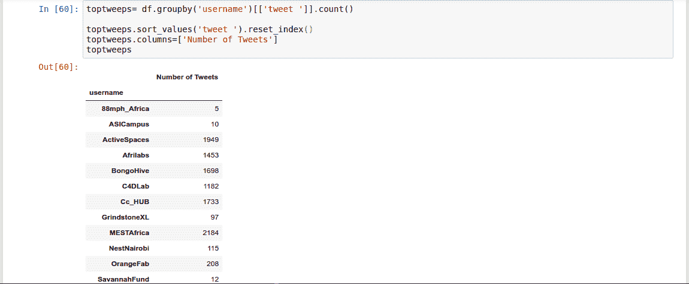

我们使用 **Sort_values** 按照 tweets 的数量对数据帧进行排序。

**总和**

因为所有组织都有转发，所以让我们看看哪个组织有最多的转发。我们可以通过按组织的用户名对推文进行分组并对转发进行汇总来实现这一点。

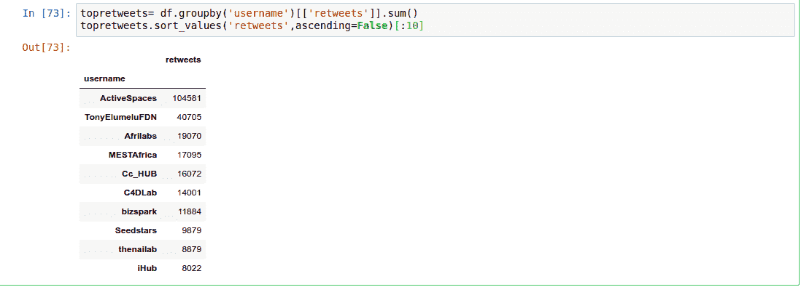

**统计数据集中唯一用户名的数量。**

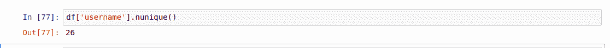

我们的数据集中有 26 个独特的组织。

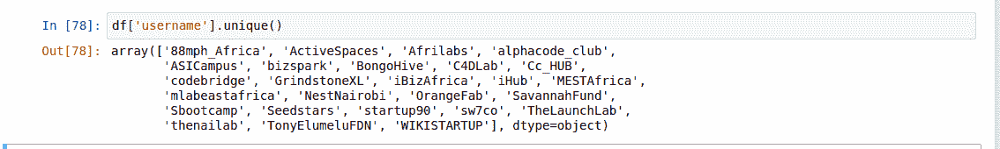

我们可以通过调用列上的 unique 函数得到它们的名字。

**统计某一列的项目数**

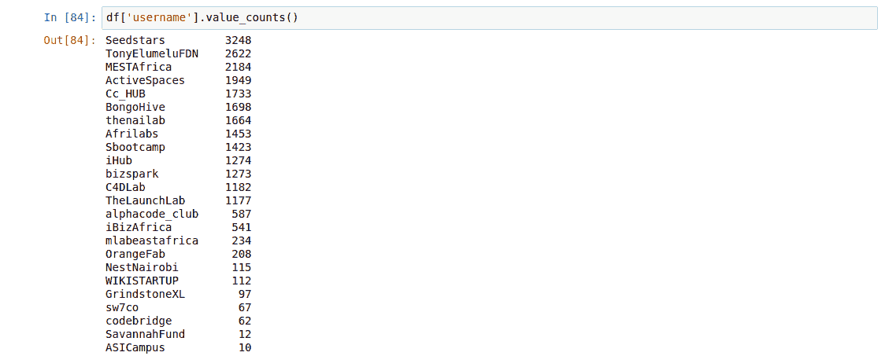

重要的是 **value_counts()** 不能用于数据帧，它只能用于序列。我们可以通过在 dataframe 上调用它来说明这一点。

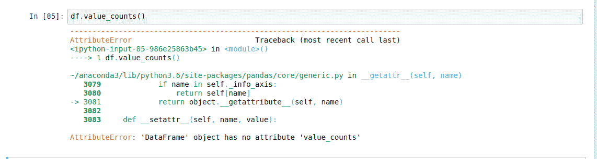

**对整个数据集应用函数**

假设我们想知道每条推文中的字数。我们将创建一个新列来保存该列的长度，然后**对其应用**len 函数来计算字符数。

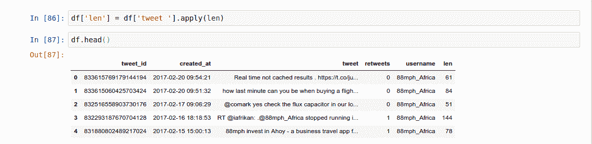

您可以通过在上面调用 **describe** 函数来查看我们刚刚创建的列的描述。

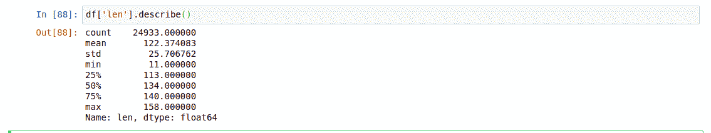

我们可以看到最长的推文有 158 个字符长。我们怎么能看到那条微博呢？

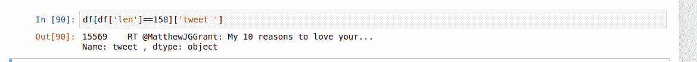

你会注意到我们只能看到推文的一部分。我们可以通过使用 **iloc** 功能看到完整的 tweet

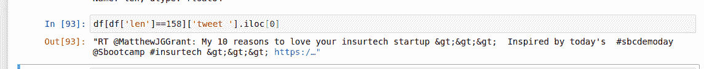

这意味着我们想要查看位于索引 0 的项目，也就是这种情况下的 tweet。

**合并两个数据帧**

有时，作为我们数据分析工作的一部分，我们可能需要合并两个数据帧。比方说，我们想找出推文数量和转发数量之间的关系。这意味着我们将有一个包含推文数量的数据帧和另一个包含转发数量的数据帧，然后将它们合并。

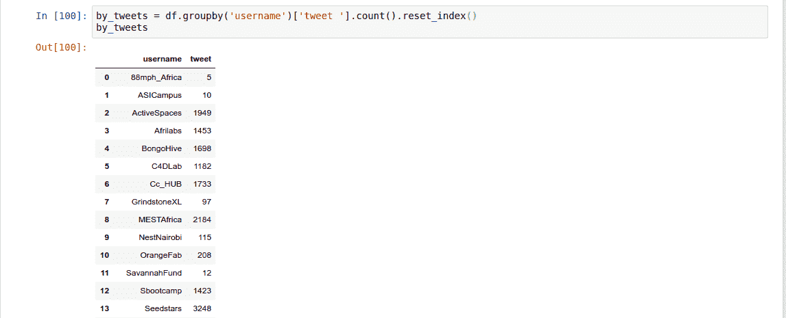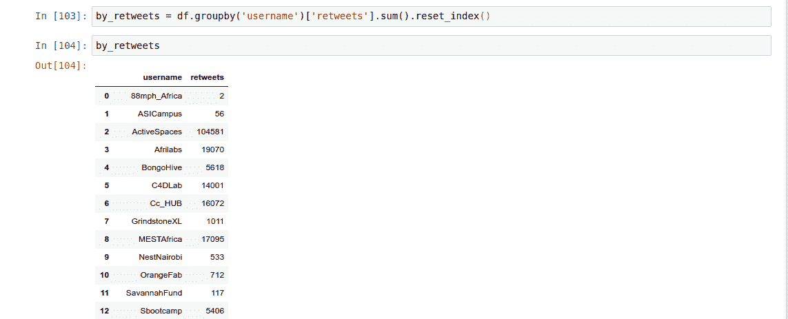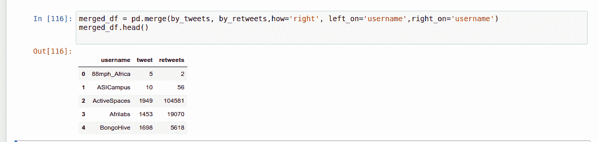

有时，您可能还想连接两个数据集。让我们以 Kaggle 竞赛数据集为例。您可能希望加入测试和训练数据集，以便使用完整的数据集。您可以使用 **concat** 来实现这一点。

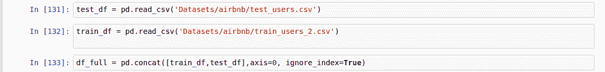

**使用熊猫进行数据可视化**

当你想快速查看你的数据时，用熊猫做可视化是很方便的。让我们用熊猫来绘制推文长度的直方图。

**直方图**

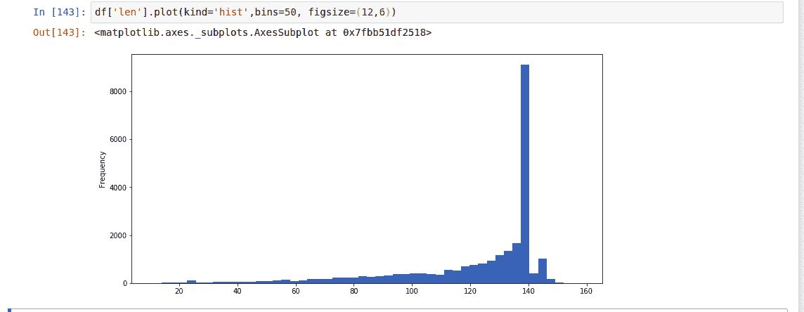

查看直方图，我们可以看出大多数推文的长度在 120 到 140 之间。

我们现在可以使用相同的概念来绘制散点图，以显示推文数量和转发数量之间的关系。

**散点图**

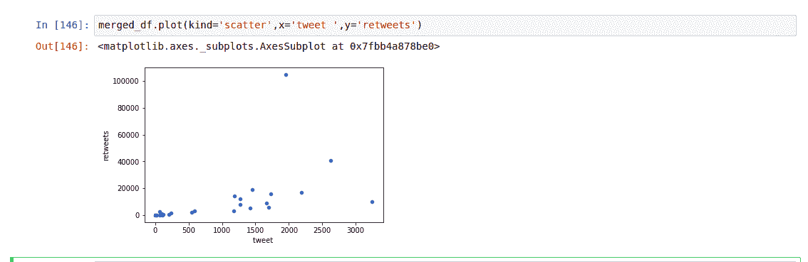

这意味着推文数量和转发数量之间存在正相关关系。

**区地块**

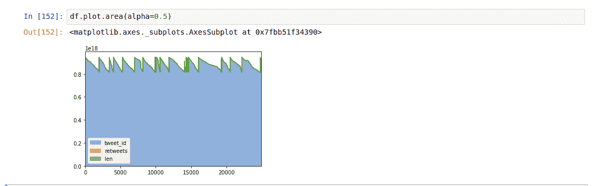

**线条图**

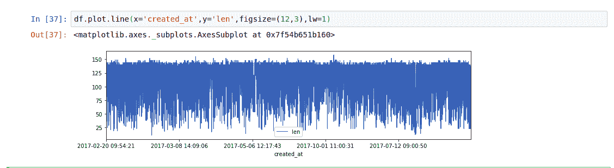

**核密度估计图(KDE**

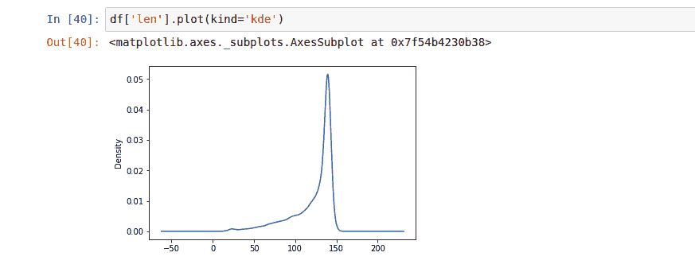

通过从不同的在线课程中学习这一点和更多内容，你可以在 2018 年开始你的职业生涯。

 [## Python 中的数据科学训练营

### 学习 Python 的数据科学，NumPy，Pandas，Matplotlib，Seaborn，Scikit-learn，Dask，LightGBM，XGBoost，CatBoost 等等…

www.udemy.com](https://www.udemy.com/course/data-science-bootcamp-in-python/?referralCode=9F6DFBC3F92C44E8C7F4)