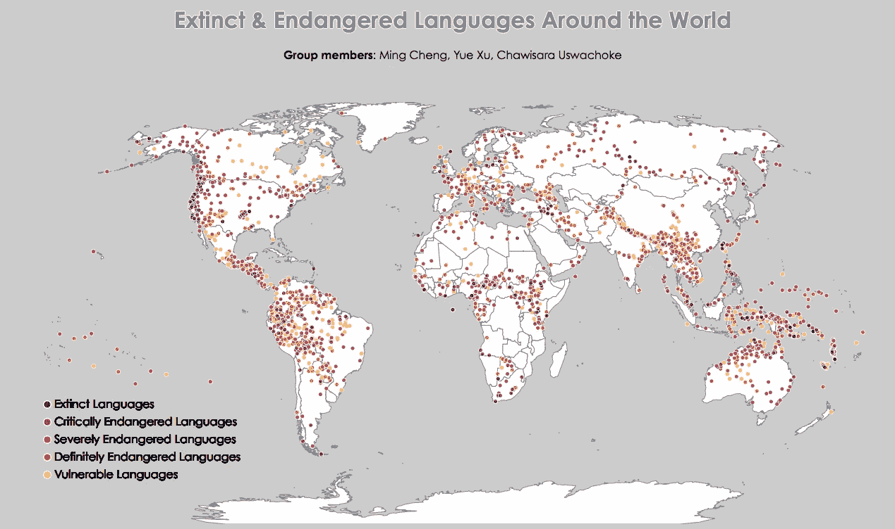
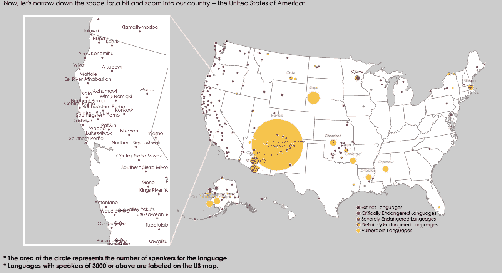

# 濒危语言的数据可视化

> 原文：<https://towardsdatascience.com/data-visualization-for-extinct-and-language-9cd75fe41da?source=collection_archive---------2----------------------->

作者:明成，徐悦，查维萨拉

GitHub 链接:[https://github.com/mc2637/INFO5100Project1.git](https://github.com/mc2637/INFO5100Project1.git)

我们的项目展示了世界各地灭绝和濒危语言的分布。数据集是从《卫报》发布的 Kaggle 上下载的。它总共包括 14 个变量(即列)，但我们只选择了 5 个变量在这个项目中进行可视化:语言的名称、经度、纬度、濒危程度(脆弱、绝对脆弱、严重脆弱、严重濒危或灭绝)，以及说话者的数量。

World Map Data Visualization of Extinct and Endangered Language

US Map of Extinct and Endangered Language

我们还为灭绝日期已知的灭绝语言创建了单独的数据集。由于数据集中灭绝的语言较少，我们手动在维基百科上查找每种灭绝语言的灭绝日期。几个灭绝日期是近似的。那些不知道灭绝日期的物种被排除在这个数据之外。我们通过对灭绝年份的排序和分组进一步处理数据，然后随着时间的推移找到累积和。

我们使用 d3-geo-projection 扩展来绘制世界地图(geoNaturalEarth)和美国地图(geoAlbersUSA)，使用了教授为课堂练习提供的 JSON 文件。地图描述对于世界地图，我们希望首先展示灭绝和濒危语言的总体分布。我们用圆圈来确定每种语言的位置，并用紫色到黄色的色标来表示相应的濒危程度(灭绝的语言是紫色的，而脆弱的语言是黄色的)。给语言名称贴上标签或显示每种语言的使用者数量会让读者不知所措，导致信息难以辨认，所以我们决定在这张地图上只使用两个变量:位置和濒危程度。

在美国地图中使用了更多的变量，我们添加了一些著名语言的标签和说话者的数量。后者通过改变圆的大小或半径来表示，线性缩放它们。扬声器数量越多，圆圈越大。为了更清楚地查看数据点群，我们决定在左上角创建一个放大的美国西海岸迷你地图。这一次，所有的语言都被贴上了相应的标签，还有不同的圆圈半径(尽管它们中的大多数都有相同的大小，因为它们要么已经灭绝，要么濒临灭绝)。故事当我们在世界地图上绘制了所有数据后，可视化告诉我们世界上所有灭绝和濒危语言的位置。我们注意到一些国家的边境上有许多灭绝的语言，这让我们感到惊讶。例如，在北美西海岸有高度集中的灭绝语言，在中国西部边境也有高度集中的灭绝和濒危语言。此外，灭绝和濒危语言高度集中在南美洲中部和上部、中非和太平洋岛屿。

这是一个非常有趣的发现。我们怀疑在每个国家的边境上有更多的方言，并且有相对较少的人口说这些方言。随着每个国家的官方语言占主导地位，说方言的人数减少了。此外，我们注意到西海岸有许多美洲土著部落语言灭绝或濒临灭绝。我们认为这些语言的灭绝是由于美国历史上土著美国人被置于保留地并被高加索文化和语言所同化。关于美国西海岸灭绝的语言的另一种推测是，西海岸在 20 世纪曾是墨西哥和加拿大的一部分。随着西海岸成为美国的一部分，一些语言灭绝了。

我们希望使用我们的数据可视化来善意地提醒我们的观众，通过拯救某些濒危语言来保护自己的独特遗产。如果越来越多的语言灭绝，那将是极其不幸的，也是世界文化的巨大损失。